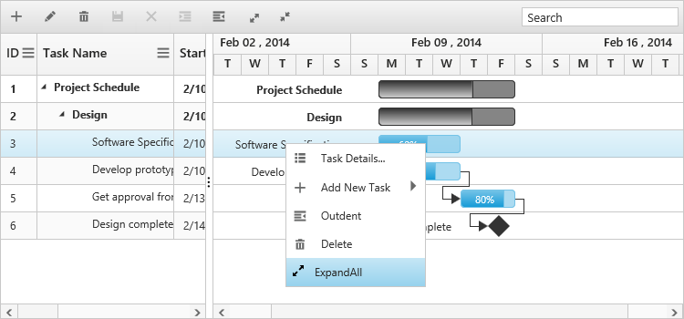
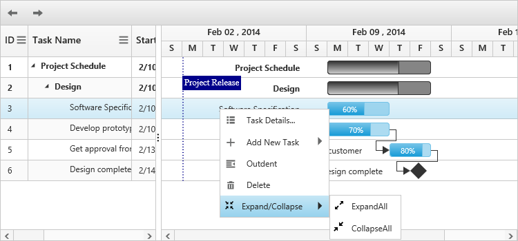

# Context Menu

## Default Menu Items

Context menu in Gantt has the following default menu items,

* Task Details
* Add New Task
* Indent
* Outdent
* Delete

The following code example explains how to enable the context menu in Gantt control.


 <ej-gantt id="ganttSample3" datasource="ViewBag.datasource" 
        //...
        enable-context-menu="true">
  </ejGantt>


The following screenshot shows the default context menu in Gantt control.

## Custom Menu Item

It is possible to add a custom context menu item in Gantt control. The following code example explains on how to add the custom context menu item


<ej-gantt id="ganttSample3" datasource="ViewBag.datasource" 
        //...
        enable-context-menu="true"
        context-menu-open="contextMenuOpen">
  </ejGantt>



    function contextMenuOpen(args) {
        args.contextMenuItems.push({
            headerText: "Expand/Collapse",
            menuId: "expand",
            iconPath: "url(Expand-02-WF.png)",
            eventHandler: function() {
                //event handler for custom menu items
            }
        });
    }



The screenshot of the custom context menu items in Gantt control is as follows.

## Custom menu item with sub menu item

It is possible to create a custom menu item with a sub menu by mapping the `parentMenuId` property from the contextMenuItems argument in the `context-menu-open` event.

The following code example explains on how to add sub context menu for custom menu items.


<ej-gantt id="ganttSample3" datasource="ViewBag.datasource" 
        //...
        enable-context-menu="true"
        context-menu-open="contextMenuOpen">
  </ejGantt>



    function contextMenuOpen(args) {
        args.contextMenuItems.push({
            headerText: "Expand/Collapse",
            menuId: "expand",
            iconPath: "url(Navigation-Up-02-WF.png)",
            eventHandler: function() {
                //event handler for custom menu items
            }
        });
        args.contextMenuItems.push({
            headerText: "ExpandAll",
            menuId: "expandall",
            parentMenuId: "expand",
            iconPath: "url(Expand-02-WF.png)",
            eventHandler: function() {
                //event handler for custom menu items
            }
        });
        args.contextMenuItems.push({
            headerText: "CollapseAll",
            menuId: "collapseall",
            parentMenuId: "expand",
            iconPath: "url(shrink2.png)",
            eventHandler: function() {
                //event handler for custom menu items
            }
        });
    }


The screenshot of the custom context menu items in Gantt control is as follows.

