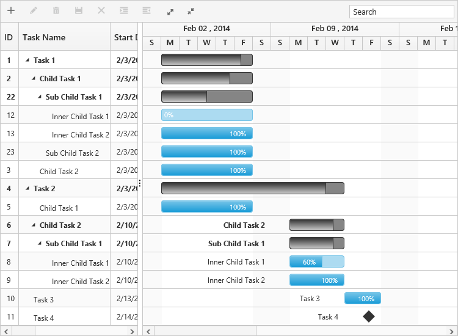

# Data Binding

Data binding is the process that establishes a connection between the application and different kinds of data sources such as business objects. And it is possible to bind local data and remote data in Gantt.

## Local Data Binding

In Local Data Binding, datasource for rendering the Gantt control is retrieved from the same application locally.

Two types of Data Binding are possible with Gantt control, 

* Hierarchical datasource binding
* Self-referential data binding (Flat data)

### Hierarchical data-source binding

The following code example explains how to bind the hierarchical data in Gantt.


<ej-gantt id="ganttSample" datasource="ViewBag.datasource"
    task-id-mapping="Id"
    task-name-mapping="Name"
    start-date-mapping="StartDate"
    end-date-mapping="EndDate"
    duration-mapping="Duration"
    progress-mapping="PercentDone">
</ejGantt>               



List<DefaultData> list = new List<DefaultData>();
    list.Add(new DefaultData()
        {
            Id = 1,
            Name = "Design",
            StartDate = "02/10/2014",
            EndDate = "02/14/2014",
            Duration = 5,
            PercentDone = 60,
            Children = (new List<DefaultData>()
                {
                    new DefaultData()
                        {
                            Id = 2,
                            Name = "Software Specification",
                            StartDate = "02/10/2014",
                            EndDate = "02/12/2014",
                            Duration = 4,
                            PercentDone = 60
                        },
                    new DefaultData()
                        {
                            Id = 3,
                            Name = "Develop prototype",
                            StartDate = "02/10/2014",
                            EndDate: "02/12/2014",
                            Duration = 4,
                            PercentDone = 70,
                        },
                        /...

The output of the above steps is as follows.

### Self-referential data binding (Flat data)

Gantt can be rendered from self-referential data structures, by mapping the task ID and parent task ID fields.

* Task ID field- This field must contain unique values to identify the nodes. It should be mapped to the `task-id-mapping` property.
* Parent task ID field- This field must contain values to identify the parent nodes. It should be mapped to the `parent-task-id-mapping` property.


public ActionResult GanttSelfReference()
    {
        var DataSource = GetData();
        ViewBag.datasource = DataSource;
        return View();
    }
public class SelfData
    {
        public string StartDate { get; set; }
        public int Id { get; set; }
        public string Name { get; set; }
        public int Duration { get; set; }
        public int PercentDone { get; set; }
        public string Predescessor { get; set; }
        public int? ParentId { get; set; }
    }
public List<SelfData> GetData() {
    List<SelfData> data = new List<SelfData>();
    data.Add(new SelfData() { Id = 1, TaskName = "Task 1", StartDate = "02/03/2014", EndDate = "03/07/2014", Duration = 5 });
    data.Add(new SelfData() { Id = 2, ParentId = 1, TaskName = "Child Task 1", StartDate = "02/03/2014", EndDate = "02/07/2014", Duration = 5 });
    data.Add(new SelfData() { Id = 3, ParentId = 1, TaskName = "Child Task 2", StartDate = "02/03/2014", EndDate = "02/07/2014", Duration = 5, PercentDone = "100" });
    data.Add(new SelfData() { Id = 22, ParentId = 2, TaskName = "Sub Child Task 1", StartDate = "02/03/2014", EndDate = "02/07/2014", Duration = 5 });
    data.Add(new SelfData() { Id = 23, ParentId = 2, TaskName = "Sub Child Task 2", StartDate = "02/03/2014", EndDate = "02/07/2014", Duration = 5, PercentDone = "100" });
    data.Add(new SelfData() { Id = 12, ParentId = 22, TaskName = "Inner Child Task 1", StartDate = "02/03/2014", EndDate = "02/07/2014", Duration = 5 });
    data.Add(new SelfData() { Id = 13, ParentId = 22, TaskName = "Inner Child Task 2", StartDate = "02/03/2014", EndDate = "02/07/2014", Duration = 5, PercentDone = "100" });
    data.Add(new SelfData() { Id = 4, TaskName = "Task 2", StartDate = "02/03/2014", EndDate = "02/07/2014", Duration = 5, PercentDone = "100" });
    data.Add(new SelfData() { Id = 5, ParentId = 4, TaskName = "Child Task 1", StartDate = "02/03/2014", EndDate = "02/07/2014", Duration = 5, PercentDone = "100" });
    data.Add(new SelfData() { Id = 6, ParentId = 4, TaskName = "Child Task 2", StartDate = "02/07/2014", EndDate = "02/07/2014", Duration = 5 });
    data.Add(new SelfData() { Id = 7, ParentId = 6, TaskName = "Sub Child Task 1", StartDate = "02/07/2014", EndDate = "02/07/2014", Duration = 5 });
    data.Add(new SelfData() { Id = 8, ParentId = 7, TaskName = "Inner Child Task 1", StartDate = "02/10/2014", EndDate = "02/12/2014", Duration = 3, PercentDone = "60" });
    data.Add(new SelfData() { Id = 9, ParentId = 7, TaskName = "Inner Child Task 2", StartDate = "02/10/2014", EndDate = "02/12/2014", Duration = 3, PercentDone = "100" });
    data.Add(new SelfData() { Id = 10, TaskName = "Task 3", StartDate = "02/13/2014", EndDate = "02/14/2014", Duration = 2, PercentDone = "100" });
    data.Add(new SelfData() { Id = 11, TaskName = "Task 4", StartDate = "02/14/2014", EndDate = "02/14/2014", Duration = 0 });
    return data;
}



<ej-gantt id="ganttSample" datasource="ViewBag.datasource"
    task-id-mapping="Id"
    parent-task-id-mapping="ParentId">
</ejGantt>     

The following screenshot shows the output of the above steps.

