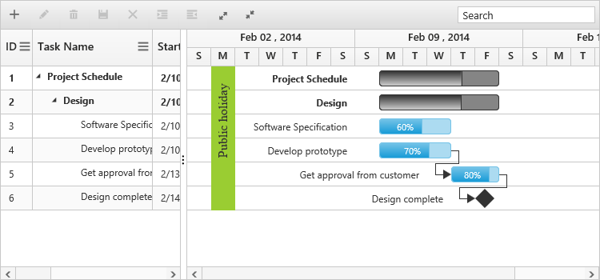

# Holidays

Holidays in Gantt control is used to highlight the non-working days in Gantt control and it can be initialized with Gantt control by using the following code example.



<ej-gantt id="ganttSample" datasource="ViewBag.datasource"
    //...>
    <e-holidays>
        <e-holiday day="2/03/2014" label="Public holiday" background="yellowgreen"></e-holiday>
    </e-holidays>
</ejGantt> 



The following screenshot shows the output of Holidays in Gantt control.

