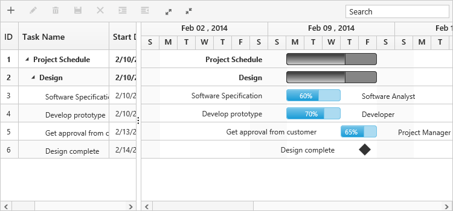
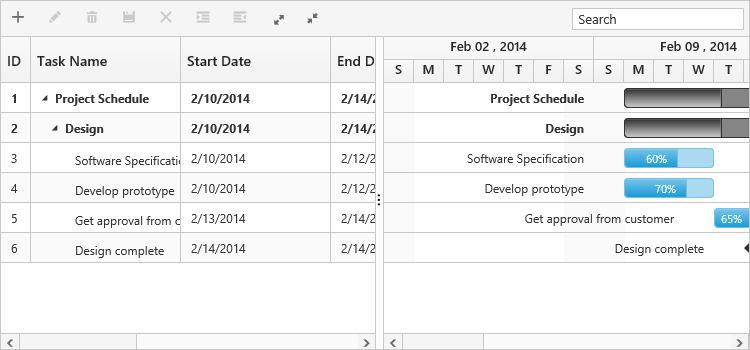
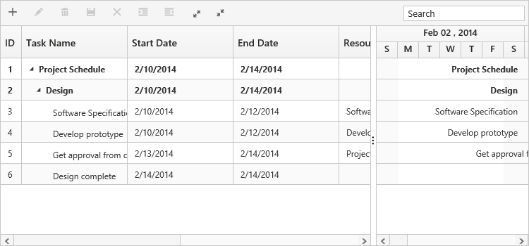

# Change Splitter position

In Gantt control, Splitter separates the TreeGrid section from the Chart section,and is possible to change the position of the Splitter while loading the Gantt by using the `splitter-position` property, thereby varying the width of the TreeGrid and Chart sections in the control.  `splitter-position` property denotes the percentage of the TreeGrid section’s width to be rendered and this property supports both pixels and percentage values.

The following code example explains how to define the `splitter-position` property in the Gantt.


<ej-gantt id="ganttSample3" datasource="ViewBag.datasource" 
        //...
        splitter-position="50%">
  </ejGantt>


Gantt with 30 % splitter position
{:.caption}

Gantt with 50% splitter position
{:.caption}

Gantt with 600px splitter position
{:.caption}

