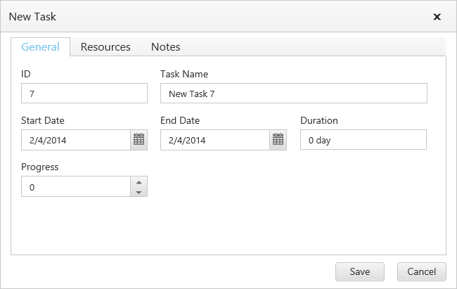
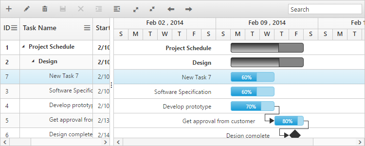
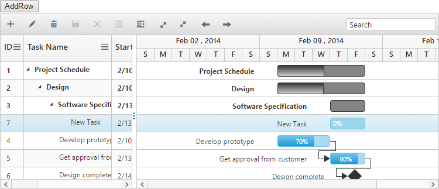
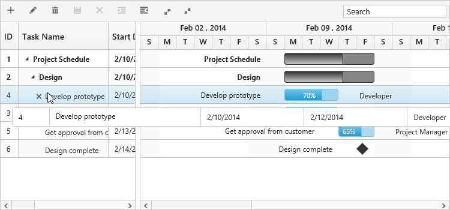
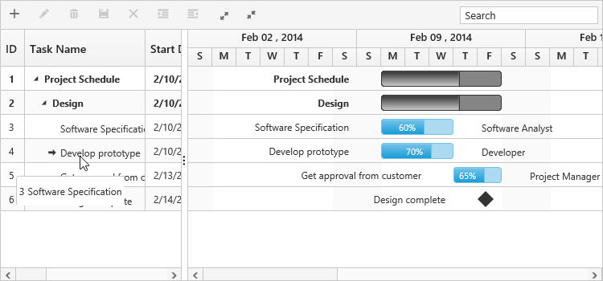
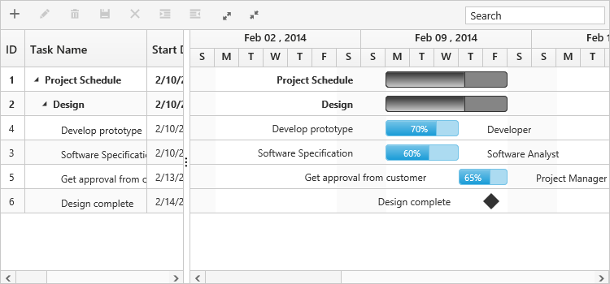
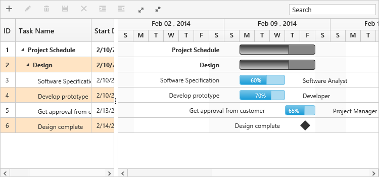
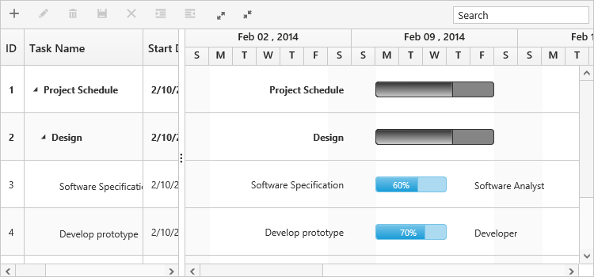

# Rows 

Row represents a task information from the datasource and it is possible to perform the following actions in Gantt rows

## Adding a row

A row can be added in the following ways in Gantt,

* Toolbar 
* Context menu 
* Adding a row programmatically 

### Toolbar Adding

Row can be added in Gantt from toolbar while `allow-adding` property is set to `true`. On clicking the toolbar add icon, you need to provide the task information in the add dialog. If a row is previously selected, then the new row will be added below and in the same hierarchical level as that of the selected row. If there are no rows selected in Gantt, by default the new row will be added as the top most row in Gantt.



<ej-gantt id="ganttSample" datasource="ViewBag.datasource"
    //...>
    <e-gantt-edit-settings allow-adding="true"></e-gantt-edit-settings>
    <e-gantt-toolbar-settings show-toolbar="true" toolbar-items="@(new List<string>() { "add" })">
</ejGantt> 



### Context menu adding

You can able to add new rows either above or below the selected rows by using the default context menu, while `enable-context-menu` is set to `true`. The new row added will have the same task information similar to the selected row.



<ej-gantt id="ganttSample" datasource="ViewBag.datasource"
    //...
    enable-context-menu="true">
    <e-gantt-edit-settings allow-adding="true"></e-gantt-edit-settings>
</ejGantt> 



### Adding a row programmatically

You can add rows in the below positions dynamically using `addRecord` public method,

* Top of all the rows
* Bottom to all the existing rows
* Above the selected row
* Below the selected row
* As child to the selected row

The below code example explains on adding a row using a custom button.


<button id="addRow" style="top:27px;left:50px;position:absolute">AddRow</button>

<ej-gantt id="ganttSample" datasource="ViewBag.datasource"
    //...>
    <e-gantt-edit-settings allow-adding="true"></e-gantt-edit-settings>
</ejGantt> 




$("#addRow").click(function(args) {

    //Create Gantt object

    var GanttObj = $("#ganttSample").data("ejGantt");

    // data to be added

    var data = {

        taskID: 5,

        taskName: "New Task",

        startDate: "02/13/2014",

        endDate: "02/14/2014",

        duration: 2

    };

    GanttObj.addRecord(data, ej.Gantt.AddRowPosition.Child);

})


The following screen shot shows to add new row as child.

## Row drag and drop

It is possible to dynamically re-arrange the rows in the Gantt control by using the `allow-drag-and-drop` property. With this property, row drag and drop can be enabled or disabled. Rows can be inserted above, below as a sibling or as a child to the existing row with the help of this feature. A default tooltip is rendered while dragging the Gantt row and this tooltip can be customized by the `e-gantt-drag-tooltip` property. This property has inner properties such as `show-tooltip`, `tooltip-items` and `tooltip-template`.

The `show-tooltip` property is used to enable or disable the tooltip. By default, this property value is `false`.

The following code explains about enabling the row drag and drop with the default tooltip in the Gantt.



<ej-gantt id="ganttSample" datasource="ViewBag.datasource"
    //...
    allow-drag-and-drop="true">
    <e-gantt-drag-tooltip show-tooltip="true"></e-gantt-drag-tooltip>
</ejGantt>



The following screenshot depicts a row drag and drop in the Gantt widget.

### Customizing Drag tooltip

The `tooltip-items` property is used to customize the tooltip items. By using this property, specific fields can be rendered in the tooltip. By default this property value is `null`, and all the defined field items are rendered in the tooltip.

The following code shows how to render row drag tooltip with the desired field items.



<ej-gantt id="ganttSample" datasource="ViewBag.datasource"
    //...
    allow-drag-and-drop="true">
    <e-gantt-drag-tooltip show-tooltip="true" tooltip-items="@(new List<string>() { "Id","Name","StartDate","EndDate" })">
    </e-gantt-drag-tooltip>
</ejGantt>



The `tooltip-template` property renders the template tooltip for row drag and drop in the Gantt control by using the JsRender template. You can provide either the id value of the script element or the script element to the property.

The following code shows how to render row drag tooltip with tooltip template.







<ej-gantt id="ganttSample" datasource="ViewBag.datasource"
    //...
    allow-drag-and-drop="true">
    <e-gantt-drag-tooltip show-tooltip="true"  tooltip-template="#customTooltip"></e-gantt-drag-tooltip>
</ejGantt>



## Alternate row background

In Gantt, it is possible to enable or disable the alternate row background using the `enable-alt-row` property. The following code example shows you to enable the alternate row color in Gantt.


<ej-gantt id="ganttSample" datasource="ViewBag.datasource"
    //...
    enable-alt-row="true">
</ejGantt>


### Change altRow background

The altRow background can be changed by setting the background color for the altRow using CSS. The following code example shows you how to change the altRow color.


<head>

    

</head>





<ej-gantt id="ganttSample" datasource="ViewBag.datasource"
    //...
    enable-alt-row="true">
</ejGantt>



## Row height

It is possible to change the height of the row in Gantt by setting row height in pixels to `row-height` property. The following code example explains how to change the row height in Gantt at load time.



<ej-gantt id="ganttSample" datasource="ViewBag.datasource"
    //...
    row-height=60>
</ejGantt>



