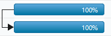
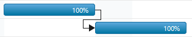
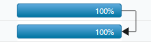

# Task Relationship

You can show the relationship between two tasks in Gantt control. These relationships are categorized into four types based on the start and finish date of the task.

## Start to Start(SS)

You cannot start a task until the other task also starts.

## Start to Finish(SF)

You cannot finish a task until the other task is started.

## Finish to Start(FS)

You cannot start a task until the other task is completed.

## Finish to Finish(FF)

You cannot finish a task until the other task is completed.

The following code example shows you how to show the predecessor in the Gantt control.



<ej-gantt id="ganttSample" datasource="ViewBag.datasource"
    //...
    predecessor-mapping="Predecessor">
</ejGantt>
    


The following screenshot displays the output of the above code. 

