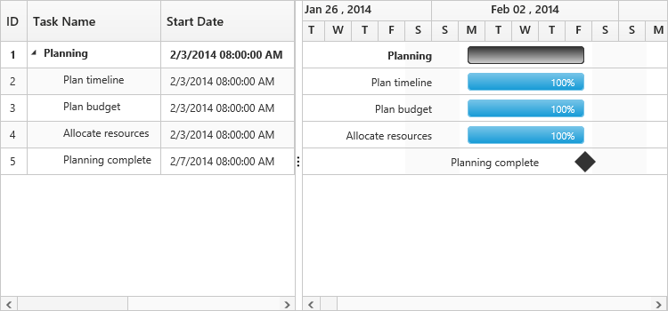

# Time Options

Start date and End date in the datasource defines the starting point and ending point of a task in the project. It can be of two data types,

* Date 
* Datetime

The datetime data type for start date and end date defines the exact starting point and ending point of a task along with time details of a day. There are two types of time scales available based on working hours,

* `TimeScale8Hours`  for 8 hour working scale
* `TimeScale24Hours` for 24 hour working scale

Use the following code example for setting different time scales of working hours.



<ej-gantt id="ganttSample" datasource="ViewBag.datasource"
    //...
    working-time-scale="TimeScale24Hours">
</ejGantt>



Use the following code example for including time options in start date and end date of a task.


        public static List<DefaultData> GetData()
            {
                List<DefaultData> list = new List<DefaultData>();
                list.Add(new DefaultData()
                {
                    Id = 1,
                    Name = "Planning",
                    StartDate = "02/03/2014 08:00:00 AM",
                    EndDate = "02/07/2014 05:00:00 PM",
                    Duration = 5,
                    PercentDone = 40,
                    Children = (new List<DefaultData>()
                    {
                        new DefaultData()
                        {
                            Id = 2,
                            Name= "Plan timeline",
                                StartDate= "02/03/2014 08:00:00 AM",
                                EndDate= "02/07/2014 05:00:00 PM",
                                Duration= 5,
                                PercentDone= 100
                        },
                    //...



<ej-gantt id="ganttSample" datasource="ViewBag.datasource"
    //...
    task-id-mapping="Id"
    task-name-mapping="Name"
    start-date-mapping="StartDate"
    end-date-mapping="EndDate"
    duration-mapping="Duration"
    progress-mapping="PercentDone"
    working-time-scale="TimeScale24Hours">
</ejGantt>



Execute the above code to render the following output.

