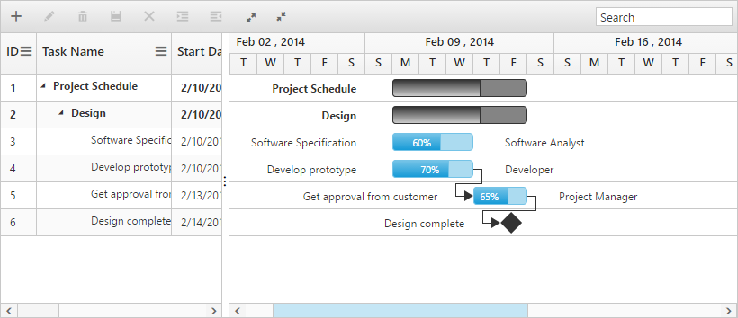

# Toolbar

Gantt control contains toolbar options for editing, searching, expanding and collapsing all records, indent, out dent, delete and add task. You can enable toolbar using the following code example.


   
   <ej-gantt id="ganttSample" datasource="ViewBag.datasource"
        //...>
        <e-gantt-toolbar-settings show-toolbar="true" toolbar-items="@(new List<string>() { "add","edit","delete","update","cancel","indent","outdent","expandAll","collapseAll","search" })">
        </e-gantt-toolbar-settings>
    </ejGantt>



The following screenshot shows the toolbar option in Gantt control.

