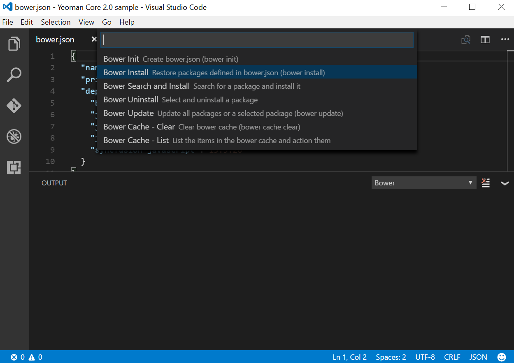
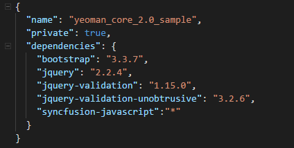
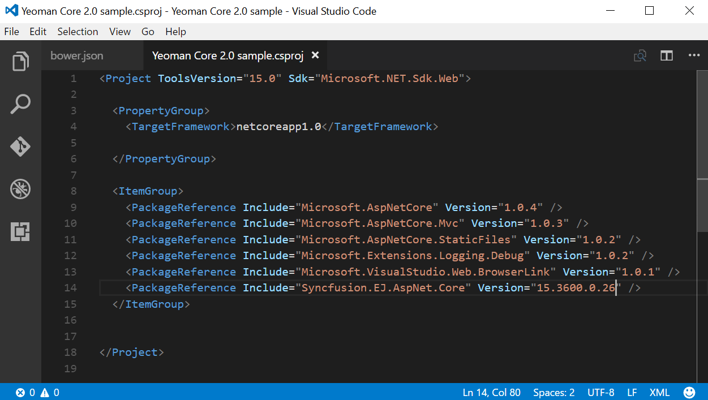
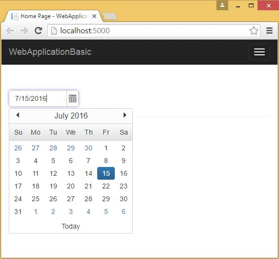

# Getting Started

> Starting with v16.2.0.x, if you reference Syncfusion assemblies from trial setup or from the NuGet feed, you also have to include a license key in your projects. Please refer to this [link](https://help.syncfusion.com/common/essential-studio/licensing/license-key#aspnet-core) to know about registering Syncfusion license key in your ASP.NET Core application to use our components.
  
## ASP.NET Core 2.0 Application Using Visual Studio 2017 version 15.3

### System Requirements:

To work with ASP.NET Core 2.0, you need to make sure, whether you have installed the following software on your machine

* Visual Studio 2017 [version 15.3](https://go.microsoft.com/fwlink/?LinkId=691129).

* DotNetCore 2.0 [x64 Installer](https://download.microsoft.com/download/0/F/D/0FD852A4-7EA1-4E2A-983A-0484AC19B92C/dotnet-sdk-2.0.0-win-x64.exe).

* DotNetCore 2.0 [x86 Installer](https://download.microsoft.com/download/0/F/D/0FD852A4-7EA1-4E2A-983A-0484AC19B92C/dotnet-sdk-2.0.0-win-x86.exe).

### Configure Syncfusion UI Components in ASP.NET Core Application:

The following steps helps to create a ASP.NET Core web application to configure our components.

*  Open Visual Studio 2017 version 15.3 to create **ASP.NET Core web application**.

   

*  After project creation, install the Syncfusion NuGet packages in your application by following the below given steps.

> The Syncfusion ASP.NET Core NuGet package can be installed from [https://www.nuget.org/packages/Syncfusion.EJ.AspNet.Core](https://www.nuget.org/packages/Syncfusion.EJ.AspNet.Core)
    
* Right click on your project references and then select “**Manage NuGet Package**” option. 

* In the new window, choose the “**nuget.org**” from the package source dropdown. And check the “**include prerelease**” option.

* Now, browse and select `Syncfusion.EJ.AspNet.Core` NuGet package from the NuGet solution window and then, install the selected NuGet package in your application.

* After successful NuGet package installation, open your **bower.json** file and specify our bower name **"syncfusion-javascript"** and the value with *. The * specifies the latest version of our scripts and themes files. After, the bower installation has completed, the project folder structure will look like in below structure.

* Now open **_viewImports.cshtml** file from the views folder and add the following namespace for components references and Tag Helper support.



    @using Syncfusion.JavaScript

    @addTagHelper "*, Syncfusion.EJ"
    


*  Refer the necessary scripts and CSS files in your **layout.cshtml** page from **lib -> syncfusion-javascript** folder.

N> Include the below mentioned scripts and CSS references under the appropriate environment. (For eg: If your environment is "Development", then refer the scripts and CSS files under the tag *environment names="Development"*). Refer all the required external and internal scripts only once in the page with proper order. Refer this [link](https://help.syncfusion.com/js/control-initialization#adding-the-required-javascript-files) to know about order of script reference.

  
   
    <html>

    <head>

    <link rel="stylesheet" href="~/lib/bootstrap/dist/css/bootstrap.css" />

    <link href="~/lib/syncfusion-javascript/Content/ej/web/bootstrap-theme/ej.web.all.min.css" rel="stylesheet" />

    <link href="~/lib/syncfusion-javascript/Content/ej/web/responsive-css/ej.responsive.css" rel="stylesheet" />

    

    

    

    </head>

    <body>

    </body>

    </html>

  

  N> jQuery.easing external dependency has been removed from version 14.3.0.49 onwards. Kindly include this jQuery.easing dependency for versions lesser than 14.3.0.49 in order to support animation effects.

  *  Add **ScriptManager** to the bottom of the **layout.cshtml** page. The **ScriptManager** used to place our control initialization script in the page.

    
    
      <ej-script-manager></ej-script-manager>
    
    

  *  Now open your view page to render our Syncfusion components in Tag Helper syntax.   
    
    
    
      <ej-date-picker id="datepicker" value="@DateTime.Now"></ej-date-picker>
    
    

*  Finally compile your project, after successful compilation then press F5 key to deploy your project.   

   

## ASP.NET Core 2.0 Application Using Command Prompt with Visual Studio Code

### System Requirements:

* Visual Studio [Code](https://code.visualstudio.com/#)

* DotNetCore 2.0 [x64 Installer](https://download.microsoft.com/download/0/F/D/0FD852A4-7EA1-4E2A-983A-0484AC19B92C/dotnet-sdk-2.0.0-win-x64.exe).

* DotNetCore 2.0 [x86 Installer](https://download.microsoft.com/download/0/F/D/0FD852A4-7EA1-4E2A-983A-0484AC19B92C/dotnet-sdk-2.0.0-win-x86.exe).

The following steps helps to create a ASP.NET Core web application to configure our components.

* Create a new folder in your local directory.
* Open the command prompt from your local directory with administrator mode.
* In the command prompt we have an options to develop a below listed types of projects. The default type as console application. To know more about the project options and its syntax declarations refer the [.NET](https://docs.microsoft.com/en-us/dotnet/articles/core/tools/dotnet-new#) link.

* Run the below command to know about project creation templates.



dotnet new --help



  

* Then run the below mentioned command to create a new web application. After command execution the project will be created within your folder.



dotnet new mvc



  

### Configure Syncfusion Components in ASP.NET Core Application

* Open Visual Studio Code and open your ASP.NET folder using **Open -> Folder** menu. Now your project folder is loaded in Visual Studio Code application.

  

* Open your **bower.json** json file and specify our Syncfusion package will loads our scripts and CSS. Refer this [link](https://help.syncfusion.com/js/installation-and-deployment#configuring-syncfusion-bower-packages) to configure the bower execution environment in your local machine. Then install a bower extension in your Visual Studio code to complete a configuration.    

* In **bower.json** file specify our Syncfusion packages with our latest version.

  

* Open quick window (Ctrl + p) to run the `bower install` command to install our scripts and CSS to your application **wwwroot -> lib** folder.

  

> Recommended to install the “**Bower package watcher**” extension will helps to load the packages whenever save the **bower.json** file.

* Now open your **project.csproj** file to specify our assembly packages.

  

> The ASP.NET Core NuGet packages versioning has been streamlined as 16.1.0.32 in shorter than older versioning (16.1600.0.32) from Volume 1, 2018 service pack 1 release (16.1.0.32). Since all the framework version wise assemblies are grouped into a single package.

> The package **"Syncfusion.EJ.MVC"** renamed into **"Syncfusion.EJ.AspNet.Core"** from Volume 3, 2016 (14.3.0.49) release. The "**preview2-final**" keyword removed our Syncfusion packages naming from Volume 1, 2017 (15.1.0.33) release.

* Open **_viewimports.cshtml** file from the views folder and add the following namespace for components references and Tag Helper support.

  

    @using Syncfusion.JavaScript

    @addTagHelper "*, Syncfusion.EJ"

  

* open command prompt window with administrator rights and navigate to your project folder then execute the following command to restore the packages specified in your **project.csproj** file.



    dotnet restore


 

* Now refer the necessary scripts and CSS files in your **_layout.cshtml** page.

N> Kindly include the below mentioned scripts and CSS references under the appropriate environment. (For eg: If your environment is "Development", then refer the scripts and CSS files under the tag *environment names="Development"*)



    <html>

    <head>

    <link rel="stylesheet" href="~/lib/bootstrap/dist/css/bootstrap.css" />

    <link href="~/lib/syncfusion-javascript/Content/ej/web/bootstrap-theme/ej.web.all.min.css" rel="stylesheet" />

    <link href="~/lib/syncfusion-javascript/Content/ej/web/responsive-css/ej.responsive.css" rel="stylesheet" />

    

    

    

    </head>

    <body>

    </body>

    </html>



N> jQuery.easing external dependency has been removed from version 14.3.0.49 onwards. Kindly include this jQuery.easing dependency for versions lesser than 14.3.0.49 in order to support animation effects.

* Add **ScriptManager** to the bottom of the **layout.cshtml** page. The **ScriptManager** used to place our control initialization script in the page.

   
   
      <ej-script-manager></ej-script-manager>
	
   

* Now open your view page to render our Syncfusion components in Tag Helper syntax.

   
   
      <ej-date-picker id="datepicker" value="@DateTime.Now"></ej-date-picker>
	
   

* Finally open command prompt window with administrator rights and navigate to your project folder then execute the following command to run the project.



    dotnet run



* Open browser and launch the localhost:5000 to view the output of the project.

  

## ASP.NET Core 2.0 Application Using Yeoman with Visual Studio Code:

### System Requirements:

* Visual Studio [Code](https://code.visualstudio.com/#)

* DotNetCore 2.0 [x64 Installer](https://download.microsoft.com/download/0/F/D/0FD852A4-7EA1-4E2A-983A-0484AC19B92C/dotnet-sdk-2.0.0-win-x64.exe).

* DotNetCore 2.0 [x86 Installer](https://download.microsoft.com/download/0/F/D/0FD852A4-7EA1-4E2A-983A-0484AC19B92C/dotnet-sdk-2.0.0-win-x86.exe).

To create an ASP.NET Core 2.0 application, we will use the [**yeoman**](http://yeoman.io/#) tool. This is a scaffolding tool for Modern web apps and helps us to quick start a new web project. 

Since **Visual Studio Code** uses folder structure for storing files of application, we will create a folder of the name **ASP.NET**

* Install Node from [https://nodejs.org/](https://nodejs.org/#)
* Open the Command prompt window in Administrator mode and execute the below mentioned command to install the **Yeoman** tool in your local machine by using **npm**.



npm install -g yo



* After installing **Yo** you need to install the ASP.NET generator, gulp and Bower.



npm install -g yo generator-aspnet gulp bower



* Once Yeoman generator installed successfully, run the below command to invoke a ASP.NET Core project creation wizard.



yo aspnet



  

* From the list of available projects, select the **Web Application Basic [ without Membership and Authorization ]** by using arrow keys.

  

* And then provide the project name or simply press the enter key to create the project with default name.

### Configure Syncfusion Components in ASP.NET Core Application

* Open Visual Studio Code and open your ASP.NET folder using **Open -> Folder** menu. Now your project folder is loaded in Visual Studio Code application.

  

* Now configure a Bower execution environment in your local machine based on this [link](https://help.syncfusion.com/js/installation-and-deployment#configuring-syncfusion-bower-packages). Then install a Bower extension in your Visual Studio code to complete a configuration.    

  

* In **bower.json** file specify our Syncfusion packages with our latest version will loads our scripts and CSS. 

  

* Open quick window (Ctrl + p) to run the `bower install` command to install our scripts and CSS to your application **wwwroot -> lib** folder.

  

> Recommended to install the “**Bower package watcher**” extension will helps to load the packages whenever save the **bower.json** file.

* Now open your **project.csproj** file to specify our assembly packages.

 

> The ASP.NET Core NuGet packages versioning has been streamlined as 16.1.0.32 in shorter than older versioning (16.1600.0.32) from Volume 1, 2018 service pack 1 release (16.1.0.32). Since all the framework version wise assemblies are grouped into a single package.

> The package **"Syncfusion.EJ.MVC"** renamed into **"Syncfusion.EJ.AspNet.Core"** from Volume 3, 2016 (14.3.0.49) release. The "**preview2-final**" keyword removed our Syncfusion packages naming from Volume 1, 2017 (15.1.0.33) release.

* Open **“_viewimports.cshtml**” file from the views folder and add the following namespace for components references and Tag Helper support.



    @using Syncfusion.JavaScript

    @addTagHelper "*, Syncfusion.EJ"



* open command prompt window with administrator rights and navigate to your project folder then execute the following command to restore the packages specified in your **project.csproj** file.



    dotnet restore


 
* Now refer the necessary scripts and CSS files in your **_layout.cshtml** page.

N> Kindly include the below mentioned scripts and CSS references under the appropriate environment. (For eg: If your environment is "Development", then refer the scripts and CSS files under the tag *environment names="Development"*)



[Layout.cshtml]

    <html>

    <head>

    <link rel="stylesheet" href="~/lib/bootstrap/dist/css/bootstrap.css" />

    <link href="~/lib/syncfusion-javascript/Content/ej/web/bootstrap-theme/ej.web.all.min.css" rel="stylesheet" />

    <link href="~/lib/syncfusion-javascript/Content/ej/web/responsive-css/ej.responsive.css" rel="stylesheet" />

    

    

    

    </head>

    <body>

    </body>

    </html>



N> jQuery.easing external dependency has been removed from version 14.3.0.49 onwards. Kindly include this jQuery.easing dependency for versions lesser than 14.3.0.49 in order to support animation effects.

* Add **ScriptManager** to the bottom of the **layout.cshtml** page. The **ScriptManager** used to place our control initialization script in the page.

   
   
      <ej-script-manager></ej-script-manager>
	
   

* Now open your view page to render our Syncfusion components in Tag Helper syntax.

   
   
	  <ej-date-picker id="datepicker" value="@DateTime.Now"></ej-date-picker>
	
   

* Finally open command prompt window with administrator rights and navigate to your project folder then execute the following command to run the project.



    dotnet run



  
