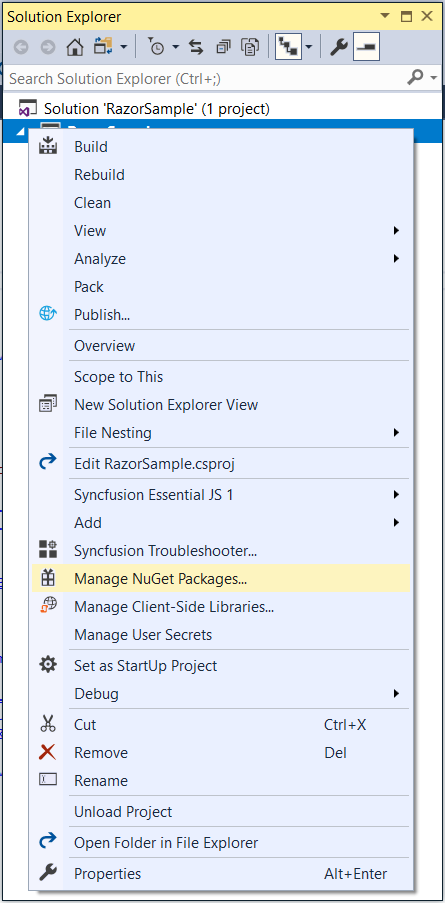
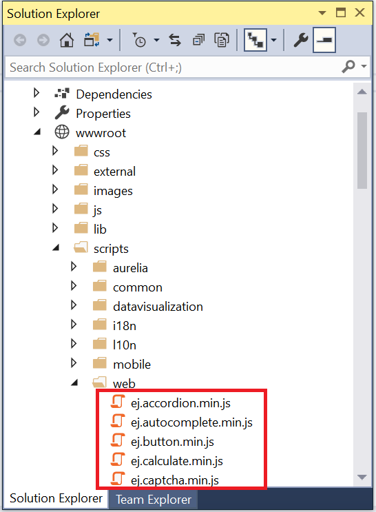
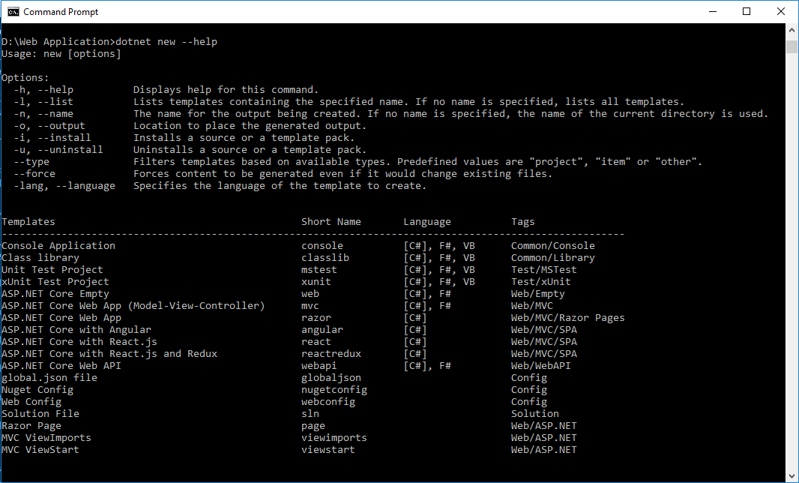
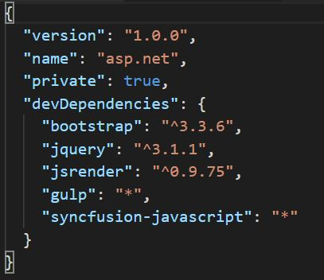

# Getting Started

> Starting with v16.2.0.x, if you reference Syncfusion assemblies from trial setup or from the NuGet feed, you also have to include a license key in your projects. Please refer to this [link](https://help.syncfusion.com/common/essential-studio/licensing/license-key#aspnet-core) to know about registering Syncfusion license key in your ASP.NET Core application to use our components.
  
## ASP.NET Core 2.x Application Using Visual Studio 2017 version 15.3+

### System Requirements:

To work with ASP.NET Core 2.x, you need to make sure, whether you have installed the following software on your machine

* Visual Studio 2017 [version 15.5](https://www.visualstudio.com/downloads/).

* DotNetCore [2.x](https://www.microsoft.com/net/download/dotnet-core).

### Configure Syncfusion UI Components in ASP.NET Core Application using NuGet packages:

The following steps helps to create a ASP.NET Core web application to configure our components.

*  Open Visual Studio 2017 version 15.5 to create **ASP.NET Core web application**.

   

*  After project creation, install the Syncfusion NuGet packages in your application by following the below given steps.

> The Syncfusion ASP.NET Core NuGet package can be installed from [https://www.nuget.org/packages/Syncfusion.EJ.AspNet.Core](https://www.nuget.org/packages/Syncfusion.EJ.AspNet.Core)
    
* Right click on your project references and then select “**Manage NuGet Package**” option. 

* In the new window, choose the “**nuget.org**” from the package source dropdown. And check the “**include prerelease**” option.

* Now, browse and select `Syncfusion.EJ.AspNet.Core` NuGet package from the NuGet solution window and then, install the selected NuGet package in your application.

* Now open **_viewImports.cshtml** file from the views folder and add the following namespace for components references and Tag Helper support.



    @using Syncfusion.JavaScript

    @addTagHelper "*, Syncfusion.EJ"
    


> **bower.json** file has been deprecated from the latest version of DotNetCore 2.1.

* The following two-ways are available to use the **Syncfusion client-side libraries** to render EJ components in the application.

* Copy the necessary Syncfusion script and themes files from the Syncfusion Essential Studio build installed location into the **wwwroot folder** in the application. 

> Syncfusion Essential Studio build will be available in the following installed location, 
 `C:\Program Files (x86)\Syncfusion\Essential Studio\{{ site.releaseversion }}\JavaScript\assets`
 

* Refer the required Syncfusion [CDN](https://help.syncfusion.com/js/cdn) links in the **_layout.cshtml** page to render Syncfusion components.

N> Include the below mentioned scripts and CSS references under the appropriate environment. (For eg: If your environment is "Development", then refer the scripts and CSS files under the tag *environment names="Development"*). Refer all the required external and internal scripts only once in the page with proper order. Refer this [link](https://help.syncfusion.com/js/control-initialization#adding-the-required-javascript-files) to know about order of script reference.

  
   
    <html>

    <head>

    <link rel="stylesheet" href="~/lib/bootstrap/dist/css/bootstrap.css" />

    <link href="~/lib/syncfusion-javascript/Content/ej/web/bootstrap-theme/ej.web.all.min.css" rel="stylesheet" />

    <!-- CDN style reference for EJ controls
    <link href="http://cdn.syncfusion.com/{{ site.releaseversion }}/js/web/flat-azure/ej.web.all.min.css" rel="stylesheet" /> -->

    <link href="~/lib/syncfusion-javascript/Content/ej/web/responsive-css/ej.responsive.css" rel="stylesheet" />

    <!-- CDN EJ responsive style reference for EJ controls
    <link href="https://cdn.syncfusion.com/{{ site.releaseversion }}/js/web/responsive-css/ej.responsive.css" rel="stylesheet"> -->

    

    

    

     <!-- CDN script reference for EJ controls
     -->

    </head>

    <body>

    </body>

    </html>

  

N> jQuery.easing external dependency has been removed from version 14.3.0.49 onwards. Kindly include this jQuery.easing dependency for versions lesser than 14.3.0.49 in order to support animation effects.

  *  Add **ScriptManager** to the bottom of the **layout.cshtml** page. The **ScriptManager** used to place our control initialization script in the page.

    
    
      <ej-script-manager></ej-script-manager>
    
    

  *  Now open your view page to render our Syncfusion components in Tag Helper syntax.   
    
    
    
      <ej-date-picker id="datepicker" value="@DateTime.Now"></ej-date-picker>
    
    

*  Finally compile your project, after successful compilation then press F5 key to deploy your project.   

   

## ASP.NET Core 2.x Application Using Command Prompt with Visual Studio Code

### System Requirements:

* Visual Studio [Code](https://code.visualstudio.com/#).

* DotNetCore [2.x](https://www.microsoft.com/net/download/dotnet-core).

The following steps helps to create a ASP.NET Core web application to configure our components.

* Create a new folder in your local directory.
* Open the command prompt from your local directory with administrator mode.
* In the command prompt we have an options to develop a below listed types of projects. The default type as console application. To know more about the project options and its syntax declarations refer the [.NET](https://docs.microsoft.com/en-us/dotnet/articles/core/tools/dotnet-new#) link.

* Run the below command to know about project creation templates.



    dotnet new --help



  

* Then run the below mentioned command to create a new web application. After command execution the project will be created within your folder.



    dotnet new mvc


  

### Configure Syncfusion Components in ASP.NET Core Application

* Open Visual Studio Code and open your ASP.NET folder using **Open -> Folder** menu. Now your project folder is loaded in Visual Studio Code application.

  

N> **bower.json** file has been deprecated from the latest version of DotNetCore 2.1. We have used syncfusion NPM packages and gulp task runner to download the necessary syncfusion scripts and CSS files into **wwwroot** folder.   

* Make sure latest version of **npm** and **Node.js** has installed in your machine. To check the npm and node version installed in your machine type the following commands in the terminal window.



    node -v 

    npm -v

 

* Type the following command in the terminal window to create **package.json** file in your application. **package.json** will contain the project dependency packages and its version information.


 
    npm init --yes 

 

* After **package.json** file is created. Remove the content in that file and include the following dependencies.

 

    { 
      "version": "1.0.0", 
      "name": "asp.net", 
      "private": true, 
      "devDependencies": { 
        "bootstrap": "^3.3.6", 
        "jquery": "^3.1.1", 
        "jsrender": "^0.9.75", 
        "gulp": "*", 
        "syncfusion-javascript": "*" 
        } 
    } 

  

  

* Now, run the following commands to download syncfusion scripts and CSS in the node_modules directory.



    npm install

  npm install syncfusion-javascript

 

* Add the **gulpfile.js** in the root directory and kindly include the below mentioned gulp task in the **gulpfile.js**.

  

    var gulp = require('gulp'); 
    gulp.task('copy', async function () { 
        gulp.src('./node_modules/syncfusion-javascript/**') 
            .pipe(gulp.dest('./wwwroot/lib/syncfusion-javascript')); 
    });

  

*  Open then command window prompt and run the below command to copy the necessary script and CSS files from node_modules directory to wwwroot directory.



  gulp copy 

 

* Now open your **project.csproj** file to specify our assembly packages.

  

N> The package **"Syncfusion.EJ.MVC"** renamed into **"Syncfusion.EJ.AspNet.Core"** from Volume 3, 2016 (14.3.0.49) release. The "**preview2-final**" keyword removed our Syncfusion packages naming from Volume 1, 2017 (15.1.0.33) release.

* Open **_viewimports.cshtml** file from the views folder and add the following namespace for components references and Tag Helper support.

 

    @using Syncfusion.JavaScript

    @addTagHelper "*, Syncfusion.EJ"



* open command prompt window with administrator rights and navigate to your project folder then execute the following command to restore the packages specified in your **project.csproj** file.



    dotnet restore


 

* Now refer the necessary scripts and CSS files in your **_layout.cshtml** page.

N> Kindly include the below mentioned scripts and CSS references under the appropriate environment. (For eg: If your environment is "Development", then refer the scripts and CSS files under the tag *environment names="Development"*)



    <html>

    <head>

    <link rel="stylesheet" href="~/lib/bootstrap/dist/css/bootstrap.css" />

    <link href="~/lib/syncfusion-javascript/Content/ej/web/bootstrap-theme/ej.web.all.min.css" rel="stylesheet" />

    <!-- CDN style reference for EJ controls
    <link href="http://cdn.syncfusion.com/{{ site.releaseversion }}/js/web/flat-azure/ej.web.all.min.css" rel="stylesheet" /> -->

    <link href="~/lib/syncfusion-javascript/Content/ej/web/responsive-css/ej.responsive.css" rel="stylesheet" />

    <!-- CDN responsive style reference for EJ controls
    <link href="https://cdn.syncfusion.com/{{ site.releaseversion }}/js/web/responsive-css/ej.responsive.css" rel="stylesheet"> -->

    

    

    

     <!-- CDN script reference for EJ controls
     -->

    </head>

    <body>

    </body>

    </html>



N> jQuery.easing external dependency has been removed from version 14.3.0.49 onwards. Kindly include this jQuery.easing dependency for versions lesser than 14.3.0.49 in order to support animation effects.

* Add **ScriptManager** to the bottom of the **layout.cshtml** page. The **ScriptManager** used to place our control initialization script in the page.

   
   
      <ej-script-manager></ej-script-manager>
	
   

* Now open your view page to render our Syncfusion components in Tag Helper syntax.

   
   
      <ej-date-picker id="datepicker" value="@DateTime.Now"></ej-date-picker>
	
   

* Finally open command prompt window with administrator rights and navigate to your project folder then execute the following command to run the project.



    dotnet run



* Open browser and launch the localhost:5000 to view the output of the project.

  

## ASP.NET Core 2.x Application Using Yeoman with Visual Studio Code:

### System Requirements:

* Visual Studio 2017 [version 15.x](https://www.visualstudio.com/downloads/).

* DotNetCore [2.x](https://www.microsoft.com/net/download/dotnet-core).

To create an ASP.NET Core 2.x application, we will use the [**yeoman**](http://yeoman.io/#) tool. This is a scaffolding tool for Modern web apps and helps us to quick start a new web project. 

Since **Visual Studio Code** uses folder structure for storing files of application, we will create a folder of the name **ASP.NET**

* Install Node from [https://nodejs.org/](https://nodejs.org/#)

* Open the Command prompt window in Administrator mode and execute the below mentioned command to install the **Yeoman** tool in your local machine by using **npm**.



    npm install -g yo



* After installing **Yo** you need to install the ASP.NET generator, gulp and Bower.



    npm install -g yo generator-aspnet gulp bower



* Once Yeoman generator installed successfully, run the below command to invoke a ASP.NET Core project creation wizard.



    yo aspnet



  

* From the list of available projects, select the **Web Application Basic [ without Membership and Authorization ]** by using arrow keys.

  

* And then provide the project name or simply press the enter key to create the project with default name.

### Configure Syncfusion Components in ASP.NET Core Application

* Open Visual Studio Code and open your ASP.NET folder using **Open -> Folder** menu. Now your project folder is loaded in Visual Studio Code application.

  

  N> **bower.json** file has been deprecated from the latest version of DotNetCore 2.1. We have used syncfusion NPM packages and gulp task runner to download the necessary syncfusion scripts and CSS files into wwwroot folder.   

* Make sure latest version of npm and Node.js has installed in your machine. To check the npm and node version installed in your machine type the following commands in the terminal window.



    node -v 

    npm -v

 

* Open the global.json file. Remove the content in that file and include the installed dotnet *2.x* version as depicted in the following code.



    {
        "sdk": {
            "version": "2.1.4"
        }
    }



* Type the following command in the terminal window to create **package.json** file in your application. **package.json** will contain the project dependency packages and its version information.


 
    npm init --yes 

 

* After **package.json** file is created. Remove the content in that file and include the following dependencies.

 

    { 
      "version": "1.0.0", 
      "name": "asp.net", 
      "private": true, 
      "devDependencies": { 
        "bootstrap": "^3.3.6", 
        "jquery": "^3.1.1", 
        "jsrender": "^0.9.75", 
        "gulp": "*", 
        "syncfusion-javascript": "*" 
        } 
    } 

  

  

* Now, run the following commands to download syncfusion scripts and CSS in the node_modules directory.



    npm install

 

* Add the **gulpfile.js** in the root directory and kindly include the below mentioned gulp task in the **gulpfile.js**.

  

    var gulp = require('gulp'); 
    gulp.task('copy', async function () { 
        gulp.src('./node_modules/syncfusion-javascript/**') 
            .pipe(gulp.dest('./wwwroot/lib/syncfusion-javascript')); 
    });

  

*  Open then command window prompt and run the below command to copy the necessary script and CSS files from node_modules directory to wwwroot directory.



  gulp copy 

 

 
* Now open your **project.csproj** file to specify our assembly packages.

  

N> The package **"Syncfusion.EJ.MVC"** renamed into **"Syncfusion.EJ.AspNet.Core"** from Volume 3, 2016 (14.3.0.49) release. The "**preview2-final**" keyword removed our Syncfusion packages naming from Volume 1, 2017 (15.1.0.33) release.

* Open **“_viewimports.cshtml**” file from the views folder and add the following namespace for components references and Tag Helper support.



    @using Syncfusion.JavaScript

    @addTagHelper "*, Syncfusion.EJ"



* open command prompt window with administrator rights and navigate to your project folder then execute the following command to restore the packages specified in your **project.csproj** file.



    dotnet restore



 
* Now refer the necessary scripts and CSS files in your **_layout.cshtml** page.

N> Kindly include the below mentioned scripts and CSS references under the appropriate environment. (For eg: If your environment is "Development", then refer the scripts and CSS files under the tag *environment names="Development"*)



[Layout.cshtml]

    <html>

    <head>

    <link rel="stylesheet" href="~/lib/bootstrap/dist/css/bootstrap.css" />

    <link href="~/lib/syncfusion-javascript/Content/ej/web/bootstrap-theme/ej.web.all.min.css" rel="stylesheet" />

    <!-- CDN style reference for EJ controls
    <link href="http://cdn.syncfusion.com/{{ site.releaseversion }}/js/web/flat-azure/ej.web.all.min.css" rel="stylesheet" /> -->

    <link href="~/lib/syncfusion-javascript/Content/ej/web/responsive-css/ej.responsive.css" rel="stylesheet" />

    <!-- CDN responsive style reference for EJ controls
    <link href="https://cdn.syncfusion.com/{{ site.releaseversion }}/js/web/responsive-css/ej.responsive.css" rel="stylesheet"> -->

    

    

    

     <!-- CDN script reference for EJ controls
     -->

    </head>

    <body>

    </body>

    </html>



N> jQuery.easing external dependency has been removed from version 14.3.0.49 onwards. Kindly include this jQuery.easing dependency for versions lesser than 14.3.0.49 in order to support animation effects.

* Add **ScriptManager** to the bottom of the **layout.cshtml** page. The **ScriptManager** used to place our control initialization script in the page.

   
   
      <ej-script-manager></ej-script-manager>
	
   

* Now open your view page to render our Syncfusion components in Tag Helper syntax.

   
   
	  <ej-date-picker id="datepicker" value="@DateTime.Now"></ej-date-picker>
	
   

* Finally open command prompt window with administrator rights and navigate to your project folder then execute the following command to run the project.



    dotnet run



  
