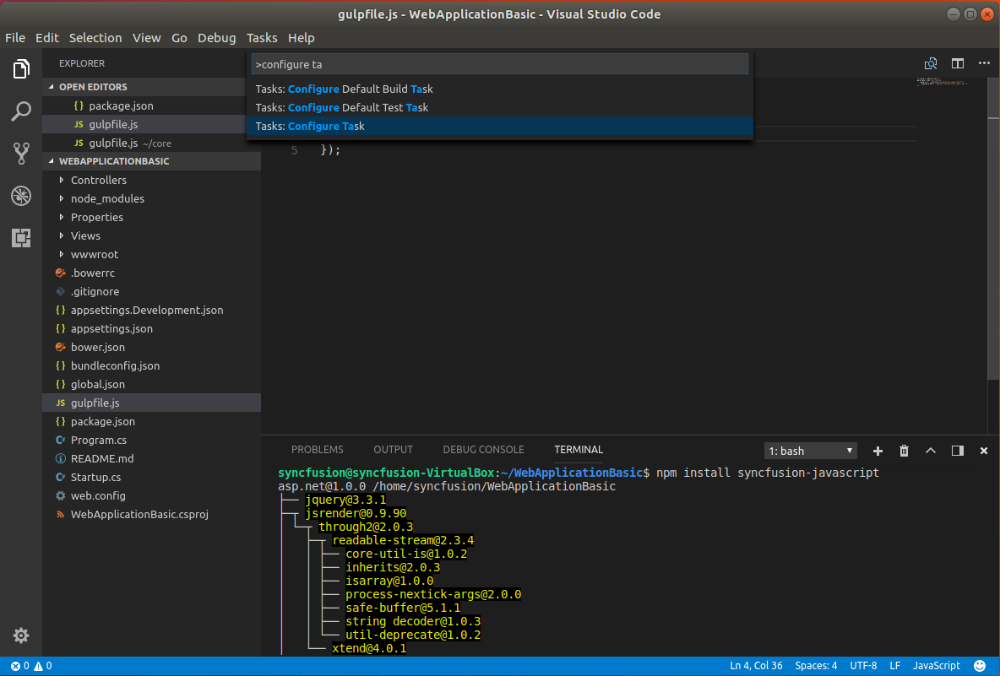
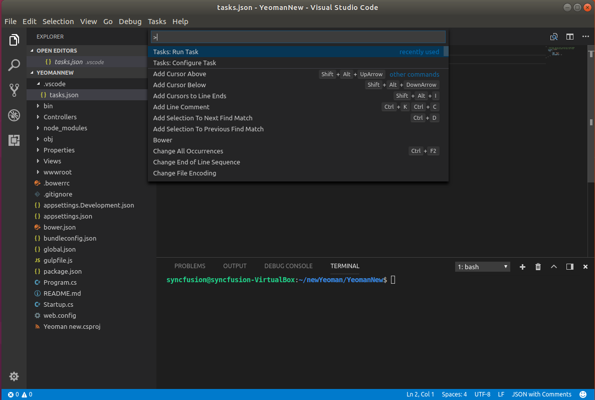
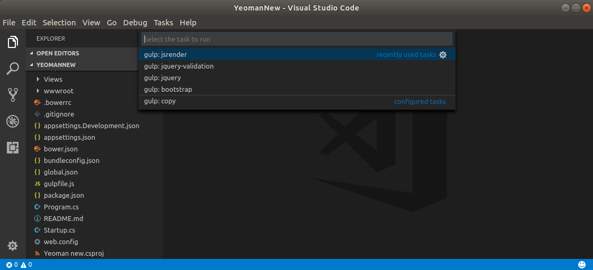

# Getting Started on Linux

> Starting with v16.2.0.x, if you reference Syncfusion assemblies from trial setup or from the NuGet feed, you also have to include a license key in your projects. Please refer to this [link](https://help.syncfusion.com/common/essential-studio/licensing/license-key#aspnet-core) to know about registering Syncfusion license key in your ASP.NET Core application to use our components.

The below guidelines demonstrate how to create an ASP.NET Core application and configure with our components.

## Prerequisites

* Visual Studio [Code](https://code.visualstudio.com/).

* Mono

* Install .NET Core [SDK](https://www.microsoft.com/net/download/linux) based on your OS version. 

Set up the apt-get feeds, then install .NET Core on Ubuntu or Linux Mint. Execute the below commands in terminal window to set up the apt-get feeds for Ubuntu 17.10 and 17.04.

### Ubuntu 17.10

Open your terminal window and execute the following commands.

* Register the Microsoft Product key as trusted.



    sudo sh -c 'echo "deb [arch=amd64] https://packages.microsoft.com/repos/microsoft-ubuntu-artful-prod artful main" > /etc/apt/sources.list.d/dotnetdev.list'
    
    sudo apt-get update



* Setup host Package feed commands.



    sudo sh -c 'echo "deb [arch=amd64] https://packages.microsoft.com/repos/microsoft-ubuntu-artful-prod artful main" > /etc/apt/sources.list.d/dotnetdev.list'

    sudo apt-get update



### Ubuntu 17.04

* Setup host Package feed commands



sudo sh -c 'echo "deb [arch=amd64] https://packages.microsoft.com/repos/microsoft-ubuntu-zesty-prod zesty main" > /etc/apt/sources.list.d/dotnetdev.list'

sudo apt-get update



### Mono Installation

The [Mono Project](http://www.mono-project.com/) (powered by Xamarin) is a project that tends to make the .NET Framework available to Microsoft's foreign platforms. To run our ASP.NET Core 2.1.4 web application on Linux, install the Mono by executing the below commands.

* Execute this command to add the Mono's GPG key to the packages manager.



apt-key adv --keyserver keyserver.ubuntu.com --recv-keys 3FA7E0328081BFF6A14DA29AA6A19B38D3D831EF



* Then need to add the required repositories to the configuration file.



echo "deb http://download.mono-project.com/repo/debian wheezy main" | sudo tee /etc/apt/sources.list.d/mono-xamarin.list

echo "deb http://download.mono-project.com/repo/debian wheezy-apache24-compat main" | sudo tee -a /etc/apt/sources.list.d/mono-xamarin.list



* Before the Mono installation, execute the below command to download the packages list from the repositories and update the packages with new version.



sudo apt-get update



* Finally install the Mono.



sudo apt-get install mono-complete



### .NET Core SDK installation

Before you start, please ensure any previous .NET Core version installed on your machine. If its exists remove the previous version by using this [script](https://github.com/dotnet/cli/blob/rel/1.0.0/scripts/obtain/uninstall/dotnet-uninstall-debian-packages.sh).

* Executing the following command automatically install the .NET Core SDK.



sudo apt-get install dotnet-sdk-2.1.4



* Execute the following command to prove the SDK installed successfully.



dotnet --version



## Configuration

To configure an ASP.NET Core application and utilize our components, follow the below guidelines.

* Create an ASP.NET Core Project.
* Configuring Syncfusion Components.

### Create an ASP.NET Core Application

ASP.NET Core Web application can be created in any one of the following ways.

* Terminal (Command Line).

* Yeoman.

#### Building Projects with Command Line

The following steps helps to create a ASP.NET Core web application using terminal window.

* Open a terminal window to create a new directory for your project creation.



mkdir Sample



* Then navigate to your folder directory in your terminal window.

* In terminal window, the following steps helps to create a ASP.NET Core web application to configure our components.

* In the terminal window, we have an options to develop a below listed types of projects. The default type as console application. To know more about the project options and its syntax declarations refer the [.NET](https://docs.microsoft.com/en-us/dotnet/articles/core/tools/dotnet-new#) link.

* Run the below command to know about project creation templates.



    dotnet new --help



  

* Then run the below mentioned command to create a new web application. After command execution the project will be created within your folder.



    dotnet new mvc



  

#### Building Projects with Yeoman
Yeoman is a scaffolding tool for modern web apps and helps us to quick start a new web project. The following steps helps to create an ASP.NET Core 1.0 application using [yeoman](http://yeoman.io/) tool.
Since **Visual Studio Code** uses folder structure for storing files of application, create a folder of the name **ASP.NET**.

* Open the Terminal window and execute the below mentioned command  to install the Node.js.



curl -sL https://deb.nodesource.com/setup_4.x | sudo -E bash -

    sudo apt-get install -y nodejs



* Install Yeoman and aspnet generator.



    sudo npm install -g yo generator-aspnet



* Once Yeoman generator installed successfully, run the below command to invoke a ASP.NET Core project creation wizard.



    yo aspnet



* From the list of available projects, select the *Web Application Basic* [without Membership and Authorization] by using arrow keys.

  

* And then provide the project name or simply press the ‘Enter’ key to create the project with default name.

  

### Configuring Syncfusion Components

* Open Visual Studio Code and open your Sample application folder using **Open Folder** option. Now your project folder is loaded in Visual Studio Code application.

  

> **bower.json** file has been deprecated from the latest version of DotNetCore 2.1. We have used syncfusion NPM packages and gulp task runner to download the necessary syncfusion scripts and CSS files into wwwroot folder.   

* Make sure latest version of npm and Node.js has installed in your machine. To check the npm and node version installed in your machine type the following commands in the terminal window.



    node -v 

    npm -v

 

* Open the global.json file. Remove the content in that file and include the installed dotnet version as depicted in the following code.



    {
        "sdk": {
            "version": "2.1.4"
        }
    }



* Type the following command in the terminal window to create **package.json** file in your application. **package.json** will contain the project dependency packages and its version information.


 
    npm init --yes 

 

* After **package.json** file is created. Remove the content in that file and include the following dependencies.

 

    { 
      "version": "1.0.0", 
      "name": "asp.net", 
      "private": true, 
      "devDependencies": { 
        "bootstrap": "^3.3.6", 
        "jquery": "^3.1.1", 
        "jsrender": "^0.9.75", 
        "gulp": "^3.9.1", 
        "syncfusion-javascript": "^16.1.24" 
        } 
    } 

  

  

  * Now, run the following commands to download syncfusion scripts and CSS in the node_modules directory.


  
  npm install

 

* Add the **gulpfile.js** in the root directory and kindly include the below mentioned gulp task in the **gulpfile.js**.

  

    var gulp = require('gulp'); 
    gulp.task('copy', function () { 
        gulp.src('./node_modules/syncfusion-javascript/**') 
            .pipe(gulp.dest('./wwwroot/lib/syncfusion-javascript')); 
    });

  

  * To copy any other project dependency packages into the **wwwroot** folder, write a new task for each packages as given in the following code sample.

    

    gulp.task('bootstrap', function () {

        gulp.src('./node_modules/bootstrap/**')

            .pipe(gulp.dest('./wwwroot/lib/bootstrap'));
            
    });

    gulp.task('jquery', function () {

        gulp.src('./node_modules/jquery/**')

            .pipe(gulp.dest('./wwwroot/lib/jquery'));

    });

    gulp.task('jquery-validation', function () {

        gulp.src('./node_modules/jquery-validation/**')

            .pipe(gulp.dest('./wwwroot/lib/jquery-validation'));

    });

    gulp.task('jsrender', function () {

        gulp.src('./node_modules/jsrender/**')

            .pipe(gulp.dest('./wwwroot/lib/jsrender'));

    });

   

   To configure Visual Studio Code to use Gulp as task runner, Press **Ctrl+Shift+P** to bring up the command palette. Now type **Configure Task** and select **Create task.json file from template**.
  
  

   * This will create **task.json** file in .vscode directory.

* Once again, press **Ctrl+Shift+P** to bring up the command palette. Type "Run Task" and select it, which will bring up a list of tasks configured in Gulp. Choose the Gulp Task **copy** to run gulp task to copy necessary script and CSS files from **node_modules** directory to **wwwroot** directory.

  

* By the same way,type "Run Task" and select each gulp task mentioned in **gulpfile.js** to copy the scripts and CSS from the required package in **node_modules** directory to **wwwroot** directory.

* Now refer our Syncfusion package **Syncfusion.EJ.AspNet.Core** into your application for our components deployment. The packages configuration & installation guidelines will be documented [here](https://help.syncfusion.com/extension/syncfusion-nuget-packages/nuget-install-and-configuration#confuguring-syncfusion-nuget-packages-from-command-line-in-linuxmac).

* Once the NuGet packages installation gets completed, the **Syncfusion.EJ.AspNet.Core** package reference was automatically added in **.csproj** file.



    <PackageReference Include="Syncfusion.EJ.AspNet.Core" Version="16.1600.0.24">



  

> The ASP.NET Core NuGet packages versioning has been streamlined as 16.1.0.32 in shorter than older versioning (16.1600.0.32) from Volume 1, 2018 service pack 1 release (16.1.0.32). Since all the framework version wise assemblies are grouped into a single package.

> The package **"Syncfusion.EJ.MVC"** renamed into **"Syncfusion.EJ.AspNet.Core"** from Volume 3, 2016 (14.3.0.49) release. The "**preview2-final**" keyword removed our Syncfusion packages naming from Volume 1, 2017 (15.1.0.33) release.

* Open **_viewimports.cshtml** file from the views folder and add the following namespace for components references and Tag Helper support.



    @using Syncfusion.JavaScript

    @addTagHelper *, Syncfusion.EJ



* Open Terminal window and navigate to your project folder then execute the following command to restore the packages which are all specified in your **.csproj** file.



    dotnet restore



 

* Now refer the necessary scripts and CSS files in your **_layout.cshtml** page.

N> Include the below mentioned scripts and CSS references under the appropriate environment. (For eg: If your environment is "Development", then refer the scripts and CSS files under the tag *environment names="Development"*). Refer all the required external and internal scripts only once in the page with proper order. Refer this [link](https://help.syncfusion.com/js/control-initialization#adding-the-required-javascript-files) to know about order of script reference.



    <html>

    <head>

    <link rel="stylesheet" href="~/lib/bootstrap/dist/css/bootstrap.css" />

    <link href="~/lib/syncfusion-javascript/Content/ej/web/bootstrap-theme/ej.web.all.min.css" rel="stylesheet" />

    <link href="~/lib/syncfusion-javascript/Content/ej/web/responsive-css/ej.responsive.css" rel="stylesheet" />

    

    

    

    </head>

    <body>

    </body>

    </html>



N> jQuery.easing external dependency has been removed from version 14.3.0.49 onwards. Kindly include this jQuery.easing dependency for versions lesser than 14.3.0.49 in order to support animation effects.

* Add **ScriptManager** to the bottom of the **layout.cshtml** page. The **ScriptManager** used to place our control initialization script in the page.


   
    <ej-script-manager></ej-script-manager>
	


* Now open your view page to render our Syncfusion components in Tag Helper syntax.


   
    <ej-date-picker id="datepicker" value="@DateTime.Now"></ej-date-picker>
	


* Finally execute the **dotnet run** command to run your sample browser.

* Then open your browser and paste the listening port **localhost:5000** to view your sample in browser.

 