# Getting Started on Mac

> Starting with v16.2.0.x, if you reference Syncfusion assemblies from trial setup or from the NuGet feed, you also have to include a license key in your projects. Please refer to this [link](https://help.syncfusion.com/common/essential-studio/licensing/license-key#aspnet-core) to know about registering Syncfusion license key in your ASP.NET Core application to use our components.

The below guidelines demonstrate how to create an ASP.NET Core application and configure with our components.

## Prerequisites

* Visual Studio [Code](https://code.visualstudio.com/).

* ASP.NET Core 1.0.1 [Preview2](https://go.microsoft.com/fwlink/?LinkID=827517).

* [Homebrew](http://brew.sh/)

* OpenSSL (Latest Version)

>   Install the latest version OpenSSL by executing the following commands in your terminal window.


~$ brew update
~$ brew install openssl
~$ brew link -force openssl


## Configuration

To configure an ASP.NET Core application and utilize our components, follow the below guidelines.

* Create an ASP.NET Core Project
* Configuring Syncfusion Components

### Create an ASP.NET Core Project

ASP.NET Core Web application can be created in any one of the following ways.

* Terminal (Command Line)
* Yeoman

#### Building Projects with Terminal

The following steps helps to create a ASP.NET Core web application using terminal window.

* Open a terminal window, create a new directory for your project creation.



mkdir Sample



* Then navigate to your folder directory in your terminal window.

* In terminal window, you have an option to develop a below listed types of ASP.NET Core projects. The default project type as console application. If you want to create any other specific type project, then need to specify the **-t** (**template**) key in command before the project type name. To know more about the project options and its syntax declarations refer the [dotnet](https://docs.microsoft.com/en-us/dotnet/articles/core/tools/dotnet-new) link.



*   console
*   web    
*   lib
*   xunittest



* Then run the below mentioned command to create a new web application. After this command execution the new web application project will be created within your folder.



dotnet new -t web



  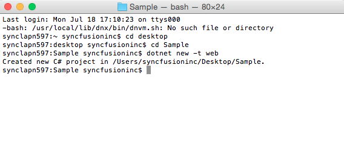

#### Building Projects with Yeoman

Yeoman is a scaffolding tool for modern web apps and helps us to quick start a new web project. The following steps helps to create an ASP.NET Core 1.0 application using [yeoman](http://yeoman.io/) tool.
Since **Visual Studio Code** uses folder structure for storing files of application, create a folder of the name **ASP.NET**.

* Open the Command line terminal and execute the below mentioned command to install the Node.js.



brew install node



* Then need to install the *Yeoman*, *bower*, *grunt* and *gulp* tool in your local machine by using *npm*.



npm install -g yo bower grunt-cli gulp



> If you get the error *npm ERR! Please try running this command again in root/administrator* on Mac OS, run the following command using [sudo](https://developer.apple.com/legacy/library/documentation/Darwin/Reference/ManPages/man8/sudo.8.html): *sudo npm install -g yo bower grunt-cli gulp*

* After installing *Yo* you need to install the ASP.NET generator.



npm install -g generator-aspnet



* Once Yeoman generator installed successfully, run the below command to invoke a ASP.NET Core project creation wizard.



yo aspnet



  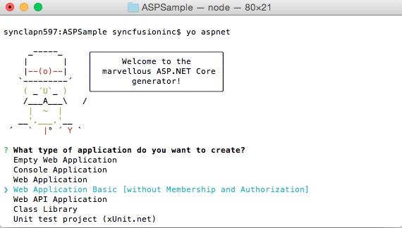

* From the list of available projects, select the *Web Application Basic* [without Membership and Authorization] by using arrow keys.

  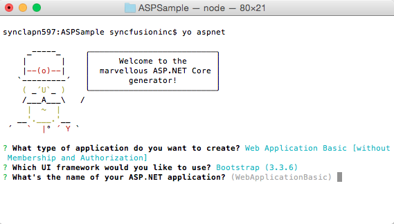

* And then provide the project name or simply press the ‘Enter’ key to create the project with default name.

  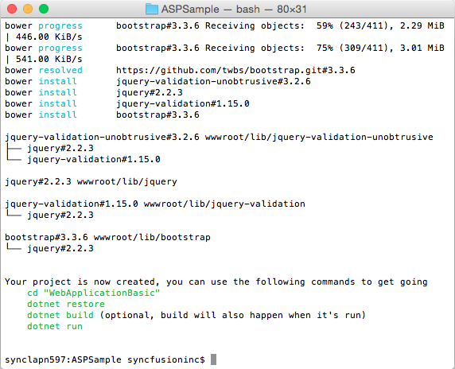

### Configuring Syncfusion Components

* Open Visual Studio Code and open your Sample application folder using **Open Folder** option. Now your project folder is loaded in Visual Studio Code application.

  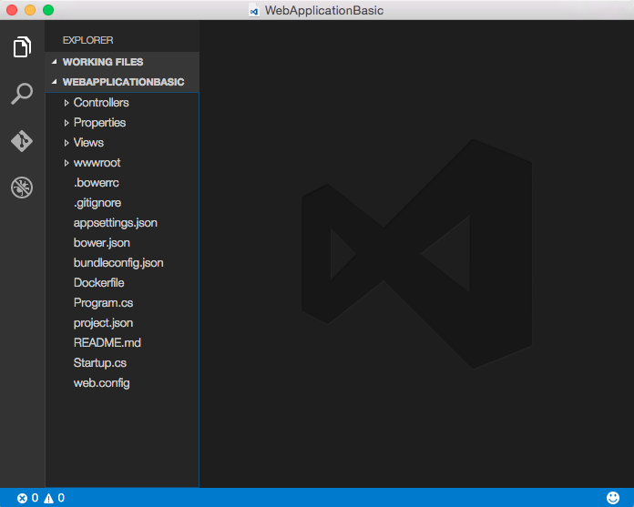

* Now configure a Bower execution environment in your local machine based on this [link](https://help.syncfusion.com/js/installation-and-deployment#configuring-syncfusion-bower-packages)

* Open a quick window (Command + P) and run the following command to install the Bower extension in your Visual Studio Code.



ext install bower



  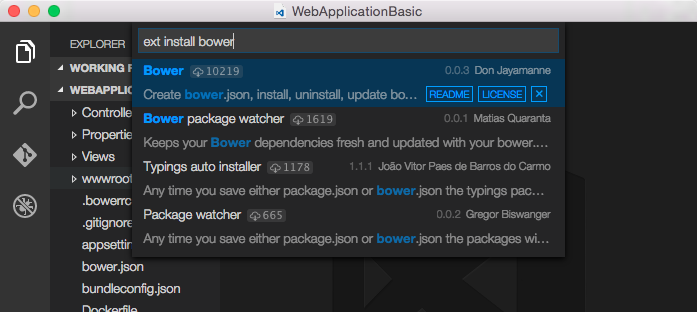

* In **bower.json** file specify our Syncfusion packages with our latest version, or else specify the **`*`** symbol will automatically loads our latest version scripts and CSS files.

  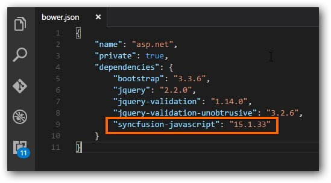

* Then open quick window to enter the *`>bower`* command and press ‘Enter’ key, from the below list of suggestions select the **bower install** option to restored our scripts and CSS into your application **wwwroot -> lib** folder.

  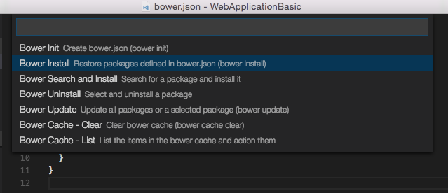

> Recommended to install the **Bower package watcher** extension will helps to load the packages automatically whenever save the **bower.json** file.

* Now refer our Syncfusion package **Syncfusion.EJ.AspNet.Core** into your application for our components deployment. The packages configuration & installation guidelines will be documented [here](https://help.syncfusion.com/extension/syncfusion-nuget-packages/nuget-install-and-configuration#confuguring-syncfusion-nuget-packages-from-command-line-in-linuxmac).

* Now open your **project.json** file to specify our assembly packages.

  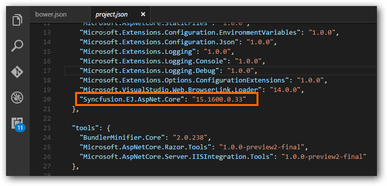

> The ASP.NET Core NuGet packages versioning has been streamlined as 16.1.0.32 in shorter than older versioning (16.1600.0.32) from Volume 1, 2018 service pack 1 release (16.1.0.32). Since all the framework version wise assemblies are grouped into a single package.

> The package **"Syncfusion.EJ.MVC"** renamed into **"Syncfusion.EJ.AspNet.Core"** from Volume 3, 2016 (14.3.0.49) release. The "**preview2-final**" keyword removed our Syncfusion packages naming from Volume 1, 2017 (15.1.0.33) release.

* Open **_viewimports.cshtml** file from the views folder and add the following namespace for components references and Tag Helper support.



@using Syncfusion.JavaScript
@addTagHelper *, Syncfusion.EJ



* Open Terminal window and navigate to your project folder then execute the following command to restore the packages which are all specified in your **project.json** file.



dotnet restore



  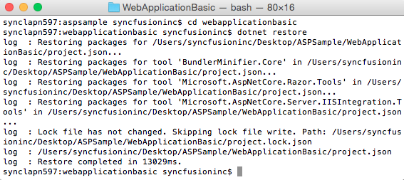

* Now refer the necessary scripts and CSS files in your **_layout.cshtml** page.

N> Include the below mentioned scripts and CSS references under the appropriate environment. (For eg: If your environment is "Development", then refer the scripts and CSS files under the tag *environment names="Development"*). Refer all the required external and internal scripts only once in the page with proper order. Refer this [link](https://help.syncfusion.com/js/control-initialization#adding-the-required-javascript-files) to know about order of script reference.



<html>

<head>

<link rel="stylesheet" href="~/lib/bootstrap/dist/css/bootstrap.css" />

<link href="~/lib/syncfusion-javascript/Content/ej/web/bootstrap-theme/ej.web.all.min.css" rel="stylesheet" />

<link href="~/lib/syncfusion-javascript/Content/ej/web/responsive-css/ej.responsive.css" rel="stylesheet" />

</head>

<body>

</body>

</html>



N> jQuery.easing external dependency has been removed from version 14.3.0.49 onwards. Kindly include this jQuery.easing dependency for versions lesser than 14.3.0.49 in order to support animation effects.

* Add **ScriptManager** to the bottom of the **layout.cshtml** page. The **ScriptManager** used to place our control initialization script in the page.


   
    <ej-script-manager></ej-script-manager>
	


* Now open your view page to render our Syncfusion components in Tag Helper syntax.



<ej-date-picker id="datepicker" value="@DateTime.Now"></ej-date-picker>
	


* Finally execute the **dotnet run** command to run your sample browser.

  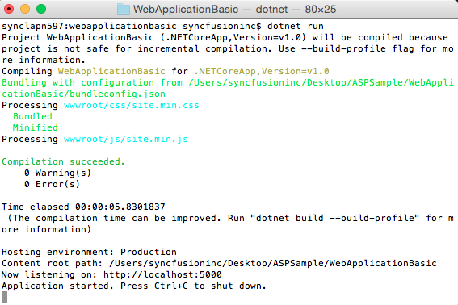

* Then open your browser and paste the listening port **localhost:5000** to view your sample in browser.

  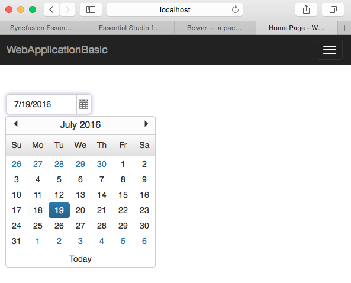