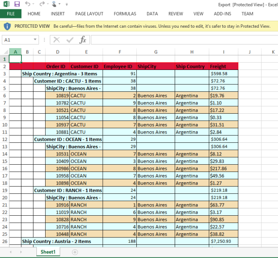

# Exporting

The Exporting provides support to export grid data into excel, word and PDF files. To export the grid, the `export` JavaScript method should be called with export action as parameter. To make it work from grid tool bar, `ExcelExport`, `WordExport` and `PdfExport` toolbar items needs to be added in grid tool bar using the `toolbar-items` property of `toolbar-settings` which are used to perform exporting. When you click the toolbar exporting icon, it internally invokes the `export` public method of grid object to export. The code snippet for this is as follows.


 


    <ej-grid id="FlatGrid" datasource="ViewBag.datasource" allow-paging="true">
        <e-toolbar-settings show-toolbar="true" toolbar-items=@(new List&lt;string>() {"excelExport","wordExport","pdfExport" })>
           
        </e-toolbar-settings>
        <e-columns>
            <e-column field="OrderID" header-text="Order ID" text-align="Right" width="75"></e-column>
            <e-column field="CustomerID" header-text="Customer ID" width="80"></e-column>
            <e-column field="EmployeeID" header-text="Employee ID" text-align="Left" width="75"></e-column>
            <e-column field="Freight" header-text="Freight" format="{0:C2}" text-align=Right width="75"></e-column>
            <e-column field="ShipCity" header-text="Ship City" width="110"></e-column>
        </e-columns>
    </ej-grid>




    public partial class GridController : Controller
    {

        private NORTHWNDContext _context;

        public GridController(NORTHWNDContext context)
        {
            _context = context;
        }
        // GET: /<controller>/
        public ActionResult Exporting()
        {
            ViewBag.datasource = _context.Orders.Take(100).ToList();
            return View();
        }
        public ActionResult ExportToExcel(string GridModel)
        {
            ExcelExport exp = new ExcelExport();
            var DataSource = _context.Orders.Take(100).ToList();
            GridProperties gridProp = ConvertGridObject(GridModel);
            GridExcelExport excelExp = new GridExcelExport();
            excelExp.FileName = "Export.xlsx"; excelExp.Excelversion = ExcelVersion.Excel2010;
            excelExp.Theme = "flat-saffron";
            return exp.Export(gridProp, DataSource, excelExp);
        }

        public ActionResult ExportToWord(string GridModel)
        {
            WordExport exp = new WordExport();
            var DataSource = _context.Orders.Take(100).ToList();
            GridProperties gridProp = ConvertGridObject(GridModel);
            GridWordExport wordExport = new GridWordExport();
            wordExport.FileName = "Export.docx"; wordExport.Theme = "flat-saffron";
            return exp.Export(gridProp, DataSource, wordExport);
        }
        public ActionResult ExportToPdf(string GridModel)
        {
            PdfExport exp = new PdfExport();
            var DataSource = _context.Orders.Take(100).ToList();
            GridProperties gridProp = ConvertGridObject(GridModel);
            GridPdfExport pdfExp = new GridPdfExport();
            pdfExp.FileName = "Export.pdf"; pdfExp.Theme = "flat-saffron";
            return exp.Export(gridProp, DataSource, pdfExp);
        }
        private GridProperties ConvertGridObject(string gridProperty)
        {
            GridProperties gridProp = new GridProperties();
            gridProp = (GridProperties)JsonConvert.DeserializeObject(gridProperty, typeof(GridProperties));
            return gridProp;
        }
    }


 

## Hierarchy grid exporting

The grid will be exported with its child grid. This can be achieved by enabling the `IncludeChildGrid` property of the respective exporting classes like `GridExcelExport`, `GridWordExport` and `GridPdfExport` and include the dataSource needed for `ChildGrid` in the `GridProperties` object after deserializing them. Remaining procedures will be same as the normal grid exporting.

N> The excel File will be exported in the collapsed state with the expand/collapse icon whereas other file-formats like PDF and Word will be exported in expanded state.


 


<ej-grid id="Grid" datasource=ViewBag.parent allow-paging="true">
    <ej-grid query-string="EmployeeID" datasource="ViewBag.child">
        <e-columns>
            <e-column field="OrderID" header-text="Order ID" text-align="Right" width="30"></e-column>
            <e-column field="ShipCity" header-text="Ship City" width="80"></e-column>
            <e-column field="CustomerID" header-text="Customer ID" width="80"></e-column>
            <e-column field="Freight" header-text="Freight" format="{0:C2}" text-align="Right" width="80"></e-column>
        </e-columns>
    </ej-grid>
    <e-toolbar-settings show-toolbar="true" toolbar-items=@(new List<string>() {"excelExport","wordExport","pdfExport" })>
    </e-toolbar-settings>
    <e-columns>
        <e-column field="EmployeeID" header-text="EmployeeID" text-align="Right" width="30"></e-column>
        <e-column field="FirstName" header-text="First Name" width="80"></e-column>
        <e-column field="LastName" header-text="Last Name" width="80"></e-column>
        <e-column field="Title" header-text="Title" width="80"></e-column>
        <e-column field="Country" header-text="Country" width="80"></e-column>
    </e-columns>
</ej-grid>




    public partial class GridController : Controller
    {

        private NORTHWNDContext _contextData;

        public static List<Employees> emp = new List<Employees>();

        // GET: /<controller>/
        public ActionResult HierarchyGridExporting()
        {
            if (emp.Count == 0)
                BindParentData();
            ViewBag.parent = emp;
            ViewBag.child = _context.Orders.Take(100).ToList();
            return View();
        }
        public ActionResult ExportToExcel(string GridModel)
        {
            ExcelExport exp = new ExcelExport();
            var DataSource = emp;
            GridProperties gridProp = ConvertGridModel(GridModel);
            gridProp.ChildGrid.DataSource = _context.Orders.Take(100).ToList();
            GridExcelExport excelExp = new GridExcelExport();
            excelExp.FileName = "Export.xlsx"; excelExp.Excelversion = ExcelVersion.Excel2010;
            excelExp.Theme = "flat-saffron";
            excelExp.IncludeChildGrid = true;
            return exp.Export(gridProp, DataSource, excelExp);
        }

        public ActionResult ExportToWord(string GridModel)
        {
            WordExport exp = new WordExport();
            var DataSource = emp;
            GridProperties gridProp = ConvertGridModel(GridModel);
            gridProp.ChildGrid.DataSource = _context.Orders.Take(100).ToList();
            GridWordExport wordExport = new GridWordExport();
            wordExport.FileName = "Export.docx"; wordExport.Theme = "flat-saffron";
            wordExport.IncludeChildGrid = true;
            return exp.Export(gridProp, DataSource, wordExport);
        }
        public ActionResult ExportToPdf(string GridModel)
        {
            PdfExport exp = new PdfExport();
            var DataSource = emp;
            GridProperties gridProp = ConvertGridModel(GridModel);
            gridProp.ChildGrid.DataSource = _context.Orders.Take(100).ToList();
            GridPdfExport pdfExp = new GridPdfExport();
            pdfExp.FileName = "Export.pdf"; pdfExp.Theme = "flat-saffron";
            pdfExp.IncludeChildGrid = true;
            return exp.Export(gridProp, DataSource, pdfExp);
        }
        private GridProperties ConvertGridModel(string gridProperty)
        {
            GridProperties gridProp = new GridProperties();
            gridProp = (GridProperties)JsonConvert.DeserializeObject(gridProperty, typeof(GridProperties));
            return gridProp;
        }
        private void BindParentData()
        {
            emp.Add(new Employees(1, "Nancy", "Davolio", new DateTime(1948, 12, 08), "USA", "Sales Representative"));
            emp.Add(new Employees(2, "Andrew", "Fuller", new DateTime(1952, 02, 19), "USA", "Vice President, Sales"));
            emp.Add(new Employees(3, "Janet", "Leverling", new DateTime(1963, 08, 30), "USA", "Sales Representative"));
            emp.Add(new Employees(4, "Margaret", "Peacock", new DateTime(1937, 09, 19), "USA", "Sales Representative"));
            emp.Add(new Employees(5, "Steven", "Buchanan", new DateTime(1955, 03, 04), "UK", "Sales Manager"));
            emp.Add(new Employees(6, "Michael", "Suyama", new DateTime(1963, 07, 02), "UK", "Sales Representative"));
            emp.Add(new Employees(7, "Robert", "King", new DateTime(1960, 05, 29), "UK", "Sales Representative"));
            emp.Add(new Employees(8, "Laura", "Callahan", new DateTime(1958, 01, 09), "USA", "Inside Sales Coordinator"));
            emp.Add(new Employees(9, "Sans", "Serif", new DateTime(1958, 10, 10), "USA", "Sales Representative"));

        }
        public class Employees
        {
            public Employees()
            {

            }
            public Employees(int EmployeeId, string FirstName, string LastName, DateTime BirthDate, string Country, string title)
            {

                this.EmployeeID = EmployeeId;
                this.FirstName = FirstName;
                this.LastName = LastName;
                this.BirthDate = BirthDate;
                this.Country = Country;
                this.Title = title;
            }
            public int EmployeeID { get; set; }
            public string FirstName { get; set; }
            public string LastName { get; set; }
            public DateTime BirthDate { get; set; }
            public string Country { get; set; }
            public string Title { get; set; }
        }
    }



 

## ColumnTemplate exporting

To export the grid with columnTemplate we have to set the `IsTemplateColumnIncluded` as true in the parameter of the export method. You can handle the template elements in server-side event while exporting grid to various files such as Excel, PDF and Word.

The server-side events available in template column exporting and its argument types are listed in the following table.

<table>
<tr>
<th>
Event Name
</th>
<th>
Argument
</th>
<th>
Description
</th>
</tr>
<tr>
<td>
ExcelColumnTemplateInfo
</td>
<td>
currentCell, Row
</td>
<td>
It returns the current cell and row of excel sheet.
</td>
</tr>
<tr>
<td>
WordColumnTemplateInfo
</td>
<td>
currentCell, Row
</td>
<td>
It returns the current cell and row of word.
</td>
</tr>
<tr>
<td>
PdfColumnTemplateInfo
</td>
<td>
currentCell, Row
</td>
<td>
It returns the current cell and row of PDF.
</td>
</tr>
<tr>
<td>
ExcelChildGridInfo
</td>
<td>
current row, row data and GridProperties.
</td>
<td>
Customize the cell and child grid.
</td>
</tr>
<tr>
<td>
PdfChildGridInfo
</td>
<td>
current row, row data and GridProperties.
</td>
<td>
Customize the cell and child grid.
</td>
</tr>
<tr>
<td>
WordChildGridInfo
</td>
<td>
current row, row data and gridProperties.
</td>
<td>
Customize the cell and child grid.
</td>
</tr>

</table>

You can modify the template column of exporting files using server events. The code snippet for this is as follows.


 


<ej-grid id="FlatGrid" datasource="ViewBag.datasource" allow-paging="true">
   <e-toolbar-settings show-toolbar="true" toolbar-items=@(new List&lt;string>() {"excelExport","wordExport","pdfExport" })>
   </e-toolbar-settings>
      <e-columns>
            <e-column header-text="First Name" template="#columnTemplate" text-align="Center" width="80"></e-column>
            <e-column field="EmployeeID" header-text="Employee ID" width="100" text-align="Right"></e-column>
            <e-column field="LastName" header-text="Last Name" text-align="Left" width="100"></e-column>
            <e-column field="Country" header-text="Country" width="100"></e-column>
     </e-columns>
</ej-grid>





public partial class GridController : Controller

{
  public void ColumnTemplateExportToExcel(string GridModel)
  {
    ExcelExport exp = new ExcelExport();
    GridExcelExport GridExp = new GridExcelExport();
    GridExp.QueryCustomSummaryInfo = SummaryCellInfo;
    GridExp.Theme = "flat-saffron";
    GridExp.FileName = "Export.xlsx";
    GridExp.IsTemplateColumnIncluded = true;
    var DataSource =  new NorthwindDataContext().EmployeeViews.ToList();
    GridProperties obj = ConvertGridObject(GridModel);
    obj.ExcelColumnTemplateInfo = templateInfo;
    exp.Export(obj, DataSource, GridExp);
  }

  public void ColumnTemplateToWord(string GridModel)
  {
    WordExport exp = new WordExport();
    GridWordExport GridExp = new GridWordExport();
    GridExp.QueryCustomSummaryInfo = SummaryCellInfo;
    GridExp.Theme = "flat-saffron";
    GridExp.FileName = "Export.docx";
    GridExp.IsTemplateColumnIncluded = true;
    var DataSource =  new NorthwindDataContext().EmployeeViews.ToList();
    GridProperties obj = ConvertGridObject(GridModel);
    obj.WordColumnTemplateInfo = WordTemplateInfo;
    exp.Export(obj, DataSource, GridExp);
  }
  public void ColumnTemplateExportToPdf(string GridModel)
  {
    PdfExport exp = new PdfExport();
    GridPdfExport GridExp = new GridPdfExport();
    GridExp.QueryCustomSummaryInfo = SummaryCellInfo;
    GridExp.Theme = "flat-saffron";
    GridExp.FileName = "Export.pdf";
    GridExp.IsTemplateColumnIncluded = true;
    var DataSource = new NorthwindDataContext().EmployeeViews.ToList();
    GridProperties obj = ConvertGridObject(GridModel);
    obj.PdfColumnTemplateInfo = PdfTemplateInfo;
    exp.Export(obj, DataSource, GridExp);
  }
  public void templateInfo(object currentCell, object row)
  {
    IRange range = (IRange)currentCell;
    object templates;
    foreach (var data in row.GetType().GetProperties())
    {
      if (range.Value.Contains(data.Name))
      {
        templates = row.GetType().GetProperty(data.Name).GetValue(row, null);
        range.Value = range.Value.Replace(data.Name, templates.ToString());
        var regex = new Regex("<a [^>]*href=(?:'(?<href>.*?)')|(?:\"(?<href>.*?)\")", RegexOptions.IgnoreCase);
        var urls = regex.Matches(range.Value.ToString()).OfType<match>().Select(m => m.Groups["href"].Value).SingleOrDefault();
        IHyperLink hyperlink = (range.Parent as Syncfusion.XlsIO.Implementation.WorksheetImpl).HyperLinks.Add(range);
        hyperlink.Type = ExcelHyperLinkType.Url;
        hyperlink.TextToDisplay = templates.ToString();
        hyperlink.Address = urls;
      }
    }
  }
  public void WordTemplateInfo(object currentCell, object row)
  {
    WTableCell wCell = (WTableCell)currentCell;
    object templates;
    foreach (var data in row.GetType().GetProperties())
    {
      if (wCell.LastParagraph.Text.ToString().Contains(data.Name))
      {
        templates = row.GetType().GetProperty(data.Name).GetValue(row, null);
        var regex = new Regex("<a [^>]*href=(?:'(?<href>.*?)')|(?:\"(?<href>.*?)\")", RegexOptions.IgnoreCase);
        var urls = regex.Matches(wCell.LastParagraph.Text).OfType<Match>().Select(m => m.Groups["href"].Value).SingleOrDefault();
        wCell.LastParagraph.Text = "";
        IWField field = wCell.LastParagraph.AppendHyperlink(urls, templates.ToString(), HyperlinkType.WebLink);
      }
    }
  }

  public void PdfTemplateInfo(object currentCell, object row)
  {
    Syncfusion.Pdf.Grid.PdfGridCell range = (Syncfusion.Pdf.Grid.PdfGridCell)currentCell;
    object templates;
    range.Value = Uri.UnescapeDataString(range.Value.ToString());
    foreach (var data in row.GetType().GetProperties())
    {
      if (range.Value.ToString().Contains(data.Name))
      {
        templates = row.GetType().GetProperty(data.Name).GetValue(row, null);
        var regex = new Regex("<a [^>]*href=(?:'(?<href>.*?)')|(?:\"(?<href>.*?)\")", RegexOptions.IgnoreCase);
        var urls = regex.Matches(range.Value.ToString()).OfType<Match>().Select(m => m.Groups["href"].Value).SingleOrDefault();
        RectangleF rectangle = new RectangleF(10, 40, 30, 30);
        PdfUriAnnotation uriAnnotation = new PdfUriAnnotation(rectangle, urls);
        uriAnnotation.Text = templates.ToString();
        range.Value = uriAnnotation;
      }
     }
   }
}




## DetailTemplate exporting

To export the grid with detail template we have to set the `IncludeDetailRow` as true in the parameter of the export method. You can handle template elements using server-side event while exporting grid to various files such as Excel, PDF and Word.

The server-side events available in detail template exporting and its argument types are listed in the following table.

<table>
<tr>
<th>
Event Name
</th>
<th>
Argument
</th>
<th>
Description
</th>
</tr>
<tr>
<td>
ExcelDetailTemplateInfo
</td>
<td>
currentCell, Row
</td>
<td>
It returns the current cell and row of excel sheet.
</td>
</tr>
<tr>
<td>
WordDetailTemplateInfo
</td>
<td>
currentCell, Row
</td>
<td>
It returns the current cell and row of word.
</td>
</tr>
<tr>
<td>
PdfDetailTemplateInfo
</td>
<td>
currentCell, Row
</td>
<td>
It returns the current cell and row of PDF.
</td>
</tr>
</table>

You can modify the detailTemplate of exporting files using server events. The code snippet for this is as follows:


 


<ej-grid id="FlatGrid" allow-paging="true" details-template="#tabGridContents" datasource="ViewBag.DataSource">
        <e-toolbar-settings show-toolbar="true" toolbar-items=@(new List<string>() {"excelExport","wordExport","pdfExport" })></e-toolbar-settings>
        <e-columns>
            <e-column field="EmployeeID" header-text="EmployeeID"></e-column>
            <e-column field="FirstName" header-text="FirstName"></e-column>
            <e-column field="Title" header-text="Title"></e-column>
            <e-column field="City" header-text="City"></e-column>
            <e-column field="Country" header-text="Country"></e-column>
       </e-columns>
</ej-grid>





public class GridController : Controller
{
    public IActionResult GridFeatures()
    {
       var DataSource = new NorthwindDataContext().EmployeeViews.ToList();
       ViewBag.DataSource = DataSource;
       return View();
    }
    public void ExportToExcel(string GridModel)
    {
      ExcelExport exp = new ExcelExport();
      var DataSource = new NorthwindDataContext().EmployeeViews.ToList();
      GridProperties obj = ConvertGridObject(GridModel);
      GridExcelExport exp2 = new GridExcelExport() { IncludeDetailRow = true, Theme = "flat-saffron", FileName = "Export.xlsx" };
      obj.ExcelDetailTemplateInfo = templateInfo;
      exp.Export(obj, DataSource, exp2);
   }
   public void ExportToWord(string GridModel)
   {
     WordExport exp = new WordExport();
     var DataSource = new NorthwindDataContext().EmployeeViews.ToList();
     GridProperties obj = ConvertGridObject(GridModel);
     obj.WordDetailTemplateInfo = WordDetailTemplateInfo;
     GridWordExport exp1 = new GridWordExport() { IncludeDetailRow = true, Theme = "flat-saffron", FileName = "Export.docx" };
     exp.Export(obj, DataSource, exp1);
   }
   public void ExportToPDF(string GridModel)
   {
     PdfExport exp = new PdfExport();
     var DataSource = new NorthwindDataContext().EmployeeViews.ToList();
     GridProperties obj = ConvertGridObject(GridModel);     
     obj.PdfDetailTemplateInfo = PdfDetailTemplateInfo;
     GridPdfExport exp3 = new GridPdfExport() { IncludeDetailRow = true, Theme = "flat-saffron", FileName = "Export.pdf" };
     exp.Export(obj, DataSource, exp3);
   }
   public void templateInfo(object currentCell, object row)
   {
     IRange range = (IRange)currentCell;
     object templates;
     foreach (var data in row.GetType().GetProperties())
     {
       if (range.Value.Contains(data.Name))
       {
         templates = row.GetType().GetProperty(data.Name).GetValue(row, null);
         range.Value = range.Value.Replace(data.Name, templates.ToString());
         var charsToRemove = new string[] { '{', '}', '<b>', ':', '</b>', ' ', 'style', '=', 'class', '
', '
', '
', 'detail', '<b', '>', };
         foreach (var c in charsToRemove)
         {
            range.Value = range.Value.ToString().Replace(c, string.Empty);
         }
         range.HorizontalAlignment = ExcelHAlign.HAlignCenter;
       }
     }
   }
   public void WordDetailTemplateInfo(object currentCell, object row)
   {
      WTableCell wCell = (WTableCell)currentCell;
      object templates;
      foreach (var data in row.GetType().GetProperties())
      {
        if (wCell.LastParagraph.Text.ToString().Contains(data.Name))
        {
          templates = row.GetType().GetProperty(data.Name).GetValue(row, null);
          wCell.LastParagraph.Text = wCell.LastParagraph.Text.ToString().Replace(data.Name, templates.ToString());
          var charsToRemove = new string[] { '{', '}', '<b>', ':', '</b>', ' ', 'style', '=', 'class', '
', '
', '
', 'detail', '<b', '>', };
          foreach (var c in charsToRemove)
          {
             wCell.LastParagraph.Text  = wCell.LastParagraph.Text.ToString().Replace(c, string.Empty); //
          }
        }
      }
   }
   public void PdfDetailTemplateInfo(object currentCell, object row)
   {
     Syncfusion.Pdf.Grid.PdfGridCell range = (Syncfusion.Pdf.Grid.PdfGridCell)currentCell;
     object templates;
     foreach (var data in row.GetType().GetProperties())
     {
       if (range.Value.ToString().Contains(data.Name))
       {
         templates = row.GetType().GetProperty(data.Name).GetValue(row, null);
         range.Value = range.Value.ToString().Replace(data.Name, templates.ToString());
         var charsToRemove = new string[] { '{', '}', '<b>', ':', '</b>', ' ', 'style', '=', 'class', '
', '
', '
', 'detail', '<b', '>', };
         foreach (var c in charsToRemove)
         {
            range.Value = range.Value.ToString().Replace(c, string.Empty);
         }
       }
     }
   }
  private GridProperties ConvertGridObject(string gridProperty)
  {
    JavaScriptSerializer serializer = new JavaScriptSerializer();
    IEnumerable div = (IEnumerable)serializer.Deserialize(gridProperty, typeof(IEnumerable));
    GridProperties gridProp = new GridProperties();
    foreach (KeyValuePair<string, object> data in div)
    {
      var property = gridProp.GetType().GetProperty(data.Key, BindingFlags.Instance | BindingFlags.Public | BindingFlags.IgnoreCase);
      if (property != null)
      {
        Type type = property.PropertyType;
        string serialize = serializer.Serialize(data.Value);
        object value = serializer.Deserialize(serialize, type);
        property.SetValue(gridProp, value, null);
      }
    }
    return gridProp;
  }
}





## Exporting with Custom Summary

In Exporting, custom summary needs to be handled using `QueryCustomSummaryInfo` server-side event.

The following code example describes the above behavior.





<ej-grid id="FlatGrid" allow-paging="true" show-summary="true" datasource="ViewBag.datasource">
        <e-toolbar-settings show-toolbar="true" toolbar-items=@(new List<string>() {"excelExport","wordExport","pdfExport" })></e-toolbar-settings>
        <e-summary-rows>
           <e-summary-row>
                   <e-summary-columns>
                     <e-summary-column summary-type="Custom" custom-summary-value="currency" format="{0:C2}" display-column="Freight"/>
                   </e-summary-columns>
           </e-summary-row>
        </e-summary-rows>
        <e-columns>
            <e-column field="OrderID" header-text="Order ID" width="70" text-align="Right"></e-column>
            <e-column field="CustomerID" header-text="Customer ID" text-align="Right" width="70"></e-column>
            <e-column field="ShipCity" header-text="Ship City" width="70"></e-column>
			<e-column field="EmployeeID" header-text="Employee ID" text-align="Right" width="70"></e-column>
            <e-column field="Freight" header-text="Freight" text-align="Right" width="70" format="{0:C}"></e-column>
        </e-columns>
</ej-grid>




   namespace Grid.Controllers
   {
     public class GridController : Controller
     {
        public ActionResult GridFeatures()
        {
            var DataSource = new NorthwindDataContext().OrdersViews.ToList();
            ViewBag.datasource = DataSource;
            return View();
        }
        public void ExportToExcel(string GridModel)
        {
            ExcelExport exp = new ExcelExport();
            GridExcelExport GridExp = new GridExcelExport();
            GridExp.QueryCustomSummaryInfo = SummaryCellInfo;
            GridExp.Theme = "flat-saffron";
            GridExp.FileName = "Export.xlsx";
            var DataSource = new NorthwindDataContext().OrdersViews.Take(100).ToList();
            GridProperties obj = ConvertGridObject(GridModel);
            exp.Export(obj, DataSource, GridExp);
        }
        public void ExportToWord(string GridModel)
        {
            WordExport exp = new WordExport();
            GridWordExport GridExp = new GridWordExport();
            GridExp.QueryCustomSummaryInfo = SummaryCellInfo;
            GridExp.Theme = "flat-saffron";
            GridExp.FileName = "Export.docx";
            var DataSource = new NorthwindDataContext().OrdersViews.Take(100).ToList();
            GridProperties obj = ConvertGridObject(GridModel);
            exp.Export(obj, DataSource, GridExp);
        }
        public void ExportToPdf(string GridModel)
        {
            PdfExport exp = new PdfExport();
            GridPdfExport GridExp = new GridPdfExport();
            GridExp.QueryCustomSummaryInfo = SummaryCellInfo;
            GridExp.Theme = "flat-saffron";
            GridExp.FileName = "Export.pdf";
            var DataSource = new NorthwindDataContext().OrdersViews.Take(100).ToList();
            GridProperties obj = ConvertGridObject(GridModel);
            exp.Export(obj, DataSource, GridExp);
        }
        private object SummaryCellInfo(IQueryable arg1, SummaryColumn arg2)
        {
            var rs = 0; double value = 0;
            if (arg2.DisplayColumn == "Freight")
            {
                rs = 100000;
                value = 0.017;
            }

            return (rs * value);
        }
        private GridProperties ConvertGridObject(string gridProperty)
        {
            JavaScriptSerializer serializer = new JavaScriptSerializer();
            IEnumerable div = (IEnumerable)serializer.Deserialize(gridProperty, typeof(IEnumerable));
            GridProperties gridProp = new GridProperties();
            foreach (KeyValuePair<string, object> ds in div)
            {
                var property = gridProp.GetType().GetProperty(ds.Key, BindingFlags.Instance | BindingFlags.Public | BindingFlags.IgnoreCase);
                if (property != null)
                {
                    Type type = property.PropertyType;
                    string serialize = serializer.Serialize(ds.Value);
                    object value = serializer.Deserialize(serialize, type);
                    property.SetValue(gridProp, value, null);
                }
            }
            return gridProp;
        }
     }
   }
   




   




##  Multiple exporting

The `allow-multiple-exporting` property allows you to export multiple grids into the same file. Once you enable the `allow-multiple-exporting`, grid properties of all the grid which are available in current page are passed as string array parameter to controller action method.
In controller action method you are able to export all the grids available in the current page. The code sample for this is as follows.


 


        Employee Grid
    

    <ej-grid id="Grid" datasource="@ViewBag.datasource1" allow-multiple-exporting="true" export-to-excel-action="MultipleExportToExcel" export-to-pdf-action="MultipleExportToPdf" export-to-word-action="MultipleExportToWord" selected-row-index="0">
        <e-toolbar-settings show-toolbar="true" toolbar-items=@(new List<string>() {"excelExport","wordExport","pdfExport" })>
        </e-toolbar-settings>
        <e-columns>
            <e-column field="EmployeeID" header-text="EmployeeID" text-align="Right" width="80"></e-column>
            <e-column field="FirstName" header-text="First Name" width="80"></e-column>
        </e-columns>
    </ej-grid>
    

        Orders Grid
    

    <ej-grid id="FlatGrid" datasource="ViewBag.datasource2">
        <e-columns>
            <e-column field="OrderID" header-text="Order ID" text-align="Right" width="75"></e-column>
            <e-column field="CustomerID" header-text="Customer ID" width="80"></e-column>
            <e-column field="EmployeeID" header-text="Employee ID" text-align="Left" width="75"></e-column>
            <e-column field="Freight" header-text="Freight" text-align=Right width="75"></e-column>
            <e-column field="ShipCity" header-text="Ship City" width="110"></e-column>
        </e-columns>
    </ej-grid>



 

// Excel export

    public ActionResult MultipleExportToExcel(string[] GridModel)
        {
            ExcelExport exp = new ExcelExport();
            var EmployeeData = _context.Employees.Take(5).ToList();
            var OrderData = _context.Orders.Take(5).ToList();
            bool initial = true;
            IWorkbook book = null;
            GridExcelExport excelExp = new GridExcelExport();
            excelExp.FileName = "Export.xlsx"; excelExp.Excelversion = ExcelVersion.Excel2010;
            excelExp.Theme = "flat-saffron";
            foreach (string gridProperty in GridModel)
            {
                GridProperties gridProp = (GridProperties)JsonConvert.DeserializeObject(gridProperty, typeof(GridProperties));
                if (initial)
                {
                    gridProp.Locale = "";
                    book = exp.Export(gridProp, EmployeeData, true, excelExp);
                    initial = false;
                }
                else
                {
                    excelExp.WorkBook = book;
                    excelExp.ExportType = MultipleExportType.AppendToSheet;
                    excelExp.HeaderText = "Second Grid";
                    return exp.Export(gridProp, OrderData,excelExp);
                }
            }
            return null;
        }

// Word export

    public ActionResult MultipleExportToWord(string[] GridModel)
        {
            WordExport exp = new WordExport();
            var EmployeeData = _context.Employees.Take(5).ToList();
            var OrderData = _context.Orders.Take(5).ToList();
            IWordDocument document = null;
            bool initial = true;
            GridWordExport wordExp = new GridWordExport();
            wordExp.FileName = "Export.docx"; wordExp.Theme = "flat-saffron";
            foreach (string gridProperty in GridModel)
            {
                GridProperties gridProp = (GridProperties)JsonConvert.DeserializeObject(gridProperty, typeof(GridProperties));
                if (initial)
                {
                    gridProp.Locale = "";
                    document = exp.Export(gridProp, EmployeeData, wordExp, true);
                    initial = false;
                }
                else
                {
                    wordExp.Document = document;
                    wordExp.HeaderText = "Second Grid";
                    return exp.Export(gridProp, OrderData, wordExp);
                }
            }
            return null;
        }

// PDF export

    public ActionResult MultipleExportToPdf(string[] GridModel)
        {
            PdfExport exp = new PdfExport();
            var EmployeeData = _context.Employees.Take(5).ToList();
            var OrderData = _context.Orders.Take(5).ToList();
            PdfDocument document = null;
            bool initial = true;
            GridPdfExport pdfExp = new GridPdfExport();
            pdfExp.FileName = "Export.pdf"; pdfExp.Theme = "flat-saffron";
            foreach (string gridProperty in GridModel)
            {
                GridProperties gridProp = (GridProperties)JsonConvert.DeserializeObject(gridProperty, typeof(GridProperties));
                if (initial)
                {
                    gridProp.Locale = "";
                    document = exp.Export(gridProp, EmployeeData, true, pdfExp);
                    initial = false;
                }
                else
                {
                    pdfExp.Document = document;
                    pdfExp.HeaderText = "Second Grid";
                    return exp.Export(gridProp, OrderData, pdfExp);
                }
            }
            return null;
        }



 

## Server Dependencies

The export helper functions are available in the Assembly `Syncfusion.EJ.Export`, which is available in the Essential Studio builds. Full list of assemblies needed for grid Export is as follows.

    1.  Syncfusion.EJ
    2.  Syncfusion.EJ.Export
    3.  Syncfusion.Linq.Base
    4.  Syncfusion.Compression.Base
    5.  Syncfusion.DocIO.Base
    6.  Syncfusion.XlsIO.Base
    7.  Syncfusion.PDF.Base

## Support Export Types

Currently server helper function allows following three types of exporting.

    1.  Word
    2.  Excel
    3.  PDF

##  Server side handlers

In ASP.NET Core, exporting is achieved by using action controller method. In controller method, the grid property is passed as string parameter you need to deserialize it into the grid Property. By using the `Export` server method, you can export the grid into excel, PDF and word documents.


 


<ej-grid id="FlatGrid" datasource="ViewBag.datasource" allow-paging="true">
    <e-toolbar-settings show-toolbar="true" toolbar-items=@(new List<string>() {"excelExport","wordExport","pdfExport" })>

    </e-toolbar-settings>
    <e-columns>
        <e-column field="OrderID" header-text="Order ID" text-align="Right"></e-column>
        <e-column field="CustomerID" header-text="Customer ID"></e-column>
        <e-column field="EmployeeID" header-text="Employee ID" text-align="@TextAlign.Right"></e-column>
        <e-column field="Freight" header-text="Freight" text-align=Right></e-column>
        <e-column field="OrderDate" header-text="Order Date" text-align="@TextAlign.Right"></e-column>
        <e-column field="ShipCity" header-text="Ship City"></e-column>
    </e-columns>
</ej-grid>




    public partial class GridController : Controller
    {

        private NORTHWNDContext _context;

        public GridController(NORTHWNDContext context)
        {
            _context = context;
        }
        // GET: /<controller>/
        public ActionResult Exporting()
        {
            ViewBag.datasource = _context.Orders.Take(100).ToList();
            return View();
        }
        public ActionResult ExportToExcel(string GridModel)
        {
            ExcelExport exp = new ExcelExport();
            var DataSource = _context.Orders.Take(100).ToList();
            GridProperties gridProp = (GridProperties)Syncfusion.JavaScript.Utils.DeserializeToModel(typeof(GridProperties), GridModel);
            GridExcelExport excelExp = new GridExcelExport();
            excelExp.FileName = "Export.xlsx"; excelExp.Excelversion = ExcelVersion.Excel2010;
            excelExp.Theme = "flat-saffron";
            return exp.Export(gridProp, DataSource, excelExp);
        }

        public ActionResult ExportToWord(string GridModel)
        {
            WordExport exp = new WordExport();
            var DataSource = _context.Orders.Take(100).ToList();
            GridProperties gridProp = (GridProperties)Syncfusion.JavaScript.Utils.DeserializeToModel(typeof(GridProperties), GridModel);
            GridWordExport wordExport = new GridWordExport();
            wordExport.FileName = "Export.docx"; wordExport.Theme = "flat-saffron";
            return exp.Export(gridProp, DataSource, wordExport);
        }
        public ActionResult ExportToPdf(string GridModel)
        {
            PdfExport exp = new PdfExport();
            var DataSource = _context.Orders.Take(100).ToList();
            GridProperties gridProp = (GridProperties)Syncfusion.JavaScript.Utils.DeserializeToModel(typeof(GridProperties), GridModel);
            GridPdfExport pdfExp = new GridPdfExport();
            pdfExp.FileName = "Export.pdf"; pdfExp.Theme = "flat-saffron";
            return exp.Export(gridProp, DataSource, pdfExp);
        }
    }



 

On exporting, the default routing path to server-side that contains the action name as ExportToExcel for Excel Exporting, ExportToWord for Word Exporting and ExportToPdf for PDF Exporting. The default controller name in routing path is the grid view page’s Controller name. For instance, when grid is rendered in gridFeatures View Page of Home Controller, then on Excel exporting grid Content, the default routing path is ~/Home/ExportToExcel.

## Export mapper in MVC

The `export-to-pdf-action`, `export-to-word-action` and `export-to-excel-action` grid property is used to modify the default routing path during exporting. By using these properties, you can use any action name in controller for exporting and the action can be in any controller (Need not to be in grid view page controller).


 


       <ej-grid id="FlatGrid" datasource="ViewBag.datasource" allow-paging="true" export-to-pdf-action="PdfAction" export-to-word-action="WordAction" export-to-excel-action="ExcelAction">
        <e-toolbar-settings show-toolbar="true" toolbar-items=@(new List<string>() {"excelExport","wordExport","pdfExport" }) >
           
        </e-toolbar-settings>
        <e-columns>
            <e-column field="OrderID" header-text="Order ID" text-align="Right"></e-column>
            <e-column field="CustomerID" header-text="Customer ID"></e-column>
            <e-column field="EmployeeID" header-text="Employee ID" text-align="@TextAlign.Right"></e-column>
            <e-column field="Freight" header-text="Freight" text-align=Right></e-column>
            <e-column field="OrderDate" header-text="Order Date" text-align="@TextAlign.Right"></e-column>
            <e-column field="ShipCity" header-text="Ship City"></e-column>
        </e-columns>
    </ej-grid>





     private NORTHWNDContext _context;

        public GridController(NORTHWNDContext context)
        {
            _context = context;
        }
        // GET: /<controller>/
        public ActionResult Exporting()
        {
            ViewBag.datasource = _context.Orders.Take(100).ToList();
            return View();
        }
        public ActionResult ExcelAction(string GridModel)
        {
            ExcelExport exp = new ExcelExport();
            var DataSource = _context.Orders.Take(100).ToList();
            GridProperties gridProp = (GridProperties)Syncfusion.JavaScript.Utils.DeserializeToModel(typeof(GridProperties), GridModel);
            GridExcelExport excelExp = new GridExcelExport();
            excelExp.FileName = "Export.xlsx"; excelExp.Excelversion = ExcelVersion.Excel2010;
            excelExp.Theme = "flat-saffron";
            return exp.Export(gridProp, DataSource, excelExp);
        }

        public ActionResult WordAction(string GridModel)
        {
            WordExport exp = new WordExport();
            var DataSource = _context.Orders.Take(100).ToList();
            GridProperties gridProp = (GridProperties)Syncfusion.JavaScript.Utils.DeserializeToModel(typeof(GridProperties), GridModel);
            GridWordExport wordExport = new GridWordExport();
            wordExport.FileName = "Export.docx"; wordExport.Theme = "flat-saffron";
            return exp.Export(gridProp, DataSource, wordExport);
        }
        public ActionResult PdfAction(string GridModel)
        {
            PdfExport exp = new PdfExport();
            var DataSource = _context.Orders.Take(100).ToList();
            GridProperties gridProp = (GridProperties)Syncfusion.JavaScript.Utils.DeserializeToModel(typeof(GridProperties), GridModel);
            GridPdfExport pdfExp = new GridPdfExport();
            pdfExp.FileName = "Export.pdf"; pdfExp.Theme = "flat-saffron";
            return exp.Export(gridProp, DataSource, pdfExp);
        }
    }


 

## Export required grid in single file

You can export required grids in single file using the `ej.Grid.exportAll` method. This method can be used with export action and array of jQuery selector of grid which need to be export. The code snippet for it is as follows.



    $('#exportAll').click(function(){
			ej.Grid.exportAll('MultipleExportToExcel',['Grid1', 'Grid2']);
		});



## List of properties ignored on export

Following are the list of properties that are exclude during grid export, to reduce the unwanted data transfer to server.  

* dataSource
* query
* rowTemplate
* detailsTemplate
* pageSettings
* enableRTL
* cssClass

## Export only visible records

By default the `pageSettings` is ignored in export to facilitate all pages export. To achieve current visible page record export, `pageSettings` should be removed from ignore list using the following code.

The snippet for this is.



	var grid = $('#Grid').ejGrid('instance');
	grid.ignoreOnExport.splice(grid.ignoreOnExport.indexOf('pageSettings'), 1);



On server before calling the `Export` function, the data source should be processed using dataOperations's execute function. 



       public partial class GridController : Controller
    {

        private NORTHWNDContext _context;

        public GridController(NORTHWNDContext context)
        {
            _context = context;
        }
        // GET: /<controller>/
            public ActionResult Exporting()
            {
                ViewBag.datasource = _context.Orders.Take(100).ToList();
                return View();
            }
            public ActionResult ExportToExcel(string GridModel)
            {
                ExcelExport exp = new ExcelExport();
                var DataSource = _context.Orders.Take(100).ToList();
                GridProperties gridProp = (GridProperties)Syncfusion.JavaScript.Utils.DeserializeToModel(typeof(GridProperties), GridModel);
                GridExcelExport excelExp = new GridExcelExport();
                excelExp.FileName = "Export.xlsx"; excelExp.Excelversion = ExcelVersion.Excel2010;
                excelExp.Theme = "flat-saffron";
                var dataSource = new DataOperations().Execute(DataSource, gridProp);
                return exp.Export(gridProp, dataSource, excelExp);
            }

            public ActionResult ExportToWord(string GridModel)
            {
                WordExport exp = new WordExport();
                var DataSource = _context.Orders.Take(100).ToList();
                GridProperties gridProp = (GridProperties)Syncfusion.JavaScript.Utils.DeserializeToModel(typeof(GridProperties), GridModel);
                GridWordExport wordExport = new GridWordExport();
                wordExport.FileName = "Export.docx"; wordExport.Theme = "flat-saffron";
                var dataSource = new DataOperations().Execute(DataSource, gridProp);
                return exp.Export(gridProp, dataSource, wordExport);
            }
            public ActionResult ExportToPdf(string GridModel)
            {
                PdfExport exp = new PdfExport();
                var DataSource = _context.Orders.Take(100).ToList();
                GridProperties gridProp = (GridProperties)Syncfusion.JavaScript.Utils.DeserializeToModel(typeof(GridProperties), GridModel);
                GridPdfExport pdfExp = new GridPdfExport();
                pdfExp.FileName = "Export.pdf"; pdfExp.Theme = "flat-saffron";
                var dataSource = new DataOperations().Execute(DataSource, gridProp);
                return exp.Export(gridProp, dataSource, pdfExp);
            }
        }



## Local data 

By default, client data source is not sent to server to prevent unwanted data transfer since all data origin is server. In case, if you don't want to query the data source again for exporting it in server, the grid's client [`dataSource`](http://help.syncfusion.com/js/api/ejgrid#members:datasource) can be sent to server on export PostBack by removing the [`dataSource`](http://help.syncfusion.com/js/api/ejgrid#members:datasource) property in grid's ignore list. The code snippet for this as follows



var grid = $('#GridId').ejGrid('instance');
grid.ignoreOnExport.splice(grid.ignoreOnExport.indexOf('dataSource'), 1);



## Themes

The grid export have 13 theme option to match with our [built-in control themes](http://helpjs.syncfusion.com/js/theming-in-essential-javascript-components#). They are as follows.

<table>
<tr><th>Enum</th><th>Equivalent string input</th></tr>

<tr><td>ExportTheme.FlatAzure</td><td>default-theme</td></tr>

<tr><td>ExportTheme.FlatSaffron</td><td>flat-saffron</td></tr>

<tr><td>ExportTheme.FlatLime</td><td>flat-lime</td></tr>

<tr><td>ExportTheme.FlatDarkAzure</td><td>flat-azure-dark</td></tr>

<tr><td>ExportTheme.FlatDarkSaffron</td><td>flat-saffron-dark</td></tr>

<tr><td>ExportTheme.FlatDarkLime</td><td>flat-lime-dark</td></tr>

<tr><td>ExportTheme.GradientAzure</td><td>gradient-azure</td></tr>

<tr><td>ExportTheme.GradientSaffron</td><td>gradient-saffron</td></tr>

<tr><td>ExportTheme.GradientLime</td><td>gradient-lime</td></tr>

<tr><td>ExportTheme.GradientDarkAzure</td><td>gradient-azure-dark</td></tr>

<tr><td>ExportTheme.GradientDarkSaffron</td><td>gradient-saffron-dark</td></tr>

<tr><td>ExportTheme.GradientDarkLime</td><td>gradient-lime-dark</td></tr>

<tr><td>ExportTheme.BootstrapTheme</td><td>bootstrap-theme</td></tr>

<tr><td>ExportTheme.None</td><td>none</td></tr>
</table>

Also, it has `none` option which will export the grid without any theme.  The desired theme name can be passed as a parameter to `Export` method and the code snippet for this is as follows.





    public partial class GridController : Controller
    {

        private NORTHWNDContext _context;

        public GridController(NORTHWNDContext context)
        {
            _context = context;
        }
        // GET: /<controller>/
        public ActionResult Exporting()
        {
            ViewBag.datasource = _context.Orders.Take(100).ToList();
            return View();
        }
        public ActionResult ExportToExcel(string GridModel)
        {
            ExcelExport exp = new ExcelExport();
            var DataSource = _context.Orders.Take(100).ToList();
            GridProperties gridProp = (GridProperties)Syncfusion.JavaScript.Utils.DeserializeToModel(typeof(GridProperties), GridModel);
            GridExcelExport excelExp = new GridExcelExport();
            excelExp.FileName = "Export.xlsx"; excelExp.Excelversion = ExcelVersion.Excel2010;
            excelExp.Theme = "none";
            return exp.Export(gridProp, DataSource, excelExp);
        }

        public ActionResult ExportToWord(string GridModel)
        {
            WordExport exp = new WordExport();
            var DataSource = _context.Orders.Take(100).ToList();
            GridProperties gridProp = (GridProperties)Syncfusion.JavaScript.Utils.DeserializeToModel(typeof(GridProperties), GridModel);
            GridWordExport wordExport = new GridWordExport();
            wordExport.FileName = "Export.docx"; wordExport.Theme = "flat-saffron";
            return exp.Export(gridProp, DataSource, wordExport);
        }
        public ActionResult ExportToPdf(string GridModel)
        {
            PdfExport exp = new PdfExport();
            var DataSource = _context.Orders.Take(100).ToList();
            GridProperties gridProp = (GridProperties)Syncfusion.JavaScript.Utils.DeserializeToModel(typeof(GridProperties), GridModel);
            GridPdfExport pdfExp = new GridPdfExport();
            pdfExp.FileName = "Export.pdf"; pdfExp.Theme = "flat-saffron";
            return exp.Export(gridProp, DataSource, pdfExp);
        }
        public ActionResult ExportingGrid()

        {

            var DataSource = _context.Orders.Take(100).ToList();

            ViewBag.datasource = DataSource;

            return View();

        }
    }





    <ej-grid id="FlatGrid" datasource="ViewBag.datasource" allow-paging="true">
        <e-toolbar-settings show-toolbar="true" toolbar-items=@(new List<string>() {"excelExport","wordExport","pdfExport" }) >
           
        </e-toolbar-settings>
        <e-columns>
            <e-column field="OrderID" header-text="Order ID" text-align="Right"></e-column>
            <e-column field="CustomerID" header-text="Customer ID"></e-column>
            <e-column field="EmployeeID" header-text="Employee ID" text-align="Right"></e-column>
            <e-column field="ShipCity" header-text="ShipCity" text-align=Right></e-column>
            <e-column field="ShipCountry" header-text="Ship Country" text-align="Right"></e-column>
            <e-column field="Freight" header-text="Freight"></e-column>
        </e-columns>
    </ej-grid


  
When the theme is set as none and the autoFormat is not set to the grid, then no theme is applied to the exported grid. The grid is exported without any theme as in the following screenshots:

## AutoFormat class

The **AutoFormat** class can be used to customize the styles or themes applied to the exported grid. With the autoFormat class, you can provide required color to the grid content, alt row background or border color.

The various properties available under the autoFormat class are listed in the following table.

<table>
<tr>
<th>
Properties</th><th>
Type</th><th>
Description</th></tr>
<tr>
<td>
FontFamily</td><td>
String</td><td>
The font name</td></tr>
<tr>
<td>
HeaderBorderColor</td><td>
System.Drawing.Color</td><td>
The border color of the grid header.</td></tr>
<tr>
<td>
HeaderFontSize</td><td>
int</td><td>
The size of the grid header font.</td></tr>
<tr>
<td>
GHeaderBgColor</td><td>
System.Drawing.Color</td><td>
The Column Header cell color and the Group Header Indent cell color.</td></tr>
<tr>
<td>
ContentBgColor</td><td>
System.Drawing.Color</td><td>
The background color of the content.</td></tr>
<tr>
<td>
ContentBorderColor</td><td>
System.Drawing.Color</td><td>
The border color of the grid content.</td></tr>
<tr>
<td>
ContentFontSize</td><td>
int</td><td>
The font size of the grid content.</td></tr>
<tr>
<td>
GContentFontColor</td><td>
System.Drawing.Color</td><td>
The font color of the record field cell.</td></tr>
<tr>
<td>
GCaptionBorderColor</td><td>
System.Drawing.Color</td><td>
The border color of the group caption cell.</td></tr>
<tr>
<td>
AltRowBgColor</td><td>
System.Drawing.Color</td><td>
The background color of the alternative row of the grid content.</td></tr>
</table>


 


       <ej-grid id="FlatGrid" datasource="ViewBag.datasource" allow-paging="true" >
        <e-toolbar-settings show-toolbar="true" toolbar-items=@(new List<string>() {"excelExport","wordExport","pdfExport" }) >
           
        </e-toolbar-settings>
        <e-columns>
            <e-column field="OrderID" header-text="OrderID" text-align="Right"></e-column>
            <e-column field="CustomerID" header-text="CustomerID"></e-column>
            <e-column field="EmployeeID" header-text="EmployeeID" text-align="Right"></e-column>
            <e-column field="ShipCity" header-text="Freight" text-align=Right></e-column>
            <e-column field="ShipCountry" header-text="Ship Country" text-align="Right"></e-column>
            <e-column field="Freight" header-text="Freight"></e-column>
        </e-columns>
    </ej-grid>




       public partial class GridController : Controller
    {

        private NORTHWNDContext _context;

        public GridController(NORTHWNDContext context)
        {
            _context = context;
        }
        // GET: /<controller>/
        public ActionResult Exporting()
        {
            ViewBag.datasource = _context.Orders.Take(100).ToList();
            return View();
        }
        public ActionResult ExportToExcel(string GridModel)
        {
            ExcelExport exp = new ExcelExport();
            var DataSource = _context.Orders.Take(100).ToList();
            GridProperties gridProp = ConvertGridObject(GridModel);
            GridExcelExport excelExp = new GridExcelExport();
            excelExp.FileName = "Export.xlsx"; excelExp.Excelversion = ExcelVersion.Excel2010;
            excelExp.Theme = "flat-saffron";
            return exp.Export(gridProp, DataSource, excelExp);
        }

        public ActionResult ExportToWord(string GridModel)
        {
            WordExport exp = new WordExport();
            var DataSource = _context.Orders.Take(100).ToList();
            GridProperties gridProp = ConvertGridObject(GridModel);
            GridWordExport wordExport = new GridWordExport();
            wordExport.FileName = "Export.docx"; wordExport.Theme = "flat-saffron";
            return exp.Export(gridProp, DataSource, wordExport);
        }
        public ActionResult ExportToPdf(string GridModel)
        {
            PdfExport exp = new PdfExport();
            var DataSource = _context.Orders.Take(100).ToList();
            GridProperties gridProp = ConvertGridObject(GridModel);
            GridPdfExport pdfExp = new GridPdfExport();
            pdfExp.FileName = "Export.pdf"; pdfExp.Theme = "flat-saffron";
            return exp.Export(gridProp, DataSource, pdfExp);
        }
        private GridProperties ConvertGridObject(string gridProperty)
        {
            GridProperties gridProp = (GridProperties)JsonConvert.DeserializeObject(gridProperty, typeof(GridProperties));

            GridExtensions ext = new GridExtensions();

            AutoFormat auto = new AutoFormat();

            ext.SetTheme(auto, "flat-saffron");

            auto.FontFamily = "Arial";

            auto.ContentBorderColor = new Syncfusion.JavaScript.Models.Color(165, 42, 42, "brown");

            auto.ContentFontSize = 10;

            auto.GCaptionBorderColor = new Syncfusion.JavaScript.Models.Color(255, 248, 220, "Cornsilk");

            auto.GContentFontColor = new Syncfusion.JavaScript.Models.Color(0, 0, 139, "DarkBlue");

            auto.HeaderFontSize = 12;

            auto.HeaderBorderColor = new Syncfusion.JavaScript.Models.Color(255, 0, 0, "Red");

            auto.ContentBgColor = new Syncfusion.JavaScript.Models.Color(245, 222, 179, "Wheat");

            auto.GHeaderBgColor = new Syncfusion.JavaScript.Models.Color(220, 20, 60, "Crimson");

            auto.AltRowBgColor = new Syncfusion.JavaScript.Models.Color(224, 255, 255, "LightCyan");

            gridProp.AutoFormat = auto;
            return gridProp;
        }
        public ActionResult ExportingGrid()

        {

            var DataSource = _context.Orders.Take(100).ToList();

            ViewBag.datasource = DataSource;

            return View();

        }
    }



 

## Exporting server events

The `Exporting` feature supports server-side event handler. You can handle server-side event while exporting grid to various files such as Excel, PDF and Word. The various server-side events available in exporting and its argument types are listed in the following table.

<table>
<tr>
<th>
Event Name
</th>
<th>
Argument 
</th>
<th>
Description
</th>
</tr>
<tr>
<td>
ServerExcelQueryCellInfo
</td>
<td>
currentCell
</td>
<td>
It returns the current cell of excel sheet.
</td>
</tr>
<tr>
<td>
ServerExcelRowInfo
</td>
<td>
range
</td>
<td>
It returns the current row of excel sheet.
</td>
</tr>
<tr>
<td>
ServerWordQueryCellInfo
</td>
<td>
currentCell
</td>
<td>
It returns the current cell of word.
</td>
</tr>
<tr>
<td>
ServerWordRowInfo
</td>
<td>
range
</td>
<td>
It returns the current row of word.
</td>
</tr>
<tr>
<td>
ServerPdfQueryCellInfo
</td>
<td>
currentCell
</td>
<td>
It returns the current cell of PDF.
</td>
</tr>
<tr>
<td>
ServerPdfRowInfo
</td>
<td>
range
</td>
<td>
It returns the current row of PDF.
</td>
</tr>
<tr>
<td>
ExcelChildGridInfo
</td>
<td>
current row, row data and gridProperties
</td>
<td>
Customize the cell and child grid
</td>
</tr>
<tr>
<td>
PdfChildGridInfo
</td>
<td>
current row, row data and gridProperties.
</td>
<td>
Customize the cell and child grids
</td>
</tr>
<tr>
<td>
WordChildGridInfo
</td>
<td>
current row, row data, gridProperties
</td>
<td>
Customize the cell and child grid
</td>
</tr>

</table>

You can customize the particular cell or particular row of exporting files using server events. The code snippet for this is as follows.


 


    <ej-grid id="FlatGrid" datasource="ViewBag.datasource" allow-paging="true" >
        <e-toolbar-settings show-toolbar="true" toolbar-items=@(new List<string>() {"excelExport","wordExport","pdfExport" }) >
           
        </e-toolbar-settings>
        <e-columns>
            <e-column field="EmployeeID" header-text="Employee ID" text-align="Right"></e-column>
            <e-column field="CustomerID" header-text="Customer ID"></e-column>
            <e-column field="Freight" header-text="Freight" text-align="Right"></e-column>
            <e-column field="ShipCity" header-text="Ship City" text-align=Right></e-column>
            <e-column field="OrderDate" header-text="Order Date" text-align="Right"></e-column>
            <e-column field="ShipCountry" header-text="Ship Country"></e-column>
        </e-columns>
    </ej-grid> 




    public partial class GridController : Controller

    {

	public void ExportToExcel(string GridModel)
    {
            ExcelExport exp = new ExcelExport();
            var DataSource = new NorthwindDataContext().EmployeeViews.Take(100).ToList(); 
            GridProperties obj =(GridProperties)Syncfusion.JavaScript.Utils.DeserializeToModel(typeof(GridProperties), GridModel);
            obj.ServerExcelQueryCellInfo = QueryCellInfo;
            exp.Export(obj, DataSource, "Export.xlsx", ExcelVersion.Excel2010, false, false, "flat-saffron");
    }
    public void QueryCellInfo(object currentCell)
    {
            IRange range = (IRange)currentCell;
            if (range.Column==1 && int.Parse(range.Value) == 5)
                range.CellStyle.Color = Color.Red;
    } 
	public ActionResult ExportingGrid()
	{

		var DataSource = new NorthwindDataContext().OrdersViews.ToList();

		ViewBag.datasource = DataSource;

		return View();

	}

    }





