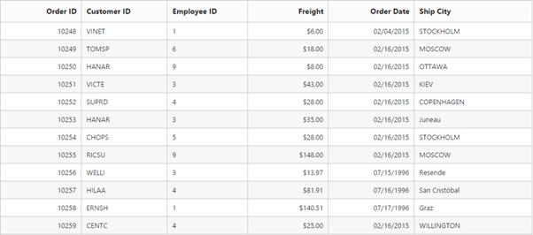

# Getting Started

Refer to the [Getting Started](https://help.syncfusion.com/aspnet-core/gettingstarted/getting-started-2-0) page of the introduction part to know more about the basic system requirements and the steps to configure the Syncfusion components in an ASP.NET Core application.

Ensure once whether all the necessary dependency packages are included within the bower.json file as mentioned [here](https://help.syncfusion.com/aspnet-core/installation#configuring-syncfusion-bower-packages), so that the required scripts and CSS to render the grid control gets installed and loads into the mentioned location (wwwroot->lib) within your project.

Also, check whether the assembly dependency package "Syncfusion.EJ.AspNet.Core" added in your application.

Now, refer to the necessary scripts and CSS files into your _Layout.cshtml page from the wwwroot -> lib -> syncfusion-javascript folder.


<!DOCTYPE html>
<html>
 <head>
   <environment names="Development">
    <link rel="stylesheet" href="~/lib/bootstrap/dist/css/bootstrap.css" /> 
    <link rel="stylesheet" href="~/css/site.css" /> 
    <link href="~/lib/syncfusion-javascript/Content/ej/web/default-theme/ej.web.all.min.css" rel="stylesheet" /> 
   </environment> 
 </head> 
<body> 
   <environment names="Development">
      
      
      
      
      
  </environment> 
</body> 
</html>



It is necessary to define the following namespace within the _viewImports.cshtml  page in order to make use of the grid control with the tag helper support.



@using Syncfusion.JavaScript 
@addTagHelper "*, Syncfusion.EJ"



N>Script manager must be defined at the bottom of the _Layout.cshtml page.

## Data binding

You can bind the data to grid control by either locally or remotely. Assign the remote service URL to `e-datamanager` property of grid control to bind remote data using the `ej.DataManager`. 

In `e-columns` definition, the `text-align` property allows you to align text of the columns, the `width` property is used to define width of the columns and `format` property allows you to format the particular columns value.




<ej-grid id="FlatGrid" datasource="ViewBag.DataSource">
     <e-columns>
        <e-column field="OrderID" header-text="Order ID" text-align="Right" width="70"></e-column>
        <e-column field="CustomerID" header-text="Customer ID" width="80"></e-column>
        <e-column field="EmployeeID" header-text="Employee ID" text-align="Left" width="75"></e-column>
        <e-column field="Freight" header-text="Freight" text-align="Right" format="{0:C2}" width="75"></e-column>
        <e-column field="OrderDate" header-text="Order Date" text-align="Right" width="80" format="{0:MM/dd/yyyy}"></e-column>
        <e-column field="ShipCity" header-text="Ship City" width="110"></e-column>
     </e-columns>
</ej-grid>




      namespace MVCSampleBrowser.Controllers
          {
            public class GridController : Controller
              { 
                public IActionResult GridFeatures()
                 {
                   var DataSource = new NorthwindDataContext().OrdersViews.Take(12).ToList();
                   ViewBag.DataSource = DataSource;
                   return View();
                 }
             }
        } 
    
  

The following output is displayed as a result of the previous code example.

## Enable paging

The paging feature in grid offers complete navigation support to easily switch between the pages, using the page bar available at the bottom of the grid control. To enable paging, use `allow-paging` property of grid as follows.



 
 <ej-grid id="FlatGrid" allow-paging="true" datasource="ViewBag.DataSource">
     <e-columns>
        <e-column field="OrderID" header-text="OrderID"></e-column>
        <e-column field="EmployeeID" header-text="EmployeeID"></e-column>
        <e-column field="CustomerID" header-text="CustomerID"></e-column>
        <e-column field="ShipCountry" header-text="ShipCountry"></e-column>
        <e-column field="Freight" header-text="Freight" format="{0:C2}"></e-column>
    </e-columns>
</ej-grid>




      namespace MVCSampleBrowser.Controllers
          {
            public class GridController : Controller
              { 
                public IActionResult GridFeatures()
                 {
                   var DataSource = new NorthwindDataContext().OrdersViews.ToList();
                   ViewBag.DataSource = DataSource;
                   return View();
                 }
             }
        } 
    
  

The following output is displayed as a result of the previous code example.

## Enable filtering

The Filtering feature in grid is used to facilitate the extraction of a subset of records that meet certain criteria. You can apply filters to one or more columns. This feature is used to filter particular sales data, in order to review the details.

To enable filtering, use the `allow-filtering` property of grid is as follows.




 <ej-grid id="FlatGrid" datasource="ViewBag.DataSource" allow-paging="true" allow-filtering="true">
     <e-columns>
        <e-column field="OrderID" header-text="OrderID"></e-column>
        <e-column field="EmployeeID" header-text="EmployeeID"></e-column>
        <e-column field="CustomerID" header-text="CustomerID"></e-column>
        <e-column field="ShipCountry" header-text="ShipCountry"></e-column>
        <e-column field="Freight" header-text="Freight" format="{0:C2}"></e-column>
    </e-columns>
</ej-grid>




      namespace MVCSampleBrowser.Controllers
          {
            public class GridController : Controller
              { 
                public IActionResult GridFeatures()
                 {
                   var DataSource = new NorthwindDataContext().OrdersViews.ToList();
                   ViewBag.DataSource = DataSource;
                   return View();
                 }
             }
        } 
    
  

The following output is displayed as a result of the previous code example.

## Enable grouping

The grouping feature in grid is used to consolidate the grid data into groups. grouping allows the categorization of records based on specified columns. You can easily group a particular column by simply dragging the column to the upper portion of the grid. The grid data is automatically grouped when you drop a particular column.  In this example, the grouping feature is used to analyze the shipment details of products.

To enable grouping, use the `allow-grouping` property of grid is as follows.



 <ej-grid id="FlatGrid" datasource="ViewBag.DataSource" allow-paging="true" allow-grouping="true">
     <e-group-settings grouped-columns="ShipCountry" />
     <e-columns>
        <e-column field="OrderID" header-text="OrderID" ></e-column>
        <e-column field="EmployeeID" header-text="EmployeeID"></e-column>
        <e-column field="CustomerID" header-text="CustomerID"></e-column>
        <e-column field="ShipCountry" header-text="ShipCountry"></e-column>
        <e-column field="Freight" header-text="Freight" format="{0:C2}"></e-column>
     </e-columns>
</ej-grid>




      namespace MVCSampleBrowser.Controllers
          {
            public class GridController : Controller
              { 
                public IActionResult GridFeatures()
                 {
                   var DataSource = new NorthwindDataContext().OrdersViews.ToList();
                   ViewBag.DataSource = DataSource;
                   return View();
                 }
             }
        } 
    
  

The following output is displayed as a result of the previous code example.

## Add summaries

Summaries can be added by setting the `show-summary` to `true` and adding required summary rows and columns in the `summary-rows` property. 



 
<ej-grid id="FlatGrid" datasource="ViewBag.DataSource" allow-paging="true" allow-grouping="true" show-summary="true">
         <e-group-settings grouped-columns="ShipCity" />
         <e-summary-rows>
           <ej-summary-row title="Sum">
                   <e-summary-column>
                    <ej-summary-column summary-type="Sum" format="{0:C2}" display-column="Freight" data-member="Freight" />
                   <e-summary-column>
           </ej-summary-row>
         </e-summary-rows>
     <e-columns>
        <e-column field="OrderID" header-text="Order ID" text-align="Left" width="80"></e-column>
        <e-column field="CustomerID" header-text="CustomerID" text-align="Right" width="75"></e-column>
        <e-column field="ShipCity" header-text="Ship City" text-align="Left"  width="150"></e-column>
        <e-column field="EmployeeID" header-text="Employee ID" text-align="Right" width="75"></e-column>
        <e-column field="Freight" header-text="Freight" text-align="Right" format="{0:C2}" width="75"></e-column>
    </e-columns>
</ej-grid>




      namespace MVCSampleBrowser.Controllers
          {
            public class GridController : Controller
              { 
                public IActionResult GridFeatures()
                 {
                   var DataSource = new NorthwindDataContext().OrdersViews.ToList();
                   ViewBag.DataSource = DataSource;
                   return View();
                 }
             }
        } 
    
  

The following output is displayed as a result of the previous code example.

