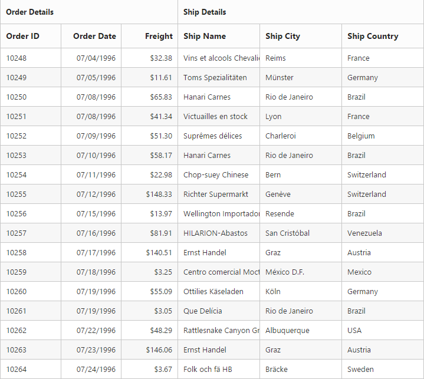

# Stacked Headers

The stacked headers helps you to group the logical columns in Grid. It can be shown by setting the `show-stacked-header` as `true` and by defining the `stacked-header-rows`.

## Adding stacked header columns

To stack the columns in stacked header, you need to define the `column` property in `stacked-header-columns` with field names of visible columns.





<ej-grid id="FlatGrid" datasource="ViewBag.DataSource" show-stacked-header="true">
    <e-stacked-header-rows>
        <e-stacked-header-row>
            <e-stacked-header-columns>
                <e-stacked-header-column header-text="OrderDetails" column='@new List<string> {"OrderID","OrderDate","Freight"}'>
                </e-stacked-header-column>
                <e-stacked-header-column header-text="Ship Details" column='@new List<string> {"ShipName","ShipCity","ShipCountry"}'></e-stacked-header-column>
            </e-stacked-header-columns>
        </e-stacked-header-row>
    </e-stacked-header-rows>
    <e-columns>
        <e-column field="OrderID" is-primary-key="true" header-text="Order ID"></e-column>
        <e-column field="OrderDate" header-text="Order Date"  format="{0:MM/dd/yyyy}" text-align="Right"></e-column>
        <e-column field="Freight" header-text="Freight" text-align="Right" format="{0:C}"></e-column>
        <e-column field="ShipName" format="{0:c2}" header-text="Ship Name"></e-column>
        <e-column field="ShipCity" header-text="Ship City"></e-column>
        <e-column field="ShipCountry" header-text="Ship Country"></e-column>
    </e-columns>
</ej-grid>




 public partial class GridController : Controller
    {

        private NORTHWNDContext _context;

        public GridController(NORTHWNDContext context)
        {
            _context = context;
        }
        // GET: /<controller>/
        public ActionResult Default()
        {
            ViewBag.datasource = _context.Orders.Take(100).ToList();
            return View();
        }
    }


 

