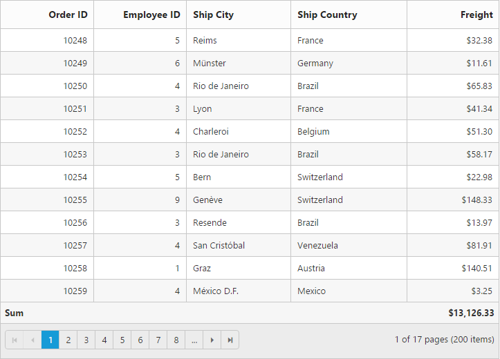
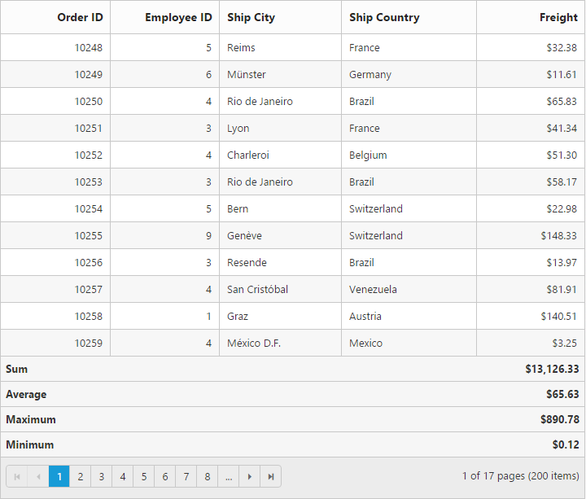
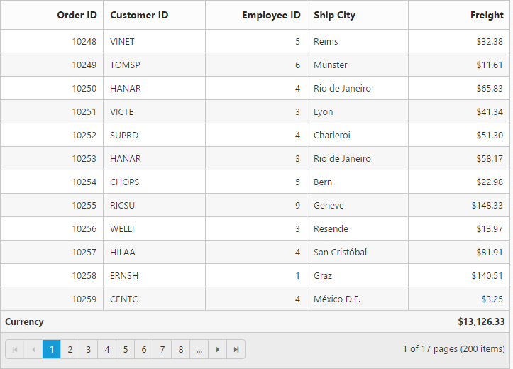
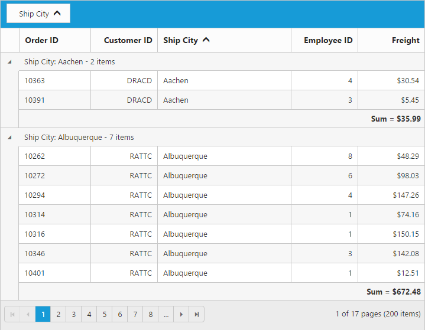
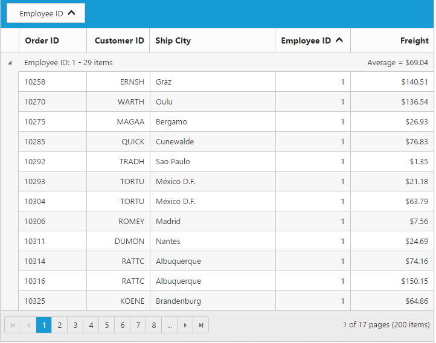
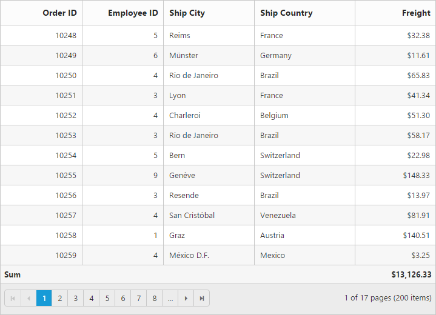

# Summary 

The summary rows visibility can be controlled by the`show-summary` property and it can be added to Grid by using the `e-summary-rows` array property. The following code example describes the above behavior.




   <ej-grid id="FlatGrid" allow-paging="true" show-summary="true" datasource="ViewBag.DataSource">
        <e-summary-rows>
           <e-summary-row title="Sum">
                   <e-summary-columns>
                     <e-summary-column summary-type="Sum" format="{0:C}" display-column="Freight" datamember="Freight" />
                   </e-summary-columns>
           </e-summary-row>
         </e-summary-rows>
        <e-columns>
            <e-column field="OrderID" header-text="Order ID" width="80" text-align="Right"></e-column>
            <e-column field="EmployeeID" header-text="Employee ID" text-align="Right" width="80"></e-column>
            <e-column field="ShipCity" header-text="Ship City" width="90"></e-column>
			<e-column field="ShipCountry" header-text="Ship Country" width="100"></e-column>
            <e-column field="Freight" header-text="Freight" text-align="Right" width="80" format="{0:C}"></e-column>
        </e-columns>
   </ej-grid>
                   



     namespace MVCSampleBrowser.Controllers
        {
            public class GridController : Controller
              { 
                public IActionResult GridFeatures()
                 {
                    var DataSource = new NorthwindDataContext().OrdersViews.ToList();
                    ViewBag.DataSource = DataSource;
                    return View();
                 }
             }
        } 
    
  

## Supported aggregates 

Following are the supported list of aggregates. 

* Sum
* Average
* Maximum
* Minimum
* False Count
* True Count

### Sum, average, maximum and minimum

Summaries with `Sum`,`Average`,`Maximum` and `Minimum` aggregate can be defined by using  `summary-type` in `e-summary-columns` collections. These aggregate are used in the `Number` column.




   <ej-grid id="FlatGrid" allow-paging="true" show-summary="true" datasource="ViewBag.DataSource">
      <e-summary-rows>
           <e-summary-row title="Sum">
                   <e-summary-columns>
                     <e-summary-column summary-type="Sum" format="{0:C}" display-column="Freight" datamember="Freight" />
                   </e-summary-columns>
           </e-summary-row>
            <e-summary-row title="Average">
                   <e-summary-columns>
                     <e-summary-column summary-type="Average" format="{0:C}" display-column="Freight" datamember="Freight" />
                   </e-summary-columns>
           </e-summary-row>
           <e-summary-row title="Maximum">
                   <e-summary-columns>
                     <e-summary-column summary-type="Maximum" format="{0:C}" display-column="Freight" datamember="Freight" />
                   </e-summary-columns>
           </e-summary-row>
           <e-summary-row title="Minimum">
                   <e-summary-columns>
                     <e-summary-column summary-type="Minimum" format="{0:C}" display-column="Freight" datamember="Freight" />
                   </e-summary-columns>
           </e-summary-row>
         </e-summary-rows>
        <e-columns>
            <e-column field="OrderID" header-text="Order ID" width="80" text-align="Right"></e-column>
            <e-column field="EmployeeID" header-text="Employee ID" text-align="Right" width="80"></e-column>
            <e-column field="ShipCity" header-text="Ship City" width="90"></e-column>
			<e-column field="ShipCountry" header-text="Ship Country" width="100"></e-column>
            <e-column field="Freight" header-text="Freight" text-align="Right" width="80" format="{0:C}"></e-column>
        </e-columns>
   </ej-grid>
                   



     namespace MVCSampleBrowser.Controllers
        {
            public class GridController : Controller
              { 
                public IActionResult GridFeatures()
                 {
                    var DataSource = new NorthwindDataContext().OrdersViews.ToList();
                    ViewBag.DataSource = DataSource;
                    return View();
                 }
             }
        } 
    
  

### True and False count 

Summaries with `true` and `false` count aggregate can be defined by using `summary-type`,`e-summary-columns` collections. `true` and `false` count aggregates are used for Boolean columns.




   <ej-grid id="FlatGrid" allow-paging="true" show-summary="true" datasource="ViewBag.DataSource">
      <e-summary-rows>
           <e-summary-row title="False Count">
                   <e-summary-columns>
                     <e-summary-column summary-type="Falsecount" display-column="Verified" datamember="Verified"/>
                   </e-summary-columns>
           </e-summary-row>
           <e-summary-row title="True Count">
                   <e-summary-columns>
                     <e-summary-column summary-type="Truecount" display-column="Verified" datamember="Verified"/>
                   </e-summary-columns>
           </e-summary-row>
         </e-summary-rows>
        <e-columns>
            <e-column field="OrderID" header-text="Order ID" width="80" text-align="Right"></e-column>
            <e-column field="EmployeeID" header-text="Employee ID" text-align="Right" width="80"></e-column>
            <e-column field="ShipCity" header-text="Ship City" width="90"></e-column>
			<e-column field="ShipCountry" header-text="Ship Country" width="100"></e-column>
            <e-column field="Verified" header-text="Verified" width="80"></e-column>
        </e-columns>
   </ej-grid>
                   



     namespace MVCSampleBrowser.Controllers
        {
            public class GridController : Controller
              { 
                public IActionResult GridFeatures()
                 {
                    var DataSource = new NorthwindDataContext().OrdersViews.ToList();
                    ViewBag.DataSource = DataSource;
                    return View();
                 }
             }
        } 
    
  

## Custom summary

Custom summary can be used to create summary values based on your required custom logic and calculations. To enable custom summary, `summary-type` should be `Custom` and the `custom-summary-value` property need to define as function. In this property the `custom-summary-value` function, you need to use grid instance to access `model.dataSource` and `model.currentViewData`. After the custom calculation, the returned value will be displayed in corresponding summary cell.




   <ej-grid id="FlatGrid" allow-paging="true" show-summary="true" datasource="ViewBag.DataSource">
        <e-summary-rows>
           <e-summary-row title="Currency">
                   <e-summary-columns>
                     <e-summary-column summary-type="Custom" custom-summary-value="currency" format="{0:C2}" display-column="Freight"/>
                   </e-summary-columns>
           </e-summary-row>
        </e-summary-rows>
        <e-columns>
            <e-column field="OrderID" header-text="Order ID" width="70" text-align="Right"></e-column>
            <e-column field="CustomerID" header-text="Customer ID" text-align="Right" width="70"></e-column>
            <e-column field="ShipCity" header-text="Ship City" width="70"></e-column>
			<e-column field="EmployeeID" header-text="Employee ID" text-align="Right" width="70"></e-column>
            <e-column field="Freight" header-text="Freight" text-align="Right" width="70" format="{0:C}"></e-column>
        </e-columns>
   </ej-grid>
                   



     namespace MVCSampleBrowser.Controllers
        {
            public class GridController : Controller
              { 
                public IActionResult GridFeatures()
                 {
                    var DataSource = new NorthwindDataContext().OrdersViews.ToList();
                    ViewBag.DataSource = DataSource;
                    return View();
                 }
             }
        } 


   
   

  
  

## Group summary

Group summary is used to summarize values of a particular column based on group and it shows at bottom of each Group. To enable Group Summary for particular Group, you need to define the `show-total-summary` as false.




   <ej-grid id="FlatGrid" allow-paging="true" show-summary="true" allow-grouping="true" group-settings ="@(new GroupSettings { GroupedColumns= new List<string>() { "CustomerID"}})"  datasource="ViewBag.DataSource">
        <e-summary-rows>
           <e-summary-row show-total-summary="false" >
                   <e-summary-columns>
                     <e-summary-column summary-type="Sum" prefix=@("Sum=") format="{0:C2}" display-column="Freight" datamember="Freight" />
                   </e-summary-columns>
           </e-summary-row>
        </e-summary-rows>
        <e-columns>
            <e-column field="OrderID" header-text="Order ID" width="70" text-align="Right"></e-column>
            <e-column field="CustomerID" header-text="Customer ID" text-align="Right" width="70"></e-column>
            <e-column field="ShipCity" header-text="Ship City" width="70"></e-column>
			<e-column field="EmployeeID" header-text="Employee ID" text-align="Right" width="70"></e-column>
            <e-column field="Freight" header-text="Freight" text-align="Right" width="70" format="{0:C2}"></e-column>
        </e-columns>
   </ej-grid>
                   



     namespace MVCSampleBrowser.Controllers
        {
            public class GridController : Controller
              { 
                public IActionResult GridFeatures()
                 {
                    var DataSource = new NorthwindDataContext().OrdersViews.ToList();
                    ViewBag.DataSource = DataSource;
                    return View();
                 }
             }
        } 



W> Minimum one column should be grouped to show the summary details.

## Group caption summary

To show summaries in each Group's caption row, particular summary row should have the `show-total-summary` as `false` and `show-caption-summary` as `true`.




   <ej-grid id="FlatGrid" allow-paging="true" show-summary="true" allow-grouping="true" group-settings ="@(new GroupSettings { GroupedColumns= new List<string>() { "EmployeeID"}})" datasource="ViewBag.DataSource">
        <e-summary-rows>
           <e-summary-row show-total-summary="false" show-caption-summary="true" >
                   <e-summary-columns>
                     <e-summary-column summary-type="Sum" prefix=@("Sum=") format="{0:C2}" display-column="Freight" datamember="Freight" />
                   </e-summary-columns>
           </e-summary-row>
        </e-summary-rows>
        <e-columns>
            <e-column field="OrderID" header-text="Order ID" width="70" text-align="Right"></e-column>
            <e-column field="CustomerID" header-text="Customer ID" text-align="Right" width="70"></e-column>
            <e-column field="ShipCity" header-text="Ship City" width="70"></e-column>
			<e-column field="EmployeeID" header-text="Employee ID" text-align="Right" width="70"></e-column>
            <e-column field="Freight" header-text="Freight" text-align="Right" width="70" format="{0:C2}"></e-column>
        </e-columns>
   </ej-grid>
                   



     namespace MVCSampleBrowser.Controllers
        {
            public class GridController : Controller
              { 
                public IActionResult GridFeatures()
                 {
                    var DataSource = new NorthwindDataContext().OrdersViews.ToList();
                    ViewBag.DataSource = DataSource;
                    return View();
                 }
             }
        } 




W> Minimum one column should be grouped to show summary details.

## Format

To format Summary values, the `format` property needs to be assigned in `e-summary-columns` collection object.  To know more about formatting options. Please refer to [**globalize.js**](https://github.com/jquery/globalize/tree/v0.1.1#)




   <ej-grid id="FlatGrid" allow-paging="true" show-summary="true" datasource="ViewBag.DataSource">
        <e-summary-rows>
           <e-summary-row title="Sum">
                   <e-summary-columns>
                     <e-summary-column summary-type="Sum" format="{0:C}" display-column="Freight" datamember="Freight" />
                   </e-summary-columns>
           </e-summary-row>
        </e-summary-rows>
        <e-columns>
            <e-column field="OrderID" header-text="Order ID" width="70" text-align="Right"></e-column>
            <e-column field="EmployeeID" header-text="Employee ID" text-align="Right" width="80"></e-column>
            <e-column field="ShipCity" header-text="Ship City" width="70"></e-column>
			      <e-column field="ShipCountry" header-text="Ship Country" width="100"></e-column>
            <e-column field="Freight" header-text="Freight" text-align="Right" width="70" format="{0:C}"></e-column>
        </e-columns>
   </ej-grid>
                   



     namespace MVCSampleBrowser.Controllers
        {
            public class GridController : Controller
              { 
                public IActionResult GridFeatures()
                 {
                    var DataSource = new NorthwindDataContext().OrdersViews.ToList();
                    ViewBag.DataSource = DataSource;
                    return View();
                 }
             }
        } 


 

## Summary template

Using the `template` property of `e-summary-columns` you can render any type of JsRender templates or customizing the summary value.

The following code example describes the previous behavior.




<ej-grid id="Summary" show-summary="true" datasource="ViewBag.datasource">
        <e-summary-rows>
           <e-summary-row title="Average">
                   <e-summary-columns>
                     <e-summary-column summary-type="Average" format="{0:C2}" template="#templateData" display-column="Freight" datamember="Freight" />
                   </e-summary-columns>
           </e-summary-row>
        </e-summary-rows>
        <e-columns>
            <e-column field="OrderID"></e-column>
            <e-column field="EmployeeID"></e-column>
            <e-column field="Freight" format="{0:C2}"></e-column>
        </e-columns>
</ej-grid>



     namespace MVCSampleBrowser.Controllers
        {
            public class GridController : Controller
              { 
                public IActionResult GridFeatures()
                 {
                    var DataSource = new NorthwindDataContext().OrdersViews.ToList();
                    ViewBag.datasource = DataSource;
                    return View();
                 }
             }
        } 








The following output is displayed as a result of the previous code example.

## Handling aggregation in server-side

The Aggregation at server-side is handled by using the `aggregate` key. While using remote data, summary row must be handled by returning summary column datasource into the `aggregate` property of `result` object.

The following code example describes the previous behavior.




<ej-grid id="Summary" allow-paging="true" show-summary="true">
        <e-datamanager url="/Grid/DataSource" adaptor="UrlAdaptor"></e-datamanager>
        <e-summary-rows>
           <e-summary-row title="Sum">
                   <e-summary-columns>
                     <e-summary-column summary-type="Sum" format="{0:C2}" display-column="Freight" datamember="Freight" />
                   </e-summary-columns>
           </e-summary-row>
        </e-summary-rows>
        <e-columns>
            <e-column field="OrderID" header-text="Order ID"></e-column>
            <e-column field="EmployeeID" header-text="Employee ID"></e-column>
            <e-column field="Freight" header-text="Freight" format="{0:C2}"></e-column>
            <e-column field="ShipCity" header-text="Ship City" format="{0:C2}"></e-column>
        </e-columns>
</ej-grid>




namespace MvcApplication4.Controllers
{
    public class GridController: Controller
       {
        public ActionResult GridFeatures()
           {
			 return View();
           }

     public ActionResult DataSource(DataManager dataManager)
       {
            IEnumerable DataSource = OrderRepository.GetAllRecords();
            DataResult result = new DataResult();
		    DataOperations dataOperations = new DataOperations();
            List<string> aggregateFields = new List<string>();
            if (dataManager.Aggregates != null)
             {
               for (var i = 0; i < dataManager.Aggregates.Count; i++)
               string.Add(dataManager.Aggregates[i].Field);
               result.aggregate = dataOperations.PerformSelect(DataSource, aggregateFields);
             }

       DataSource = dataOperations.PerformSkip(DataSource, dataManager.Skip);
       result.result = dataOperations.PerformTake(DataSource, dataManager.Take);
       result.count = DataSource.AsQueryable().Count();
       return Json(result);

       }

    public class DataResult
       {
         public IEnumerable result { get; set; }
         public int count { get; set; }
         public IEnumerable aggregate { get; set; }
         public IEnumerable groupDs { get; set; }
       }

   }

}


 

The following output is displayed as a result of the previous code example.

