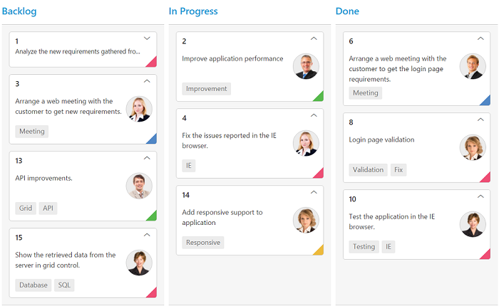
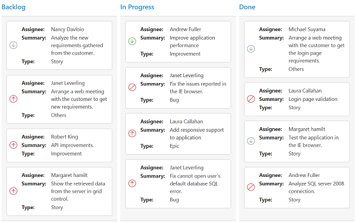

# Cards

## Customization

Cards can be customized with appropriate mapping fields from the database. The customizable mapping properties are listed as follows

<table>
<tr>
<th>
Mapping Fields</th><th>
Description</th></tr>
<tr>
<td>
 {{ 'content' | markdownify }} </td><td> Map the column name to use as content to cards.</td></tr>
<tr>
<td>
{{ 'tag'| markdownify }} </td><td>
Map the column name to use as tag. Multiple tags can be given with comma separated.  E.g. "API","SQL, Database".</td></tr>
<tr>
<td>
{{ 'color' | markdownify }} </td><td>
 Map the column name to use as colors to highlight cards left border.</td></tr>
<tr>
<td>
{{ 'color-mapping' | markdownify }} </td><td>
Map the colors to use with column values which is mapped with {{ 'kanbanfields.color' | markdownify }}. </td></tr>
<tr>
<td>
{{ 'image-url' | markdownify }} </td><td>
Map the column name to use as image to cards.</td></tr>
<tr>
<td>
{{ 'primary-key' | markdownify }} </td><td>
Map the column name to use as primary key to cards.</td></tr>
<tr>
<td>
{{ 'priority'| markdownify }}</td><td>
Map the column name to use as priority key to cards.</td></tr>
<tr>
<td>
 {{ 'title' | markdownify }} </td><td>
Map the column name to use as title to cards. Default title is {{ 'primary-key' | markdownify }}.</td></tr>
<tr>
<td>
{{ 'allow-title'| markdownify }} </td><td>
Set as true to enable title for card.</td></tr>
</table>

The following code example describes the above behavior.





 <ej-kanban id="KanbanBoard" key-field="Status" allow-title="true" dataSource="ViewBag.datasource">
     <e-kanbancolumns>
        <e-kanbancolumn header-text="Backlog" key=@(new List<string>(){"Open"})>
        </e-kanbancolumn>
        <e-kanbancolumn header-text="In Progress" key=@(new List<string>() {"InProgress"})></e-kanbancolumn>
        <e-kanbancolumn header-text="Done" key=@(new List<string>() {"Close"})></e-kanbancolumn>
     </e-kanbancolumns>
     <e-kanbanfield content="Summary" primary-key="Id" priority="RankId" tag="Tags" color="Type" image-url="ImgUrl">
     </e-kanbanfield>
     <e-kanbancard-settings color-mapping=@(new Dictionary<string, object>() { { "#cb2027", "Bug,Story" }, { "#67ab47", "Improvement" }, { "#fbae19", "Epic" }, { "#6a5da8", "Others"} })>
     </e-kanbancard-settings>
</ej-kanban>
  




    public partial class KanbanBoardController : Controller
    {
        List<Tasks> Task = new List<Tasks>();

        public ActionResult Default()
        {
            Task.Add(new Tasks(1, "Open", "Analyze the new requirements gathered from the customer.", "Story", "Low", "Analyze,Customer", 3.5, "Nancy", "../content/images/kanban/1.png", 1));
            Task.Add(new Tasks(2, "InProgress", "Improve application performance", "Improvement", "Normal", "Improvement", 6, "Andrew Fuller", "../content/images/kanban/2.png", 1));
            Task.Add(new Tasks(3, "Open", "Arrange a web meeting with the customer to get new requirements.", "Others", "Critical", "Meeting", 5.5, "Janet Leverling", "../content/images/kanban/3.png", 2));
            Task.Add(new Tasks(4, "InProgress", "Fix the issues reported in the IE browser.", "Bug", "Release Breaker", "IE", 2.5, "Janet Leverling", "../content/images/kanban/3.png", 2));
            Task.Add(new Tasks(5, "Testing", "Fix the issues reported by the customer.", "Bug", "Low", "Customer", 3.5, "Steven walker", "../content/images/kanban/5.png", 1));
            Task.Add(new Tasks(6, "Close", "Arrange a web meeting with the customer to get the login page requirements.", "Others", "Low", "Meeting", 2, "Michael Suyama", "../content/images/kanban/6.png", 1));
            Task.Add(new Tasks(7, "Validate", "Validate new requirements", "Improvement", "Low", "Validation", 1.5, "Robert King", "../content/images/kanban/7.png", 4));
            Task.Add(new Tasks(8, "Close", "Login page validation", "Story", "Release Breaker", "Validation,Fix", 2.5, "Laura Callahan", "../content/images/kanban/8.png", 2));
            Task.Add(new Tasks(9, "Testing", "Fix the issues reported in Safari browser.", "Bug", "Release Breaker", "Fix,Safari", 1.5, "Nancy", "../content/images/kanban/1.png", 2));
            Task.Add(new Tasks(10, "Close", "Test the application in the IE browser.", "Story", "Low", "Testing,IE", 5.5, "Margaret", "../content/images/kanban/4.png", 3));
            Task.Add(new Tasks(11, "Validate", "Validate the issues reported by the customer.", "Story", "High", "Validation,Fix", 1, "Steven walker", "../content/images/kanban/5.png", 5));
            Task.Add(new Tasks(12, "Testing", "Check Login page validation.", "Story", "Release Breaker", "Testing", 0.5, "Michael Suyama", "../content/images/kanban/6.png", 3));
            Task.Add(new Tasks(13, "Open", "API improvements.", "Improvement", "High", "Grid,API", 3.5, "Robert King", "../content/images/kanban/7.png", 3));
            Task.Add(new Tasks(14, "InProgress", "Add responsive support to application", "Epic", "Critical", "Responsive", 6, "Laura Callahan", "../content/images/kanban/8.png", 3));
            Task.Add(new Tasks(15, "Open", "Show the retrieved data from the server in grid control.", "Story", "High", "Database,SQL", 5.5, "Margaret", "../content/images/kanban/4.png", 4));
            ViewBag.datasource = Task;
            return View();
        }
    }
    public class Tasks
    {
        public Tasks()
        {
        }
        public Tasks(int Id, string Status, string Summary, string Type, string Priority, string Tags, double Estimate, string Assignee, string ImageUrl, int RankId)
        {
            this.Id = Id;
            this.Status = Status;
            this.Summary = Summary;
            this.Type = Type;
            this.Priority = Priority;
            this.Tags = Tags;
            this.Estimate = Estimate;
            this.Assignee = Assignee;
            this.ImageUrl = ImageUrl;
            this.RankId = RankId;
        }
        public int Id { get; set; }
        public string Status { get; set; }
        public string Summary { get; set; }
        public string Type { get; set; }
        public string Priority { get; set; }
        public string Tags { get; set; }
        public double Estimate { get; set; }
        public string Assignee { get; set; }
        public string ImageUrl { get; set; }
        public int RankId { get; set; }
    }



  

The following output is displayed as a result of the above code example.

## Template

Templates are used to create custom card layout as per the user convenient. HTML templates can be specified in the `template` property of the [`kanbancard-settings`] as an ID of the template’s HTML element.

You can use JsRender syntax in the template. For more information about JsRender syntax, please refer this [`link`](https://www.jsviews.com/).

The following code example describes the above behavior.



 
            




    <!--CSS for card template-->
        







     <ej-kanban id="KanbanBoard" key-field="Status" allow-title="true" dataSource="ViewBag.datasource">
          <e-kanbancolumns>
              <e-kanbancolumn header-text="Backlog" key=@(new List<string>(){"Open"})>
              </e-kanbancolumn>
              <e-kanbancolumn header-text="In Progress" key=@(new List<string>() {"InProgress"})></e-kanbancolumn>
              <e-kanbancolumn header-text="Done" key=@(new List<string>() {"Close"})></e-kanbancolumn>
          </e-kanbancolumns>
          <e-kanbanfield primary-key="Id">
          </e-kanbanfield>
          <e-kanbancard-settings template="#cardtemplate">
          </e-kanbancard-settings>
      </ej-kanban>
  




    public partial class KanbanBoardController : Controller
    {
        List<Tasks> Task = new List<Tasks>();

        public ActionResult Default()
        {
            Task.Add(new Tasks(1, "Open", "Analyze the new requirements gathered from the customer.", "Story", "Low", "Analyze,Customer", 3.5, "Nancy", "../content/images/kanban/1.png", 1));
            Task.Add(new Tasks(2, "InProgress", "Improve application performance", "Improvement", "Normal", "Improvement", 6, "Andrew Fuller", "../content/images/kanban/2.png", 1));
            Task.Add(new Tasks(3, "Open", "Arrange a web meeting with the customer to get new requirements.", "Others", "Critical", "Meeting", 5.5, "Janet Leverling", "../content/images/kanban/3.png", 2));
            Task.Add(new Tasks(4, "InProgress", "Fix the issues reported in the IE browser.", "Bug", "Release Breaker", "IE", 2.5, "Janet Leverling", "../content/images/kanban/3.png", 2));
            Task.Add(new Tasks(5, "Testing", "Fix the issues reported by the customer.", "Bug", "Low", "Customer", 3.5, "Steven walker", "../content/images/kanban/5.png", 1));
            Task.Add(new Tasks(6, "Close", "Arrange a web meeting with the customer to get the login page requirements.", "Others", "Low", "Meeting", 2, "Michael Suyama", "../content/images/kanban/6.png", 1));
            Task.Add(new Tasks(7, "Validate", "Validate new requirements", "Improvement", "Low", "Validation", 1.5, "Robert King", "../content/images/kanban/7.png", 4));
            Task.Add(new Tasks(8, "Close", "Login page validation", "Story", "Release Breaker", "Validation,Fix", 2.5, "Laura Callahan", "../content/images/kanban/8.png", 2));
            Task.Add(new Tasks(9, "Testing", "Fix the issues reported in Safari browser.", "Bug", "Release Breaker", "Fix,Safari", 1.5, "Nancy", "../content/images/kanban/1.png", 2));
            Task.Add(new Tasks(10, "Close", "Test the application in the IE browser.", "Story", "Low", "Testing,IE", 5.5, "Margaret", "../content/images/kanban/4.png", 3));
            Task.Add(new Tasks(11, "Validate", "Validate the issues reported by the customer.", "Story", "High", "Validation,Fix", 1, "Steven walker", "../content/images/kanban/5.png", 5));
            Task.Add(new Tasks(12, "Testing", "Check Login page validation.", "Story", "Release Breaker", "Testing", 0.5, "Michael Suyama", "../content/images/kanban/6.png", 3));
            Task.Add(new Tasks(13, "Open", "API improvements.", "Improvement", "High", "Grid,API", 3.5, "Robert King", "../content/images/kanban/7.png", 3));
            Task.Add(new Tasks(14, "InProgress", "Add responsive support to application", "Epic", "Critical", "Responsive", 6, "Laura Callahan", "../content/images/kanban/8.png", 3));
            Task.Add(new Tasks(15, "Open", "Show the retrieved data from the server in grid control.", "Story", "High", "Database,SQL", 5.5, "Margaret", "../content/images/kanban/4.png", 4));
            ViewBag.datasource = Task;
            return View();
        }
    }
    public class Tasks
    {
        public Tasks()
        {
        }
        public Tasks(int Id, string Status, string Summary, string Type, string Priority, string Tags, double Estimate, string Assignee, string ImageUrl, int RankId)
        {
            this.Id = Id;
            this.Status = Status;
            this.Summary = Summary;
            this.Type = Type;
            this.Priority = Priority;
            this.Tags = Tags;
            this.Estimate = Estimate;
            this.Assignee = Assignee;
            this.ImageUrl = ImageUrl;
            this.RankId = RankId;
        }
        public int Id { get; set; }
        public string Status { get; set; }
        public string Summary { get; set; }
        public string Type { get; set; }
        public string Priority { get; set; }
        public string Tags { get; set; }
        public double Estimate { get; set; }
        public string Assignee { get; set; }
        public string ImageUrl { get; set; }
        public int RankId { get; set; }
    }



  

The following output is displayed as a result of the above code example.

## Tooltip

You can enable HTML tooltip for Kanban card elements by setting `enable` property as true in [`kanbantooltip-settings`].

The following code example describes the above behavior. 





 <ej-kanban id="KanbanBoard" key-field="Status" dataSource="ViewBag.datasource" allow-title="true">
   <e-kanbancolumns>
        <e-kanbancolumn header-text="Backlog" key=@(new List<string>(){"Open"})>
        </e-kanbancolumn>
        <e-kanbancolumn header-text="In Progress" key=@(new List<string>() {"InProgress"})></e-kanbancolumn>
        <e-kanbancolumn header-text="Done" key=@(new List<string>() {"Close"})></e-kanbancolumn>
   </e-kanbancolumns>
   <e-kanbantooltip-settings enable="true">
   </e-kanbantooltip-settings>
   <e-kanbanfield content="Summary" primary-key="Id" tag="Tags">
   </e-kanbanfield>
</ej-kanban>
  




    public partial class KanbanBoardController : Controller
    {
        List<Tasks> Task = new List<Tasks>();

        public ActionResult Default()
        {
            Task.Add(new Tasks(1, "Open", "Analyze the new requirements gathered from the customer.", "Story", "Low", "Analyze,Customer", 3.5, "Nancy", "../content/images/kanban/1.png", 1));
            Task.Add(new Tasks(2, "InProgress", "Improve application performance", "Improvement", "Normal", "Improvement", 6, "Andrew Fuller", "../content/images/kanban/2.png", 1));
            Task.Add(new Tasks(3, "Open", "Arrange a web meeting with the customer to get new requirements.", "Others", "Critical", "Meeting", 5.5, "Janet Leverling", "../content/images/kanban/3.png", 2));
            Task.Add(new Tasks(4, "InProgress", "Fix the issues reported in the IE browser.", "Bug", "Release Breaker", "IE", 2.5, "Janet Leverling", "../content/images/kanban/3.png", 2));
            Task.Add(new Tasks(5, "Testing", "Fix the issues reported by the customer.", "Bug", "Low", "Customer", 3.5, "Steven walker", "../content/images/kanban/5.png", 1));
            Task.Add(new Tasks(6, "Close", "Arrange a web meeting with the customer to get the login page requirements.", "Others", "Low", "Meeting", 2, "Michael Suyama", "../content/images/kanban/6.png", 1));
            Task.Add(new Tasks(7, "Validate", "Validate new requirements", "Improvement", "Low", "Validation", 1.5, "Robert King", "../content/images/kanban/7.png", 4));
            Task.Add(new Tasks(8, "Close", "Login page validation", "Story", "Release Breaker", "Validation,Fix", 2.5, "Laura Callahan", "../content/images/kanban/8.png", 2));
            Task.Add(new Tasks(9, "Testing", "Fix the issues reported in Safari browser.", "Bug", "Release Breaker", "Fix,Safari", 1.5, "Nancy", "../content/images/kanban/1.png", 2));
            Task.Add(new Tasks(10, "Close", "Test the application in the IE browser.", "Story", "Low", "Testing,IE", 5.5, "Margaret", "../content/images/kanban/4.png", 3));
            Task.Add(new Tasks(11, "Validate", "Validate the issues reported by the customer.", "Story", "High", "Validation,Fix", 1, "Steven walker", "../content/images/kanban/5.png", 5));
            Task.Add(new Tasks(12, "Testing", "Check Login page validation.", "Story", "Release Breaker", "Testing", 0.5, "Michael Suyama", "../content/images/kanban/6.png", 3));
            Task.Add(new Tasks(13, "Open", "API improvements.", "Improvement", "High", "Grid,API", 3.5, "Robert King", "../content/images/kanban/7.png", 3));
            Task.Add(new Tasks(14, "InProgress", "Add responsive support to application", "Epic", "Critical", "Responsive", 6, "Laura Callahan", "../content/images/kanban/8.png", 3));
            Task.Add(new Tasks(15, "Open", "Show the retrieved data from the server in grid control.", "Story", "High", "Database,SQL", 5.5, "Margaret", "../content/images/kanban/4.png", 4));
            ViewBag.datasource = Task;
            return View();
        }
    }
    public class Tasks
    {
        public Tasks()
        {
        }
        public Tasks(int Id, string Status, string Summary, string Type, string Priority, string Tags, double Estimate, string Assignee, string ImageUrl, int RankId)
        {
            this.Id = Id;
            this.Status = Status;
            this.Summary = Summary;
            this.Type = Type;
            this.Priority = Priority;
            this.Tags = Tags;
            this.Estimate = Estimate;
            this.Assignee = Assignee;
            this.ImageUrl = ImageUrl;
            this.RankId = RankId;
        }
        public int Id { get; set; }
        public string Status { get; set; }
        public string Summary { get; set; }
        public string Type { get; set; }
        public string Priority { get; set; }
        public string Tags { get; set; }
        public double Estimate { get; set; }
        public string Assignee { get; set; }
        public string ImageUrl { get; set; }
        public int RankId { get; set; }
    }



  

The following output is displayed as a result of the above code example.

### Template

By making use of template feature with tooltip, all the field names that are mapped from the `dataSource` can be accessed to define the `template` tooltip for card. The [`kanbantooltip-settings.enable`] must be enabled first.

The following code example describes the tooltip template.



     





    <!--toolTip template releated css -->
    







<ej-kanban id="KanbanBoard" key-field="Status" dataSource="ViewBag.datasource">
     <e-kanbancolumns>
        <e-kanbancolumn header-text="Backlog" key=@(new List<string>(){"Open"})>
        </e-kanbancolumn>
        <e-kanbancolumn header-text="In Progress" key=@(new List<string>() {"InProgress"})></e-kanbancolumn>
        <e-kanbancolumn header-text="Done" key=@(new List<string>() {"Close"})></e-kanbancolumn>
     </e-kanbancolumns>
     <e-kanbantooltip-settings enable="true" template="#tooltipTemp">
     </e-kanbantooltip-settings>
     <e-kanbanfield content="Summary" primary-key="Id" tag="Tags">
     </e-kanbanfield>
</ej-kanban>





    public partial class KanbanBoardController : Controller
    {
        List<Tasks> Task = new List<Tasks>();

        public ActionResult Default()
        {
            Task.Add(new Tasks(1, "Open", "Analyze the new requirements gathered from the customer.", "Story", "Low", "Analyze,Customer", 3.5, "Nancy", "../content/images/kanban/1.png", 1));
            Task.Add(new Tasks(2, "InProgress", "Improve application performance", "Improvement", "Normal", "Improvement", 6, "Andrew Fuller", "../content/images/kanban/2.png", 1));
            Task.Add(new Tasks(3, "Open", "Arrange a web meeting with the customer to get new requirements.", "Others", "Critical", "Meeting", 5.5, "Janet Leverling", "../content/images/kanban/3.png", 2));
            Task.Add(new Tasks(4, "InProgress", "Fix the issues reported in the IE browser.", "Bug", "Release Breaker", "IE", 2.5, "Janet Leverling", "../content/images/kanban/3.png", 2));
            Task.Add(new Tasks(5, "Testing", "Fix the issues reported by the customer.", "Bug", "Low", "Customer", 3.5, "Steven walker", "../content/images/kanban/5.png", 1));
            Task.Add(new Tasks(6, "Close", "Arrange a web meeting with the customer to get the login page requirements.", "Others", "Low", "Meeting", 2, "Michael Suyama", "../content/images/kanban/6.png", 1));
            Task.Add(new Tasks(7, "Validate", "Validate new requirements", "Improvement", "Low", "Validation", 1.5, "Robert King", "../content/images/kanban/7.png", 4));
            Task.Add(new Tasks(8, "Close", "Login page validation", "Story", "Release Breaker", "Validation,Fix", 2.5, "Laura Callahan", "../content/images/kanban/8.png", 2));
            Task.Add(new Tasks(9, "Testing", "Fix the issues reported in Safari browser.", "Bug", "Release Breaker", "Fix,Safari", 1.5, "Nancy", "../content/images/kanban/1.png", 2));
            Task.Add(new Tasks(10, "Close", "Test the application in the IE browser.", "Story", "Low", "Testing,IE", 5.5, "Margaret", "../content/images/kanban/4.png", 3));
            Task.Add(new Tasks(11, "Validate", "Validate the issues reported by the customer.", "Story", "High", "Validation,Fix", 1, "Steven walker", "../content/images/kanban/5.png", 5));
            Task.Add(new Tasks(12, "Testing", "Check Login page validation.", "Story", "Release Breaker", "Testing", 0.5, "Michael Suyama", "../content/images/kanban/6.png", 3));
            Task.Add(new Tasks(13, "Open", "API improvements.", "Improvement", "High", "Grid,API", 3.5, "Robert King", "../content/images/kanban/7.png", 3));
            Task.Add(new Tasks(14, "InProgress", "Add responsive support to application", "Epic", "Critical", "Responsive", 6, "Laura Callahan", "../content/images/kanban/8.png", 3));
            Task.Add(new Tasks(15, "Open", "Show the retrieved data from the server in grid control.", "Story", "High", "Database,SQL", 5.5, "Margaret", "../content/images/kanban/4.png", 4));
            ViewBag.datasource = Task;
            return View();
        }
    }
    public class Tasks
    {
        public Tasks()
        {
        }
        public Tasks(int Id, string Status, string Summary, string Type, string Priority, string Tags, double Estimate, string Assignee, string ImageUrl, int RankId)
        {
            this.Id = Id;
            this.Status = Status;
            this.Summary = Summary;
            this.Type = Type;
            this.Priority = Priority;
            this.Tags = Tags;
            this.Estimate = Estimate;
            this.Assignee = Assignee;
            this.ImageUrl = ImageUrl;
            this.RankId = RankId;
        }
        public int Id { get; set; }
        public string Status { get; set; }
        public string Summary { get; set; }
        public string Type { get; set; }
        public string Priority { get; set; }
        public string Tags { get; set; }
        public double Estimate { get; set; }
        public string Assignee { get; set; }
        public string ImageUrl { get; set; }
        public int RankId { get; set; }
    }
    


  

The following output is displayed as a result of the above code example.

