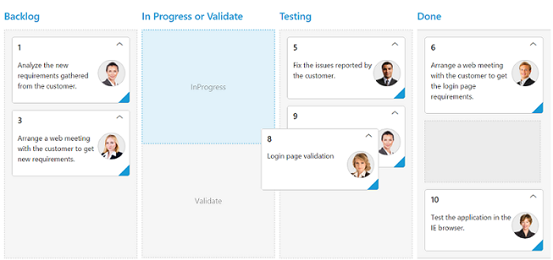

# Columns

Column fields are present in the `dataSource` schema and it is rendering cards based its mapping column values.

## Key Mapping

To render Kanban with simple cards, you need to map the `dataSource` fields to Kanban cards and [`kanbancolumns`]. The required mapping field are listed as follows

<table>
<tr>
<th>
Mapping Fields</th><th>
Description</th></tr>
<tr>
<td>
{{ 'key-field' | markdownify }} </td><td>
Map the column name to use as {{ 'key'| markdownify }} values to columns.</td></tr>
<tr>
<td>
{{ 'kanbancolumns.kanbancolumn.key' | markdownify }} </td><td>
Map the corresponding {{ 'key'| markdownify }} values of {{ 'key-field'| markdownify }} column to each columns.</td></tr>
<tr>
<td>
{{ 'kanbancolumns.kanbancolumn.header-text'| markdownify }} </td><td>
 It represents the title for particular column</td></tr>
<tr>
<td>
{{ 'kanbanfield.content'| markdownify }} </td><td>
Map the column name to use as content to cards.</td></tr>
</table>

N> 1. If the column with `key-field` is not in the datasource and `key` values specified will not available in column values, then the cards will not be rendered.
N> 2. If the [`kanbanfield.content`] is not in the datasource, then empty cards will be rendered.

The following code example describes the above behavior.




   
     <ej-kanban id="KanbanBoard" key-field="Status" dataSource="ViewBag.datasource">
            <e-kanbancolumns>
                <e-kanbancolumn header-text="Backlog" key=@(new List<string>(){"Open"})>
                </e-kanbancolumn>
                <e-kanbancolumn header-text="In Progress" key=@(new List<string>() {"InProgress"})></e-kanbancolumn>
                <e-kanbancolumn header-text="Testing" key=@(new List<string>() {"Testing"})></e-kanbancolumn>
                <e-kanbancolumn header-text="Done" key=@(new List<string>() {"Close"})></e-kanbancolumn>
            </e-kanbancolumns>
            <e-kanbanfield content="Summary" primary-key="Id">
            </e-kanbanfield>
     </ej-kanban>





     namespace samplebrowser.Controllers
     {
     public partial class KanbanBoardController : Controller
     {
        List<Tasks> Task = new List<Tasks>();

        public ActionResult Default()
        {
            Task.Add(new Tasks(1, "Open", "Analyze the new requirements gathered from the customer.", "Story", "Low", "Analyze,Customer", 3.5, "Nancy", "../content/images/kanban/1.png", 1));
            Task.Add(new Tasks(2, "InProgress", "Improve application performance", "Improvement", "Normal", "Improvement", 6, "Andrew Fuller", "../content/images/kanban/2.png", 1));
            Task.Add(new Tasks(3, "Open", "Arrange a web meeting with the customer to get new requirements.", "Others", "Critical", "Meeting", 5.5, "Janet Leverling", "../content/images/kanban/3.png", 2));
            Task.Add(new Tasks(4, "InProgress", "Fix the issues reported in the IE browser.", "Bug", "Release Breaker", "IE", 2.5, "Janet Leverling", "../content/images/kanban/3.png", 2));
            Task.Add(new Tasks(5, "Testing", "Fix the issues reported by the customer.", "Bug", "Low", "Customer", 3.5, "Steven walker", "../content/images/kanban/5.png", 1));
            Task.Add(new Tasks(6, "Close", "Arrange a web meeting with the customer to get the login page requirements.", "Others", "Low", "Meeting", 2, "Michael Suyama", "../content/images/kanban/6.png", 1));
            Task.Add(new Tasks(7, "Validate", "Validate new requirements", "Improvement", "Low", "Validation", 1.5, "Robert King", "../content/images/kanban/7.png", 4));
            Task.Add(new Tasks(8, "Close", "Login page validation", "Story", "Release Breaker", "Validation,Fix", 2.5, "Laura Callahan", "../content/images/kanban/8.png", 2));
            Task.Add(new Tasks(9, "Testing", "Fix the issues reported in Safari browser.", "Bug", "Release Breaker", "Fix,Safari", 1.5, "Nancy", "../content/images/kanban/1.png", 2));
            Task.Add(new Tasks(10, "Close", "Test the application in the IE browser.", "Story", "Low", "Testing,IE", 5.5, "Margaret", "../content/images/kanban/4.png", 3));
            Task.Add(new Tasks(11, "Validate", "Validate the issues reported by the customer.", "Story", "High", "Validation,Fix", 1, "Steven walker", "../content/images/kanban/5.png", 5));
            Task.Add(new Tasks(12, "Testing", "Check Login page validation.", "Story", "Release Breaker", "Testing", 0.5, "Michael Suyama", "../content/images/kanban/6.png", 3));
            Task.Add(new Tasks(13, "Open", "API improvements.", "Improvement", "High", "Grid,API", 3.5, "Robert King", "../content/images/kanban/7.png", 3));
            Task.Add(new Tasks(14, "InProgress", "Add responsive support to application", "Epic", "Critical", "Responsive", 6, "Laura Callahan", "../content/images/kanban/8.png", 3));
            Task.Add(new Tasks(15, "Open", "Show the retrieved data from the server in grid control.", "Story", "High", "Database,SQL", 5.5, "Margaret", "../content/images/kanban/4.png", 4));
            ViewBag.datasource = Task;
            return View();
        }
    }
    public class Tasks
    {
        public Tasks()
        {
        }
        public Tasks(int Id, string Status, string Summary, string Type, string Priority, string Tags, double Estimate, string Assignee, string ImgUrl, int RankId)
        {
            this.Id = Id;
            this.Status = Status;
            this.Summary = Summary;
            this.Type = Type;
            this.Priority = Priority;
            this.Tags = Tags;
            this.Estimate = Estimate;
            this.Assignee = Assignee;
            this.ImgUrl = ImgUrl;
            this.RankId = RankId;
        }
        public int Id { get; set; }
        public string Status { get; set; }
        public string Summary { get; set; }
        public string Type { get; set; }
        public string Priority { get; set; }
        public string Tags { get; set; }
        public double Estimate { get; set; }
        public string Assignee { get; set; }
        public string ImgUrl { get; set; }
        public int RankId { get; set; }
    }
}


  

The following output is displayed as a result of the above code example.

## Multiple Key Mapping

You can map more than one datasource fields as `key` values to show different key cards into single column. For e.g, you can map "Validate,In progress" keys under "In progress" column. 

The following code example and screenshot which describes the above behavior.





   <ej-kanban id="KanbanBoard" key-field="Status" dataSource="ViewBag.datasource" allow-title="true">
            <e-kanbancolumns>
                <e-kanbancolumn header-text="Backlog" key=@(new List<string>(){"Open"})>
                </e-kanbancolumn>
                <e-kanbancolumn header-text="In Progress" key=@(new List<string>() {"InProgress","Validate"})></e-kanbancolumn>
                <e-kanbancolumn header-text="Testing" key=@(new List<string>() {"Testing"})></e-kanbancolumn>
                <e-kanbancolumn header-text="Done" key=@(new List<string>() {"Close"})></e-kanbancolumn>
            </e-kanbancolumns>
            <e-kanbanfield content="Summary" primary-key="Id">
            </e-kanbanfield>
   </ej-kanban>





namespace samplebrowser.Controllers
{
    public partial class KanbanBoardController : Controller
    {
        List<Tasks> Task = new List<Tasks>();

        public ActionResult Default()
        {
            Task.Add(new Tasks(1, "Open", "Analyze the new requirements gathered from the customer.", "Story", "Low", "Analyze,Customer", 3.5, "Nancy", "../content/images/kanban/1.png", 1));
            Task.Add(new Tasks(2, "InProgress", "Improve application performance", "Improvement", "Normal", "Improvement", 6, "Andrew Fuller", "../content/images/kanban/2.png", 1));
            Task.Add(new Tasks(3, "Open", "Arrange a web meeting with the customer to get new requirements.", "Others", "Critical", "Meeting", 5.5, "Janet Leverling", "../content/images/kanban/3.png", 2));
            Task.Add(new Tasks(4, "InProgress", "Fix the issues reported in the IE browser.", "Bug", "Release Breaker", "IE", 2.5, "Janet Leverling", "../content/images/kanban/3.png", 2));
            Task.Add(new Tasks(5, "Testing", "Fix the issues reported by the customer.", "Bug", "Low", "Customer", 3.5, "Steven walker", "../content/images/kanban/5.png", 1));
            Task.Add(new Tasks(6, "Close", "Arrange a web meeting with the customer to get the login page requirements.", "Others", "Low", "Meeting", 2, "Michael Suyama", "../content/images/kanban/6.png", 1));
            Task.Add(new Tasks(7, "Validate", "Validate new requirements", "Improvement", "Low", "Validation", 1.5, "Robert King", "../content/images/kanban/7.png", 4));
            Task.Add(new Tasks(8, "Close", "Login page validation", "Story", "Release Breaker", "Validation,Fix", 2.5, "Laura Callahan", "../content/images/kanban/8.png", 2));
            Task.Add(new Tasks(9, "Testing", "Fix the issues reported in Safari browser.", "Bug", "Release Breaker", "Fix,Safari", 1.5, "Nancy", "../content/images/kanban/1.png", 2));
            Task.Add(new Tasks(10, "Close", "Test the application in the IE browser.", "Story", "Low", "Testing,IE", 5.5, "Margaret", "../content/images/kanban/4.png", 3));
            Task.Add(new Tasks(11, "Validate", "Validate the issues reported by the customer.", "Story", "High", "Validation,Fix", 1, "Steven walker", "../content/images/kanban/5.png", 5));
            Task.Add(new Tasks(12, "Testing", "Check Login page validation.", "Story", "Release Breaker", "Testing", 0.5, "Michael Suyama", "../content/images/kanban/6.png", 3));
            Task.Add(new Tasks(13, "Open", "API improvements.", "Improvement", "High", "Grid,API", 3.5, "Robert King", "../content/images/kanban/7.png", 3));
            Task.Add(new Tasks(14, "InProgress", "Add responsive support to application", "Epic", "Critical", "Responsive", 6, "Laura Callahan", "../content/images/kanban/8.png", 3));
            Task.Add(new Tasks(15, "Open", "Show the retrieved data from the server in grid control.", "Story", "High", "Database,SQL", 5.5, "Margaret", "../content/images/kanban/4.png", 4));
            ViewBag.datasource = Task;
            
            return View();
        }
    }
    public class Tasks
    {
        public Tasks()
        {
        }
        public Tasks(int Id, string Status, string Summary, string Type, string Priority, string Tags, double Estimate, string Assignee, string ImgUrl, int RankId)
        {
            this.Id = Id;
            this.Status = Status;
            this.Summary = Summary;
            this.Type = Type;
            this.Priority = Priority;
            this.Tags = Tags;
            this.Estimate = Estimate;
            this.Assignee = Assignee;
            this.ImgUrl = ImgUrl;
            this.RankId = RankId;
        }
        public int Id { get; set; }
        public string Status { get; set; }
        public string Summary { get; set; }
        public string Type { get; set; }
        public string Priority { get; set; }
        public string Tags { get; set; }
        public double Estimate { get; set; }
        public string Assignee { get; set; }
        public string ImgUrl { get; set; }
        public int RankId { get; set; }
    }
}



  

The following output is displayed as a result of the above code example.

## Headers

### Header Template

The template design that applies on for the column header. To render template, set `header-template` property of the [`kanbancolumn`].

You can use JsRender syntax in the template.

The following code example describes the above behavior.





   <ej-kanban id="KanbanBoard" key-field="Status" dataSource="ViewBag.datasource">
        <e-kanbancolumns>
            <e-kanbancolumn header-text="Backlog" key=@(new List<string>(){"Open"}) header-template="#column1">
            </e-kanbancolumn>
            <e-kanbancolumn header-text="In Progress" key=@(new List<string>() {"InProgress"})></e-kanbancolumn>
            <e-kanbancolumn header-text="Testing" key=@(new List<string>() {"Testing"})></e-kanbancolumn>
            <e-kanbancolumn header-text="Done" key=@(new List<string>() {"Close"}) header-template="#column4"></e-kanbancolumn>
        </e-kanbancolumns>
        <e-kanbanfield content="Summary" primary-key="Id">
        </e-kanbanfield>
   </ej-kanban>
     
     

         Done
     

      





   namespace samplebrowser.Controllers
   {
     public partial class KanbanBoardController : Controller
     {
        List<Tasks> Task = new List<Tasks>();

        public ActionResult Default()
        {
            Task.Add(new Tasks(1, "Open", "Analyze the new requirements gathered from the customer.", "Story", "Low", "Analyze,Customer", 3.5, "Nancy", "../content/images/kanban/1.png", 1));
            Task.Add(new Tasks(2, "InProgress", "Improve application performance", "Improvement", "Normal", "Improvement", 6, "Andrew Fuller", "../content/images/kanban/2.png", 1));
            Task.Add(new Tasks(3, "Open", "Arrange a web meeting with the customer to get new requirements.", "Others", "Critical", "Meeting", 5.5, "Janet Leverling", "../content/images/kanban/3.png", 2));
            Task.Add(new Tasks(4, "InProgress", "Fix the issues reported in the IE browser.", "Bug", "Release Breaker", "IE", 2.5, "Janet Leverling", "../content/images/kanban/3.png", 2));
            Task.Add(new Tasks(5, "Testing", "Fix the issues reported by the customer.", "Bug", "Low", "Customer", 3.5, "Steven walker", "../content/images/kanban/5.png", 1));
            Task.Add(new Tasks(6, "Close", "Arrange a web meeting with the customer to get the login page requirements.", "Others", "Low", "Meeting", 2, "Michael Suyama", "../content/images/kanban/6.png", 1));
            Task.Add(new Tasks(7, "Validate", "Validate new requirements", "Improvement", "Low", "Validation", 1.5, "Robert King", "../content/images/kanban/7.png", 4));
            Task.Add(new Tasks(8, "Close", "Login page validation", "Story", "Release Breaker", "Validation,Fix", 2.5, "Laura Callahan", "../content/images/kanban/8.png", 2));
            Task.Add(new Tasks(9, "Testing", "Fix the issues reported in Safari browser.", "Bug", "Release Breaker", "Fix,Safari", 1.5, "Nancy", "../content/images/kanban/1.png", 2));
            Task.Add(new Tasks(10, "Close", "Test the application in the IE browser.", "Story", "Low", "Testing,IE", 5.5, "Margaret", "../content/images/kanban/4.png", 3));
            Task.Add(new Tasks(11, "Validate", "Validate the issues reported by the customer.", "Story", "High", "Validation,Fix", 1, "Steven walker", "../content/images/kanban/5.png", 5));
            Task.Add(new Tasks(12, "Testing", "Check Login page validation.", "Story", "Release Breaker", "Testing", 0.5, "Michael Suyama", "../content/images/kanban/6.png", 3));
            Task.Add(new Tasks(13, "Open", "API improvements.", "Improvement", "High", "Grid,API", 3.5, "Robert King", "../content/images/kanban/7.png", 3));
            Task.Add(new Tasks(14, "InProgress", "Add responsive support to application", "Epic", "Critical", "Responsive", 6, "Laura Callahan", "../content/images/kanban/8.png", 3));
            Task.Add(new Tasks(15, "Open", "Show the retrieved data from the server in grid control.", "Story", "High", "Database,SQL", 5.5, "Margaret", "../content/images/kanban/4.png", 4));
            ViewBag.datasource = Task;
            return View();
        }
    }
    public class Tasks
    {
        public Tasks()
        {
        }
        public Tasks(int Id, string Status, string Summary, string Type, string Priority, string Tags, double Estimate, string Assignee, string ImgUrl, int RankId)
        {
            this.Id = Id;
            this.Status = Status;
            this.Summary = Summary;
            this.Type = Type;
            this.Priority = Priority;
            this.Tags = Tags;
            this.Estimate = Estimate;
            this.Assignee = Assignee;
            this.ImgUrl = ImgUrl;
            this.RankId = RankId;
        }
        public int Id { get; set; }
        public string Status { get; set; }
        public string Summary { get; set; }
        public string Type { get; set; }
        public string Priority { get; set; }
        public string Tags { get; set; }
        public double Estimate { get; set; }
        public string Assignee { get; set; }
        public string ImgUrl { get; set; }
        public int RankId { get; set; }
    }
}



  

The following output is displayed as a result of the above code example.

## Width

You can specify the width for particular column by setting `width` property of [`kanbancolumn`] as in pixel (ex: 100) or in percentage (ex: 40%).

The following code example describes the above behavior.





<ej-kanban id="KanbanBoard" key-field="Status" dataSource="ViewBag.dataSource">
        <e-kanbancolumns>
            <e-kanbancolumn header-text="Backlog" key=@(new List<string>(){"Open"}) width=@("5%")>
            </e-kanbancolumn>
            <e-kanbancolumn header-text="In Progress" key=@(new List<string>() {"InProgress"}) width=@("12%")></e-kanbancolumn>
            <e-kanbancolumn header-text="Testing" key=@(new List<string>() {"Testing"}) width="100"></e-kanbancolumn>
            <e-kanbancolumn header-text="Done" key=@(new List<string>() {"Close"}) width="100"></e-kanbancolumn>
        </e-kanbancolumns>
        <e-kanbanfield content="Summary" primary-key="Id">
        </e-kanbanfield>
</ej-kanban>





    namespace samplebrowser.Controllers
{
    public partial class KanbanBoardController : Controller
    {
        List<Tasks> Task = new List<Tasks>();

        public ActionResult Default()
        {
            Task.Add(new Tasks(1, "Open", "Analyze the new requirements gathered from the customer.", "Story", "Low", "Analyze,Customer", 3.5, "Nancy", "../content/images/kanban/1.png", 1));
            Task.Add(new Tasks(2, "InProgress", "Improve application performance", "Improvement", "Normal", "Improvement", 6, "Andrew Fuller", "../content/images/kanban/2.png", 1));
            Task.Add(new Tasks(3, "Open", "Arrange a web meeting with the customer to get new requirements.", "Others", "Critical", "Meeting", 5.5, "Janet Leverling", "../content/images/kanban/3.png", 2));
            Task.Add(new Tasks(4, "InProgress", "Fix the issues reported in the IE browser.", "Bug", "Release Breaker", "IE", 2.5, "Janet Leverling", "../content/images/kanban/3.png", 2));
            Task.Add(new Tasks(5, "Testing", "Fix the issues reported by the customer.", "Bug", "Low", "Customer", 3.5, "Steven walker", "../content/images/kanban/5.png", 1));
            Task.Add(new Tasks(6, "Close", "Arrange a web meeting with the customer to get the login page requirements.", "Others", "Low", "Meeting", 2, "Michael Suyama", "../content/images/kanban/6.png", 1));
            Task.Add(new Tasks(7, "Validate", "Validate new requirements", "Improvement", "Low", "Validation", 1.5, "Robert King", "../content/images/kanban/7.png", 4));
            Task.Add(new Tasks(8, "Close", "Login page validation", "Story", "Release Breaker", "Validation,Fix", 2.5, "Laura Callahan", "../content/images/kanban/8.png", 2));
            Task.Add(new Tasks(9, "Testing", "Fix the issues reported in Safari browser.", "Bug", "Release Breaker", "Fix,Safari", 1.5, "Nancy", "../content/images/kanban/1.png", 2));
            Task.Add(new Tasks(10, "Close", "Test the application in the IE browser.", "Story", "Low", "Testing,IE", 5.5, "Margaret", "../content/images/kanban/4.png", 3));
            Task.Add(new Tasks(11, "Validate", "Validate the issues reported by the customer.", "Story", "High", "Validation,Fix", 1, "Steven walker", "../content/images/kanban/5.png", 5));
            Task.Add(new Tasks(12, "Testing", "Check Login page validation.", "Story", "Release Breaker", "Testing", 0.5, "Michael Suyama", "../content/images/kanban/6.png", 3));
            Task.Add(new Tasks(13, "Open", "API improvements.", "Improvement", "High", "Grid,API", 3.5, "Robert King", "../content/images/kanban/7.png", 3));
            Task.Add(new Tasks(14, "InProgress", "Add responsive support to application", "Epic", "Critical", "Responsive", 6, "Laura Callahan", "../content/images/kanban/8.png", 3));
            Task.Add(new Tasks(15, "Open", "Show the retrieved data from the server in grid control.", "Story", "High", "Database,SQL", 5.5, "Margaret", "../content/images/kanban/4.png", 4));
            ViewBag.datasource = Task;
            return View();
        }
    }
    public class Tasks
    {
        public Tasks()
        {
        }
        public Tasks(int Id, string Status, string Summary, string Type, string Priority, string Tags, double Estimate, string Assignee, string ImgUrl, int RankId)
        {
            this.Id = Id;
            this.Status = Status;
            this.Summary = Summary;
            this.Type = Type;
            this.Priority = Priority;
            this.Tags = Tags;
            this.Estimate = Estimate;
            this.Assignee = Assignee;
            this.ImgUrl = ImgUrl;
            this.RankId = RankId;
        }
        public int Id { get; set; }
        public string Status { get; set; }
        public string Summary { get; set; }
        public string Type { get; set; }
        public string Priority { get; set; }
        public string Tags { get; set; }
        public double Estimate { get; set; }
        public string Assignee { get; set; }
        public string ImgUrl { get; set; }
        public int RankId { get; set; }
    }
}


  

The following output is displayed as a result of the above code example.

## Visibility 

You can hide particular column in Kanban by setting `visible` property of it as false.

The following code example describes the above behavior.





  <ej-kanban id="KanbanBoard" key-field="Status" dataSource="ViewBag.datasource">
          <e-kanbancolumns>
              <e-kanbancolumn header-text="Backlog" key=@(new List<string>(){"Open"})>
              </e-kanbancolumn>
              <e-kanbancolumn header-text="In Progress" key=@(new List<string>() {"InProgress"})></e-kanbancolumn>
              <e-kanbancolumn header-text="Testing" key=@(new List<string>() {"Testing"}) visible="false"></e-kanbancolumn>
              <e-kanbancolumn header-text="Done" key=@(new List<string>() {"Close"})></e-kanbancolumn>
          </e-kanbancolumns>
          <e-kanbanfield content="Summary" primary-key="Id">
          </e-kanbanfield>
   </ej-kanban>





     namespace samplebrowser.Controllers
     {
     public partial class KanbanBoardController : Controller
     {
        List<Tasks> Task = new List<Tasks>();

        public ActionResult Default()
        {
            Task.Add(new Tasks(1, "Open", "Analyze the new requirements gathered from the customer.", "Story", "Low", "Analyze,Customer", 3.5, "Nancy", "../content/images/kanban/1.png", 1));
            Task.Add(new Tasks(2, "InProgress", "Improve application performance", "Improvement", "Normal", "Improvement", 6, "Andrew Fuller", "../content/images/kanban/2.png", 1));
            Task.Add(new Tasks(3, "Open", "Arrange a web meeting with the customer to get new requirements.", "Others", "Critical", "Meeting", 5.5, "Janet Leverling", "../content/images/kanban/3.png", 2));
            Task.Add(new Tasks(4, "InProgress", "Fix the issues reported in the IE browser.", "Bug", "Release Breaker", "IE", 2.5, "Janet Leverling", "../content/images/kanban/3.png", 2));
            Task.Add(new Tasks(5, "Testing", "Fix the issues reported by the customer.", "Bug", "Low", "Customer", 3.5, "Steven walker", "../content/images/kanban/5.png", 1));
            Task.Add(new Tasks(6, "Close", "Arrange a web meeting with the customer to get the login page requirements.", "Others", "Low", "Meeting", 2, "Michael Suyama", "../content/images/kanban/6.png", 1));
            Task.Add(new Tasks(7, "Validate", "Validate new requirements", "Improvement", "Low", "Validation", 1.5, "Robert King", "../content/images/kanban/7.png", 4));
            Task.Add(new Tasks(8, "Close", "Login page validation", "Story", "Release Breaker", "Validation,Fix", 2.5, "Laura Callahan", "../content/images/kanban/8.png", 2));
            Task.Add(new Tasks(9, "Testing", "Fix the issues reported in Safari browser.", "Bug", "Release Breaker", "Fix,Safari", 1.5, "Nancy", "../content/images/kanban/1.png", 2));
            Task.Add(new Tasks(10, "Close", "Test the application in the IE browser.", "Story", "Low", "Testing,IE", 5.5, "Margaret", "../content/images/kanban/4.png", 3));
            Task.Add(new Tasks(11, "Validate", "Validate the issues reported by the customer.", "Story", "High", "Validation,Fix", 1, "Steven walker", "../content/images/kanban/5.png", 5));
            Task.Add(new Tasks(12, "Testing", "Check Login page validation.", "Story", "Release Breaker", "Testing", 0.5, "Michael Suyama", "../content/images/kanban/6.png", 3));
            Task.Add(new Tasks(13, "Open", "API improvements.", "Improvement", "High", "Grid,API", 3.5, "Robert King", "../content/images/kanban/7.png", 3));
            Task.Add(new Tasks(14, "InProgress", "Add responsive support to application", "Epic", "Critical", "Responsive", 6, "Laura Callahan", "../content/images/kanban/8.png", 3));
            Task.Add(new Tasks(15, "Open", "Show the retrieved data from the server in grid control.", "Story", "High", "Database,SQL", 5.5, "Margaret", "../content/images/kanban/4.png", 4));
            ViewBag.datasource = Task;
            return View();
        }
    }
    public class Tasks
    {
        public Tasks()
        {
        }
        public Tasks(int Id, string Status, string Summary, string Type, string Priority, string Tags, double Estimate, string Assignee, string ImgUrl, int RankId)
        {
            this.Id = Id;
            this.Status = Status;
            this.Summary = Summary;
            this.Type = Type;
            this.Priority = Priority;
            this.Tags = Tags;
            this.Estimate = Estimate;
            this.Assignee = Assignee;
            this.ImgUrl = ImgUrl;
            this.RankId = RankId;
        }
        public int Id { get; set; }
        public string Status { get; set; }
        public string Summary { get; set; }
        public string Type { get; set; }
        public string Priority { get; set; }
        public string Tags { get; set; }
        public double Estimate { get; set; }
        public string Assignee { get; set; }
        public string ImgUrl { get; set; }
        public int RankId { get; set; }
    }
}



  

The following output is displayed as a result of the above code example.

## Toggle 

You can set particular column collapsed state in Kanban by setting `is-collapsed` property of it as true. You need to set `allow-toggle-column` as true to use `Expand/Collapse` Column.

The following code example describes the above behavior.





   <ej-kanban id="KanbanBoard" key-field="Status" dataSource="ViewBag.datasource" allow-toggle-column="true">
          <e-kanbancolumns>
              <e-kanbancolumn header-text="Backlog" key=@(new List<string>(){"Open"}) is-collapsed="true">
              </e-kanbancolumn>
              <e-kanbancolumn header-text="In Progress" key=@(new List<string>() {"InProgress"})></e-kanbancolumn>
              <e-kanbancolumn header-text="Testing" key=@(new List<string>() {"Testing"}) visible="false"></e-kanbancolumn>
              <e-kanbancolumn header-text="Done" key=@(new List<string>() {"Close"})></e-kanbancolumn>
          </e-kanbancolumns>
          <e-kanbanfield content="Summary" primary-key="Id">
          </e-kanbanfield>
   </ej-kanban>





    namespace samplebrowser.Controllers
{
    public partial class KanbanBoardController : Controller
    {
        List<Tasks> Task = new List<Tasks>();

        public ActionResult Default()
        {
            Task.Add(new Tasks(1, "Open", "Analyze the new requirements gathered from the customer.", "Story", "Low", "Analyze,Customer", 3.5, "Nancy", "../content/images/kanban/1.png", 1));
            Task.Add(new Tasks(2, "InProgress", "Improve application performance", "Improvement", "Normal", "Improvement", 6, "Andrew Fuller", "../content/images/kanban/2.png", 1));
            Task.Add(new Tasks(3, "Open", "Arrange a web meeting with the customer to get new requirements.", "Others", "Critical", "Meeting", 5.5, "Janet Leverling", "../content/images/kanban/3.png", 2));
            Task.Add(new Tasks(4, "InProgress", "Fix the issues reported in the IE browser.", "Bug", "Release Breaker", "IE", 2.5, "Janet Leverling", "../content/images/kanban/3.png", 2));
            Task.Add(new Tasks(5, "Testing", "Fix the issues reported by the customer.", "Bug", "Low", "Customer", 3.5, "Steven walker", "../content/images/kanban/5.png", 1));
            Task.Add(new Tasks(6, "Close", "Arrange a web meeting with the customer to get the login page requirements.", "Others", "Low", "Meeting", 2, "Michael Suyama", "../content/images/kanban/6.png", 1));
            Task.Add(new Tasks(7, "Validate", "Validate new requirements", "Improvement", "Low", "Validation", 1.5, "Robert King", "../content/images/kanban/7.png", 4));
            Task.Add(new Tasks(8, "Close", "Login page validation", "Story", "Release Breaker", "Validation,Fix", 2.5, "Laura Callahan", "../content/images/kanban/8.png", 2));
            Task.Add(new Tasks(9, "Testing", "Fix the issues reported in Safari browser.", "Bug", "Release Breaker", "Fix,Safari", 1.5, "Nancy", "../content/images/kanban/1.png", 2));
            Task.Add(new Tasks(10, "Close", "Test the application in the IE browser.", "Story", "Low", "Testing,IE", 5.5, "Margaret", "../content/images/kanban/4.png", 3));
            Task.Add(new Tasks(11, "Validate", "Validate the issues reported by the customer.", "Story", "High", "Validation,Fix", 1, "Steven walker", "../content/images/kanban/5.png", 5));
            Task.Add(new Tasks(12, "Testing", "Check Login page validation.", "Story", "Release Breaker", "Testing", 0.5, "Michael Suyama", "../content/images/kanban/6.png", 3));
            Task.Add(new Tasks(13, "Open", "API improvements.", "Improvement", "High", "Grid,API", 3.5, "Robert King", "../content/images/kanban/7.png", 3));
            Task.Add(new Tasks(14, "InProgress", "Add responsive support to application", "Epic", "Critical", "Responsive", 6, "Laura Callahan", "../content/images/kanban/8.png", 3));
            Task.Add(new Tasks(15, "Open", "Show the retrieved data from the server in grid control.", "Story", "High", "Database,SQL", 5.5, "Margaret", "../content/images/kanban/4.png", 4));
            ViewBag.datasource = Task;
            return View();
        }
    }
    public class Tasks
    {
        public Tasks()
        {
        }
        public Tasks(int Id, string Status, string Summary, string Type, string Priority, string Tags, double Estimate, string Assignee, string ImgUrl, int RankId)
        {
            this.Id = Id;
            this.Status = Status;
            this.Summary = Summary;
            this.Type = Type;
            this.Priority = Priority;
            this.Tags = Tags;
            this.Estimate = Estimate;
            this.Assignee = Assignee;
            this.ImgUrl = ImgUrl;
            this.RankId = RankId;
        }
        public int Id { get; set; }
        public string Status { get; set; }
        public string Summary { get; set; }
        public string Type { get; set; }
        public string Priority { get; set; }
        public string Tags { get; set; }
        public double Estimate { get; set; }
        public string Assignee { get; set; }
        public string ImgUrl { get; set; }
        public int RankId { get; set; }
    }
}


  

The following output is displayed as a result of the above code example.

## Allow Dragging

You can enable and disable drag behavior to the cards in the Kanban columns using the `allow-drag` property and the default value is `true`.

The following code example describes the above behavior.



  <ej-kanban id="KanbanBoard" key-field="Status" dataSource="ViewBag.datasource">
          <e-kanbancolumns>
              <e-kanbancolumn header-text="Backlog" key=@(new List<string>(){"Open"}) allow-drag="false">
              </e-kanbancolumn>
              <e-kanbancolumn header-text="In Progress" key=@(new List<string>() {"InProgress"})></e-kanbancolumn>
              <e-kanbancolumn header-text="Done" key=@(new List<string>() {"Close"})></e-kanbancolumn>
          </e-kanbancolumns>
          <e-kanbanfield content="Summary" primary-key="Id" priority="RankId">
          </e-kanbanfield>
 </ej-kanban>



The following output is displayed as a result of the above code example.

## Allow Dropping

You can enable and disable drop behavior to the cards in the Kanban columns using the `allow-drop` property and the default value is `true`.

The following code example describes the above behavior.





     <ej-kanban id="KanbanBoard" key-field="Status" dataSource="ViewBag.datasource">
          <e-kanbancolumns>
              <e-kanbancolumn header-text="Backlog" key=@(new List<string>(){"Open"})>
              </e-kanbancolumn>
              <e-kanbancolumn header-text="In Progress" key=@(new List<string>() {"InProgress"})></e-kanbancolumn>
              <e-kanbancolumn header-text="Done" key=@(new List<string>() {"Close"}) allow-drop="false"></e-kanbancolumn>
          </e-kanbancolumns>
          <e-kanbanfield content="Summary" primary-key="Id" priority="RankId">
          </e-kanbanfield>
      </ej-kanban>





    namespace samplebrowser.Controllers
{
    public partial class KanbanBoardController : Controller
    {
        List<Tasks> Task = new List<Tasks>();

        public ActionResult Default()
        {
            Task.Add(new Tasks(1, "Open", "Analyze the new requirements gathered from the customer.", "Story", "Low", "Analyze,Customer", 3.5, "Nancy", "../content/images/kanban/1.png", 1));
            Task.Add(new Tasks(2, "InProgress", "Improve application performance", "Improvement", "Normal", "Improvement", 6, "Andrew Fuller", "../content/images/kanban/2.png", 1));
            Task.Add(new Tasks(3, "Open", "Arrange a web meeting with the customer to get new requirements.", "Others", "Critical", "Meeting", 5.5, "Janet Leverling", "../content/images/kanban/3.png", 2));
            Task.Add(new Tasks(4, "InProgress", "Fix the issues reported in the IE browser.", "Bug", "Release Breaker", "IE", 2.5, "Janet Leverling", "../content/images/kanban/3.png", 2));
            Task.Add(new Tasks(5, "Testing", "Fix the issues reported by the customer.", "Bug", "Low", "Customer", 3.5, "Steven walker", "../content/images/kanban/5.png", 1));
            Task.Add(new Tasks(6, "Close", "Arrange a web meeting with the customer to get the login page requirements.", "Others", "Low", "Meeting", 2, "Michael Suyama", "../content/images/kanban/6.png", 1));
            Task.Add(new Tasks(7, "Validate", "Validate new requirements", "Improvement", "Low", "Validation", 1.5, "Robert King", "../content/images/kanban/7.png", 4));
            Task.Add(new Tasks(8, "Close", "Login page validation", "Story", "Release Breaker", "Validation,Fix", 2.5, "Laura Callahan", "../content/images/kanban/8.png", 2));
            Task.Add(new Tasks(9, "Testing", "Fix the issues reported in Safari browser.", "Bug", "Release Breaker", "Fix,Safari", 1.5, "Nancy", "../content/images/kanban/1.png", 2));
            Task.Add(new Tasks(10, "Close", "Test the application in the IE browser.", "Story", "Low", "Testing,IE", 5.5, "Margaret", "../content/images/kanban/4.png", 3));
            Task.Add(new Tasks(11, "Validate", "Validate the issues reported by the customer.", "Story", "High", "Validation,Fix", 1, "Steven walker", "../content/images/kanban/5.png", 5));
            Task.Add(new Tasks(12, "Testing", "Check Login page validation.", "Story", "Release Breaker", "Testing", 0.5, "Michael Suyama", "../content/images/kanban/6.png", 3));
            Task.Add(new Tasks(13, "Open", "API improvements.", "Improvement", "High", "Grid,API", 3.5, "Robert King", "../content/images/kanban/7.png", 3));
            Task.Add(new Tasks(14, "InProgress", "Add responsive support to application", "Epic", "Critical", "Responsive", 6, "Laura Callahan", "../content/images/kanban/8.png", 3));
            Task.Add(new Tasks(15, "Open", "Show the retrieved data from the server in grid control.", "Story", "High", "Database,SQL", 5.5, "Margaret", "../content/images/kanban/4.png", 4));
            ViewBag.datasource = Task;
            return View();
        }
    }
    public class Tasks
    {
        public Tasks()
        {
        }
        public Tasks(int Id, string Status, string Summary, string Type, string Priority, string Tags, double Estimate, string Assignee, string ImgUrl, int RankId)
        {
            this.Id = Id;
            this.Status = Status;
            this.Summary = Summary;
            this.Type = Type;
            this.Priority = Priority;
            this.Tags = Tags;
            this.Estimate = Estimate;
            this.Assignee = Assignee;
            this.ImgUrl = ImgUrl;
            this.RankId = RankId;
        }
        public int Id { get; set; }
        public string Status { get; set; }
        public string Summary { get; set; }
        public string Type { get; set; }
        public string Priority { get; set; }
        public string Tags { get; set; }
        public double Estimate { get; set; }
        public string Assignee { get; set; }
        public string ImgUrl { get; set; }
        public int RankId { get; set; }
    }
}


  

The following output is displayed as a result of the above code example.

## Items Count

You can show total cards count in each column's header using the property `enable-total-count` and the default value is `false`.

The following code example describes the above behavior.





   <ej-kanban id="KanbanBoard" key-field="Status" dataSource="ViewBag.datasource" enable-total-count="true">
          <e-kanbancolumns>
              <e-kanbancolumn header-text="Backlog" key=@(new List<string>(){"Open"})>
              </e-kanbancolumn>
              <e-kanbancolumn header-text="In Progress" key=@(new List<string>() {"InProgress"})></e-kanbancolumn>
              <e-kanbancolumn header-text="Done" key=@(new List<string>() {"Close"})></e-kanbancolumn>
          </e-kanbancolumns>
          <e-kanbanfield content="Summary" primary-key="Id">
          </e-kanbanfield>
      </ej-kanban>
   





    namespace samplebrowser.Controllers
{
    public partial class KanbanBoardController : Controller
    {
        List<Tasks> Task = new List<Tasks>();

        public ActionResult Default()
        {
            Task.Add(new Tasks(1, "Open", "Analyze the new requirements gathered from the customer.", "Story", "Low", "Analyze,Customer", 3.5, "Nancy", "../content/images/kanban/1.png", 1));
            Task.Add(new Tasks(2, "InProgress", "Improve application performance", "Improvement", "Normal", "Improvement", 6, "Andrew Fuller", "../content/images/kanban/2.png", 1));
            Task.Add(new Tasks(3, "Open", "Arrange a web meeting with the customer to get new requirements.", "Others", "Critical", "Meeting", 5.5, "Janet Leverling", "../content/images/kanban/3.png", 2));
            Task.Add(new Tasks(4, "InProgress", "Fix the issues reported in the IE browser.", "Bug", "Release Breaker", "IE", 2.5, "Janet Leverling", "../content/images/kanban/3.png", 2));
            Task.Add(new Tasks(5, "Testing", "Fix the issues reported by the customer.", "Bug", "Low", "Customer", 3.5, "Steven walker", "../content/images/kanban/5.png", 1));
            Task.Add(new Tasks(6, "Close", "Arrange a web meeting with the customer to get the login page requirements.", "Others", "Low", "Meeting", 2, "Michael Suyama", "../content/images/kanban/6.png", 1));
            Task.Add(new Tasks(7, "Validate", "Validate new requirements", "Improvement", "Low", "Validation", 1.5, "Robert King", "../content/images/kanban/7.png", 4));
            Task.Add(new Tasks(8, "Close", "Login page validation", "Story", "Release Breaker", "Validation,Fix", 2.5, "Laura Callahan", "../content/images/kanban/8.png", 2));
            Task.Add(new Tasks(9, "Testing", "Fix the issues reported in Safari browser.", "Bug", "Release Breaker", "Fix,Safari", 1.5, "Nancy", "../content/images/kanban/1.png", 2));
            Task.Add(new Tasks(10, "Close", "Test the application in the IE browser.", "Story", "Low", "Testing,IE", 5.5, "Margaret", "../content/images/kanban/4.png", 3));
            Task.Add(new Tasks(11, "Validate", "Validate the issues reported by the customer.", "Story", "High", "Validation,Fix", 1, "Steven walker", "../content/images/kanban/5.png", 5));
            Task.Add(new Tasks(12, "Testing", "Check Login page validation.", "Story", "Release Breaker", "Testing", 0.5, "Michael Suyama", "../content/images/kanban/6.png", 3));
            Task.Add(new Tasks(13, "Open", "API improvements.", "Improvement", "High", "Grid,API", 3.5, "Robert King", "../content/images/kanban/7.png", 3));
            Task.Add(new Tasks(14, "InProgress", "Add responsive support to application", "Epic", "Critical", "Responsive", 6, "Laura Callahan", "../content/images/kanban/8.png", 3));
            Task.Add(new Tasks(15, "Open", "Show the retrieved data from the server in grid control.", "Story", "High", "Database,SQL", 5.5, "Margaret", "../content/images/kanban/4.png", 4));
            ViewBag.datasource = Task;
            return View();
        }
    }
    public class Tasks
    {
        public Tasks()
        {
        }
        public Tasks(int Id, string Status, string Summary, string Type, string Priority, string Tags, double Estimate, string Assignee, string ImgUrl, int RankId)
        {
            this.Id = Id;
            this.Status = Status;
            this.Summary = Summary;
            this.Type = Type;
            this.Priority = Priority;
            this.Tags = Tags;
            this.Estimate = Estimate;
            this.Assignee = Assignee;
            this.ImgUrl = ImgUrl;
            this.RankId = RankId;
        }
        public int Id { get; set; }
        public string Status { get; set; }
        public string Summary { get; set; }
        public string Type { get; set; }
        public string Priority { get; set; }
        public string Tags { get; set; }
        public double Estimate { get; set; }
        public string Assignee { get; set; }
        public string ImgUrl { get; set; }
        public int RankId { get; set; }
    }
}


  

The following output is displayed as a result of the above code example.

## Customize Items Count Text

You can customize the items count text using the property [`kanbantotalcount.text`].

The following code example describes the above behavior.





   <ej-kanban id="KanbanBoard" key-field="Status" dataSource="ViewBag.datasource" enable-total-count="true">
          <e-kanbancolumns>
              <e-kanbancolumn header-text="Backlog" key=@(new List<string>(){"Open"})>
                  <e-kanbantotalcount text="Backlog Count"></e-kanbantotalcount>
              </e-kanbancolumn>
              <e-kanbancolumn header-text="In Progress" key=@(new List<string>() {"InProgress"})></e-kanbancolumn>
              <e-kanbancolumn header-text="Done" key=@(new List<string>() {"Close"})></e-kanbancolumn>
          </e-kanbancolumns>
          <e-kanbanfield content="Summary" primary-key="Id">
          </e-kanbanfield>
      </ej-kanban>
   





    namespace samplebrowser.Controllers
{
    public partial class KanbanBoardController : Controller
    {
        List<Tasks> Task = new List<Tasks>();

        public ActionResult Default()
        {
            Task.Add(new Tasks(1, "Open", "Analyze the new requirements gathered from the customer.", "Story", "Low", "Analyze,Customer", 3.5, "Nancy", "../content/images/kanban/1.png", 1));
            Task.Add(new Tasks(2, "InProgress", "Improve application performance", "Improvement", "Normal", "Improvement", 6, "Andrew Fuller", "../content/images/kanban/2.png", 1));
            Task.Add(new Tasks(3, "Open", "Arrange a web meeting with the customer to get new requirements.", "Others", "Critical", "Meeting", 5.5, "Janet Leverling", "../content/images/kanban/3.png", 2));
            Task.Add(new Tasks(4, "InProgress", "Fix the issues reported in the IE browser.", "Bug", "Release Breaker", "IE", 2.5, "Janet Leverling", "../content/images/kanban/3.png", 2));
            Task.Add(new Tasks(5, "Testing", "Fix the issues reported by the customer.", "Bug", "Low", "Customer", 3.5, "Steven walker", "../content/images/kanban/5.png", 1));
            Task.Add(new Tasks(6, "Close", "Arrange a web meeting with the customer to get the login page requirements.", "Others", "Low", "Meeting", 2, "Michael Suyama", "../content/images/kanban/6.png", 1));
            Task.Add(new Tasks(7, "Validate", "Validate new requirements", "Improvement", "Low", "Validation", 1.5, "Robert King", "../content/images/kanban/7.png", 4));
            Task.Add(new Tasks(8, "Close", "Login page validation", "Story", "Release Breaker", "Validation,Fix", 2.5, "Laura Callahan", "../content/images/kanban/8.png", 2));
            Task.Add(new Tasks(9, "Testing", "Fix the issues reported in Safari browser.", "Bug", "Release Breaker", "Fix,Safari", 1.5, "Nancy", "../content/images/kanban/1.png", 2));
            Task.Add(new Tasks(10, "Close", "Test the application in the IE browser.", "Story", "Low", "Testing,IE", 5.5, "Margaret", "../content/images/kanban/4.png", 3));
            Task.Add(new Tasks(11, "Validate", "Validate the issues reported by the customer.", "Story", "High", "Validation,Fix", 1, "Steven walker", "../content/images/kanban/5.png", 5));
            Task.Add(new Tasks(12, "Testing", "Check Login page validation.", "Story", "Release Breaker", "Testing", 0.5, "Michael Suyama", "../content/images/kanban/6.png", 3));
            Task.Add(new Tasks(13, "Open", "API improvements.", "Improvement", "High", "Grid,API", 3.5, "Robert King", "../content/images/kanban/7.png", 3));
            Task.Add(new Tasks(14, "InProgress", "Add responsive support to application", "Epic", "Critical", "Responsive", 6, "Laura Callahan", "../content/images/kanban/8.png", 3));
            Task.Add(new Tasks(15, "Open", "Show the retrieved data from the server in grid control.", "Story", "High", "Database,SQL", 5.5, "Margaret", "../content/images/kanban/4.png", 4));
            ViewBag.datasource = Task;
            return View();
        }
    }
    public class Tasks
    {
        public Tasks()
        {
        }
        public Tasks(int Id, string Status, string Summary, string Type, string Priority, string Tags, double Estimate, string Assignee, string ImgUrl, int RankId)
        {
            this.Id = Id;
            this.Status = Status;
            this.Summary = Summary;
            this.Type = Type;
            this.Priority = Priority;
            this.Tags = Tags;
            this.Estimate = Estimate;
            this.Assignee = Assignee;
            this.ImgUrl = ImgUrl;
            this.RankId = RankId;
        }
        public int Id { get; set; }
        public string Status { get; set; }
        public string Summary { get; set; }
        public string Type { get; set; }
        public string Priority { get; set; }
        public string Tags { get; set; }
        public double Estimate { get; set; }
        public string Assignee { get; set; }
        public string ImgUrl { get; set; }
        public int RankId { get; set; }
    }
}


  

The following output is displayed as a result of the above code example.

