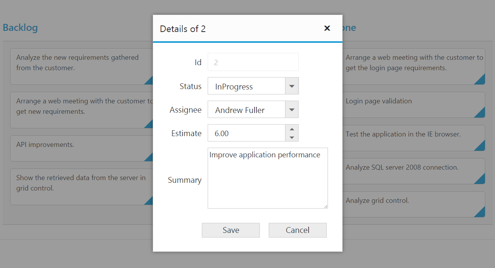
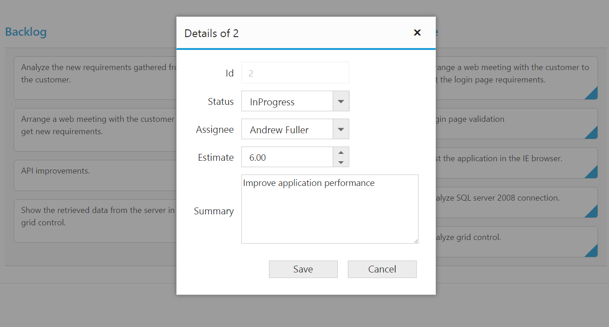
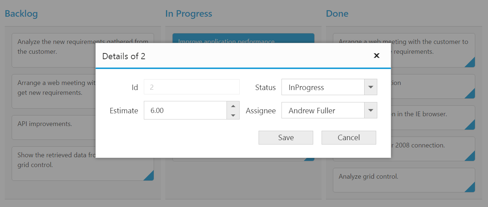
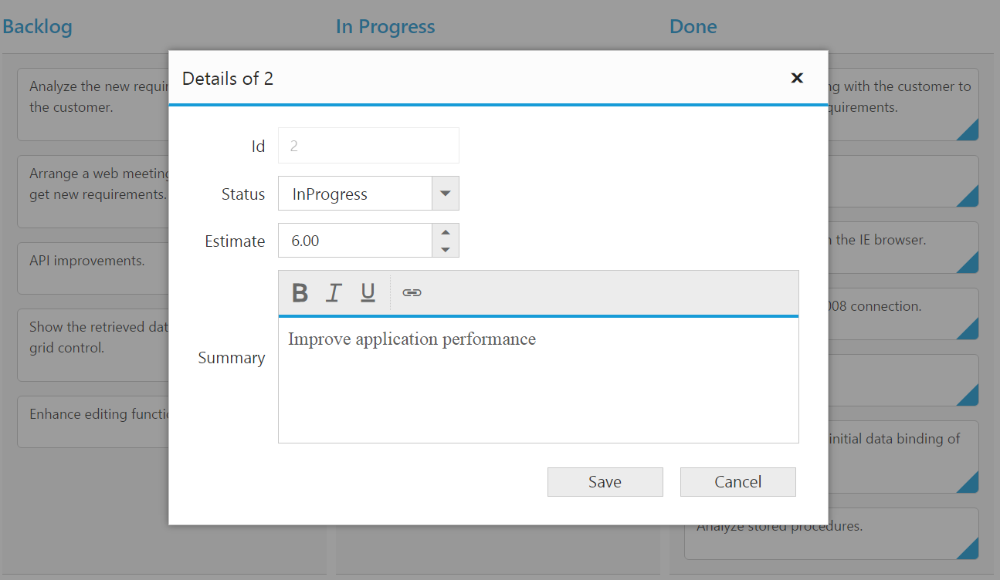
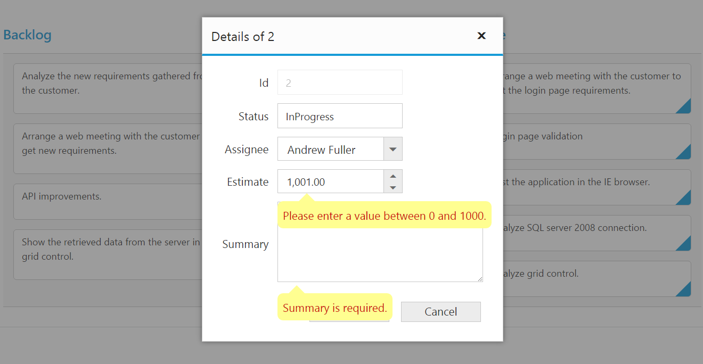

# Editing

The Kanban control has support for dynamic insertion, updating and deletion of cards. 

Set `allow-editing` and `allow-adding` property as true to enable editing/inserting respectively. The primary key for the data source should be defined in `primary-key`, for editing to work properly. 

You can start the edit action by double clicking the particular card. Similarly, you can add new card to Kanban either by double clicking the particular cell or on an external button which is bound to call `addCard` method of Kanban. 

Deletion of the card is possible by using `deleteCard` by passing primary key as attribute.

N> In Kanban, the `primary key` column will be automatically set to `read only` while editing the card which is to avoid duplicate entry in the cards.

## Configuring Edit Items

You need to configure the list of data source fields that are allowable in editing state using [`kanbanedit-item`] property. The `field` property of [`kanbanedit-item`] needs to be mapped with data source fields.

You can map the data source field as title to edit form using `title` property of [`kanbanfield`]. By default, it’s mapped with `primary-key`.

The following code example describes the above behavior.





     <ej-kanban id="KanbanBoard" key-field="Status" dataSource="ViewBag.datasource">
          <e-kanbancolumns>
              <e-kanbancolumn header-text="Backlog" key=@(new List<string>(){"Open"})>
              </e-kanbancolumn>
              <e-kanbancolumn header-text="In Progress" key=@(new List<string>() {"InProgress"})></e-kanbancolumn>
              <e-kanbancolumn header-text="Done" key=@(new List<string>() {"Close"})></e-kanbancolumn>
          </e-kanbancolumns>
          <e-kanbanfield content="Summary" primary-key="Id">
          </e-kanbanfield>
          <e-kanbanedit-settings allow-editing="true" allow-adding="true">
              <e-kanbanedit-items>
                  <e-kanbanedit-item field="Id"></e-kanbanedit-item>
                  <e-kanbanedit-item field="Status" edit-type="Dropdown"></e-kanbanedit-item>
                  <e-kanbanedit-item field="Assignee" edit-type="Dropdown"></e-kanbanedit-item>
                  <e-kanbanedit-item field="Estimate" edit-type="Numeric" numeric-edit-options=@(new Syncfusion.JavaScript.Models.EditorProperties() { DecimalPlaces=2 })>
                  </e-kanbanedit-item>
                  <e-kanbanedit-item field="Summary" edit-type="TextArea" text-area-options=@(new Syncfusion.JavaScript.Models.KanbanTextAreaProperties() { Height="100", Width="200"})>
                  </e-kanbanedit-item>
              </e-kanbanedit-items>
          </e-kanbanedit-settings>
      </ej-kanban>





    public partial class KanbanBoardController : Controller
    {
        List<Tasks> Task = new List<Tasks>();

        public ActionResult Default()
        {
            Task.Add(new Tasks(1, "Open", "Analyze the new requirements gathered from the customer.", "Story", "Low", "Analyze,Customer", 3.5, "Nancy", "../content/images/kanban/1.png", 1));
            Task.Add(new Tasks(2, "InProgress", "Improve application performance", "Improvement", "Normal", "Improvement", 6, "Andrew Fuller", "../content/images/kanban/2.png", 1));
            Task.Add(new Tasks(3, "Open", "Arrange a web meeting with the customer to get new requirements.", "Others", "Critical", "Meeting", 5.5, "Janet Leverling", "../content/images/kanban/3.png", 2));
            Task.Add(new Tasks(4, "InProgress", "Fix the issues reported in the IE browser.", "Bug", "Release Breaker", "IE", 2.5, "Janet Leverling", "../content/images/kanban/3.png", 2));
            Task.Add(new Tasks(5, "Testing", "Fix the issues reported by the customer.", "Bug", "Low", "Customer", 3.5, "Steven walker", "../content/images/kanban/5.png", 1));
            Task.Add(new Tasks(6, "Close", "Arrange a web meeting with the customer to get the login page requirements.", "Others", "Low", "Meeting", 2, "Michael Suyama", "../content/images/kanban/6.png", 1));
            Task.Add(new Tasks(7, "Validate", "Validate new requirements", "Improvement", "Low", "Validation", 1.5, "Robert King", "../content/images/kanban/7.png", 4));
            Task.Add(new Tasks(8, "Close", "Login page validation", "Story", "Release Breaker", "Validation,Fix", 2.5, "Laura Callahan", "../content/images/kanban/8.png", 2));
            Task.Add(new Tasks(9, "Testing", "Fix the issues reported in Safari browser.", "Bug", "Release Breaker", "Fix,Safari", 1.5, "Nancy", "../content/images/kanban/1.png", 2));
            Task.Add(new Tasks(10, "Close", "Test the application in the IE browser.", "Story", "Low", "Testing,IE", 5.5, "Margaret", "../content/images/kanban/4.png", 3));
            Task.Add(new Tasks(11, "Validate", "Validate the issues reported by the customer.", "Story", "High", "Validation,Fix", 1, "Steven walker", "../content/images/kanban/5.png", 5));
            Task.Add(new Tasks(12, "Testing", "Check Login page validation.", "Story", "Release Breaker", "Testing", 0.5, "Michael Suyama", "../content/images/kanban/6.png", 3));
            Task.Add(new Tasks(13, "Open", "API improvements.", "Improvement", "High", "Grid,API", 3.5, "Robert King", "../content/images/kanban/7.png", 3));
            Task.Add(new Tasks(14, "InProgress", "Add responsive support to application", "Epic", "Critical", "Responsive", 6, "Laura Callahan", "../content/images/kanban/8.png", 3));
            Task.Add(new Tasks(15, "Open", "Show the retrieved data from the server in grid control.", "Story", "High", "Database,SQL", 5.5, "Margaret", "../content/images/kanban/4.png", 4));
            ViewBag.datasource = Task;
            return View();
        }
    }
    public class Tasks
    {
        public Tasks()
        {
        }
        public Tasks(int Id, string Status, string Summary, string Type, string Priority, string Tags, double Estimate, string Assignee, string ImageUrl, int RankId)
        {
            this.Id = Id;
            this.Status = Status;
            this.Summary = Summary;
            this.Type = Type;
            this.Priority = Priority;
            this.Tags = Tags;
            this.Estimate = Estimate;
            this.Assignee = Assignee;
            this.ImageUrl = ImageUrl;
            this.RankId = RankId;
        }
        public int Id { get; set; }
        public string Status { get; set; }
        public string Summary { get; set; }
        public string Type { get; set; }
        public string Priority { get; set; }
        public string Tags { get; set; }
        public double Estimate { get; set; }
        public string Assignee { get; set; }
        public string ImageUrl { get; set; }
        public int RankId { get; set; }
    }



  

The following output is displayed as a result of the above code example.

## Edit modes

### Dialog

Set `edit-mode` as `Dialog` to edit data using a dialog box, which displays the fields associated with the data card being edited. Default value is `Dialog`.

N> For `edit-mode` property you can assign `string` value (“Dialog”).

The following code example describes the above behavior.





   <ej-kanban id="KanbanBoard" key-field="Status" dataSource="ViewBag.datasource">
          <e-kanbancolumns>
              <e-kanbancolumn header-text="Backlog" key=@(new List<string>(){"Open"})>
              </e-kanbancolumn>
              <e-kanbancolumn header-text="In Progress" key=@(new List<string>() {"InProgress"})></e-kanbancolumn>
              <e-kanbancolumn header-text="Done" key=@(new List<string>() {"Close"})></e-kanbancolumn>
          </e-kanbancolumns>
          <e-kanbanfield content="Summary" primary-key="Id">
          </e-kanbanfield>
          <e-kanbanedit-settings allow-editing="true" allow-adding="true">
              <e-kanbanedit-items>
                  <e-kanbanedit-item field="Id"></e-kanbanedit-item>
                  <e-kanbanedit-item field="Status" edit-type="Dropdown"></e-kanbanedit-item>
                  <e-kanbanedit-item field="Assignee" edit-type="Dropdown"></e-kanbanedit-item>
                  <e-kanbanedit-item field="Estimate" edit-type="Numeric" numeric-edit-options=@(new Syncfusion.JavaScript.Models.EditorProperties() { DecimalPlaces=2 })>
                  </e-kanbanedit-item>
                  <e-kanbanedit-item field="Summary" edit-type="TextArea">
                  </e-kanbanedit-item>
              </e-kanbanedit-items>
          </e-kanbanedit-settings>
     </ej-kanban>





    public partial class KanbanBoardController : Controller
    {
        List<Tasks> Task = new List<Tasks>();

        public ActionResult Default()
        {
            Task.Add(new Tasks(1, "Open", "Analyze the new requirements gathered from the customer.", "Story", "Low", "Analyze,Customer", 3.5, "Nancy", "../content/images/kanban/1.png", 1));
            Task.Add(new Tasks(2, "InProgress", "Improve application performance", "Improvement", "Normal", "Improvement", 6, "Andrew Fuller", "../content/images/kanban/2.png", 1));
            Task.Add(new Tasks(3, "Open", "Arrange a web meeting with the customer to get new requirements.", "Others", "Critical", "Meeting", 5.5, "Janet Leverling", "../content/images/kanban/3.png", 2));
            Task.Add(new Tasks(4, "InProgress", "Fix the issues reported in the IE browser.", "Bug", "Release Breaker", "IE", 2.5, "Janet Leverling", "../content/images/kanban/3.png", 2));
            Task.Add(new Tasks(5, "Testing", "Fix the issues reported by the customer.", "Bug", "Low", "Customer", 3.5, "Steven walker", "../content/images/kanban/5.png", 1));
            Task.Add(new Tasks(6, "Close", "Arrange a web meeting with the customer to get the login page requirements.", "Others", "Low", "Meeting", 2, "Michael Suyama", "../content/images/kanban/6.png", 1));
            Task.Add(new Tasks(7, "Validate", "Validate new requirements", "Improvement", "Low", "Validation", 1.5, "Robert King", "../content/images/kanban/7.png", 4));
            Task.Add(new Tasks(8, "Close", "Login page validation", "Story", "Release Breaker", "Validation,Fix", 2.5, "Laura Callahan", "../content/images/kanban/8.png", 2));
            Task.Add(new Tasks(9, "Testing", "Fix the issues reported in Safari browser.", "Bug", "Release Breaker", "Fix,Safari", 1.5, "Nancy", "../content/images/kanban/1.png", 2));
            Task.Add(new Tasks(10, "Close", "Test the application in the IE browser.", "Story", "Low", "Testing,IE", 5.5, "Margaret", "../content/images/kanban/4.png", 3));
            Task.Add(new Tasks(11, "Validate", "Validate the issues reported by the customer.", "Story", "High", "Validation,Fix", 1, "Steven walker", "../content/images/kanban/5.png", 5));
            Task.Add(new Tasks(12, "Testing", "Check Login page validation.", "Story", "Release Breaker", "Testing", 0.5, "Michael Suyama", "../content/images/kanban/6.png", 3));
            Task.Add(new Tasks(13, "Open", "API improvements.", "Improvement", "High", "Grid,API", 3.5, "Robert King", "../content/images/kanban/7.png", 3));
            Task.Add(new Tasks(14, "InProgress", "Add responsive support to application", "Epic", "Critical", "Responsive", 6, "Laura Callahan", "../content/images/kanban/8.png", 3));
            Task.Add(new Tasks(15, "Open", "Show the retrieved data from the server in grid control.", "Story", "High", "Database,SQL", 5.5, "Margaret", "../content/images/kanban/4.png", 4));
            ViewBag.datasource = Task;
            return View();
        }
    }
    public class Tasks
    {
        public Tasks()
        {
        }
        public Tasks(int Id, string Status, string Summary, string Type, string Priority, string Tags, double Estimate, string Assignee, string ImageUrl, int RankId)
        {
            this.Id = Id;
            this.Status = Status;
            this.Summary = Summary;
            this.Type = Type;
            this.Priority = Priority;
            this.Tags = Tags;
            this.Estimate = Estimate;
            this.Assignee = Assignee;
            this.ImageUrl = ImageUrl;
            this.RankId = RankId;
        }
        public int Id { get; set; }
        public string Status { get; set; }
        public string Summary { get; set; }
        public string Type { get; set; }
        public string Priority { get; set; }
        public string Tags { get; set; }
        public double Estimate { get; set; }
        public string Assignee { get; set; }
        public string ImageUrl { get; set; }
        public int RankId { get; set; }
    }



  

The following output is displayed as a result of the above code example.

### Dialog Template Form

You can edit any of the fields pertaining to a single card of data and apply it to a template so that the same format is applied to all the other cards that you may edit later. 

Using this template support, you can edit the fields that are not bound to [`kanbanedit-items`].

To edit the cards using Dialog template form, set `edit-mode` as `DialogTemplate` and specify the template id to `DialogTemplate` property of [`kanbanedit-settings`].

N> 1. `value` attribute is used to bind the corresponding field value while editing.
N> 2. `name` attribute is used to get the changed field values while save the edited card.

The following code example describes the above behavior.



                 







 <ej-kanban id="KanbanBoard" key-field="Status" dataSource="ViewBag.datasource" action-complete="complete">
     <e-kanbancolumns>
        <e-kanbancolumn header-text="Backlog" key=@(new List<string>(){"Open"})>
        </e-kanbancolumn>
        <e-kanbancolumn header-text="In Progress" key=@(new List<string>() {"InProgress"})></e-kanbancolumn>
        <e-kanbancolumn header-text="Done" key=@(new List<string>() {"Close"})></e-kanbancolumn>
     </e-kanbancolumns>
     <e-kanbanfield content="Summary" primary-key="Id">
     </e-kanbanfield>
     <e-kanbanedit-settings allow-editing="true" allow-adding="true" edit-mode="DialogTemplate" dialog-template="#template">
     </e-kanbanedit-settings>
</ej-kanban>





    public partial class KanbanBoardController : Controller
    {
        List<Tasks> Task = new List<Tasks>();

        public ActionResult Default()
        {
            Task.Add(new Tasks(1, "Open", "Analyze the new requirements gathered from the customer.", "Story", "Low", "Analyze,Customer", 3.5, "Nancy", "../content/images/kanban/1.png", 1));
            Task.Add(new Tasks(2, "InProgress", "Improve application performance", "Improvement", "Normal", "Improvement", 6, "Andrew Fuller", "../content/images/kanban/2.png", 1));
            Task.Add(new Tasks(3, "Open", "Arrange a web meeting with the customer to get new requirements.", "Others", "Critical", "Meeting", 5.5, "Janet Leverling", "../content/images/kanban/3.png", 2));
            Task.Add(new Tasks(4, "InProgress", "Fix the issues reported in the IE browser.", "Bug", "Release Breaker", "IE", 2.5, "Janet Leverling", "../content/images/kanban/3.png", 2));
            Task.Add(new Tasks(5, "Testing", "Fix the issues reported by the customer.", "Bug", "Low", "Customer", 3.5, "Steven walker", "../content/images/kanban/5.png", 1));
            Task.Add(new Tasks(6, "Close", "Arrange a web meeting with the customer to get the login page requirements.", "Others", "Low", "Meeting", 2, "Michael Suyama", "../content/images/kanban/6.png", 1));
            Task.Add(new Tasks(7, "Validate", "Validate new requirements", "Improvement", "Low", "Validation", 1.5, "Robert King", "../content/images/kanban/7.png", 4));
            Task.Add(new Tasks(8, "Close", "Login page validation", "Story", "Release Breaker", "Validation,Fix", 2.5, "Laura Callahan", "../content/images/kanban/8.png", 2));
            Task.Add(new Tasks(9, "Testing", "Fix the issues reported in Safari browser.", "Bug", "Release Breaker", "Fix,Safari", 1.5, "Nancy", "../content/images/kanban/1.png", 2));
            Task.Add(new Tasks(10, "Close", "Test the application in the IE browser.", "Story", "Low", "Testing,IE", 5.5, "Margaret", "../content/images/kanban/4.png", 3));
            Task.Add(new Tasks(11, "Validate", "Validate the issues reported by the customer.", "Story", "High", "Validation,Fix", 1, "Steven walker", "../content/images/kanban/5.png", 5));
            Task.Add(new Tasks(12, "Testing", "Check Login page validation.", "Story", "Release Breaker", "Testing", 0.5, "Michael Suyama", "../content/images/kanban/6.png", 3));
            Task.Add(new Tasks(13, "Open", "API improvements.", "Improvement", "High", "Grid,API", 3.5, "Robert King", "../content/images/kanban/7.png", 3));
            Task.Add(new Tasks(14, "InProgress", "Add responsive support to application", "Epic", "Critical", "Responsive", 6, "Laura Callahan", "../content/images/kanban/8.png", 3));
            Task.Add(new Tasks(15, "Open", "Show the retrieved data from the server in grid control.", "Story", "High", "Database,SQL", 5.5, "Margaret", "../content/images/kanban/4.png", 4));
            ViewBag.datasource = Task;
            return View();
        }
    }
    public class Tasks
    {
        public Tasks()
        {
        }
        public Tasks(int Id, string Status, string Summary, string Type, string Priority, string Tags, double Estimate, string Assignee, string ImageUrl, int RankId)
        {
            this.Id = Id;
            this.Status = Status;
            this.Summary = Summary;
            this.Type = Type;
            this.Priority = Priority;
            this.Tags = Tags;
            this.Estimate = Estimate;
            this.Assignee = Assignee;
            this.ImageUrl = ImageUrl;
            this.RankId = RankId;
        }
        public int Id { get; set; }
        public string Status { get; set; }
        public string Summary { get; set; }
        public string Type { get; set; }
        public string Priority { get; set; }
        public string Tags { get; set; }
        public double Estimate { get; set; }
        public string Assignee { get; set; }
        public string ImageUrl { get; set; }
        public int RankId { get; set; }
    }



  

While using template, you can change the elements that are defined in the `template`, to appropriate Syncfusion JS controls based on the column type. This can be achieved by using `action-complete` event of Kanban. Please refer to following code snippets.



    function complete(args) {
        if ((args.requestType == "beginedit" || args.requestType == "add") && args.model.editSettings.editMode == "dialogtemplate") {
            $("#Estimate").ejNumericTextbox({ value: parseFloat($("#Estimate").val()), width: "175px", height: "34px", decimalPlaces: 2 });
            $("#Assignee").ejDropDownList({ width: '175px' });
            $("#Status").ejDropDownList({ width: '175px' });
            $("#Priority").ejDropDownList({ width: '175px' });
            if (args.requestType == "beginedit" || args.requestType == "add") {
                $("#Assignee").ejDropDownList("setSelectedValue", args.data['Assignee']);
                $("#Priority").ejDropDownList("setSelectedValue", args.data['Priority']);
                $("#Status").ejDropDownList("setSelectedValue", args.data['Status']);
            }
        
        }
    }



The following output is displayed as a result of the above code example.

### External Form

Set the `edit-mode` as `ExternalForm` to open the edit form in outside kanban content.

The following code example describes the above behavior.





     <ej-kanban id="KanbanBoard" key-field="Status" dataSource="ViewBag.datasource" allow-scrolling="true">
          <e-kanbancolumns>
              <e-kanbancolumn header-text="Backlog" key=@(new List<string>(){"Open"})>
              </e-kanbancolumn>
              <e-kanbancolumn header-text="In Progress" key=@(new List<string>() {"InProgress"})></e-kanbancolumn>
              <e-kanbancolumn header-text="Done" key=@(new List<string>() {"Close"})></e-kanbancolumn>
          </e-kanbancolumns>
          <e-kanbanfield content="Summary" primary-key="Id">
          </e-kanbanfield>
          <e-kanbanscroll-settings height="300" width="700"></e-kanbanscroll-settings>
          <e-kanbanedit-settings allow-editing="true" allow-adding="true" edit-mode="ExternalForm">
              <e-kanbanedit-items>
                  <e-kanbanedit-item field="Id" edit-type="String"></e-kanbanedit-item>
                  <e-kanbanedit-item field="Status" edit-type="Dropdown"></e-kanbanedit-item>
                  <e-kanbanedit-item field="Summary" edit-type="TextArea" validation-rule=@(new Dictionary<string, object>() { { "required", true } })>
                  </e-kanbanedit-item>
              </e-kanbanedit-items>
          </e-kanbanedit-settings>
      </ej-kanban>
      




    public partial class KanbanBoardController : Controller
    {
        List<Tasks> Task = new List<Tasks>();

        public ActionResult Default()
        {
            Task.Add(new Tasks(1, "Open", "Analyze the new requirements gathered from the customer.", "Story", "Low", "Analyze,Customer", 3.5, "Nancy", "../content/images/kanban/1.png", 1));
            Task.Add(new Tasks(2, "InProgress", "Improve application performance", "Improvement", "Normal", "Improvement", 6, "Andrew Fuller", "../content/images/kanban/2.png", 1));
            Task.Add(new Tasks(3, "Open", "Arrange a web meeting with the customer to get new requirements.", "Others", "Critical", "Meeting", 5.5, "Janet Leverling", "../content/images/kanban/3.png", 2));
            Task.Add(new Tasks(4, "InProgress", "Fix the issues reported in the IE browser.", "Bug", "Release Breaker", "IE", 2.5, "Janet Leverling", "../content/images/kanban/3.png", 2));
            Task.Add(new Tasks(5, "Testing", "Fix the issues reported by the customer.", "Bug", "Low", "Customer", 3.5, "Steven walker", "../content/images/kanban/5.png", 1));
            Task.Add(new Tasks(6, "Close", "Arrange a web meeting with the customer to get the login page requirements.", "Others", "Low", "Meeting", 2, "Michael Suyama", "../content/images/kanban/6.png", 1));
            Task.Add(new Tasks(7, "Validate", "Validate new requirements", "Improvement", "Low", "Validation", 1.5, "Robert King", "../content/images/kanban/7.png", 4));
            Task.Add(new Tasks(8, "Close", "Login page validation", "Story", "Release Breaker", "Validation,Fix", 2.5, "Laura Callahan", "../content/images/kanban/8.png", 2));
            Task.Add(new Tasks(9, "Testing", "Fix the issues reported in Safari browser.", "Bug", "Release Breaker", "Fix,Safari", 1.5, "Nancy", "../content/images/kanban/1.png", 2));
            Task.Add(new Tasks(10, "Close", "Test the application in the IE browser.", "Story", "Low", "Testing,IE", 5.5, "Margaret", "../content/images/kanban/4.png", 3));
            Task.Add(new Tasks(11, "Validate", "Validate the issues reported by the customer.", "Story", "High", "Validation,Fix", 1, "Steven walker", "../content/images/kanban/5.png", 5));
            Task.Add(new Tasks(12, "Testing", "Check Login page validation.", "Story", "Release Breaker", "Testing", 0.5, "Michael Suyama", "../content/images/kanban/6.png", 3));
            Task.Add(new Tasks(13, "Open", "API improvements.", "Improvement", "High", "Grid,API", 3.5, "Robert King", "../content/images/kanban/7.png", 3));
            Task.Add(new Tasks(14, "InProgress", "Add responsive support to application", "Epic", "Critical", "Responsive", 6, "Laura Callahan", "../content/images/kanban/8.png", 3));
            Task.Add(new Tasks(15, "Open", "Show the retrieved data from the server in grid control.", "Story", "High", "Database,SQL", 5.5, "Margaret", "../content/images/kanban/4.png", 4));
            ViewBag.datasource = Task;
            return View();
        }
    }
    public class Tasks
    {
        public Tasks()
        {
        }
        public Tasks(int Id, string Status, string Summary, string Type, string Priority, string Tags, double Estimate, string Assignee, string ImageUrl, int RankId)
        {
            this.Id = Id;
            this.Status = Status;
            this.Summary = Summary;
            this.Type = Type;
            this.Priority = Priority;
            this.Tags = Tags;
            this.Estimate = Estimate;
            this.Assignee = Assignee;
            this.ImageUrl = ImageUrl;
            this.RankId = RankId;
        }
        public int Id { get; set; }
        public string Status { get; set; }
        public string Summary { get; set; }
        public string Type { get; set; }
        public string Priority { get; set; }
        public string Tags { get; set; }
        public double Estimate { get; set; }
        public string Assignee { get; set; }
        public string ImageUrl { get; set; }
        public int RankId { get; set; }
    }



  

The following output is displayed as a result of the above code example.

Form Position:

Form Position can be customized by setting the `form-position` property of [`kanbanedit-settings`] as "Right" or "Bottom".

The following code example describes the above behavior.





<ej-kanban id="KanbanBoard" key-field="Status" dataSource="ViewBag.datasource" allow-title="true" allow-scrolling="true">
   <e-kanbancolumns>
        <e-kanbancolumn header-text="Backlog" key=@(new List<string>(){"Open"})>
        </e-kanbancolumn>
        <e-kanbancolumn header-text="In Progress" key=@(new List<string>() {"InProgress"})></e-kanbancolumn>
        <e-kanbancolumn header-text="Done" key=@(new List<string>() {"Close"})></e-kanbancolumn>
   </e-kanbancolumns>
   <e-kanbanfield content="Summary" primary-key="Id">
   </e-kanbanfield>
   <e-kanbanscroll-settings height="250" width="700"></e-kanbanscroll-settings>
   <e-kanbanedit-settings allow-editing="true" allow-adding="true" edit-mode="ExternalForm" form-position="Right">
        <e-kanbanedit-items>
            <e-kanbanedit-item field="Id" edit-type="String">
            </e-kanbanedit-item>
            <e-kanbanedit-item field="Status" edit-type="Dropdown"></e-kanbanedit-item>
            <e-kanbanedit-item field="Assignee" edit-type="Dropdown"></e-kanbanedit-item>
            <e-kanbanedit-item field="Estimate" edit-type="Numeric" numeric-edit-options=@(new Syncfusion.JavaScript.Models.EditorProperties() { DecimalPlaces=2 })>
            </e-kanbanedit-item>
            <e-kanbanedit-item field="Summary" edit-type="TextArea">
            </e-kanbanedit-item>
        </e-kanbanedit-items>
   </e-kanbanedit-settings>
</ej-kanban>





    public partial class KanbanBoardController : Controller
    {
        List<Tasks> Task = new List<Tasks>();

        public ActionResult Default()
        {
            Task.Add(new Tasks(1, "Open", "Analyze the new requirements gathered from the customer.", "Story", "Low", "Analyze,Customer", 3.5, "Nancy", "../content/images/kanban/1.png", 1));
            Task.Add(new Tasks(2, "InProgress", "Improve application performance", "Improvement", "Normal", "Improvement", 6, "Andrew Fuller", "../content/images/kanban/2.png", 1));
            Task.Add(new Tasks(3, "Open", "Arrange a web meeting with the customer to get new requirements.", "Others", "Critical", "Meeting", 5.5, "Janet Leverling", "../content/images/kanban/3.png", 2));
            Task.Add(new Tasks(4, "InProgress", "Fix the issues reported in the IE browser.", "Bug", "Release Breaker", "IE", 2.5, "Janet Leverling", "../content/images/kanban/3.png", 2));
            Task.Add(new Tasks(5, "Testing", "Fix the issues reported by the customer.", "Bug", "Low", "Customer", 3.5, "Steven walker", "../content/images/kanban/5.png", 1));
            Task.Add(new Tasks(6, "Close", "Arrange a web meeting with the customer to get the login page requirements.", "Others", "Low", "Meeting", 2, "Michael Suyama", "../content/images/kanban/6.png", 1));
            Task.Add(new Tasks(7, "Validate", "Validate new requirements", "Improvement", "Low", "Validation", 1.5, "Robert King", "../content/images/kanban/7.png", 4));
            Task.Add(new Tasks(8, "Close", "Login page validation", "Story", "Release Breaker", "Validation,Fix", 2.5, "Laura Callahan", "../content/images/kanban/8.png", 2));
            Task.Add(new Tasks(9, "Testing", "Fix the issues reported in Safari browser.", "Bug", "Release Breaker", "Fix,Safari", 1.5, "Nancy", "../content/images/kanban/1.png", 2));
            Task.Add(new Tasks(10, "Close", "Test the application in the IE browser.", "Story", "Low", "Testing,IE", 5.5, "Margaret", "../content/images/kanban/4.png", 3));
            Task.Add(new Tasks(11, "Validate", "Validate the issues reported by the customer.", "Story", "High", "Validation,Fix", 1, "Steven walker", "../content/images/kanban/5.png", 5));
            Task.Add(new Tasks(12, "Testing", "Check Login page validation.", "Story", "Release Breaker", "Testing", 0.5, "Michael Suyama", "../content/images/kanban/6.png", 3));
            Task.Add(new Tasks(13, "Open", "API improvements.", "Improvement", "High", "Grid,API", 3.5, "Robert King", "../content/images/kanban/7.png", 3));
            Task.Add(new Tasks(14, "InProgress", "Add responsive support to application", "Epic", "Critical", "Responsive", 6, "Laura Callahan", "../content/images/kanban/8.png", 3));
            Task.Add(new Tasks(15, "Open", "Show the retrieved data from the server in grid control.", "Story", "High", "Database,SQL", 5.5, "Margaret", "../content/images/kanban/4.png", 4));
            ViewBag.datasource = Task;
            return View();
        }
    }
    public class Tasks
    {
        public Tasks()
        {
        }
        public Tasks(int Id, string Status, string Summary, string Type, string Priority, string Tags, double Estimate, string Assignee, string ImageUrl, int RankId)
        {
            this.Id = Id;
            this.Status = Status;
            this.Summary = Summary;
            this.Type = Type;
            this.Priority = Priority;
            this.Tags = Tags;
            this.Estimate = Estimate;
            this.Assignee = Assignee;
            this.ImageUrl = ImageUrl;
            this.RankId = RankId;
        }
        public int Id { get; set; }
        public string Status { get; set; }
        public string Summary { get; set; }
        public string Type { get; set; }
        public string Priority { get; set; }
        public string Tags { get; set; }
        public double Estimate { get; set; }
        public string Assignee { get; set; }
        public string ImageUrl { get; set; }
        public int RankId { get; set; }
    }



  

The following output is displayed as a result of the above code example.

### External Template Form

You can edit any of the fields pertaining to a single card of data and apply it to a template so that the same format is applied to all the other cards that you may edit later. 

Using this template support, you can edit the fields that are not bound to Kanban Edit Items.

To edit the cards using External template form, set `edit-mode` as `ExternalFormTemplate` and specify the template id to `ExternalFormTemplate` property of [`kanbanedit-settings`].

While using template, you can change the elements that are defined in the template, to appropriate Syncfusion JS controls based on the column type. This can be achieved by using `action-complete` event of Kanban.

N> 1. `value` attribute is used to bind the corresponding field value while editing. 
N> 2. `name` attribute is used to get the changed field values while save the edited card. 

The following code example describes the above behavior.



   







     <ej-kanban id="KanbanBoard" key-field="Status" dataSource="ViewBag.datasource" allow-title="true" allow-scrolling="true" action-complete="complete">
          <e-kanbancolumns>
              <e-kanbancolumn header-text="Backlog" key=@(new List<string>(){"Open"})>
              </e-kanbancolumn>
              <e-kanbancolumn header-text="In Progress" key=@(new List<string>() {"InProgress"})></e-kanbancolumn>
              <e-kanbancolumn header-text="Done" key=@(new List<string>() {"Close"})></e-kanbancolumn>
          </e-kanbancolumns>
          <e-kanbanfield content="Summary" primary-key="Id">
          </e-kanbanfield>
          <e-kanbanscroll-settings height="450" width="700"></e-kanbanscroll-settings>
          <e-kanbanedit-settings allow-editing="true" allow-adding="true" edit-mode="ExternalFormTemplate" external-form-template="#template">
          </e-kanbanedit-settings>
      </ej-kanban>





   
    public partial class KanbanBoardController : Controller
    {
        List<Tasks> Task = new List<Tasks>();

        public ActionResult Default()
        {
            Task.Add(new Tasks(1, "Open", "Analyze the new requirements gathered from the customer.", "Story", "Low", "Analyze,Customer", 3.5, "Nancy", "../content/images/kanban/1.png", 1));
            Task.Add(new Tasks(2, "InProgress", "Improve application performance", "Improvement", "Normal", "Improvement", 6, "Andrew Fuller", "../content/images/kanban/2.png", 1));
            Task.Add(new Tasks(3, "Open", "Arrange a web meeting with the customer to get new requirements.", "Others", "Critical", "Meeting", 5.5, "Janet Leverling", "../content/images/kanban/3.png", 2));
            Task.Add(new Tasks(4, "InProgress", "Fix the issues reported in the IE browser.", "Bug", "Release Breaker", "IE", 2.5, "Janet Leverling", "../content/images/kanban/3.png", 2));
            Task.Add(new Tasks(5, "Testing", "Fix the issues reported by the customer.", "Bug", "Low", "Customer", 3.5, "Steven walker", "../content/images/kanban/5.png", 1));
            Task.Add(new Tasks(6, "Close", "Arrange a web meeting with the customer to get the login page requirements.", "Others", "Low", "Meeting", 2, "Michael Suyama", "../content/images/kanban/6.png", 1));
            Task.Add(new Tasks(7, "Validate", "Validate new requirements", "Improvement", "Low", "Validation", 1.5, "Robert King", "../content/images/kanban/7.png", 4));
            Task.Add(new Tasks(8, "Close", "Login page validation", "Story", "Release Breaker", "Validation,Fix", 2.5, "Laura Callahan", "../content/images/kanban/8.png", 2));
            Task.Add(new Tasks(9, "Testing", "Fix the issues reported in Safari browser.", "Bug", "Release Breaker", "Fix,Safari", 1.5, "Nancy", "../content/images/kanban/1.png", 2));
            Task.Add(new Tasks(10, "Close", "Test the application in the IE browser.", "Story", "Low", "Testing,IE", 5.5, "Margaret", "../content/images/kanban/4.png", 3));
            Task.Add(new Tasks(11, "Validate", "Validate the issues reported by the customer.", "Story", "High", "Validation,Fix", 1, "Steven walker", "../content/images/kanban/5.png", 5));
            Task.Add(new Tasks(12, "Testing", "Check Login page validation.", "Story", "Release Breaker", "Testing", 0.5, "Michael Suyama", "../content/images/kanban/6.png", 3));
            Task.Add(new Tasks(13, "Open", "API improvements.", "Improvement", "High", "Grid,API", 3.5, "Robert King", "../content/images/kanban/7.png", 3));
            Task.Add(new Tasks(14, "InProgress", "Add responsive support to application", "Epic", "Critical", "Responsive", 6, "Laura Callahan", "../content/images/kanban/8.png", 3));
            Task.Add(new Tasks(15, "Open", "Show the retrieved data from the server in grid control.", "Story", "High", "Database,SQL", 5.5, "Margaret", "../content/images/kanban/4.png", 4));
            ViewBag.datasource = Task;
            return View();
        }
    }
    public class Tasks
    {
        public Tasks()
        {
        }
        public Tasks(int Id, string Status, string Summary, string Type, string Priority, string Tags, double Estimate, string Assignee, string ImageUrl, int RankId)
        {
            this.Id = Id;
            this.Status = Status;
            this.Summary = Summary;
            this.Type = Type;
            this.Priority = Priority;
            this.Tags = Tags;
            this.Estimate = Estimate;
            this.Assignee = Assignee;
            this.ImageUrl = ImageUrl;
            this.RankId = RankId;
        }
        public int Id { get; set; }
        public string Status { get; set; }
        public string Summary { get; set; }
        public string Type { get; set; }
        public string Priority { get; set; }
        public string Tags { get; set; }
        public double Estimate { get; set; }
        public string Assignee { get; set; }
        public string ImageUrl { get; set; }
        public int RankId { get; set; }
    }



  



    function complete(args) {
        if ((args.requestType == "beginedit" || args.requestType == "add") && args.model.editSettings.editMode == "externalformtemplate") {
            $("#Assignee").ejDropDownList({ width: '175px' });
            $("#Status").ejDropDownList({ width: '175px' });
            if (args.requestType == "beginedit" || args.requestType == "add") {
                $("#Assignee").ejDropDownList("setSelectedValue", args.data['Assignee']);
                $("#Status").ejDropDownList("setSelectedValue", args.data['Status']);
            }        
        }
    }



The following output is displayed as a result of the above code example.

### Cell edit type and its params

The edit type of bound column can be customized using `edit-type` property of [`kanbancolumns`]. The following Essential JavaScript controls are supported built-in by `edit-type`. You can set the `edit-type` based on specific data type of the column.

<table>
<tr>
<th>
EditType</th><th>
EditParams</th>
<th>
Description</th>
<th>
Example</th>
</tr>
<tr>
<td>
Numeric</td><td>
 {{ 'TextBoxes' | markdownify }} </td>
<td>
control for integers, double, and decimal data’s</td>
<td>
numeric-edit-options=@(new Syncfusion.JavaScript.Models.EditorProperties() { DecimalPlaces=2 })</td>
</tr>
<tr>
<td>
String</td><td>
HTML Textbox</td>
<td>
HTML Textbox</td>
<td>
-</td>
</tr>
<tr>
<td>
DatePicker </td><td>
{{ 'DatePicker'| markdownify }} </td>
<td>
control for date data</td>
<td>
date-edit-options=@(new Syncfusion.JavaScript.Models.DatePickerProperties() { ButtonText="Now" })</td>
</tr>
<tr>
<td>
DateTimePicker </td><td>
{{ 'DateTimePicker'| markdownify }} </td>
<td>
control for date data-time data</td>
<td>
date-time-edit-options=@(new Syncfusion.JavaScript.Models.DateTimePickerProperties() { Enabled=true})</td>
</tr>
<tr>
<td>
DropDown </td><td>
{{ 'DropDownList'| markdownify }} </td>
<td>
control for list of data</td>
<td>
dropdown-edit-options=@(new Syncfusion.JavaScript.Models.DropDownListProperties() { Height="40"})</td>
</tr>
<tr>
<td>
RTE </td><td>
{{ 'RTE'| markdownify }} </td>
<td>
control for customizing text in RTE format</td>
<td>
rte-edit-options=@(new Syncfusion.JavaScript.Models.RTEProperties() { EnableResize=true})</td>
</tr>
<tr>
<td>
TextArea </td><td>
HTML TextArea</td>
<td>
Control for multi-line plain-text editing</td>
<td>
</td>
</tr>
</table>

N> 1. If `edit-type` is not set, then by default it will display HTML textbox while editing a card.
N> 2. For `edit-type` property you can assign string value (`Numeric`).

The following code example describes the above behavior.





     <ej-kanban id="KanbanBoard" key-field="Status" dataSource="ViewBag.datasource">
          <e-kanbancolumns>
              <e-kanbancolumn header-text="Backlog" key=@(new List<string>(){"Open"})>
              </e-kanbancolumn>
              <e-kanbancolumn header-text="In Progress" key=@(new List<string>() {"InProgress"})></e-kanbancolumn>
              <e-kanbancolumn header-text="Done" key=@(new List<string>() {"Close"})></e-kanbancolumn>
          </e-kanbancolumns>
          <e-kanbanfield content="Summary" primary-key="Id">
          </e-kanbanfield>
          <e-kanbanedit-settings allow-editing="true" allow-adding="true">
              <e-kanbanedit-items>
                  <e-kanbanedit-item field="Id">
                  </e-kanbanedit-item>
                  <e-kanbanedit-item field="Status" edit-type="Dropdown"></e-kanbanedit-item>
                  <e-kanbanedit-item field="Estimate" edit-type="Numeric" numeric-edit-options=@(new Syncfusion.JavaScript.Models.EditorProperties() { MinValue=4 })>
                  </e-kanbanedit-item>
                  <e-kanbanedit-item field="Summary" edit-type="RTE" rte-edit-options=@(new Syncfusion.JavaScript.Models.RTEproperties() { Height = "150", MinHeight="100" })>
                  </e-kanbanedit-item>
              </e-kanbanedit-items>
          </e-kanbanedit-settings>
      </ej-kanban>
      




   
    public partial class KanbanBoardController : Controller
    {
        List<Tasks> Task = new List<Tasks>();

        public ActionResult Default()
        {
            Task.Add(new Tasks(1, "Open", "Analyze the new requirements gathered from the customer.", "Story", "Low", "Analyze,Customer", 3.5, "Nancy", "../content/images/kanban/1.png", 1));
            Task.Add(new Tasks(2, "InProgress", "Improve application performance", "Improvement", "Normal", "Improvement", 6, "Andrew Fuller", "../content/images/kanban/2.png", 1));
            Task.Add(new Tasks(3, "Open", "Arrange a web meeting with the customer to get new requirements.", "Others", "Critical", "Meeting", 5.5, "Janet Leverling", "../content/images/kanban/3.png", 2));
            Task.Add(new Tasks(4, "InProgress", "Fix the issues reported in the IE browser.", "Bug", "Release Breaker", "IE", 2.5, "Janet Leverling", "../content/images/kanban/3.png", 2));
            Task.Add(new Tasks(5, "Testing", "Fix the issues reported by the customer.", "Bug", "Low", "Customer", 3.5, "Steven walker", "../content/images/kanban/5.png", 1));
            Task.Add(new Tasks(6, "Close", "Arrange a web meeting with the customer to get the login page requirements.", "Others", "Low", "Meeting", 2, "Michael Suyama", "../content/images/kanban/6.png", 1));
            Task.Add(new Tasks(7, "Validate", "Validate new requirements", "Improvement", "Low", "Validation", 1.5, "Robert King", "../content/images/kanban/7.png", 4));
            Task.Add(new Tasks(8, "Close", "Login page validation", "Story", "Release Breaker", "Validation,Fix", 2.5, "Laura Callahan", "../content/images/kanban/8.png", 2));
            Task.Add(new Tasks(9, "Testing", "Fix the issues reported in Safari browser.", "Bug", "Release Breaker", "Fix,Safari", 1.5, "Nancy", "../content/images/kanban/1.png", 2));
            Task.Add(new Tasks(10, "Close", "Test the application in the IE browser.", "Story", "Low", "Testing,IE", 5.5, "Margaret", "../content/images/kanban/4.png", 3));
            Task.Add(new Tasks(11, "Validate", "Validate the issues reported by the customer.", "Story", "High", "Validation,Fix", 1, "Steven walker", "../content/images/kanban/5.png", 5));
            Task.Add(new Tasks(12, "Testing", "Check Login page validation.", "Story", "Release Breaker", "Testing", 0.5, "Michael Suyama", "../content/images/kanban/6.png", 3));
            Task.Add(new Tasks(13, "Open", "API improvements.", "Improvement", "High", "Grid,API", 3.5, "Robert King", "../content/images/kanban/7.png", 3));
            Task.Add(new Tasks(14, "InProgress", "Add responsive support to application", "Epic", "Critical", "Responsive", 6, "Laura Callahan", "../content/images/kanban/8.png", 3));
            Task.Add(new Tasks(15, "Open", "Show the retrieved data from the server in grid control.", "Story", "High", "Database,SQL", 5.5, "Margaret", "../content/images/kanban/4.png", 4));
            ViewBag.datasource = Task;
            return View();
        }
    }
    public class Tasks
    {
        public Tasks()
        {
        }
        public Tasks(int Id, string Status, string Summary, string Type, string Priority, string Tags, double Estimate, string Assignee, string ImageUrl, int RankId)
        {
            this.Id = Id;
            this.Status = Status;
            this.Summary = Summary;
            this.Type = Type;
            this.Priority = Priority;
            this.Tags = Tags;
            this.Estimate = Estimate;
            this.Assignee = Assignee;
            this.ImageUrl = ImageUrl;
            this.RankId = RankId;
        }
        public int Id { get; set; }
        public string Status { get; set; }
        public string Summary { get; set; }
        public string Type { get; set; }
        public string Priority { get; set; }
        public string Tags { get; set; }
        public double Estimate { get; set; }
        public string Assignee { get; set; }
        public string ImageUrl { get; set; }
        public int RankId { get; set; }
    }



  

The following output is displayed as a result of the above code example.

## Column Validation

We can validate the value of the added or edited card cell before saving.
The below validation script files are needed when editing is enabled with validation.

1.	jquery.validate.min.js
2.	jquery.validate.unobtrusive.min.js

N> If you enabled the unobtrusive option, then need to refer the jquery.validate.unobtrusive.min.js file in your application along with the other script.

### jQuery Validation

You can set validation rules using `validation-rules` property of [`kanbancolumns`]. The following are jQuery validation methods.

#### List of jQuery validation methods

<table>
<tr>
<th>
Rules</th><th>
Description</th>
</tr>
<tr>
<td>
required</td><td>
Requires an element.</td></tr>
<tr>
<td>
remote</td><td>
Requests a resource to check the element for validity.</td></tr>
<tr>
<td>
minlength</td><td>
Requires the element to be of given minimum length.</td></tr>
<tr>
<td>
maxlength</td><td>
Requires the element to be of given maximum length.</td></tr>
<tr>
<td>
rangelength</td><td>
Requires the element to be in given value range.</td></tr>
<tr>
<td>
min</td><td>
The element requires a given minimum.</td></tr>
<tr>
<td>
max</td><td>
The element requires a given maximum.</td></tr>
<tr>
<td>
range</td><td>
Requires the element to be in a given value range.</td></tr>
<tr>
<td>
email</td><td>
The element requires a valid email.</td></tr>
<tr>
<td>
url</td><td>
The element requires a valid url.</td></tr>
<tr>
<td>
date</td><td>
Requires the element to be a date.</td></tr>
<tr>
<td>
dateISO</td><td>
The element requires an ISO date.</td></tr>
<tr>
<td>
number</td><td>
The element requires a decimal number.</td></tr>
<tr>
<td>
digits</td><td>
The element requires digits only.</td></tr>
<tr>
<td>
creditcard</td><td>
Requires the element to be a credit card number.</td></tr>
<tr>
<td>
equalTo</td><td>
Requires the element to be the same as another.</td></tr>
</table>

Kanban supports all the standard validation methods of jQuery, please refer the jQuery validation documentation [`link`](https://jqueryvalidation.org/) for more information.

The following code example describes the above behavior.




  
 <ej-kanban id="KanbanBoard" key-field="Status" dataSource="ViewBag.datasource">
     <e-kanbancolumns>
        <e-kanbancolumn header-text="Backlog" key=@(new List<string>(){"Open"})>
        </e-kanbancolumn>
        <e-kanbancolumn header-text="In Progress" key=@(new List<string>() {"InProgress"})></e-kanbancolumn>
        <e-kanbancolumn header-text="Done" key=@(new List<string>() {"Close"})></e-kanbancolumn>
     </e-kanbancolumns>
     <e-kanbanfield content="Summary" primary-key="Id">
     </e-kanbanfield>
     <e-kanbanedit-settings allow-editing="true" allow-adding="true">
        <e-kanbanedit-items>
            <e-kanbanedit-item field="Id">
            </e-kanbanedit-item>
            <e-kanbanedit-item field="Status" edit-type="String"></e-kanbanedit-item>
            <e-kanbanedit-item field="Assignee" edit-type="Dropdown"></e-kanbanedit-item>
            <e-kanbanedit-item field="Estimate" edit-type="Numeric"  validation-rule=@(new Dictionary<string, object>() { { "range", "[0,1000]" }}) numeric-edit-options=@(new Syncfusion.JavaScript.Models.EditorProperties() { DecimalPlaces=2 })>
            </e-kanbanedit-item>
            <e-kanbanedit-item field="Summary" edit-type="TextArea"  validation-rule=@(new Dictionary<string, object>() { { "required", true } })>
            </e-kanbanedit-item>
        </e-kanbanedit-items>
     </e-kanbanedit-settings>
</ej-kanban> 
  




    public partial class KanbanBoardController : Controller
    {
        List<Tasks> Task = new List<Tasks>();

        public ActionResult Default()
        {
            Task.Add(new Tasks(1, "Open", "Analyze the new requirements gathered from the customer.", "Story", "Low", "Analyze,Customer", 3.5, "Nancy", "../content/images/kanban/1.png", 1));
            Task.Add(new Tasks(2, "InProgress", "Improve application performance", "Improvement", "Normal", "Improvement", 6, "Andrew Fuller", "../content/images/kanban/2.png", 1));
            Task.Add(new Tasks(3, "Open", "Arrange a web meeting with the customer to get new requirements.", "Others", "Critical", "Meeting", 5.5, "Janet Leverling", "../content/images/kanban/3.png", 2));
            Task.Add(new Tasks(4, "InProgress", "Fix the issues reported in the IE browser.", "Bug", "Release Breaker", "IE", 2.5, "Janet Leverling", "../content/images/kanban/3.png", 2));
            Task.Add(new Tasks(5, "Testing", "Fix the issues reported by the customer.", "Bug", "Low", "Customer", 3.5, "Steven walker", "../content/images/kanban/5.png", 1));
            Task.Add(new Tasks(6, "Close", "Arrange a web meeting with the customer to get the login page requirements.", "Others", "Low", "Meeting", 2, "Michael Suyama", "../content/images/kanban/6.png", 1));
            Task.Add(new Tasks(7, "Validate", "Validate new requirements", "Improvement", "Low", "Validation", 1.5, "Robert King", "../content/images/kanban/7.png", 4));
            Task.Add(new Tasks(8, "Close", "Login page validation", "Story", "Release Breaker", "Validation,Fix", 2.5, "Laura Callahan", "../content/images/kanban/8.png", 2));
            Task.Add(new Tasks(9, "Testing", "Fix the issues reported in Safari browser.", "Bug", "Release Breaker", "Fix,Safari", 1.5, "Nancy", "../content/images/kanban/1.png", 2));
            Task.Add(new Tasks(10, "Close", "Test the application in the IE browser.", "Story", "Low", "Testing,IE", 5.5, "Margaret", "../content/images/kanban/4.png", 3));
            Task.Add(new Tasks(11, "Validate", "Validate the issues reported by the customer.", "Story", "High", "Validation,Fix", 1, "Steven walker", "../content/images/kanban/5.png", 5));
            Task.Add(new Tasks(12, "Testing", "Check Login page validation.", "Story", "Release Breaker", "Testing", 0.5, "Michael Suyama", "../content/images/kanban/6.png", 3));
            Task.Add(new Tasks(13, "Open", "API improvements.", "Improvement", "High", "Grid,API", 3.5, "Robert King", "../content/images/kanban/7.png", 3));
            Task.Add(new Tasks(14, "InProgress", "Add responsive support to application", "Epic", "Critical", "Responsive", 6, "Laura Callahan", "../content/images/kanban/8.png", 3));
            Task.Add(new Tasks(15, "Open", "Show the retrieved data from the server in grid control.", "Story", "High", "Database,SQL", 5.5, "Margaret", "../content/images/kanban/4.png", 4));
            ViewBag.datasource = Task;
            return View();
        }
    }
    public class Tasks
    {
        public Tasks()
        {
        }
        public Tasks(int Id, string Status, string Summary, string Type, string Priority, string Tags, double Estimate, string Assignee, string ImageUrl, int RankId)
        {
            this.Id = Id;
            this.Status = Status;
            this.Summary = Summary;
            this.Type = Type;
            this.Priority = Priority;
            this.Tags = Tags;
            this.Estimate = Estimate;
            this.Assignee = Assignee;
            this.ImageUrl = ImageUrl;
            this.RankId = RankId;
        }
        public int Id { get; set; }
        public string Status { get; set; }
        public string Summary { get; set; }
        public string Type { get; set; }
        public string Priority { get; set; }
        public string Tags { get; set; }
        public double Estimate { get; set; }
        public string Assignee { get; set; }
        public string ImageUrl { get; set; }
        public int RankId { get; set; }
    }
              


  

The following output is displayed as a result of the above code example.

