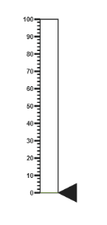
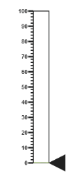
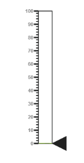
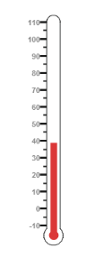

# Getting Started

This section briefly explains on how to create a Linear Gauge control for your application.

* The ASP.NET Core 1.0 Linear Gauge provides support to display the Linear Gauge within your web page and allows you to customize it. This section encompasses the details on how to configure Linear Gauge. 
* You will learn how to provide data for a Linear Gauge and display data in the required way. In addition, you will learn how to customize the default Linear Gauge appearance for your requirements.

### Create a Linear Gauge

ASP.NET Core Linear Gauge widget basically renders with flexible APIs. You can easily create the Linear Gauge widget by the following steps.

1. First create an Core Project and add necessary Dll's and scripts with the help of the given [ASP.NET core 1.0-Getting Started](/aspnet-core/getting-started) Documentation.
2. Add the following code example to the corresponding view page to render Linear Gauge.

   ~~~ cshtml

   <ej-linear-gauge id="thermoLinear"></ej-linear-gauge>

   ~~~

3. Add the following code example in the Controller page.

   ~~~ csharp

   public IActionResult Default()

   {

      return View( );

   }

   ~~~

Run the above code example to get a default Linear Gauge with default values as follows.

### Set Height and Width values

Basic attributes of each canvas elements are height and width. You can set the height and width of the gauge using the following code example. It sets the height and width of the canvas image where the thermometer is to be rendered.



    <ej-linear-gauge id="thermoLinear"
                     height="550"
                     width="500">
    </ej-linear-gauge>



Run the above code example and you will get the following gauge as similar to default. Here height and width of the canvas are set for given values.

### Set Animation option and Label Color

* You can draw the Thermometer with some Label color to display the measurement value. For example give the labelColor as “#8c8c8c”.
* Set the EnableAnimation property as false to avoid animation on the pointers.



    <ej-linear-gauge id="thermoLinear"
                     label-color="#8c8c8c"
                     enable-animation="false">
    </ej-linear-gauge>



Run the above code example and you will get the following gauge as the output.

### Provide Scale Values

* The scale must have the appearance of a thermometer. By giving ScaleType as Thermometer, you can render a thermometer design.
* Minimum temperature can go up to -10 and maximum temperature can rise up to 110, so you can give minimum scale value as -10 and maximum value as 110.
* Set the location values such as vertical and horizontal position of the thermometer and give the thermometer height as Length.
* You can give the Minor Interval value as 5 to get the exact temperature on the patient.



    <ej-linear-gauge id="thermoLinear">
        <e-linear-scale-collections>
            <e-linear-scales width="20" 
                             type="Thermometer" 
                             background-color="transparent"
                             minimum="-10"
                             maximum="110"
                             minor-interval-value="5"
                             length="335"
                             show-custom-labels="true">
             <e-border width="1"></e-border>                
                <e-linear-position x="50" y="18"></e-linear-position>
            </e-linear-scales>
        </e-linear-scale-collections>
    </ej-linear-gauge>



Run the above code example and you will get the following gauge as the output.

### Add Pointers

In Linear Gauge the two types of pointers available are: Marker pointer and Bar pointer.

* Marker pointer is displayed as a pointer device that shows the actual values. But for your thermometer there is no need for the marker pointer. So you can hide the marker pointer by giving opacity as 0. 
* Bar pointer acts as the mercury metal that shows the exact temperature of the patient. Set some of the basic properties of the Bar pointer such as Width, BarPointerDistanceFromScale, BarPointerValue and BarPointerBackgroundColor.



    <ej-linear-gauge id="thermoLinear">
        <e-linear-scale-collections>
            <e-linear-scales>            
                <e-marker-pointer-collections>
                    <e-marker-pointers marker-opacity="0"></e-marker-pointers>
                </e-marker-pointer-collections>
                <e-bar-pointer-collections>
                    <e-bar-pointers width="10" bar-pointerdistance-from-scale="0" bar-pointer-value="37" 
                                    bar-pointer-background-color="#DB3738">
                    </e-bar-pointers>
                </e-bar-pointer-collections>
            </e-linear-scales>
        </e-linear-scale-collections>
    </ej-linear-gauge>



Run the above code example to get the following gauge as your output.

Add Label Customization

* For thermometer, you can display the label value on two sides, to get temperature in different scales. For that you can add two label values in an array.
* To display the value around the scales, labels are used. You can customize the label placement, font (including its style and family) and its distance from scale.



<ej-linear-gauge id="thermoLinear">
        <e-linear-scale-collections>
            <e-linear-scales>
                <e-linear-label-collections>
                    <e-linear-labels placement="Near">
                        <e-font size="10px" font-family="Segoe UI" font-style="normal"></e-font>
                    </e-linear-labels>
                    <e-linear-labels placement="Far">
                        <e-distance-from-scale x="13"></e-distance-from-scale>
                    </e-linear-labels>
                </e-linear-label-collections>
            </e-linear-scales>
        </e-linear-scale-collections>
</ej-linear-gauge>



Run the above code example and you will get the following gauge as output.

### Add Tick Details

* Tick style has two values called major interval and minor interval. You can set major ticks width and height greater than Minor ticks. And you can give TickColor, for better visibility in light backgrounds.
* Here four tick details are used for both sides having minor and major ticks. To display the tick value add the following code example.



    <ej-linear-gauge id="thermoLinear">
        <e-linear-scale-collections>
            <e-linear-scales>
             
                <e-linear-tick-collections>

                    <e-linear-ticks type="MajorInterval" height="8" width="1" color="#8c8c8c">
                        <e-distance-from-scale y="4"></e-distance-from-scale>
                    </e-linear-ticks>
                    <e-linear-ticks type="MinorInterval" height="4" width="1" color="#8c8c8c">
                        <e-distance-from-scale y="4"></e-distance-from-scale>
                    </e-linear-ticks>
                    <e-linear-ticks type="MajorInterval" placement="Far" height="8" width="1" color="#8c8c8c">
                        <e-distance-from-scale y="4"></e-distance-from-scale>
                    </e-linear-ticks>
                    <e-linear-ticks type="MinorInterval" placement="Far" height="4" width="1" color="#8c8c8c">
                        <e-distance-from-scale y="4"></e-distance-from-scale>
                    </e-linear-ticks>

                </e-linear-tick-collections>

            </e-linear-scales>
        </e-linear-scale-collections>
    </ej-linear-gauge>



Run the above code example and you will get the following gauge as output.

### Add Custom Label Details

* Custom labels are used to specify the texts in the gauge.
* It can be customized through various properties.
* In order to show the custom labels, change the showIndicators property to True.
* Here you can use custom text to display three range descriptions.



    <ej-linear-gauge id="thermoLinear">
        <e-linear-scale-collections>
            <e-linear-scales>

                <e-custom-label-collections>
                    <e-custom-labels value="0 C" color="#666666">
                        <e-linear-position x="44" y="78"></e-linear-position>
                        <e-font font-family="Segoe UI" font-style="bold" size="12px"></e-font>
                    </e-custom-labels>
                    <e-custom-labels value="0 F" color="#666666">
                        <e-linear-position x="56" y="78"></e-linear-position>
                        <e-font font-family="Segoe UI" font-style="bold" size="12px"></e-font>
                    </e-custom-labels>
                    <e-custom-labels value="0 C" color="#666666">
                        <e-linear-position x="51" y="90"></e-linear-position>
                        <e-font font-family="Segoe UI" font-style="bold" size="13px"></e-font>
                    </e-custom-labels>
                </e-custom-label-collections>

            </e-linear-scales>
        </e-linear-scale-collections>
    </ej-linear-gauge>



Run the above code example to get the following gauge as output.

### Change Scale from Degree to Fahrenheit 

Add the function that converts the temperature in degree to Fahrenheit in the label, with an index value of 1.



<ej-linear-gauge id="thermoLinear"
                     draw-labels="DrawLabel">
</ej-linear-gauge>



Run the above code example and you will get the following gauge as output.

### Add Custom Label for Current Value

Add the function that displays the current temperature value in the custom label.



<ej-linear-gauge id="thermoLinear"
                     draw-custom-label="DrawCustomLabel">        
</ej-linear-gauge>



