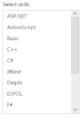

# Data-binding 

The ListBox is populated with the node information taken from a data source. The ListBox supports binding data sources containing hierarchical data and supports Object data, Remote data for retrieving data from a specified data source.

## Data fields and configuration 

The following sub-properties provides you a way to bind either the local or remote data to the ListBox control.

_Property Table for ASP.NET MVC ListBox_

<table>
<tr>
<th>
Name</th><th>
Description</th></tr>
<tr>
<td>
Datasource</td><td>
The data source contains the list of data for generating the ListBox items</td></tr>
<tr>
<td>
Query</td><td>
It specifies the query to retrieve the data from online server</td></tr>
<tr>
<td>
ListBoxFields</td><td>
It specifies the mapping fields for the data items of the ListBox</td></tr>
<tr>
<td>
ID</td><td>
It specifies the id of the tag</td></tr>
<tr>
<td>
Text</td><td>
It specifies the text content of the tag</td></tr>
<tr>
<td>
Value</td><td>
It specifies the value of the tag</td></tr>
<tr>
<td>
ImageUrl</td><td>
It’s defines the imageURL for the image location</td></tr>
<tr>
<td>
ImageAttributes</td><td>
It’s defines the image attributes such as height, width, styles and so on</td></tr>
<tr>
<td>
SpriteCssClass</td><td>
It defines the sprite CSS for the image tag.</td></tr>
<tr>
<td>
HtmlAttributes</td><td>
It defines the HTML attributes such as id, class, styles for the item</td></tr>
<tr>
<td>
Selected</td><td>
It defines the tag value to be selected initially</td></tr>
<tr>
<td>
ToolTipText</td><td>
It specifies the Tooltip text  of the tag</td></tr>
<tr>
<td>
Category</td><td>
It specifies the category of the tag</td></tr>
<tr>
<td>
TableName</td><td>
It defines the table name for tag value or display text while render with remote data</td></tr>
</table>

## Local data

ListBox provides data binding support. Thus, you can bind the data from JSON Data source. To achieve this, map the corresponding fields with their column names.

And also, provide support to add and customize the list item by using appropriate data fields. 

The following code explains you the details of data binding with ListBox. 

1. Add the below code in your page to render the ListBox with local data.

  
   
	// Add the following code in View page to configure ListBox control

<ej-list-box id="listboxsample" datasource="ViewBag.datasource">
    <e-list-box-fields id="empid" text="text"/>
</ej-list-box>  


   
   

   
	// Add the following code to add list items in the controller page
	   public class skillset
        {
            public string text { get; set; }
        }
        public ActionResult Localdata()
        {
            List<skillset> skill = new List<skillset>();
            skill.Add(new skillset { text = "ASP.NET" });
            skill.Add(new skillset { text = "ActionScript" });
            skill.Add(new skillset { text = "Basic" });
            skill.Add(new skillset { text = "C++" });
            skill.Add(new skillset { text = "C#" });
            skill.Add(new skillset { text = "dBase" });
            skill.Add(new skillset { text = "Delphi" });
            skill.Add(new skillset { text = "ESPOL" });
            skill.Add(new skillset { text = "F#" });
            skill.Add(new skillset { text = "FoxPro" });
            skill.Add(new skillset { text = "Java" });
            skill.Add(new skillset { text = "J#" });
            skill.Add(new skillset { text = "Lisp" });
            skill.Add(new skillset { text = "Logo" });
            skill.Add(new skillset { text = "PHP" });
            ViewBag.datasource = skill;
            return View();
        }


   
		
2. Output of the above steps

## Remote data 

You can bind the data for the ListBox from remote that can fetch the data from remote web service. You can pass the query string to filter the data that helps to avoid the extensive properties look up by using query options. 

The following steps explains you the details of data binding from remote. 

1. Add the below code in your page to render the ListBox with remote data

    

	// Add the following code in View page to configure ListBox widget

<ej-list-box id="customerList" query="ej.Query().from('Customers').take(10)">
    <e-datamanager url="//mvc.syncfusion.com/Services/Northwnd.svc/"></e-datamanager>
    <e-list-box-fields text="CustomerID" />
</ej-list-box>  

 
   

2. Output of the above steps.

