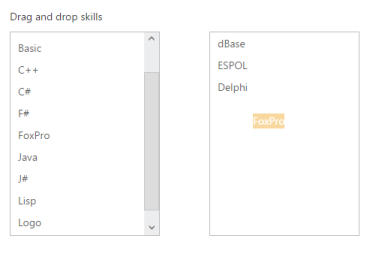

# Drag and Drop Support

ListBox widget provides the Drag and Drop support. A list item can be dragged from a ListBox control and can be dropped in any droppable element. To enable Drag and Drop support, set the allow-drag-and-drop property as true. In control, enable the allow-drag-and-drop property where you want to drop list Item.

The following steps explains you the behavior of Drag and drop  support with ListBox.

1. Add the below code in your page to render the ListBox

 

	// Add the following code in View page to configure ListBox widget 

    <ej-list-box id="list1" allow-drag-and-drop="true" datasource="ViewBag.datasource">
        <e-list-box-fields text="text" />
    </ej-list-box>

    <ej-list-box id="list2" allow-drag-and-drop="true"></ej-list-box>

		

   
   

		
	// Add the following code to add list items in the controller page  
	 public class skillset
        {
            public string text { get; set; }
        }
        public ActionResult Draganddrop()
        {
            List<skillset> skill = new List<skillset>();
            skill.Add(new skillset { text = "ASP.NET" });
            skill.Add(new skillset { text = "ActionScript" });
            skill.Add(new skillset { text = "Basic" });
            skill.Add(new skillset { text = "C++" });
            skill.Add(new skillset { text = "C#" });
            skill.Add(new skillset { text = "dBase" });
            skill.Add(new skillset { text = "Delphi" });
            skill.Add(new skillset { text = "ESPOL" });
            skill.Add(new skillset { text = "F#" });
            skill.Add(new skillset { text = "FoxPro" });
            skill.Add(new skillset { text = "Java" });
            skill.Add(new skillset { text = "J#" });
            skill.Add(new skillset { text = "Lisp" });
            skill.Add(new skillset { text = "Logo" });
            skill.Add(new skillset { text = "PHP" });
            ViewBag.datasource = skill;
            return View();
        }


   

2. Output of the above steps.

