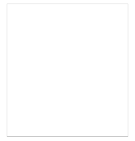
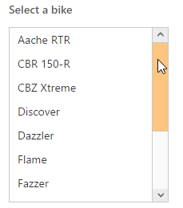
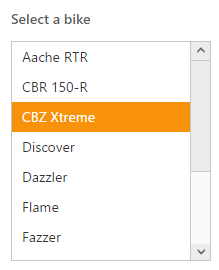

# Getting Started with ASP.NET Core ListBox

This section explains briefly on how to create a ListBox control in your ASP.NET Core application.

## Create your first ListBox

1. Refer the [Getting Started](https://help.syncfusion.com/aspnet-core/gettingstarted/getting-started-1-1-0) page of the Introduction part to know more about the basic system requirements and the steps to configure the Syncfusion components in an ASP.NET Core application.
2. Create your first Listbox by using the below mentioned code.

    
    
        <ej-list-box id="list1"></ej-list-box>

    

3. After executed the above code you can get the following output.

## Data binding

We can also populate data in the listbox using “datasource” and “e-list-box-fields” properties. To achieve this we need to create and assign Datasource to the Listbox as given below.

The following steps explain local data binding to an ListBox.

You need to add the class in the Models. Define the Class with key and text field. Then create a List of that class and add the data.

    

        public class Bikes
        {
            public string text { get; set; }
            public string empid { get; set; }
        }
        public static class BikesModal
        {
            public static List<Bikes> bike = new List<Bikes>();
            public static List<Bikes> setBikesDataSource()
            {
                bike.Add(new Bikes { empid = "bk1", text = "Aache RTR" });
                bike.Add(new Bikes { empid = "bk2", text = "CBR 150-R" });
                bike.Add(new Bikes { empid = "bk3", text = "CBZ Xtreme" });
                bike.Add(new Bikes { empid = "bk4", text = "Discover" });
                bike.Add(new Bikes { empid = "bk5", text = "Dazzler" });
                bike.Add(new Bikes { empid = "bk6", text = "Flame" });
                bike.Add(new Bikes { empid = "bk7", text = "Fazzer" });
                bike.Add(new Bikes { empid = "bk8", text = "FZ-S" });
                bike.Add(new Bikes { empid = "bk9", text = "Pulsar" });
                bike.Add(new Bikes { empid = "bk10", text = "Shine" });
                bike.Add(new Bikes { empid = "bk11", text = "R15" });
                bike.Add(new Bikes { empid = "bk12", text = "Unicorn" });
                return bike;
            }
        }

    

In the controller page, you need to pass the model class to the corresponding view.

    

            public ActionResult Index()
            {

            return View(BikesModal.setBikesDataSource());                
            }

    

In the View page, add Listbox helper and map the Local data list to corresponding DataSource and ListBoxFields. You need to refer the model class at the top of the page.    

    

        @model List<ApplicationName.Models.Bikes>
        

            

                Select a bike:
            

            <ej-list-box id="bikeList" datasource="Model">
                <e-list-box-fields id="empid" text="text" value="text" />
            </ej-list-box>
        

                
    

Run this code and you can get output like this

## Selection

The ListBox control supports item selection in different way. In this example we are selected the items by its index value using selected-index property.

    
            
            Select a bike:
            <ej-list-box id="bikeList" datasource="Model" selected-index="2">
                <e-list-box-fields id="empid" text="text" value="text" />
            </ej-list-box> 

    
 
 Your output will be as given below.

 
 