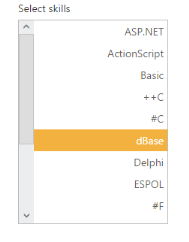

# RTL Support

This feature supports to change the left-to-right alignment of the ListBox widget to right-to-left (RTL). 

Defining the RTL property

The following steps explains you the configuration of enable-rtl properties in ListBox.

1. Add the below code in your page to render the ListBox with right to left alignment

 
   
	// Add the following code in View page to configure ListBox widget
	
 
	<h5 class="ctrllabel">
		Select a skill 
	</h5>  
<ej-list-box id="listboxsample" datasource="ViewBag.datasource" enable-rtl="true">
    <e-list-box-fields id="empid" text="text"/>
</ej-list-box>  

	

		
  
   
   


	// Add the following code to add list items in the controller page

	     public class skillset
        {
            public string text { get; set; }
        }
        public ActionResult Localdata()
        {
            List<skillset> skill = new List<skillset>();
            skill.Add(new skillset { text = "ASP.NET" });
            skill.Add(new skillset { text = "ActionScript" });
            skill.Add(new skillset { text = "Basic" });
            skill.Add(new skillset { text = "C++" });
            skill.Add(new skillset { text = "C#" });
            skill.Add(new skillset { text = "dBase" });
            skill.Add(new skillset { text = "Delphi" });
            skill.Add(new skillset { text = "ESPOL" });
            skill.Add(new skillset { text = "F#" });
            skill.Add(new skillset { text = "FoxPro" });
            skill.Add(new skillset { text = "Java" });
            skill.Add(new skillset { text = "J#" });
            skill.Add(new skillset { text = "Lisp" });
            skill.Add(new skillset { text = "Logo" });
            skill.Add(new skillset { text = "PHP" });
            ViewBag.datasource = skill;
            return View();
        }

   
   

2. Output of the above steps.

