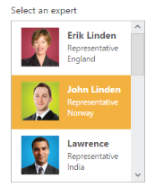

# Template Support

ListBox widget provides the template support, when binding the data for the ListBox. For this behavior, set the common syntax /element in template property. You can add any HTML mark-up element inside the ListBox using this property.

The following steps explains you the behavior of template support with ListBox.

1. Add the below code in your view page to render the ListBox

   N> Images for this sample are available in ‘installed location/images/Employee’

  

	// Add the following code in View page to configure ListBox widget
    

        

            Select an expert :
        

        <ej-list-box id="selectExperts" datasource="ViewBag.datasource" template="&lt;img class='eimg' src='../images/Employee/${eimg}.png' alt='employee' height='50px' width='50px'/>
 ${text} 

 ${desig} 

 ${country} 
"></ej-list-box>        
    

}
	
 
   
   

   
	// Add the following code to add list items in the controller page 
	 public partial class ListBoxController : Controller
    {
        public class EmployeeSpecialists
        {
            public string text { get; set; }
            public string eimg { get; set; }
            public string desig { get; set; }
            public string country { get; set; }
        }
        // GET: /Template/
        List<EmployeeSpecialists> empl = new List<EmployeeSpecialists>();
        public ActionResult Template()
        {
            empl.Add(new EmployeeSpecialists { text = "Erik Linden", eimg = "3", desig = "Representative", country = "England" });
            empl.Add(new EmployeeSpecialists { text = "John Linden", eimg = "6", desig = "Representative", country = "Norway" });
            empl.Add(new EmployeeSpecialists { text = "Louis", eimg = "7", desig = "Representative", country = "Australia" });
            empl.Add(new EmployeeSpecialists { text = "Lawrence", eimg = "8", desig = "Representative", country = "India" });
            ViewBag.datasource = empl;
            return View();
        }

    }

 
   

2. Customize the template in CSS. 

   

	

  
   

3. Output of the above steps.

