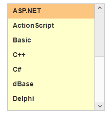

# Theme

ListBox control’s style and appearance can be controlled based on CSS classes. In order to apply styles to the ListBox control, you can refer to two files namely, ej.widgets.core.min.css and ej.theme.min.css. When you refer to the file ej.widgets.all.min.css, it is not necessary to include the files ej.widgets.core.min.css and ej.theme.min.css in your project, as ej.widgets.all.min.css is the combination of these two. 

By default, there are 12 themes support available for ListBox control namely,

* default-theme
* flat-azure-dark
* fat-lime
* flat-lime-dark
* flat-saffron
* flat-saffron-dark
* gradient-azure
* gradient-azure-dark
* gradient-lime
* gradient-lime-dark
* gradient-saffron
* gradient-saffron-dark

Please find the below screenshot for different theming.

## Custom class with ListBox 

CSS class can be used to customize the ListBox control appearance. Define a CSS class as per your requirement and assign the class name to css-class property. The data type of css-class property is string. 

### Configuring the Custom CSS property

The following steps explains you the configuration of css-class properties in ListBox.

1. Add the below code in your view page to render the ListBox with custom CSS class.

  
		
	// Add the following code in View page to configure ListBox widget

<ej-list-box id="listboxsample" datasource="ViewBag.datasource" css-class="customclass">
    <e-list-box-fields id="empid" text="text"/>
</ej-list-box>  


   
   
  
   
	// Add the following code to add list items in the controller page
	   public class skillset
        {
            public string text { get; set; }
        }
        public ActionResult Localdata()
        {
            List<skillset> skill = new List<skillset>();
            skill.Add(new skillset { text = "ASP.NET" });
            skill.Add(new skillset { text = "ActionScript" });
            skill.Add(new skillset { text = "Basic" });
            skill.Add(new skillset { text = "C++" });
            skill.Add(new skillset { text = "C#" });
            skill.Add(new skillset { text = "dBase" });
            skill.Add(new skillset { text = "Delphi" });
            skill.Add(new skillset { text = "ESPOL" });
            skill.Add(new skillset { text = "F#" });
            skill.Add(new skillset { text = "FoxPro" });
            skill.Add(new skillset { text = "Java" });
            skill.Add(new skillset { text = "J#" });
            skill.Add(new skillset { text = "Lisp" });
            skill.Add(new skillset { text = "Logo" });
            skill.Add(new skillset { text = "PHP" });
            ViewBag.datasource = skill;
            return View();
        }



2. Configure the CSS styles to apply on ListBox.

  

	

   

3. Output of the above steps.

