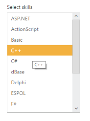

# Tooltip Support

The following steps explains you the configuration of Tooltip properties in ListBox.

1. Add the below code in your page to render the ListBox with tooltip

  
   
	// Add the following code in View page to configure ListBox widget
	

		<h5 class="ctrllabel">
			Select a skills 
		</h5> 
<ej-list-box id="Listboxsample" datasource="ViewBag.datasource" height="250px">
    <e-list-box-fields text="text" tooltip-text="tooltip" />
</ej-list-box> 
	


   
   
  
   
	// Add the following code to add list items in the controller page
	     public class skillset
        {
            public string text { get; set; }
            public string tooltip { get; set; }
        }
        public ActionResult Tooltip()
        {
            List<skillset> skill = new List<skillset>();
            skill.Add(new skillset { text = "ASP.NET", tooltip = "ASP.NET" });
            skill.Add(new skillset { text = "ActionScript", tooltip = "ActionScript" });
            skill.Add(new skillset { text = "Basic", tooltip = "Basic" });
            skill.Add(new skillset { text = "C++", tooltip = "C++" });
            skill.Add(new skillset { text = "C#", tooltip = "C#" });
            skill.Add(new skillset { text = "dBase", tooltip = "dBase" });
            skill.Add(new skillset { text = "Delphi", tooltip = "Delphi" });
            skill.Add(new skillset { text = "ESPOL", tooltip = "ESPOL" });
            skill.Add(new skillset { text = "F#", tooltip = "F#" });
            skill.Add(new skillset { text = "FoxPro", tooltip = "FoxPro" });
            skill.Add(new skillset { text = "Java", tooltip = "Java" });
            skill.Add(new skillset { text = "J#", tooltip = "J#" });
            skill.Add(new skillset { text = "Lisp", tooltip = "Lisp" });
            skill.Add(new skillset { text = "Logo", tooltip = "Logo" });
            skill.Add(new skillset { text = "PHP", tooltip = "PHP" });
            ViewBag.datasource = skill;
            return View();
        }


   

2. Output of the above steps.

  