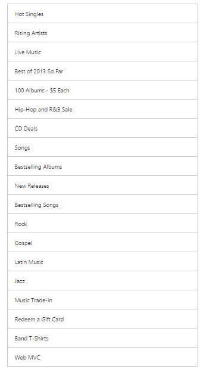

# Data Binding

## Local Data Binding

Essential Studio WebJS ListView provides support for Data Binding. Data Binding provides a simple and consistent way for applications to present and interact with data. Elements can be bounded to data from a variety of data sources. In local data binding, the data source is written inside the program. Then it is handled by the ListView control. DataSource is used to get the data source that holds the list items.

Please refer the following code examples.

For ASP.NET Core  Wrapper example, you need to create model file for data-binding. Add the following model code to a CS file and save it as ListLocalData.cs.



public class ListLocalData

{

	public string text { get; set; }

}  

public static class ListLocalDataModal

{

	public static List<ListLocalData> listSource = new List<ListLocalData>();      

	public static List<ListLocalData> setListSource()

	{

		listSource.Add(new ListLocalData { text = "Hot Singles"});

		listSource.Add(new ListLocalData { text = "Rising Artists"});

		listSource.Add(new ListLocalData { text = "Live Music"});

		listSource.Add(new ListLocalData { text = "Best of 2013 So Far"});

		listSource.Add(new ListLocalData { text = "100 Albums - $5 Each"});

		listSource.Add(new ListLocalData { text = "Hip-Hop and R&B Sale"});

		listSource.Add(new ListLocalData { text = "CD Deals"});

		listSource.Add(new ListLocalData { text = "Songs"});

		listSource.Add(new ListLocalData { text = "Bestselling Albums"});

		listSource.Add(new ListLocalData { text = "New Releases"});

		listSource.Add(new ListLocalData { text = "Bestselling Songs"});

		listSource.Add(new ListLocalData { text = "Rock"});

		listSource.Add(new ListLocalData { text = "Gospel" });

		listSource.Add(new ListLocalData { text = "Jazz"});

		listSource.Add(new ListLocalData { text = "Music Trade-In"});

		listSource.Add(new ListLocalData { text = "Redeem a Gift Card"});

		listSource.Add(new ListLocalData { text = "Band T-Shirts"});

		listSource.Add(new ListLocalData { text = "Mobile MVC"});

		return listSource;

	}

	public static void clearSource()

	{

		listSource.Clear();

	}       

}



You have to modify the controller as the model is added to the sample. You can modify the controller as follows.



public ActionResult LocalDataBinding()

{

	ListLocalDataModal.clearSource();

	return View(ListLocalDataModal.setListSource());

}



You can use the following code example to give you the exact output.



@model List<ListLocalData>

@{

    <ej-list-view  id="localListView" width="400" datasource="Model"></ej-list-view>

}



### Screenshot:

Local Data Binding
{:.caption}

