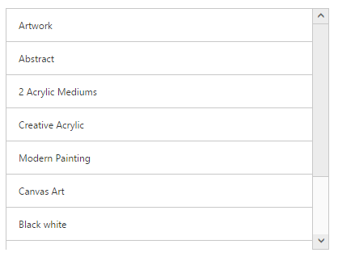

# Dimensions

To customize the ListView dimensions, width and height properties are used.

Refer to the following code examples.



    <ej-list-view id="checklist" width="600" height="300">
    <e-list-view-items>
        <e-list-view-item text="Artwork"></e-list-view-item>
        <e-list-view-item text="Abstract"></e-list-view-item>
        <e-list-view-item text="2 Acrylic Mediums"></e-list-view-item>
        <e-list-view-item text="Creative Acrylic"></e-list-view-item>
        <e-list-view-item text="Canvas Art"></e-list-view-item>
        <e-list-view-item text="Black white"></e-list-view-item>
        <e-list-view-item text="Children"></e-list-view-item>
        <e-list-view-item text="Preschool Crafts"></e-list-view-item>
        <e-list-view-item text="School-age Crafts"></e-list-view-item>
    </e-list-view-items>
</ej-list-view>   



### Screenshot:

Height
{:.caption}