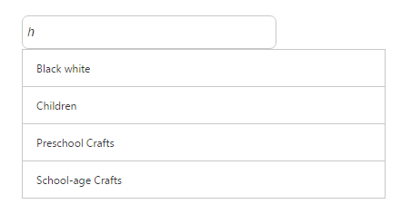

# Filtering

Filtering is one of the key features of ListView control. The Filtering option is added into the ListView control when the enable-filtering property is set to “true”. This enables a simple interface to filter items from a large collection of ListView items.

Refer the following code examples.

 

<ej-list-view id="prevent" width="400" enable-filtering="true">
    <e-list-view-items>
        <e-list-view-item text="Artwork"></e-list-view-item>
        <e-list-view-item text="Abstract"></e-list-view-item>
        <e-list-view-item text="2 Acrylic Mediums"></e-list-view-item>
        <e-list-view-item text="Creative Acrylic"></e-list-view-item>
        <e-list-view-item text="Modern Painting"></e-list-view-item>
        <e-list-view-item text="Canvas Art"></e-list-view-item>
        <e-list-view-item text="Black white"></e-list-view-item>
        <e-list-view-item text="Children"></e-list-view-item>
        <e-list-view-item text="Preschool Crafts"></e-list-view-item>
        <e-list-view-item text="School-age Crafts"></e-list-view-item>
    </e-list-view-items>
</ej-list-view>  



### Screenshot:

Enable Filtering
{:.caption}

Enable Filtering
{:.caption}
