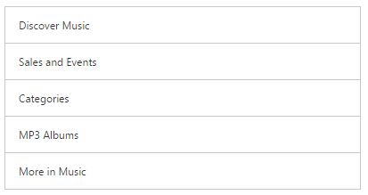
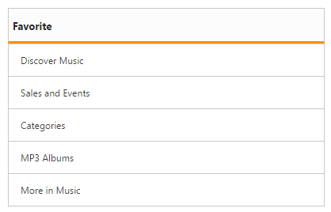

# Getting Started

This control allows you to select an item from a list-like interface and provides the infrastructure to display a set of data items in different layouts or views. It also has ajax loading support, from this you can load data from the cache when once the initial data loaded successfully. This section explains briefly on how to create a ListView control in your ASP.NET Core application.
 
## Create a simple ListView

1.	Refer the [Getting Started]( https://help.syncfusion.com/aspnet-core/getting-started ) page of the Introduction part to know more about the basic system requirements and the steps to configure the Syncfusion components in an ASP.NET Core application.
2.	Add the following code example to the corresponding view page for ListView rendering.

The following steps explain local data binding to an ListView.

You need to add the class in the Models. Define the Class with key and text field. Then create a List of that class and add the data.

    

        public class ListData
        {
            public string texts { get; set; }
        }
        public static class ListDataModal
        {
            public static List<ListData> listTempSource = new List<ListData>();
            public static List<ListData> setListDataSource()
            {
                listTempSource.Add(new ListData { texts = "Inbox" });
                listTempSource.Add(new ListData { texts = "VIP" });
                listTempSource.Add(new ListData { texts = "Drafts" });
                listTempSource.Add(new ListData { texts = "Sent" });
                listTempSource.Add(new ListData { texts = "Junk" });
                listTempSource.Add(new ListData { texts = "Trash" });
                listTempSource.Add(new ListData { texts = "All mails" });
                listTempSource.Add(new ListData { texts = "Mail" });
                return listTempSource;
            }
        }

    

In the controller page, you need to pass the model class to the corresponding view.

    

            public ActionResult Index()
            {
            
                return View(ListDataModal.setListDataSource());             
            }

    

In the View page, add Listview helper and map the Local data list to corresponding DataSource and ListviewFields. You need to refer the model class at the top of the page.

    

        @model List<ApplicationName.Models.ListData>
        <ej-list-view id="locallistview" show-header="false" width="400" height="206" datasource="Model">
            <e-field-settings text="texts" />
        </ej-list-view>

    
            
Run the above code then you will get output as follows.
        

         
 ## Header support

You can add a header for ListView using show-header property. Refer the following code to render ListView with header text.

    

        @model List<ApplicationName.Models.ListData>
        <ej-list-view id="locallistview"  show-header="true" header-title="Favorite" width="400" height="206" datasource="Model">
            <e-field-settings text="texts" />
        </ej-list-view>

    
 
 Run the above code and you will get the below output.
 
 
 