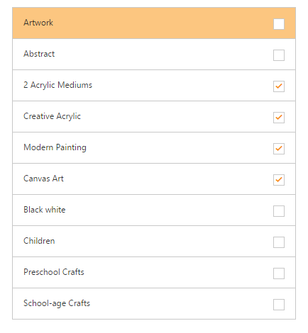
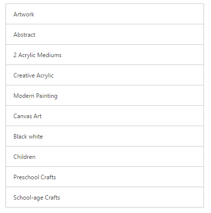

# Selection

## MultiSelection

ListView has a checklist feature that is used to select multiple list items at the same time in the ListView. For this, set enable-check-mark to “true”.

Refer the following code examples.



<ej-list-view id="checklist" enable-check-mark="true" width="400">
    <e-list-view-items>
        <e-list-view-item text="Artwork"></e-list-view-item>
        <e-list-view-item text="Abstract"></e-list-view-item>
        <e-list-view-item text="2 Acrylic Mediums"></e-list-view-item>
        <e-list-view-item text="Creative Acrylic"></e-list-view-item>
        <e-list-view-item text="Modern Painting"></e-list-view-item>
        <e-list-view-item text="Canvas Art"></e-list-view-item>
        <e-list-view-item text="Black white"></e-list-view-item>
        <e-list-view-item text="Children"></e-list-view-item>
        <e-list-view-item text="Preschool Crafts"></e-list-view-item>
        <e-list-view-item text="School-age Crafts"></e-list-view-item>
    </e-list-view-items>
</ej-list-view>   



### Screenshot:

Enable Check Mark
{:.caption}

## PreventSelection

When selecting a specific list item, it is highlighted with an active color. prevent-selection property is used to prevent this behavior by setting it to “true”. 

N> When the click or select action is completed, the highlight is undone automatically even when the property is set to “false”.

Refer the following code examples.



<ej-list-view id="prevent" prevent-selection="true" width="400">
    <e-list-view-items>
        <e-list-view-item text="Artwork"></e-list-view-item>
        <e-list-view-item text="Abstract"></e-list-view-item>
        <e-list-view-item text="2 Acrylic Mediums"></e-list-view-item>
        <e-list-view-item text="Creative Acrylic"></e-list-view-item>
        <e-list-view-item text="Modern Painting"></e-list-view-item>
        <e-list-view-item text="Canvas Art"></e-list-view-item>
        <e-list-view-item text="Black white"></e-list-view-item>
        <e-list-view-item text="Children"></e-list-view-item>
        <e-list-view-item text="Preschool Crafts"></e-list-view-item>
        <e-list-view-item text="School-age Crafts"></e-list-view-item>
    </e-list-view-items>
</ej-list-view>   



## PersistSelection

persist-selection property is used to highlight the selected item in the ListView control even after touch end happens. By default, the active state is removed once the touch end happens.

Refer the following code examples.



<ej-list-view id="persist" persist-selection="true" width="400">
    <e-list-view-items>
        <e-list-view-item text="Artwork"></e-list-view-item>
        <e-list-view-item text="Abstract"></e-list-view-item>
        <e-list-view-item text="2 Acrylic Mediums"></e-list-view-item>
        <e-list-view-item text="Creative Acrylic"></e-list-view-item>
        <e-list-view-item text="Modern Painting"></e-list-view-item>
        <e-list-view-item text="Canvas Art"></e-list-view-item>
        <e-list-view-item text="Black white"></e-list-view-item>
        <e-list-view-item text="Children"></e-list-view-item>
        <e-list-view-item text="Preschool Crafts"></e-list-view-item>
        <e-list-view-item text="School-age Crafts"></e-list-view-item>
    </e-list-view-items>
</ej-list-view>   



### Screenshot:

Persist Selection
{:.caption}
