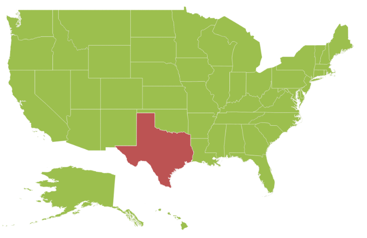
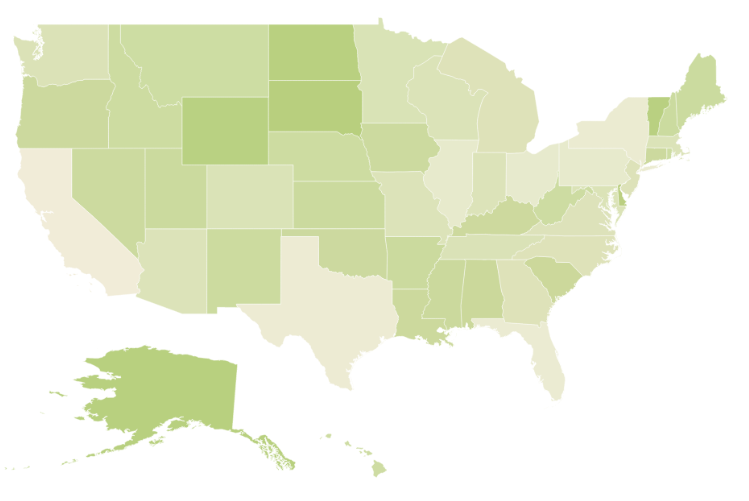
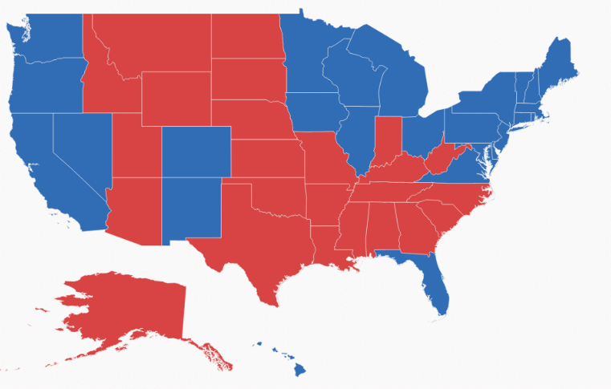
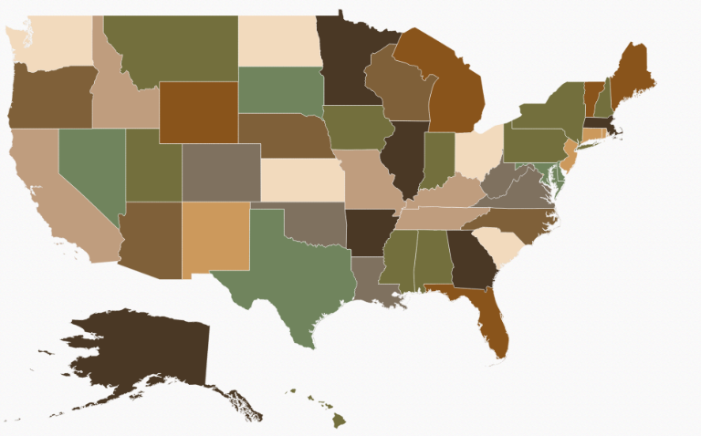
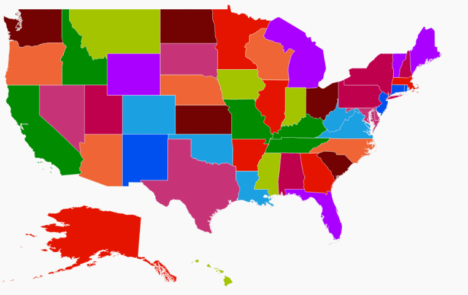
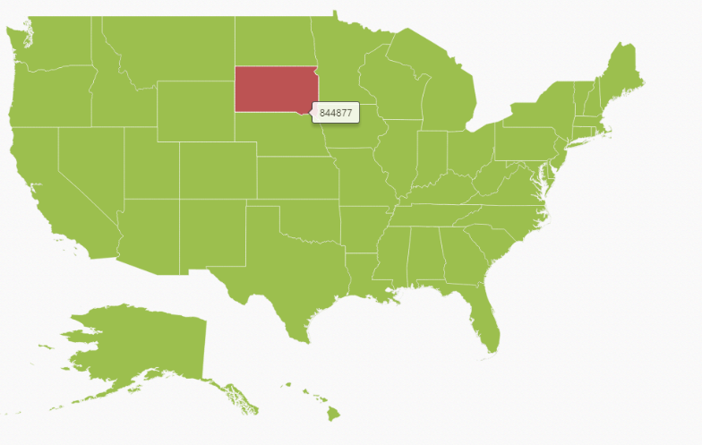
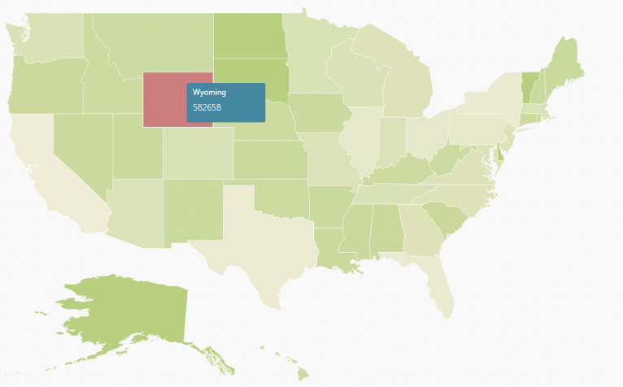

# Customization

Maps control supports color customization to determine the exact combination of colors for shapes displayed in Maps and tooltip support to display additional information of shape data.

## Shapes Color Customization

The Map control highly supports the customization of the shape’s color. The shape’s color can be customized using the following ways:

* Using the `fill`, `stroke` and `strokeThickness` properties.
* Color Mapping support.
* Color Palette support.

### Shape Settings 

The `shape-settings` defines the basic customization settings of shapes in the map. 

The important property that makes an impact on shape colors is `Autofill`. This `Autofill` property is available in the `shapeSettings`. 

* `fill` - It is used to set the fill color of the shapes in the map.
* `stroke` - It is used to set the border color of the shape in the map.
* `strokeThickness` - It is used to set the border thickness of the shape in the map.
* `HighlightColor` - It is used to set the mouse hover color for shapes in the map.
* `HighlightBorderWidth` - It is used to set the mouse hover border width for shapes in the map.
* `SelectionColor` - It is used to set the selection color for shapes in the map.

The above properties of `ShapeSettings` are applied only when `Autofill` property value is false. By map, `Autofill` property value is false.



<ej-map id="maps">
<e-layers >
<e-layer  shape-data-path="mapData" enable-mouse-hover="true" >
<e-shape-settings  highlight-color="#BC5353" stroke-thickness="0.5"
stroke="white" highlight-stroke="white" fill="#9CBF4E"
highlight-border-width="1">
</e-shape-settings>
</e-layer>
</e-layers>
</ej-map>



## Color Mapping

The color Mapping support enables the customization of shape colors based on the underlying value of shape received from bounded data.

* `color-value-path` - It renders the field value that is to be fetched from data for each shape used for determining the shape color.

* `value-path` - It renders the field value that is to be fetched from data for each shape. This support also provides a tree map-like impact on the map UI. The various types of color Mapping supported in maps are listed as follows.

* `range-color-mapping` - It is used to differentiate the shape’s fill based on its underlying value and color ranges. The properties of Range color mapping are listed in the following table.

_Property Table_

<table>
<tr>
<th>
Property</th><th>
Type</th><th>
Description</th></tr>
<tr>
<td>
From</td><td>
Double</td><td>
Gets or sets start value</td></tr>
<tr>
<td>
To</td><td>
Double</td><td>
Gets or sets end value</td></tr>
<tr>
<td>
color</td><td>
color</td><td>
Gets or sets the colors to be applied for specific range value containing shapes when EnableGradient property value is false.</td></tr>
<tr>
<td>
Label</td><td>
String</td><td>
Gets or sets the label for legend when Mode property value is ‘default’.</td></tr>
<tr>
<td>
GradientColors</td><td>
Array</td><td>
Gets or sets the start point and end point gradient colors to be applied for specific range value containing shapes when EnableGradient property value is set to true.</td></tr>
</table>



<ej-map id="maps">
<e-layers >
<e-layer shape-data-path="name" shape-property-path="name" shape-data="ViewBag.shapeData"
datasource="ViewBag.datasource" show-map-items="false" enable-selection="false" enable-mouse-hover="true">
<e-shape-settings   stroke="white" fill="#9CBF4E" value-path="population" enable-gradient="true"
stroke-thickness="0.5" highlight-stroke="white" highlight-color="#BC5353" highlight-border-width="1">
</e-shape-settings>             
</e-layer>
</e-layers>
</ej-map>           

   

	


When the underlying object value is 700000, then the fill color of the corresponding shape is set between #9CBF4E and #B8CE7B. 

When the underlying value is below any of the given sorted range or above the sorted range, then the fill is set from fill.

* `EqualColorMapping` - The Equal color mapping is used to differentiate the shape’s fill based on its underlying Value and color. The properties of Equal color mapping is listed in the following table.

<table>
<tr>
<th>
Property</th><th>
Type</th><th>
Description</th></tr>
<tr>
<td>
Value</td><td>
String</td><td>
Gets or sets the value.</td></tr>
<tr>
<td>
color</td><td>
String</td><td>
Gets or sets the color for mapping.</td></tr>
</table>

In Equal color mapping, value property contains the values of the field set in `colorValuePath` property of shape settings.

Here “MapController.cs” is populated with data of USA Election in “MapController.cs” to provide election data as input datasource.





	public ActionResult Map()
	{

		ViewBag.datasource = GetElectionResults();
		return View();
	}         
	
	public List<ElectionData> GetElectionResults()
	{            
  
		List<ElectionData> electionResults = new List<ElectionData>
		{new ElectionData {State = "Alabama", Candidate = "Romney", Electors = 9 },
		new ElectionData { State = "Alaska", Candidate = "Romney", Electors = 3 }, 
		new ElectionData { State = "Arizona", Candidate = "Romney", Electors = 11 }, 
		new ElectionData { State = "Arkansas", Candidate = "Romney", Electors = 6 }, 
		new ElectionData { State = "California", Candidate = "Obama", Electors = 55}, 
		new ElectionData { State = "Colorado", Candidate = "Obama", Electors = 9 },           
		new ElectionData { State = "Connecticut", Candidate = "Obama", Electors = 7 }, 
		new ElectionData { State = "Delaware", Candidate = "Obama", Electors = 3 },           
		new ElectionData { State = "District of Columbia", Candidate = "Obama", Electors = 3 },           
		new ElectionData { State = "Florida", Candidate = "Obama", Electors = 29 },           
		new ElectionData { State = "Georgia", Candidate = "Romney", Electors = 16 },           
		new ElectionData { State = "Hawaii", Candidate = "Obama", Electors = 4 },           
		new ElectionData { State = "Idaho", Candidate = "Romney", Electors = 4 },           
		new ElectionData { State = "Illinois", Candidate = "Obama", Electors = 20 },           
		new ElectionData { State = "Indiana", Candidate = "Romney", Electors = 11 },           
		new ElectionData { State = "Iowa", Candidate = "Obama", Electors = 6 },           
		new ElectionData { State = "Kansas", Candidate = "Romney", Electors = 6 },           
		new ElectionData { State = "Kentucky", Candidate = "Romney", Electors = 8 },           
		new ElectionData { State = "Louisiana", Candidate = "Romney", Electors = 8 },           
		new ElectionData { State = "Maine", Candidate = "Obama", Electors = 4 },           
		new ElectionData { State = "Maryland", Candidate = "Obama", Electors = 10 },           
		new ElectionData { State = "Massachusetts", Candidate = "Obama", Electors = 11},           
		new ElectionData { State = "Michigan", Candidate = "Obama", Electors = 16 },           
		new ElectionData { State = "Minnesota", Candidate = "Obama", Electors = 10 },           
		new ElectionData { State = "Mississippi", Candidate = "Romney", Electors = 6},           
		new ElectionData { State = "Missouri", Candidate = "Romney", Electors = 10 },           
		new ElectionData { State = "Montana", Candidate = "Romney", Electors = 3 },           
		new ElectionData { State = "Nebraska", Candidate = "Romney", Electors = 5 },           
		new ElectionData { State = "Nevada", Candidate = "Obama", Electors = 6 },           
		new ElectionData { State = "New Hampshire", Candidate = "Obama", Electors = 4},           
		new ElectionData { State = "New Jersey", Candidate = "Obama", Electors = 14 },           
		new ElectionData { State = "New Mexico", Candidate = "Obama", Electors = 5 },           
		new ElectionData { State = "New York", Candidate = "Obama", Electors = 29 },           
		new ElectionData { State = "North Carolina", Candidate = "Romney", Electors = 15 },           
		new ElectionData { State = "North Dakota", Candidate = "Romney", Electors = 3},           
		new ElectionData { State = "Ohio", Candidate = "Obama", Electors = 18 },           
		new ElectionData { State = "Oklahoma", Candidate = "Romney", Electors = 7 },           
		new ElectionData { State = "Oregon", Candidate = "Obama", Electors = 7 },           
		new ElectionData { State = "Pennsylvania", Candidate = "Obama", Electors = 20},           
		new ElectionData { State = "Rhode Island", Candidate = "Obama", Electors = 4},           
		new ElectionData { State = "South Carolina", Candidate = "Romney", Electors = 9 },           
		new ElectionData { State = "South Dakota", Candidate = "Romney", Electors = 3},           
		new ElectionData { State = "Tennessee", Candidate = "Romney", Electors = 11 },           
		new ElectionData { State = "Texas", Candidate = "Romney", Electors = 38 },           
		new ElectionData { State = "Utah", Candidate = "Romney", Electors = 6 },           
		new ElectionData { State = "Vermont", Candidate = "Obama", Electors = 3 },           
		new ElectionData { State = "Virginia", Candidate = "Obama", Electors = 13 },           
		new ElectionData { State = "Washington", Candidate = "Obama", Electors = 12 },           
		new ElectionData { State = "West Virginia", Candidate = "Romney", Electors = 5},           
		new ElectionData { State = "Wisconsin", Candidate = "Obama", Electors = 10 },           
		new ElectionData { State = "Wyoming", Candidate = "Romney", Electors = 3 }};            
		return electionResults; 
	}

	public class ElectionData
	{
		private string state;
		public string State
		{
			get { return state; }
			set { state = value; }
		}
		public string candidate;
		public string Candidate 
		{            
			get { return candidate; }
			set { candidate = value; }
		}        
		private double electors;
		public double Electors
		{
			get { return electors; }
			set { electors = value; }
		}
	} 




<ej-map id="maps">
<e-layers >
<e-layer shape-data-path="state" shape-property-path="name" shape-data="ViewBag.shapeData"
datasource="ViewBag.datasource" show-map-items="false" enable-selection="false" enable-mouse-hover="true">
<e-shape-settings   stroke="white" fill="#9CBF4E" value-path="electors" enable-gradient="true" 
color-value-path="candidate" stroke-thickness="0.5" highlight-stroke="white" highlight-color="#BC5353" highlight-border-width="1">
</e-shape-settings>             
</e-layer>
</e-layers>
</ej-map>           

   

	



 

## colorPalette

### Autofill

When `Autofill` property is set to true, shapes are filled with default colors from built-in palettes or custom palette.



<ej-map id="maps">
<e-layers >
<e-layer  shape-data="ViewBag.shapeData">
<e-shape-settings   auto-fill="true" stroke-thickness="0.5" stroke="white">
</e-shape-settings>             
</e-layer>
</e-layers>
</ej-map>      
	


### colorPalette

The `colorPalette` property determines whether the auto fill colors are fetched from built-in color palettes or custom palette.

The `colorPalette` property can be set with Palette1, Palette2, Palette3 and CustomPalette values where Palette1, Palette2 and Palette3 are built-in color palettes and default value for this property is “Palette1”.

The `CustomPalette` property is used to set an array of colors to be auto filled in shapes.

This property is enabled only when `colorPalette` property value is set to “CustomPalette”.




<ej-map id="maps">
<e-layers >
<e-layer >
<e-shape-settings   auto-fill="true" color-palette="@ColorPalette.CustomPalette" custom-palette="ViewBag.customPalette">
</e-shape-settings>             
</e-layer>
</e-layers>
</ej-map>  

 
	


	public ActionResult Map()
	{
List<string> colorArray = new List<string>

	  			{

		  			"#E51400", "#A4C400", "#730202",

		  			"#008B00", "#EF6535",

		  			"#1BA0E2", "#C63477", "#0050EF",

		  			"#BF004D", "#AA00FF"

	  			});
		ViewBag.customPalette  = colorArray;
		return View();
	} 	
	  		




## Tooltip

The tooltip is displayed only when you set `ShowTooltip` to “True” in the shape layers. By default, it takes the property of the bound object that is referred in the `ValuePath` and displays its content on hovering the corresponding shape. 



<ej-map id="maps">
<e-layers >
<e-layer show-tooltip="true">
<e-shape-settings  value-path="name">
</e-shape-settings>             
</e-layer>
</e-layers>
</ej-map>  



### Tooltip Template

The `ToolTipTemplate` property is used for customizing the template for tooltip.



<ej-map id="maps">
<e-layers >
<e-layer show-tooltip="true" shape-data="ViewBag.mapData" tooltip-template="myTooltip">
<e-shape-settings  value-path="name">
</e-shape-settings>             
</e-layer>
</e-layers>
</ej-map>  

		

 			

	 			

		 			<label style="margin-top:-20px;font-weight:normal;font-size:12px;color:white;font-family:Segoe UI;">{{:name}}</label>

	 			

	 			

	 			

		 			<label style="margin-top:-10px;font-weight:normal;font-size:14px;color:white;font-family:segoe ui light;">{{:population}}</label>

	 			

 			

		

	



The following screenshot illustrates a map control displaying a Tooltip with template.

