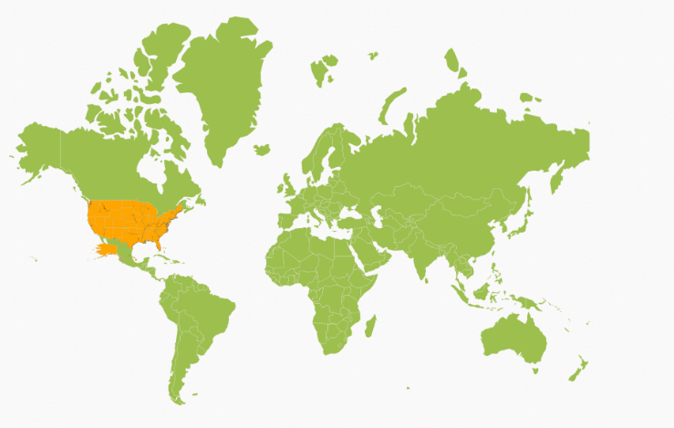

# Layers

Map is maintained through `layers` and it can accommodate one or more layers.

## Multilayer

The Multilayer support allows you to load multiple shape files in a single container, enabling maps to display more information.

### Adding Multiple Layers in the Map 

The shape layers is the core layer of the map. The multiple layers can be added in the shape Layers as `sub-shape-file-layers` within the shape Layers.

## SubLayer

The subLayer is the collection of shape Layers. 

In this example, World Map shape is used as shape data by utilizing the `“WorldMap.json”` file in the following folder structure obtained from downloaded Maps_GeoJSON folder.

..\ Maps_GeoJSON\

Here “MapController.cs” is populated with data of World Map in “MapController.cs”.

~/Controller/MapController.cs



	public ActionResult Map()

	{

		ViewBag.worldMap = GetWorldMap();
        return View();
	}

	public object GetWorldMap ()

	{

		string data = System.IO.File.ReadAllText(Server.MapPath("~/App_Data/WorldMap.json"));

		JavaScriptSerializer serialObj = new JavaScriptSerializer();

		serialObj.MaxJsonLength = int.MaxValue;

		return new MapData(data);
	}



Refer both USA data and world map data as illustrated in the following “Map.cshtml”.



<ej-map id="maps">
<e-layers >
<e-layer shape-data="ViewBag.worldMap" >
<e-shape-settings   stroke="white" fill="#9CBF4E"
stroke-thickness="0.5" >
</e-shape-settings>
</e-layer>
</e-layers>
</ej-map>



