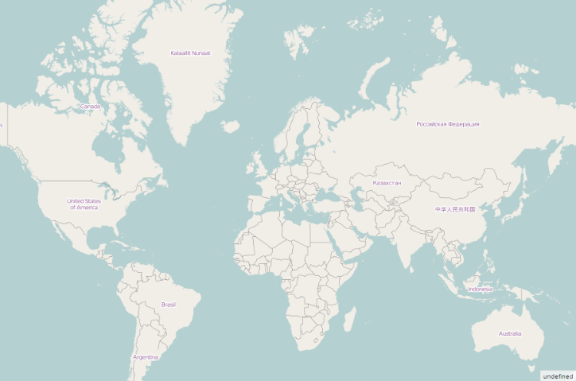

# Map Providers

Map control support map providers such as OpenStreetMap that can be added to any layers in maps.

## Open Street Map

OpenStreetMap is a map of the entire world. The OpenStreetMap allows you to view, edit and use geographical data in a collaborative way from any place on the Earth.

### Enable OSM

You can enable this feature by setting the `layer-type` property value as "OSM".



<ej-map id="maps">
<e-layers >
<e-layer  layer-type="@LayerType.OSM" 
url-template="http://a.tile.openstreetmap.org/level/tileX/tileY.png">
</e-layer>
</e-layers>
</ej-map>



### URL Template

The `url-template` property determines the format of tile map. You can specify the template for the tile layer. 

## Bing Map

Bing Map is a key feature in accessing the external geospatial imagery services for deep-zoom satellite view. 

### Enable Bing Maps

You can enable this feature by defining the `layer-type` as “Bing”.



<ej-map id="maps">
<e-layers >
<e-layer  layer-type="@LayerType.Bing" 
key="// ...bingMapKey">
</e-layer>
</e-layers>
</ej-map>



### Key

The bing Map Key is provided as input to this `key` property. The Bing Map key can be obtained from [http://www.microsoft.com/maps/create-a-bing-maps-key.aspx](http://www.microsoft.com/maps/create-a-bing-maps-key.aspx). 

