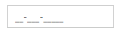
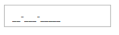
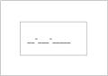
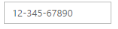
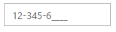
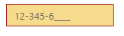
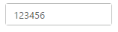
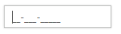

# Behavior Settings

## Persistence Support

MaskEditTextBox provides state maintenance support. You can maintain the previous changes made in the control after a page loads.

### Configure Persistence Support 

In the View page add MaskEditTextBox helper, and configure the EnablePersistence property as follows.



	<ej-mask-edit id="mask" mask-format="99-999-99999" enable-persistence="true" />



Output of MaskEditTextBox with EnablePersistence is as follows. 

MaskEditTextBox at initial load
{:.caption}

MaskEditTextBox after changing the value and after page refresh
{:.caption}

## Enabled or Disabled

MaskEditTextBox has an option to enable or disable its element. You can set the Enabled property as “false” to enable the Textbox controls.

### Configure Enabled or Disabled 

In the View page add MaskEditTextBox helper, and configure the Enabled property.



	<ej-mask-edit id="mask" mask-format="99-999-99999" enabled="false" />



Output when Enabled is “true” and when Enabled is “false”.

Textboxes with enabled as true
{:.caption}

Textboxes with enabled as false
{:.caption}

## Adjusting Textbox Size

MaskEditTextBox size can be modified by using the Height and Width properties. You can customize the size of Textbox by using these properties.

### Configure Height and Width 

MaskEditTextBox size can be modified by using the Height and Width properties. 



	<ej-mask-edit id="mask" mask-format="99-999-99999" width="100px" height="50px" />



Output of MaskEditTextBox after setting “Height” and “Width” is as follows.

MaskEditTextBox with height and width
{:.caption}

## Define Value

The value of MaskEditTextBox can be assigned by using the Value property. The default value for Value property is null. Specify the [name](https://help.syncfusion.com/api/js/ejmaskedit#members:name) attribute value for the mask edit textbox.
You can get the raw value of **MaskEdit** without literals and prompt characters by using the [get_StrippedValue](https://help.syncfusion.com/api/js/ejmaskedit#methods:get_strippedvalue) method.
Also you get the value of **MaskEdit** with the masked format by using the [get_UnstrippedValue](https://help.syncfusion.com/api/js/ejmaskedit#methods:get_unstrippedvalue) method.

### Configure Value

In the View page add MaskEditTextBox helper, and configure the Value property 



	<ej-mask-edit id="mask" mask-format="99-999-99999" value="1234567890" />



Output of MaskEditTextBox with the value property is as follows.

MaskEditTextBox with value
{:.caption}

## Read Only Support

MaskEditTextBox supports read only option. When you enable the ReadOnly property to the control, the value cannot be changed in the MaskEditTextBox. You can set the ReadOnly property as “true” to enable this option.

### Configure Read Only

In the View page add MaskEditTextBox helper, and configure the ReadOnly property.



	<ej-mask-edit id="mask" mask-format="99-999-99999" value="123456" read-only="true" />



Output of MaskEditTextBox when ReadOnly is “true” is as follows. MaskEditTextBox values cannot be edited or changed.

MaskEditTextBox with readOnly 
{:.caption}

## Error Visibility

The MaskEditTextBox has an option that shows the error value with red colored text. It is used to validate the Mask Edit value. You can set the ShowError property as “true” to enable this option.

### Configure Error Visibility

In the View page use the corresponding Textbox helper for rendering Textbox controls. 



	@* Add the following code in your view page to render Textbox controls.*@

	<ej-mask-edit id="mask" mask-format="99-999-99999" value="123456" show-error="true" />



Output for MaskEditTextBox when ShowError is “true” is as follows. 

Textbox with showError
{:.caption}

Textbox without error
{:.caption}

## Mask Edit Properties

### Custom Character

The MaskEdit allows you to use the custom character option. You can define any of the non-mask element as the mask element  through the customCharacters property.The specified character is allowed to enter in the Mask Edit Textbox by using the CustomCharacter property.Non-mask element  accepts the values as mentioned in the custom characters collection.

### Hide Prompt On Leave

The MaskEditTextBox provides the option to hide the prompt when you focus out from the control. The mask prompt is visible when you focus again to the control. The default value of HidePromptOnLeave is false.

### Input Mode

The MaskEdit supports two type of inputs such as text and password that have been assigned by using the enum values ej.InputMode.Text and ej.InputMode.Password. The default value for InputMode is text in MaskEdit.

### Mask Format

The MaskEdit provides the option to define the MaskFormat to the value. The default value for MaskFormat property is empty string.

The following steps explain the implementation of MaskEdit Properties.

In the View page use the corresponding Textbox helper for rendering MaskEdit control. 



	@* Add the following code in your view page to render Textbox controls.*@

	<ej-mask-edit id="mask" mask-format="99-999-CCCC" custom-character="r" hide-prompt-on-leave="true" input-mode="Text" />



The output for MaskEditTextBox with its properties is as follows.

MaskEdit with MaskFormat
{:.caption}

MaskEdit with HidePromptOnLeave
{:.caption}

MaskEdit with prompt focus
{:.caption}

MaskEdit with InputMode text
{:.caption}

MaskEdit with CustomCharacter
{:.caption}

## Appearance

### Theme

The MaskEditTextBox control’s style and appearance can be controlled based on CSS classes. In order to apply styles to the Textbox control, you need to refer 2 files namely, ej.widgets.core.min.css and ej.theme.min.css. If the file ej.web.all.min.css is referred, then it is not necessary to include the files ej.widgets.core.min.css and ej.theme.min.css in your project, as ej.web.all.min.css is the combination of these two. 

By default, there are 17 themes support available for Textbox control namely:

* default-theme
* flat-azure-dark
* fat-lime
* flat-lime-dark
* flat-saffron
* flat-saffron-dark
* gradient-azure
* gradient-azure-dark
* gradient-lime
* gradient-lime-dark
* gradient-saffron
* gradient-saffron-dark
* bootstrap
* high-contrast-01
* high-contrast-02
* office-365
* material

### CSS Class

The CSS can be customized by using the CssClass in the MaskEditTextBox. You can customize the MaskEditTextBox with CssClass property to appear like your desired control.

#### Configure CSS Class

1. In the View page add MaskEditTextBox helper, and configure the CssClass property. 

   ~~~ cshtml

	<ej-mask-edit id="mask" mask-format="99-999-99999" value="123456" css-class="customCss" />

   ~~~
   

2. Customize the CSS properties in custom CSS class.

   ~~~ css
   
	

   ~~~
   

The output for MaskEditTextBox after applying CssClass is as follows.

Textboxes with cssClass
{:.caption}

### Rounded Corner Support

MaskEditTextBox provides you with rounded corner support whose appearance is different from normal textbox controls.

#### Configure Rounded Corner Support

In the View page add MaskEditTextBox helper, and configure the ShowRoundedCorner property. 

 

	<ej-mask-edit id="mask" value="123456" show-rounded-corner="true" />



Output of MaskEditTextBox when ShowRoundedCorner is “true”.

Textboxes with showRoundedCorner
{:.caption}

### Water Mark Text Support

The Textboxes provide water mark text support. You can display the initial value in the control by water mark.

#### Configure Water Mark Text

In the View page use the corresponding Textbox helper for rendering Textbox controls. 

 

	<ej-mask-edit id="mask" mask-format="99-999-99999" watermark-text="MaskEdit" />



Output of MaskEditTextBox with watermark text.

MaskEditTextBox with watermark text
{:.caption}

### Text Alignment Support

The MaskEditTextBox provides text alignment support that allows you to set the alignment of text in the control by using the TextAlign property.

#### Configure Text Alignment

In the View page use the corresponding MaskEdit helper for rendering MaskEdit control. 



	<ej-mask-edit id="mask" mask-format="99-999-99999" value="12345677"text-align="Right" />



The output for Textboxes when TextAlign is set to “right”.

MaskEditTextBox with textAlign
{:.caption}

### HTML Attributes Support

The MaskEditTextBox provides support for adding HTML attributes to the component. ‘HtmlAttributes’ property is used to add HTML attributes like, id, class etc.. to the components. We need to use IDictionary<string,object> to specify the HTML attributes. 

#### Configure HTMLAttributes property

1. In the View page add MaskEditTextBox helper, and configure the HtmlAttributes property. Here we have added the [Access key](http://en.wikipedia.org/wiki/Access_key) attribute. While pressing the “AccessKey” and “J” keys, MaskEditTextBox will gain focus.

   ~~~ cshtml

	@{IDictionary<string, object> maskAttribute = new Dictionary<string, object>();

	maskAttribute.Add("accesskey", "j");

	}
	
	<ej-mask-edit id="mask" mask-format="99-999-99999" html-attributes="maskAttribute" />

   ~~~
   

2. Add the following JavaScript code to focus the MaskEditTextBox

   ~~~ js

	

   ~~~
   

The output for MaskEditTextBox after configuring the HtmlAttributes property

MaskEditTextBox with focus
{:.caption}

