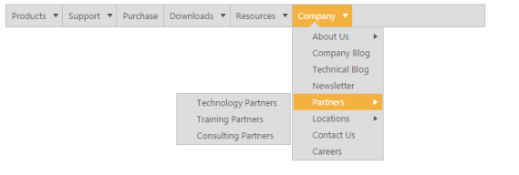
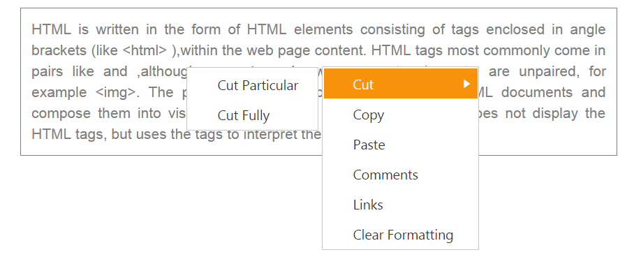

# Customizing the Submenu direction

You can customize the direction to open the sub menu items using SubMenuDirection property. SubMenuDirection accepts the type as string or enum and value as “Left” and “Right”. 

In the following example, the Sub menus opens in the Left side of the menu.

1. Add the following code in your View page.



// Add the following code in your CSHTML page.



The output for the above code example is as follows.          

Customizing Submenu Direction
{:.caption}

You can even achieve auto positioning for Context Menu. Use the following code sample for context menu in order to open the submenu items of context menu in left side.

1. Add the following code in your View page.

 

    HTML is written in the form of HTML elements consisting of tags enclosed in angle
    brackets (like &lt;html&gt; ),within the web page content. HTML tags most commonly
    come in pairs like and ,although some tags, known as empty elements, are unpaired,
    for example &lt;img&gt;. The purpose of a web browser is to read HTML documents
    and compose them into visible or audible web pages. The browser does not display
    the HTML tags, but uses the tags to interpret the content of the page.

<ej-menu id="menu" menu-type="@MenuType.ContextMenu" open-on-click="true" context-menu-target="#target" sub-menu-direction="@Direction.Left">
    <e-menu-items>
        <e-menu-item url="" text="Cut">
            <e-menu-child-items>
                <e-menu-child-item text="Cut Particular"></e-menu-child-item>
                <e-menu-child-item text="Cut Fully"></e-menu-child-item>
            </e-menu-child-items>
        </e-menu-item>
        <e-menu-item url="" text="Copy"></e-menu-item>
        <e-menu-item url="" text="Paste"></e-menu-item>
        <e-menu-item url="" text="Comments"></e-menu-item>
        <e-menu-item url="" text="Links"></e-menu-item>
        <e-menu-item url="" text="Clear Formatting"></e-menu-item>
    </e-menu-items>
</ej-menu>

  

2. Add the following code in your style section.

 

	

   
   
The output for the above code example is as follows.

Customizing Submenu direction in Context Menu
{:.caption}