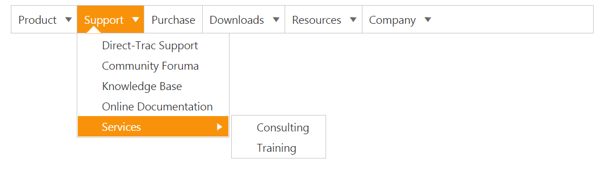

# Data binding

Data binding enables you to synchronize the elements with different sources of data. You can bind data using two ways, Local data and remote data. 

## Field Members

Field is a property that includes the object type. Fields are used to bind the data source and it includes following field members to make binding easier.

_List of Field members_

<table>
<tr>
<th>
Name</th><th>
Description</th></tr>
<tr>
<td>
DataSource</td><td>
Datasource receives Essential DataManager object and JSON object. </td></tr>
<tr>
<td>
Query</td><td>
It receives query to retrieve data from the table (query is same as SQL). Example:  ej.Query().from("Categories").select("CategoryID,CategoryName").take(3);</td></tr>
<tr>
<td>
TableName</td><td>
It receives table name to execute query on the corresponding table</td></tr>
<tr>
<td>
Id</td><td>
Specifies the id to menu items list</td></tr>
<tr>
<td>
ParentId</td><td>
Specifies the parent id of the table.</td></tr>
<tr>
<td>
Text</td><td>
Specifies the text of menu items list</td></tr>
<tr>
<td>
SpriteCssClass</td><td>
Specifies the sprite CSS class to “LI” item list</td></tr>
<tr>
<td>
LinkAttribute</td><td>
Specifies the link attribute to “A” tag in item list</td></tr>
<tr>
<td>
ImageAttribute</td><td>
Specifies the image attribute to “IMG” tag inside items list </td></tr>
<tr>
<td>
HtmlAttribute</td><td>
Specifies the HTML attributes to “LI” item list</td></tr>
<tr>
<td>
ImageUrl</td><td>
Specifies the image URL to “IMG” tag inside item list. </td></tr>
</table>

## Local data

To define the local data to the Menu control, map the user-defined JSON data names with its appropriate dataSource column names.

1. Add the following code in your view page to render menu with local data



// Add the following code in your CSHTML page.

<ej-Menu id="SyncfusionProducts">
    <e-menu-fields dataSource="ViewBag.datasource" id="pid" text="mtext" parent-id="parent"></e-menu-fields>
</ej-Menu>





using System;
using System.Collections.Generic;
using System.Linq;
using System.Web;
using System.Web.Mvc;
namespace Check.Controllers
{
    public class CheckController : Controller 
	{
		public class MenuJson    
		{   
			public string mtext { get; set; } 
			public int pid { get; set; }  
			public string parent { get; set; }  
		}   
		List<MenuJson> menu = new List<MenuJson>();  
		public ActionResult DataBindingJson()    
		{          
			menu.Add(new MenuJson { pid = 1, mtext = "Group A", parent = null }); 
			menu.Add(new MenuJson { pid = 2, mtext = "Group B", parent = null });
            menu.Add(new MenuJson { pid = 3, mtext = "Group C", parent = null });  
			menu.Add(new MenuJson { pid = 4, mtext = "Group D", parent = null });  
			menu.Add(new MenuJson { pid = 5, mtext = "Group E", parent = null });  
			menu.Add(new MenuJson { pid = 11, parent = "1", mtext = "Algeria" });  
			menu.Add(new MenuJson { pid = 12, parent = "1", mtext = "Armenia" });   
			menu.Add(new MenuJson { pid = 13, parent = "1", mtext = "Bangladesh" }); 
			menu.Add(new MenuJson { pid = 14, parent = "1", mtext = "Cuba" });      
			menu.Add(new MenuJson { pid = 15, parent = "2", mtext = "Denmark" });   
			menu.Add(new MenuJson { pid = 16, parent = "2", mtext = "Egypt" });     
			menu.Add(new MenuJson { pid = 17, parent = "3", mtext = "Finland" });   
			menu.Add(new MenuJson { pid = 18, parent = "3", mtext = "India" });     
			menu.Add(new MenuJson { pid = 19, parent = "3", mtext = "Malaysia" });   
			menu.Add(new MenuJson { pid = 20, parent = "4", mtext = "New Zealand" });
            menu.Add(new MenuJson { pid = 21, parent = "4", mtext = "Norway" });      
			menu.Add(new MenuJson { pid = 22, parent = "4", mtext = "Romania" });     
			menu.Add(new MenuJson { pid = 23, parent = "5", mtext = "Singapore" });   
			menu.Add(new MenuJson { pid = 24, parent = "5", mtext = "Thailand" });      
			menu.Add(new MenuJson { pid = 25, parent = "5", mtext = "Ukraine" });     
			menu.Add(new MenuJson { pid = 26, parent = "11", mtext = "First Place" }); 
			menu.Add(new MenuJson { pid = 27, parent = "12", mtext = "Second Place" }); 
			menu.Add(new MenuJson { pid = 28, parent = "13", mtext = "Third place" });     
			menu.Add(new MenuJson { pid = 29, parent = "14", mtext = "Fourth Place" });  
			menu.Add(new MenuJson { pid = 30, parent = "15", mtext = "First Place" });    
			menu.Add(new MenuJson { pid = 31, parent = "16", mtext = "Second Place" }); 
			menu.Add(new MenuJson { pid = 32, parent = "17", mtext = "Third Place" });     
			menu.Add(new MenuJson { pid = 33, parent = "18", mtext = "First Place" });    
			menu.Add(new MenuJson { pid = 34, parent = "19", mtext = "Second Place" });
			menu.Add(new MenuJson { pid = 36, parent = "21", mtext = "Second Place" });   
			menu.Add(new MenuJson { pid = 37, parent = "22", mtext = "Third place" });
			menu.Add(new MenuJson { pid = 39, parent = "24", mtext = "First Place" });    
			menu.Add(new MenuJson { pid = 40, parent = "25", mtext = "Second Place" });   
			ViewBag.datasource = menu;  
			return View();
		} 
	}
}



The following screenshot displays the output of the above code.

Local data of Menu
{:.caption}