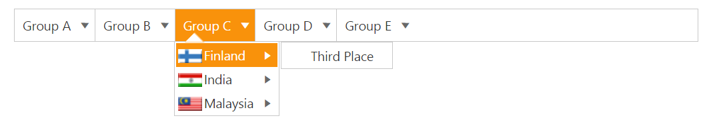
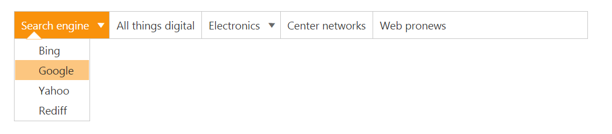
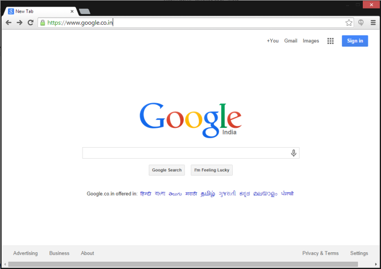

# Icons and navigation

Icons are the images that is displayed in the Menu control. To specify the menu with icons you can use SpriteCssClass property to display the icons. 

1. Add the following code in your View page.



<ej-Menu id="menujson" width="60%">
	<e-menu-fields dataSource="ViewBag.datasource" id="pid" text="mtext" parent-id="parent" sprite-css-class="sprite"></e-menu-fields>
</ej-Menu>
	




	// In the controller page add the code

	using System;
	using System.Collections.Generic;
	using System.Linq;
	using System.Web;
	using System.Web.Mvc;
	using Check.Models;
	namespace Check.Controllers
	{    
		public class CheckController : Controller
		{     
			public class icons 
			{  
				public string mtext { get; set; }
				public string sprite { get; set; }
				public int pid { get; set; }
				public string parent { get; set; }
			}    
			List<icons> menu = new List<icons>(); 
			public ActionResult DataBindingJson() 
			{
				menu.Add(new MenuJson { pid = 1, mtext = "Group A", parent = null }); 
				menu.Add(new MenuJson { pid = 2, mtext = "Group B", parent = null }); 
				menu.Add(new MenuJson { pid = 3, mtext = "Group C", parent = null });
				menu.Add(new MenuJson { pid = 4, mtext = "Group D", parent = null });
				menu.Add(new MenuJson { pid = 5, mtext = "Group E", parent = null }); 
				menu.Add(new MenuJson { pid = 11, parent = "1", mtext = "Algeria", sprite = "flag-dz" });
				menu.Add(new MenuJson { pid = 12, parent = "1", mtext = "Armenia", sprite = "flag-am" });
				menu.Add(new MenuJson { pid = 13, parent = "1", mtext = "Bangladesh", sprite = "flag-bd" }); 
				menu.Add(new MenuJson { pid = 14, parent = "1", mtext = "Cuba", sprite = "flag-cu" });  
				menu.Add(new MenuJson { pid = 15, parent = "2", mtext = "Denmark", sprite = "flag-dk" }); 
				menu.Add(new MenuJson { pid = 16, parent = "2", mtext = "Egypt", sprite = "flag-eg" });  
				menu.Add(new MenuJson { pid = 17, parent = "3", mtext = "Finland", sprite = "flag-fi" });
				menu.Add(new MenuJson { pid = 18, parent = "3", mtext = "India", sprite = "flag-in" }); 
				menu.Add(new MenuJson { pid = 19, parent = "3", mtext = "Malaysia", sprite = "flag-my" });
				menu.Add(new MenuJson { pid = 20, parent = "4", mtext = "New Zealand", sprite = "flag-nz" });
				menu.Add(new MenuJson { pid = 21, parent = "4", mtext = "Norway", sprite = "flag-no" });
				menu.Add(new MenuJson { pid = 22, parent = "4", mtext = "Romania", sprite = "flag-ro" });
				menu.Add(new MenuJson { pid = 23, parent = "5", mtext = "Singapore", sprite = "flag-sg" });
				menu.Add(new MenuJson { pid = 24, parent = "5", mtext = "Thailand", sprite = "flag-th" }); 
				menu.Add(new MenuJson { pid = 25, parent = "5", mtext = "Ukraine", sprite = "flag-ua" }); 
				menu.Add(new MenuJson { pid = 26, parent = "11", mtext = "First Place" });  
				menu.Add(new MenuJson { pid = 27, parent = "12", mtext = "Second Place" }); 
				menu.Add(new MenuJson { pid = 28, parent = "13", mtext = "Third place" }); 
				menu.Add(new MenuJson { pid = 29, parent = "14", mtext = "Fourth Place" }); 
				menu.Add(new MenuJson { pid = 30, parent = "15", mtext = "First Place" });  
				menu.Add(new MenuJson { pid = 31, parent = "16", mtext = "Second Place" }); 
				menu.Add(new MenuJson { pid = 32, parent = "17", mtext = "Third Place" }); 
				menu.Add(new MenuJson { pid = 33, parent = "18", mtext = "First Place" }); 
				menu.Add(new MenuJson { pid = 34, parent = "19", mtext = "Second Place" }); 
				menu.Add(new MenuJson { pid = 35, parent = "20", mtext = "First Place" }); 
				menu.Add(new MenuJson { pid = 36, parent = "21", mtext = "Second Place" });
				menu.Add(new MenuJson { pid = 37, parent = "22", mtext = "Third place" }); 
				menu.Add(new MenuJson { pid = 38, parent = "23", mtext = "Third Place" }); 
				menu.Add(new MenuJson { pid = 39, parent = "24", mtext = "First Place" }); 
				menu.Add(new MenuJson { pid = 40, parent = "25", mtext = "Second Place" });
				ViewBag.datasource = menu; 
				return View();  
			} 
		}
	} 



2. Add the following code in your style section.





The following screenshot displays the output for the above code.                                                                                                       

Menu with Icons
{:.caption}

## Navigation

Navigation in Menu control is the default usage to navigate into the other web page. You can navigate to another page in menu item by providing link to the menu items. Navigation in Menu control can be achieved by placing “href” path to the anchor tag. Use the following code sample for navigating in Menu control.

1. Add the following code in your View page.



// Add the following code in your CSHTML page.

<ej-menu id="weblink" width="60%">
<e-menu-items>
<e-menu-item id="searchengine" text="Search engine">
	<e-menu-child-items>
		<e-menu-child-item text="Bing" url="http://www.bing.com/"></e-menu-child-item>
		<e-menu-child-item text="Google" url="https://www.google.co.in/"></e-menu-child-item>
		<e-menu-child-item text="Yahoo" url="https://in.yahoo.com/"></e-menu-child-item>
		<e-menu-child-item text="Rediff" url="http://www.rediff.com/"></e-menu-child-item>
	</e-menu-child-items>
</e-menu-item>
	<e-menu-item text="All things digital" url="http://allthingsd.com/"></e-menu-item>
	<e-menu-item url="" text="Electronics">
		<e-menu-child-items>
			<e-menu-child-item text="Engadget" url="http://www.engadget.com/"></e-menu-child-item>
			<e-menu-child-item text="Electronista" url="http://www.electronista.com/"></e-menu-child-item>
			<e-menu-child-item text="Gearlog" url="http://www.gearlog.com/"></e-menu-child-item>
		</e-menu-child-items>
	</e-menu-item>
	<e-menu-item text="Center networks" url="http://www.centernetworks.com/"></e-menu-item>
	<e-menu-item text="Web pronews" url="http://www.webpronews.com/"></e-menu-item>
	</e-menu-items>
</ej-menu>



The following screenshot displays the output for the above code example.            

Navigation of Menu
{:.caption}

When you click on “Google” that is present under “Search engine”, it navigates to the link that you specified in the sample code. Then the output is as follows.

After navigating to a menu item
{:.caption}