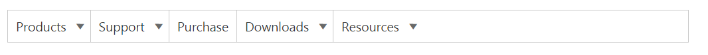
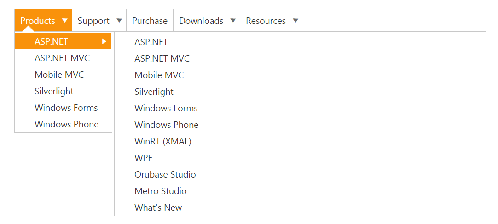

# Keyboard Navigation

The Menu control also provides support for keyboard navigation. In the Menu control, it is possible to control the entire menu control items by using the provided shortcut keys. 

The various keyboard shortcuts available within the Menu control are discussed in the following table, 

_List of keyboard shortcut keys_

<table>
<tr>
<th>
Keys</th><th>
Usage</th></tr>
<tr>
<td>
Esc</td><td>
Closes the opened Menu control.</td></tr>
<tr>
<td>
Enter</td><td>
Selects the focused item.</td></tr>
<tr>
<td>
Up/left/down/right arrow keys</td><td>
Navigates up or previous item.</td></tr>
<tr>
<td>
Down</td><td>
Navigates down or next item.</td></tr>
<tr>
<td>
Left</td><td>
Navigates to previous group.</td></tr>
<tr>
<td>
Right</td><td>
Navigates to next group.</td></tr>
</table>

1. Add the following code for Keyboard navigation in your Menu control.



<ej-menu id="keyboard" width="60%">
    <e-menu-items>
        <e-menu-item id="Products" text="Products">
            <e-menu-child-items>
                <e-menu-child-item text="ASP.NET" url=""></e-menu-child-item>
                <e-menu-child-item text="ASP.NET MVC" url=""></e-menu-child-item>
                <e-menu-child-item text="Mobile MVC" url=""></e-menu-child-item>
                <e-menu-child-item text="Silverlight" url=""></e-menu-child-item>
                <e-menu-child-item text="Windows Forms" url=""></e-menu-child-item>
                <e-menu-child-item text="Windows Phone" url=""></e-menu-child-item>
                <e-menu-child-item text="WinRT (XMAL)" url=""></e-menu-child-item>
                <e-menu-child-item text="WPF" url=""></e-menu-child-item>
                <e-menu-child-item text="Orubase Studio" url=""></e-menu-child-item>
                <e-menu-child-item text="Metro Studio" url=""></e-menu-child-item>
                <e-menu-child-item text="What's New" url=""></e-menu-child-item>
            </e-menu-child-items>
            <e-menu-child-items>
                <e-menu-child-item text="ASP.NET" url=""></e-menu-child-item>
                <e-menu-child-item text="ASP.NET MVC" url=""></e-menu-child-item>
                <e-menu-child-item text="Mobile MVC" url=""></e-menu-child-item>
                <e-menu-child-item text="Silverlight" url=""></e-menu-child-item>
                <e-menu-child-item text="Windows Forms" url=""></e-menu-child-item>
                <e-menu-child-item text="Windows Phone" url=""></e-menu-child-item>
                <e-menu-child-item text="" url="ASP.NET MVC"></e-menu-child-item>
                <e-menu-child-item text="" url="ASP.NET"></e-menu-child-item>
            </e-menu-child-items>
        </e-menu-item>
        <e-menu-item text="Support" url="">
            <e-menu-child-items>
                <e-menu-child-item text="Direct-Trac Support" url=""></e-menu-child-item>
                <e-menu-child-item text="Community Forums" url=""></e-menu-child-item>
                <e-menu-child-item text="Knowledge Base" url=""></e-menu-child-item>
                <e-menu-child-item text="Online Documentation" url=""></e-menu-child-item>
                <e-menu-child-item text="Services" url=""></e-menu-child-item>
            </e-menu-child-items>
            <e-menu-child-items>
                <e-menu-child-item text="Consulting" url=""></e-menu-child-item>
                <e-menu-child-item text="Training" url=""></e-menu-child-item>
            </e-menu-child-items>
        </e-menu-item>
        <e-menu-item text="Purchase" id="Purchase" url="">
        </e-menu-item>
        <e-menu-item text="Downloads" id="Downloads" url="">
            <e-menu-child-items>
                <e-menu-child-item text="Evaluation" url=""></e-menu-child-item>
                <e-menu-child-item text="Free E-Books" url=""></e-menu-child-item>
                <e-menu-child-item text="Metro Studio" url=""></e-menu-child-item>
                <e-menu-child-item text="C" url=""></e-menu-child-item>
                <e-menu-child-item text="Version History" url=""></e-menu-child-item>
            </e-menu-child-items>
        </e-menu-item>
        <e-menu-item id="Resources" Text="Resources" Url="">
            <e-menu-child-items>
                <e-menu-child-item text="E-Books" url=""></e-menu-child-item>
                <e-menu-child-item text="White Papers" url=""></e-menu-child-item>
            </e-menu-child-items>
        </e-menu-item>
    </e-menu-items>
</ej-menu>
	// Add the following code in your 
	
   

2. Add the following code in your style section.



	

    
   
Following screenshot displays the output of the above code. 

Accessibility
{:.caption}

When you press alt+j, the first item of the Menu control only gets focused as displayed in the following screenshot.

Keyboard Navigation
{:.caption}

Similarly you can access the Menu control using keyboard itself.