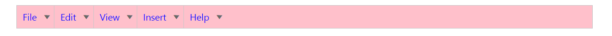

# Look and feel

Essential JavaScript controls feature 12 built-in themes, six flat and gradient effects, and also supports custom skin options for user-defined themes.

12 themes support available for Menu control namely,

* default-theme
* flat-azure-dark
* flat-lime
* flat-lime-dark
* flat-saffron
* flat-saffron-dark
* gradient-azure
* gradient-azure-dark
* gradient-lime
* gradient-lime-dark
* gradient-saffron
* gradient-saffron-dark

## CssClass

Menu control also customizes its appearance using user-defined CSS and custom skin options (colors and backgrounds). To apply custom themes you can use the “CssClass” property. “CssClass” property sets the root class for Menu control theme.

Using this CssClass you can override the existing styles under the theme style sheet. The theme stylesheet applies theme-specific styles like colors and backgrounds. In the following sample the value of “CssClass” property is set as “Purple-dark”. Purple-dark is added as root class to Menu control at the runtime. From this root class you can customize the Menu control theme.

1. Add the following code in your View page.



// Add the following code in your CSHTML page.
<ej-menu id="menu" width="70%" css-class="Purple-dark">
    <e-menu-items>
        <e-menu-item url="" text="File">
            <e-menu-child-items>
                <e-menu-child-item text="New" url=""></e-menu-child-item>
                <e-menu-child-item text="Open" url=""></e-menu-child-item>
                <e-menu-child-item text="Save" url=""></e-menu-child-item>
                <e-menu-child-item text="PrintPreview" url=""></e-menu-child-item>
                <e-menu-child-item text="Print" url=""></e-menu-child-item>
            </e-menu-child-items>
        </e-menu-item>
        <e-menu-item text="Edit" url="">
            <e-menu-child-items>
                <e-menu-child-item text="Undo" url=""></e-menu-child-item>
                <e-menu-child-item text="Redo" url=""></e-menu-child-item>
                <e-menu-child-item text="Mobile MVC" url=""></e-menu-child-item>
                <e-menu-child-item text="Services" url=""></e-menu-child-item>
            </e-menu-child-items>
        </e-menu-item>
        <e-menu-item text="View" url="">
            <e-menu-child-items>
                <e-menu-child-item text="Print Layout" url=""></e-menu-child-item>
                <e-menu-child-item text="Show ruler" url=""></e-menu-child-item>
                <e-menu-child-item text="Show spelling suggestion" url=""></e-menu-child-item>
                <e-menu-child-item text="Compact controls" url=""></e-menu-child-item>
                <e-menu-child-item text="Full screen" url=""></e-menu-child-item>
            </e-menu-child-items>
        </e-menu-item>
        <e-menu-item text="Insert" url="">
            <e-menu-child-items>
                <e-menu-child-item text="Image" url=""></e-menu-child-item>
                <e-menu-child-item text="Link" url=""></e-menu-child-item>
                <e-menu-child-item text="Comments" url=""></e-menu-child-item>
                <e-menu-child-item text="Header" url=""></e-menu-child-item>
                <e-menu-child-item text="Footer" url=""></e-menu-child-item>
            </e-menu-child-items>
        </e-menu-item>
        <e-menu-item text="Help" url="">
            <e-menu-child-items>
                <e-menu-child-item text="Docs Help" url=""></e-menu-child-item>
                <e-menu-child-item text="User Forums" url=""></e-menu-child-item>
                <e-menu-child-item text="Report an Issue" url=""></e-menu-child-item>
                <e-menu-child-item text="Keyboard Shortcuts" url=""></e-menu-child-item>
            </e-menu-child-items>
        </e-menu-item>
    </e-menu-items>
</ej-menu>

   

2. Add the following code in your style section.



	

   

Following screenshot displays the output of the above code.

Look and feel of a Menu
{:.caption}