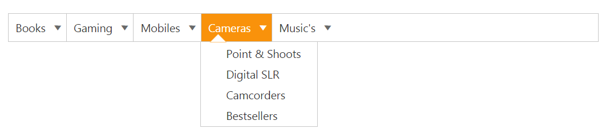
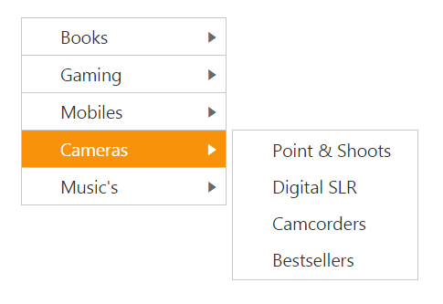

# Orientation

It gets or sets the direction in which the Menu control renders and specifies the orientation of the normal menu.  According to the orientation property the Menu control renders in horizontal or vertical.

## Horizontal Menu

Horizontal orientation displays the menu items horizontally and it is the default orientation behavior of Menu control. 

The following steps explains you the details on rendering the Menu control. 

1. Add the below code in your view page to render the horizontal menu


    
// In the CSHTML page, add the following code to configure Menu control.
<ej-menu id="vertical" menu-type="@MenuType.NormalMenu" orientation="@Orientation.Horizontal">
    <e-menu-items>
        <e-menu-item url="" text="Books">
            <e-menu-child-items>
                <e-menu-child-item text="New Releases" url=""></e-menu-child-item>
                <e-menu-child-item text="New Releases audio books" url=""></e-menu-child-item>
                <e-menu-child-item text="Bestsellers" url=""></e-menu-child-item>
                <e-menu-child-item text="Upcoming" url=""></e-menu-child-item>
                <e-menu-child-item text="Box Sets" url=""></e-menu-child-item>
            </e-menu-child-items>
        </e-menu-item>
        <e-menu-item text="Gaming" url="">
            <e-menu-child-items>
                <e-menu-child-item text="Upcoming" url=""></e-menu-child-item>
                <e-menu-child-item text="PC" url=""></e-menu-child-item>
                <e-menu-child-item text="PS Vista" url=""></e-menu-child-item>
                <e-menu-child-item text="XBox" url=""></e-menu-child-item>
            </e-menu-child-items>
        </e-menu-item>
        <e-menu-item text="Mobiles" url="">
            <e-menu-child-items>
                <e-menu-child-item text="New Arrivals" url=""></e-menu-child-item>
                <e-menu-child-item text="Bestsellers" url=""></e-menu-child-item>
                <e-menu-child-item text="Low Price" url=""></e-menu-child-item>
                <e-menu-child-item text="Tablets" url=""></e-menu-child-item>
            </e-menu-child-items>
        </e-menu-item>
        <e-menu-item text="Cameras" url="">
            <e-menu-child-items>
                <e-menu-child-item text="Point & Shoots" url=""></e-menu-child-item>
                <e-menu-child-item text="Digital SLR" url=""></e-menu-child-item>
                <e-menu-child-item text="Camcorders" url=""></e-menu-child-item>
                <e-menu-child-item text="Bestsellers" url=""></e-menu-child-item>
            </e-menu-child-items>
        </e-menu-item>
        <e-menu-item text="Music's" url="">
            <e-menu-child-items>
                <e-menu-child-item text="New Releases" url=""></e-menu-child-item>
                <e-menu-child-item text="Bestsellers" url=""></e-menu-child-item>
                <e-menu-child-item text="Rock Music" url=""></e-menu-child-item>
                <e-menu-child-item text="Devotional & Spiritual" url=""></e-menu-child-item>
            </e-menu-child-items>
        </e-menu-item>
    </e-menu-items>
</ej-menu>



The following screenshot displays the output of the above code.        

Horizontal Menu
{:.caption}

## Vertical Menu

You can also render Menu control in vertical direction using orientation.To set the vertical orientation of Menu control, replace the following script in the above sample code example.

1. Add the following code in your view page to render vertical menu



// Add the following code in the CSHTML page.

<ej-menu id="vertical" menu-type="@MenuType.NormalMenu" orientation="@Orientation.Vertical">
    <e-menu-items>
        <e-menu-item url="" text="Books">
            <e-menu-child-items>
                <e-menu-child-item text="New Releases" url=""></e-menu-child-item>
                <e-menu-child-item text="New Releases audio books" url=""></e-menu-child-item>
                <e-menu-child-item text="Bestsellers" url=""></e-menu-child-item>
                <e-menu-child-item text="Upcoming" url=""></e-menu-child-item>
                <e-menu-child-item text="Box Sets" url=""></e-menu-child-item>
            </e-menu-child-items>
        </e-menu-item>
        <e-menu-item text="Gaming" url="">
            <e-menu-child-items>
                <e-menu-child-item text="Upcoming" url=""></e-menu-child-item>
                <e-menu-child-item text="PC" url=""></e-menu-child-item>
                <e-menu-child-item text="PS Vista" url=""></e-menu-child-item>
                <e-menu-child-item text="XBox" url=""></e-menu-child-item>
            </e-menu-child-items>
        </e-menu-item>
        <e-menu-item text="Mobiles" url="">
            <e-menu-child-items>
                <e-menu-child-item text="New Arrivals" url=""></e-menu-child-item>
                <e-menu-child-item text="Bestsellers" url=""></e-menu-child-item>
                <e-menu-child-item text="Low Price" url=""></e-menu-child-item>
                <e-menu-child-item text="Tablets" url=""></e-menu-child-item>
            </e-menu-child-items>
        </e-menu-item>
        <e-menu-item text="Cameras" url="">
            <e-menu-child-items>
                <e-menu-child-item text="Point & Shoots" url=""></e-menu-child-item>
                <e-menu-child-item text="Digital SLR" url=""></e-menu-child-item>
                <e-menu-child-item text="Camcorders" url=""></e-menu-child-item>
                <e-menu-child-item text="Bestsellers" url=""></e-menu-child-item>
            </e-menu-child-items>
        </e-menu-item>
        <e-menu-item text="Music's" url="">
            <e-menu-child-items>
                <e-menu-child-item text="New Releases" url=""></e-menu-child-item>
                <e-menu-child-item text="Bestsellers" url=""></e-menu-child-item>
                <e-menu-child-item text="Rock Music" url=""></e-menu-child-item>
                <e-menu-child-item text="Devotional & Spiritual" url=""></e-menu-child-item>
            </e-menu-child-items>
        </e-menu-item>
    </e-menu-items>
</ej-menu>



The following screen shot displays the output of the above code.                       

Vertical Menu
{:.caption}