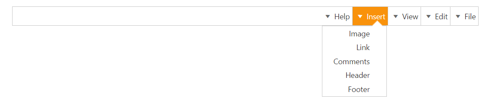

# RTL Support

The EnableRTL option allows the Menu control to display it in the right to left direction. By default, this option is set to “false” in the Menu control.

1. The following code depicts you on how to enable the rtl property of the Menu control.



// The following code example depicts how to enable the rtl property of the Menu control.

<ej-menu id="menu" width="70%" enable-rtl="true">
    <e-menu-items>
        <e-menu-item url="" text="File">
            <e-menu-child-items>
                <e-menu-child-item text="New" url=""></e-menu-child-item>
                <e-menu-child-item text="Open" url=""></e-menu-child-item>
                <e-menu-child-item text="Save" url=""></e-menu-child-item>
                <e-menu-child-item text="PrintPreview" url=""></e-menu-child-item>
                <e-menu-child-item text="Print" url=""></e-menu-child-item>
            </e-menu-child-items>
        </e-menu-item>
        <e-menu-item text="Edit" url="">
            <e-menu-child-items>
                <e-menu-child-item text="Undo" url=""></e-menu-child-item>
                <e-menu-child-item text="Redo" url=""></e-menu-child-item>
                <e-menu-child-item text="Mobile MVC" url=""></e-menu-child-item>
                <e-menu-child-item text="Services" url=""></e-menu-child-item>
            </e-menu-child-items>
        </e-menu-item>
        <e-menu-item text="View" url="">
            <e-menu-child-items>
                <e-menu-child-item text="Print Layout" url=""></e-menu-child-item>
                <e-menu-child-item text="Show ruler" url=""></e-menu-child-item>
                <e-menu-child-item text="Show spelling suggestion" url=""></e-menu-child-item>
                <e-menu-child-item text="Compact controls" url=""></e-menu-child-item>
                <e-menu-child-item text="Full screen" url=""></e-menu-child-item>
            </e-menu-child-items>
        </e-menu-item>
        <e-menu-item text="Insert" url="">
            <e-menu-child-items>
                <e-menu-child-item text="Image" url=""></e-menu-child-item>
                <e-menu-child-item text="Link" url=""></e-menu-child-item>
                <e-menu-child-item text="Comments" url=""></e-menu-child-item>
                <e-menu-child-item text="Header" url=""></e-menu-child-item>
                <e-menu-child-item text="Footer" url=""></e-menu-child-item>
            </e-menu-child-items>
        </e-menu-item>
        <e-menu-item text="Help" url="">
            <e-menu-child-items>
                <e-menu-child-item text="Docs Help" url=""></e-menu-child-item>
                <e-menu-child-item text="User Forums" url=""></e-menu-child-item>
                <e-menu-child-item text="Report an Issue" url=""></e-menu-child-item>
                <e-menu-child-item text="Keyboard Shortcuts" url=""></e-menu-child-item>
            </e-menu-child-items>
        </e-menu-item>
    </e-menu-items>
</ej-menu>



Following screenshot displays the output for the above code.

RTL Support
{:.caption}