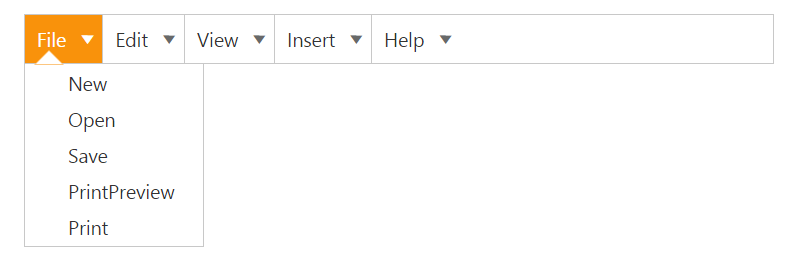
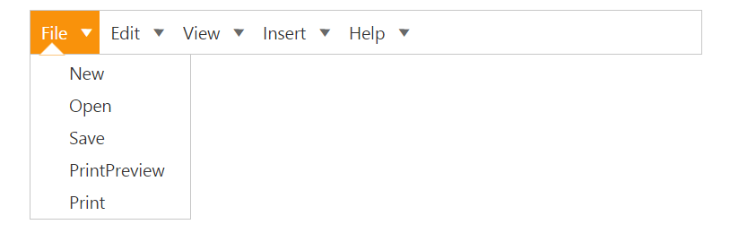

# Separators

Separators can be added to menu items to display a horizontal bars between menu items. Separators are similar to borders and cannot be selected.**enableSeparator** is the property that is used to display the separators in the Menu control. It accepts Boolean type value. Its default value is true. 

1. Add the following code in your view page.



	// Add the following code in the CSHTML page.
<ej-menu id="menu" width="500px" enable-separator="true">
    <e-menu-items>
        <e-menu-item url="" text="File">
            <e-menu-child-items>
                <e-menu-child-item text="New" url=""></e-menu-child-item>
                <e-menu-child-item text="Open" url=""></e-menu-child-item>
                <e-menu-child-item text="Save" url=""></e-menu-child-item>
                <e-menu-child-item text="PrintPreview" url=""></e-menu-child-item>
                <e-menu-child-item text="Print" url=""></e-menu-child-item>
            </e-menu-child-items>
        </e-menu-item>
        <e-menu-item text="Edit" url="">
            <e-menu-child-items>
                <e-menu-child-item text="Undo" url=""></e-menu-child-item>
                <e-menu-child-item text="Redo" url=""></e-menu-child-item>
                <e-menu-child-item text="Mobile MVC" url=""></e-menu-child-item>
                <e-menu-child-item text="Services" url=""></e-menu-child-item>
            </e-menu-child-items>
        </e-menu-item>
        <e-menu-item text="View" url="">
            <e-menu-child-items>
                <e-menu-child-item text="Print Layout" url=""></e-menu-child-item>
                <e-menu-child-item text="Show ruler" url=""></e-menu-child-item>
                <e-menu-child-item text="Show spelling suggestion" url=""></e-menu-child-item>
                <e-menu-child-item text="Compact controls" url=""></e-menu-child-item>
                <e-menu-child-item text="Full screen" url=""></e-menu-child-item>
            </e-menu-child-items>
        </e-menu-item>
        <e-menu-item text="Insert" url="">
            <e-menu-child-items>
                <e-menu-child-item text="Image" url=""></e-menu-child-item>
                <e-menu-child-item text="Link" url=""></e-menu-child-item>
                <e-menu-child-item text="Comments" url=""></e-menu-child-item>
                <e-menu-child-item text="Header" url=""></e-menu-child-item>
                <e-menu-child-item text="Footer" url=""></e-menu-child-item>
            </e-menu-child-items>
        </e-menu-item>
        <e-menu-item text="Help" url="">
            <e-menu-child-items>
                <e-menu-child-item text="Docs Help" url=""></e-menu-child-item>
                <e-menu-child-item text="User Forums" url=""></e-menu-child-item>
                <e-menu-child-item text="Report an Issue" url=""></e-menu-child-item>
                <e-menu-child-item text="Keyboard Shortcuts" url=""></e-menu-child-item>
            </e-menu-child-items>
        </e-menu-item>
    </e-menu-items>
</ej-menu>

    

   The following screenshot displays the output for the above code sample.

   

	Menu with Separators
	{:.caption}
	
2. Add the following code in your view page to display the Menu control without separator by setting EnableSeparator as false.


	
<ej-menu id="menu" width="500px" enable-separator="false">
    <e-menu-items>
        <e-menu-item url="" text="File">
            <e-menu-child-items>
                <e-menu-child-item text="New" url=""></e-menu-child-item>
                <e-menu-child-item text="Open" url=""></e-menu-child-item>
                <e-menu-child-item text="Save" url=""></e-menu-child-item>
                <e-menu-child-item text="PrintPreview" url=""></e-menu-child-item>
                <e-menu-child-item text="Print" url=""></e-menu-child-item>
            </e-menu-child-items>
        </e-menu-item>
        <e-menu-item text="Edit" url="">
            <e-menu-child-items>
                <e-menu-child-item text="Undo" url=""></e-menu-child-item>
                <e-menu-child-item text="Redo" url=""></e-menu-child-item>
                <e-menu-child-item text="Mobile MVC" url=""></e-menu-child-item>
                <e-menu-child-item text="Services" url=""></e-menu-child-item>
            </e-menu-child-items>
        </e-menu-item>
        <e-menu-item text="View" url="">
            <e-menu-child-items>
                <e-menu-child-item text="Print Layout" url=""></e-menu-child-item>
                <e-menu-child-item text="Show ruler" url=""></e-menu-child-item>
                <e-menu-child-item text="Show spelling suggestion" url=""></e-menu-child-item>
                <e-menu-child-item text="Compact controls" url=""></e-menu-child-item>
                <e-menu-child-item text="Full screen" url=""></e-menu-child-item>
            </e-menu-child-items>
        </e-menu-item>
        <e-menu-item text="Insert" url="">
            <e-menu-child-items>
                <e-menu-child-item text="Image" url=""></e-menu-child-item>
                <e-menu-child-item text="Link" url=""></e-menu-child-item>
                <e-menu-child-item text="Comments" url=""></e-menu-child-item>
                <e-menu-child-item text="Header" url=""></e-menu-child-item>
                <e-menu-child-item text="Footer" url=""></e-menu-child-item>
            </e-menu-child-items>
        </e-menu-item>
        <e-menu-item text="Help" url="">
            <e-menu-child-items>
                <e-menu-child-item text="Docs Help" url=""></e-menu-child-item>
                <e-menu-child-item text="User Forums" url=""></e-menu-child-item>
                <e-menu-child-item text="Report an Issue" url=""></e-menu-child-item>
                <e-menu-child-item text="Keyboard Shortcuts" url=""></e-menu-child-item>
            </e-menu-child-items>
        </e-menu-item>
    </e-menu-items>
</ej-menu>

    

The following screenshot displays the output for the above code. 

Menu without Separators
{:.caption}