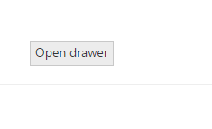
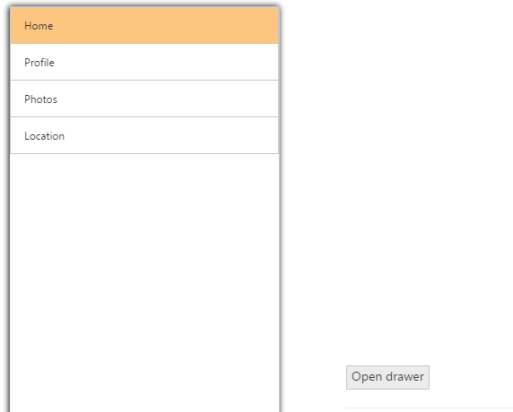

# Animations

You can set the transition type of the Navigation Drawer by using type property. The possible transition types are slide and overlay.

* Slide - both navigation panel and content page slides towards left/right direction to view the navigation panel items.
* Overlay - Only the navigation panel slides over the content page to view the navigation panel items. That is, part of the content page is hidden under navigation panel.

N> Transition slide type works only with fixed position.

The default value is Overlay.



    

        

            

                

             
                    <ej-navigation-drawer id="navpane" direction="Left" type="Slide" position="Fixed" enable-list-view="true" target-id="butdrawer">
                        <e-list-view-settings width="300" />
                        <e-content-template>
                            <ul>
                                <li data-ej-text="Home"></li>
                                <li data-ej-text="Profile"></li>
                                <li data-ej-text="Photos"></li>
                                <li data-ej-text="Location"></li>
                            </ul>
                        </e-content-template>
                    </ej-navigation-drawer>
                

            

        

    

<ej-button id="butdrawer" text="Open drawer" />

  


The following screenshot illustrates the output.

