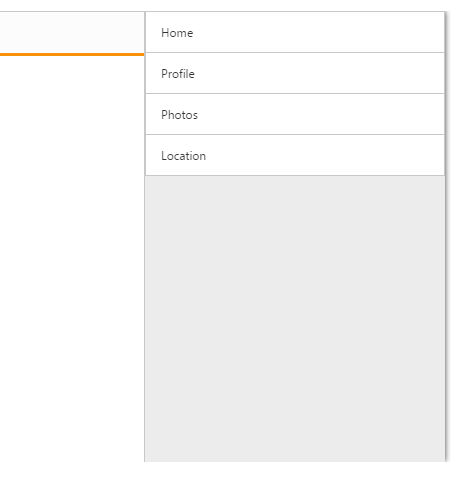

# Customize Direction

By using this property, you can set the drawer to be open from right to left direction or left to right direction. The possible direction values are Right, Left and the default value is Left. Refer to the following code example.



    

        

            

                

                    

                        

                            

                        

                    

                    <ej-navigation-drawer id="navpane" direction="Right" type="Slide" position="Fixed" enable-list-view="true" target-id="butdrawer">
                        <e-list-view-settings width="300" />
                        <e-content-template>
                            <ul>
                                <li data-ej-text="Home"></li>
                                <li data-ej-text="Profile"></li>
                                <li data-ej-text="Photos"></li>
                                <li data-ej-text="Location"></li>
                            </ul>
                        </e-content-template>
                    </ej-navigation-drawer>
                

            

        

    



The following screenshot displays the output by swiping from right to left at the right side end of the screen.

