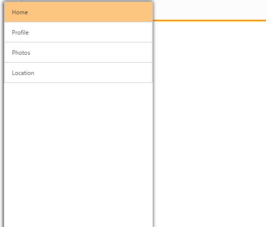

# Customize Position

Position property is used to specify the position whether it is in fixed or relative to the page. When you set a normal value to position property, it appears within the container. Otherwise, it appears in the whole body .The possible position values are fixed and normal. The Default value is normal.



    

        

            

                

                    

                        

                            

                        

                    

                    <ej-navigation-drawer id="navpane" direction="Left" type="Slide" position="Fixed" enable-list-view="true" target-id="butdrawer">
                        <e-list-view-settings width="300" />
                        <e-content-template>
                            <ul>
                                <li data-ej-text="Home"></li>
                                <li data-ej-text="Profile"></li>
                                <li data-ej-text="Photos"></li>
                                <li data-ej-text="Location"></li>
                            </ul>
                        </e-content-template>
                    </ej-navigation-drawer>
                

            

        

    



The following screenshot illustrates the output by swiping from left to right at the left end of the screen.

