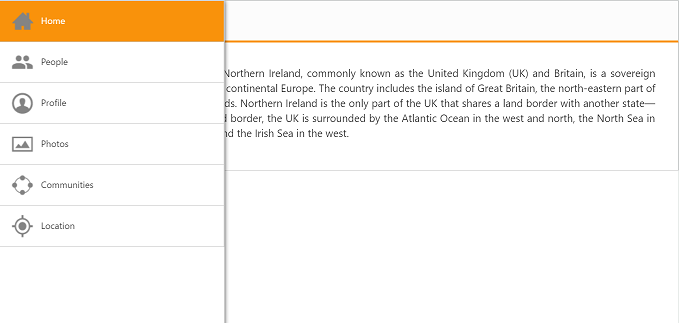

# Getting Started with ASP.NET Core NavigationDrawer

This section allows you to learn and how to configure the NavigationDrawer control in your application.

## Create Navigation Drawer control

Refer the [Getting Started](https://help.syncfusion.com/aspnet-core/gettingstarted/getting-started-1-1-0) page of the Introduction part to know more about the basic system requirements and the steps to configure the Syncfusion components in an ASP.NET Core application. Here we have used listview to show list of items such as home, profile, photos and location where you can navigate to desired page by clicking on the option available in the drawer. Use the below code in the corresponding view page.



        

        

            

                

                    

                        

                            

                                

                                <h2>Home</h2>
                            

                        

                    

                        

                            

                                The United Kingdom of Great Britain and Northern Ireland, commonly known as the United Kingdom (UK) and Britain, is a sovereign state located off the north-western coast of continental Europe. The country includes the island of Great Britain, the north-eastern part of the island of Ireland and many smaller islands. Northern Ireland is the only part of the UK that shares a land border with another state—the Republic of Ireland. Apart from this land border, the UK is surrounded by the Atlantic Ocean in the west and north, the North Sea in the east, the English Channel in the south and the Irish Sea in the west.
                            

                        

                        

                            <table cellpadding="5px">
                                <tbody>
                                    <tr>
                                        <td>
                                            

                                            Agatha Jessie
                                        </td>
                                        <td>
                                            

                                            Andrew Philip
                                        </td>
                                        <td>
                                            

                                            Lilly Thomas
                                        </td>
                                        <td>
                                            

                                            Jaden Storm
                                        </td>
                                        <td>
                                            

                                            Angel Christie
                                        </td>
                                        <td>
                                            

                                            Joe Michael
                                        </td>
                                        <td>
                                            

                                            Marie Luke
                                        </td>
                                        <td>
                                            

                                            Magen Mia
                                        </td>

                                    </tr>
                                </tbody>
                            </table>
                        

                        

                            <table>
                                <tbody>
                                    <tr>
                                        <td>
                                            

                                        </td>
                                        <td>
                                            <h2>Andrew Philip</h2>                                            
                                        </td>
                                    </tr>
                                </tbody>
                            </table>
                             
                            Profile 
                            

                                Born on December 25, 1954, in Spokane, Washington. Philip graduated from Texas University in 1978. He started his career as a teacher.
                                Later he started business with his friend Paul. They both spent more time together working on business. They earned enough money and spent that for poor and social welfares. Later they together started an organization for children welfare.
                            

                        

                        

                            <table>
                                <tbody>
                                    <tr>
                                        <td>
                                            

                                        </td>
                                        <td>
                                            

                                        </td>
                                        <td>
                                            

                                        </td>
                                        <td>
                                            

                                        </td>
                                        <td>
                                            

                                        </td>
                                        <td>
                                            

                                        </td>
                                    </tr>
                                </tbody>
                            </table>
                        

                        

                            <h2>Product Breadth</h2>
                            
UI, reporting and business intelligence on any .NET platform, all from one vendor.

                            <h2>No-Hassle Licensing</h2>
                            
No royalties, run-time, or server-deployment fees means no surprises.

                            <h2>Uncompromising Quality</h2>
                            
An almost brutal QA process makes our products truly enterprise-quality.

                            <h2>Outstanding Support</h2>
                            
Our team is in-house, accessible, and fast. The online forum, knowledge base, and Direct-Trac support system provide 24/7 access.

                        

                        

                            

                        

                    

                    <ej-navigation-drawer id="navpane" direction="@NavigationDrawerDirection.Left" type="@NavigationDrawerType.Overlay" enable-list-view="true" target-id="butdrawer" content-id="content_container">
                        <e-list-view-settings width="300" selected-item-index="0" show-header="false" mouse-up="headChange" persist-selection="true" />
                        <e-content-template>
                            <ul>
                                <li data-ej-imageurl="../Images/navigationdrawer/home.png" data-ej-text="Home" data-ej-href="#home"
                                    id="navhome"></li>
                                <li data-ej-imageurl="../Images/navigationdrawer/people.png" data-ej-text="People" data-ej-href="#people"
                                    id="navpeople"></li>
                                <li data-ej-imageurl="../Images/navigationdrawer/profile.png" data-ej-text="Profile" data-ej-href="#profile"
                                    id="navprofile"></li>
                                <li data-ej-imageurl="../Images/navigationdrawer/photo.png" data-ej-text="Photos" data-ej-href="#photos"
                                    id="navphotos"></li>
                                <li data-ej-imageurl="../Images/navigationdrawer/communities.png" data-ej-text="Communities" data-ej-href="#communities"
                                    id="navcommunities"></li>
                                <li data-ej-imageurl="../Images/navigationdrawer/locations.png" data-ej-text="Location" data-ej-href="#location"
                                    id="navlocation"></li>
                            </ul>
                        </e-content-template>
                    </ej-navigation-drawer>                    
                

            

        

     



Add the following code in script section:



        function headChange(e) {
            $("#butdrawer").parent().children("h2").text(e.text);
        }



Add this in corresponding style section:



        #navpane
        {
            z-index: 99998 !important;
        }
        #navpane_Overlay
        {
            z-index: 99997 !important;
        }
        #navpane_listbox img.e-list-img {
            padding-right: 10px;
        }

        body {
            margin: 0;
            padding: 0;
        }

        .e-header {
            padding-top: 8px;
        }

        #container p {
            padding: 10px;
            text-align: justify;
        }

        #container {
            -moz-user-select: none;
            -webkit-user-select: none;
            -ms-user-select: none;
            user-select: none;
            position: relative;
            overflow: hidden;
            min-height: 451px;
        }

        .peopleimage {
            background: none no-repeat scroll center center / 70px 70px rgba(0, 0, 0, 0);
            height: 100px;
            margin: auto;
            width: 100px;
            border: 1px solid #737373;
        }

        .profileimage {
            background: none no-repeat scroll center center / 90px 90px rgba(0, 0, 0, 0);
            height: 95px;
            border: 1px solid #b3b3b3;
            margin-right: 12px;
            width: 95px;
        }

        .photoimage {
            background: none no-repeat scroll center center / 140px 120px rgba(0, 0, 0, 0);
            height: 125px;
            margin: auto;
            width: 145px;
        }

        .locationimage {
            background: url("img/location.png") no-repeat scroll center center / 300px 200px rgba(0, 0, 0, 0);
            height: 230px;
            margin: auto;
            padding: 10px;
            width: 320px;
        }

        .drawericon {
            background-position: center center;
            background-repeat: no-repeat;
            height: 32px;
            width: 32px;
            background-size: 100% 100%;
            padding-right: 10px;
        }

         #people td {
            border: 1px solid #9f9f9f;
            text-align: center;
			padding: 8px;
        }
		#photos td div {
			background-position: center center;
			background-size: 100% 100%;
			border: 1px solid #b3b3b3;
			margin-left: 7.6px;
		}
         .subpage {
            padding: 10px;
            text-align: justify;
            overflow:auto;
        }
        #navpane .subpage {
            padding:0px;
        }

        .drawericon:before {
            content: "\e76b";
            font-size: 28px;
            height: 26px;
        }
 



After execute the above code you can get below output.

