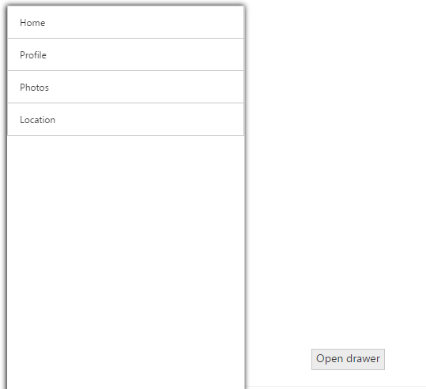

# TargetId

This property is used to define the target Id for Navigation Drawer. The drawer opens while you click on the specified target element.



    

        

            

                

             
                    <ej-navigation-drawer id="navpane" direction="Left" type="Overlay" position="Fixed" enable-list-view="true" target-id="butdrawer">
                        <e-list-view-settings width="300" />
                        <e-content-template>
                            <ul>
                                <li data-ej-text="Home"></li>
                                <li data-ej-text="Profile"></li>
                                <li data-ej-text="Photos"></li>
                                <li data-ej-text="Location"></li>
                            </ul>
                        </e-content-template>
                    </ej-navigation-drawer>
                

            

        

    

<ej-button id="butdrawer" text="Open drawer" />



The following screenshots illustrates the output.

