# Behavior Settings

## Decimal Places

DecimalPlaces property specifies number of values allowed after the decimal point.The default value of DecimalPlaces property is 0 i.e., by default you cannot specify decimal value in NumericTextBox. We need to add this property to allow decimal values. To set the DecimalPlaces to “-1”, that allows the decimals without any limit in NumericTextBox control.

### Configure Decimal Places

In the View page add the below code and configure the DecimalPlaces property as shown below.



    <ej-numeric-text-box id="numeric" decimal-places="3" value="333"/>



The output is as follows.

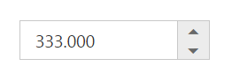

## Persistence Support

NumericTextBox provides state maintenance support. You can maintain the previous changes made in the control after a page loads.

### Configure Persistence Support 

In the View page add the below code and configure the EnablePersistence property as shown below.



    <ej-numeric-text-box id="numeric" value="11" enable-persistence="true"/>



Output of NumericTextBox with EnablePersistence is as follows. 

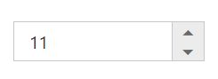

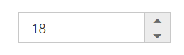

## Strict Mode Support

NumericTextBox allows you to use the strict mode option by setting the EnableStrictMode property. You can set the MinValue and MaxValue to the controls to enable strict mode functionality. Default value of this property is false. When the textbox value exceeds the MaxValue, it restricts the exceeded value and returns the MaxValue. Likewise when the textbox value goes below MinValue, it restricts the new value and returns the MinValue. When this property is enabled, it will not restrict the specified value and an error class is added to indicate wrong value is provided to the textbox.

### Configure Strict Mode Support 

In the View page add the below code and configure the EnableStrictMode property.



    <ej-numeric-text-box id="numeric" value="10" min-value="-3" max-value="5" enable-strict-mode="true"/>



Output when EnableStrictMode is “true” is as follows.

## Enabled or Disabled

NumericTextBox has an option to enable or disable its element. You can set the Enabled property as “false” to enable the Textbox controls.
Also you can enable/disable the **NumericTextBox** by using [enable](https://help.syncfusion.com/api/js/ejtextboxes#methods:enable) and [disable](https://help.syncfusion.com/api/js/ejtextboxes#methods:disable) methods.

### Configure Enabled or Disabled 

In the View page add the below code and configure the Enabled property.



    <ej-numeric-text-box id="numeric" value="1" enabled="false"/>



Output when Enabled is “true” and when Enabled is “false”.

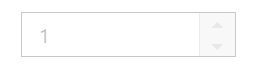

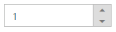

## Adjusting Textbox Size

NumericTextBox size can be modified by using the Height and Width properties. 

Configure Height and Width 

In the View page add the below code and configure the Height and Width property.



    <ej-numeric-text-box id="numeric" value="1" width="100px" height="50px"/>



 Output of NumericTextBox after setting “Height” and “Width” is as follows.

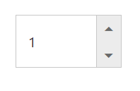

## Increment Step

The IncrementStep property is used to increase or decrease the amount of value in the Numeric textbox. 

### Configure Increment Step

In the View page add the below code and configure the IncrementStep property.



    <ej-numeric-text-box id="numeric" value="1" increment-step="2"/>



Output of Numeric textbox with IncrementStep is as follows.

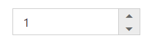

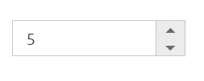

## Define Name

When you have placed the NumericTextBox in a form, the Name property is used to send the field value at form submission. The default value of the Name property is null.

### Configure Name

In the View page add the below code and configure the Name property.  



    <ej-numeric-text-box id="numeric" name="Numeric"/>



## Define Value

The value of NumericTextBox can be assigned by using the Value property. The default value for Value property is null.
You can get the value of **NumericTextBox** by using [getValue](https://help.syncfusion.com/api/js/ejtextboxes#methods:getvalue) method.

### Configure Value

In the View page add the below code and configure the Value property.  



    <ej-numeric-text-box id="numeric" value="12"/>



Output of NumericTextBox with the value property is as follows.

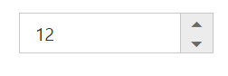

## Define MaxValue and MinValue

### MaxValue

The maximum limit value can be assigned to the NumericTextBox by using the MaxValue property. The default value of MaxValue property is 1.7976931348623157e+308. 

### MinValue

The minimum limit value can be assigned to the NumericTextBox by using the MinValue property. The default value of MinValue property is -1.7976931348623157e+308.

### Configure MaxValue and MinValue

In the View page add the below code and configure the MinValue and MaxValue property.  .  



    <ej-numeric-text-box id="numeric" value="2" min-value="-1" max-value="2"/>



Output of NumericTextBox with MaxValue and MinValue is as follows.

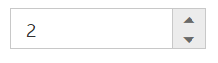

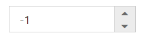

## Read Only Support

NumericTextBox supports read only option. When you enable the ReadOnly property to the control, the value cannot be changed in the NumericTextBox. You can set the ReadOnly property as “true” to enable this option.

### Configure Read Only

In the View page add the below code and configure the ReadOnly property.



    <ej-numeric-text-box id="numeric" value="1" read-only="true"/>



Output of NumericTextBox when ReadOnly is “true” is as follows. NumericTextBox values cannot be edited or changed.

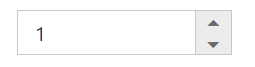

## Appearance

### Theme

NumericTextBox control’s style and appearance can be controlled based on CSS classes. In order to apply styles you need to refer 2 files namely, ej.widgets.core.min.css and ej.theme.min.css. If the file ej.web.all.min.css is referred, then it is not necessary to include the files ej.widgets.core.min.css and ej.theme.min.css in your project, as ej.web.all.min.css is the combination of these two. 

By default, there are 17 themes support available namely:

* bootstrap
* flat-azure
* flat-azure-dark
* fat-lime
* flat-lime-dark
* flat-saffron
* flat-saffron-dark
* gradient-azure
* gradient-azure-dark
* gradient-lime
* gradient-lime-dark
* gradient-saffron
* gradient-saffron-dark
* high-contrast-01
* high-contrast-02
* material
* office-365

### CSS Class

The CSS can be customized by using the CssClass in the NumericTextBox. You can customize the NumericTextBox with CssClass property to appear like your desired control.

#### Configure CSS Class

In the View page add the below code and configure the CssClass property. 



    <ej-numeric-text-box id="numeric" value="1" css-class="customCss"/>



1. Customize the CSS properties in custom CSS class.





Output of NumericTextBox after applying CssClass is as follows.

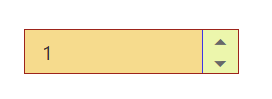

### Rounded Corner Support

NumericTextBox provides you with rounded corner support whose appearance is different from normal textbox controls.

#### Configure Rounded Corner Support

In the View page add the below code and configure the ShowRoundedCorner property. 



    <ej-numeric-text-box id="numeric" value="1" show-rounded-corner="true"/>



Output of NumericTextBox when ShowRoundedCorner is “true”.

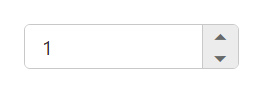

### Spin Button Support

NumericTextBox provides you the option as to whether to display the spin button in the widget or remove it from the control by using showSpinButton property.

### Configure Spin Button

In the View page add the below code and configure the ShowSpinButton property. 



    <ej-numeric-text-box id="numeric" value="1" show-spin-button="false"/>



Output of NumericTextBox when ShowSpinButton is “false”.

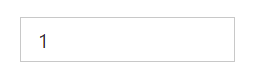

## Water Mark Text Support

The NumericTextBox provide water mark text support. You can display the initial value in the control by water mark.

### Configure Water Mark Text

In the View page add the below code and configure the ShowSpinButton property.



    <ej-numeric-text-box id="numeric" watermark-text="Numeric"/>



Output of NumericTextBox after applying WaterMarkText is as follows.

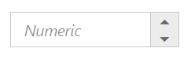